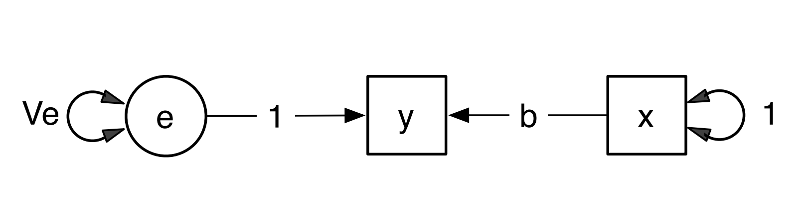
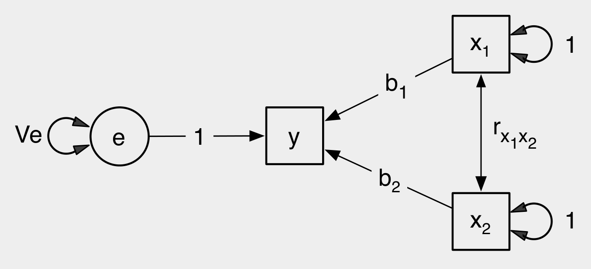

```{r setup, include=FALSE}
library(knitr)
require(tidyverse)
require(lavaan)
require(semPlot)

set.seed(453)
# invalidate cache when the package version changes
knitr::opts_chunk$set(tidy = FALSE, echo = FALSE, 
                  message = FALSE, warning = FALSE,
                  out.width = "45%", cache = TRUE, 
                  dev.args=list(bg=grey(0.9), pointsize=11))
options(knitr.table.format = "latex")
options(knitr.kable.NA = "", digits = 2)
options(kableExtra.latex.load_packages = FALSE)
theme_set(theme_bw())
```

# Introduction

##

- Path analysis, alike the family of related regression models, is a linear model framework that models regression equations simultaneously with the given observed variables. It can be thought of as a special case of Structural Equation Modeling (SEM).
- Variations of SEMs:
  - Simple regression
  - Multiple regression
  - Path analysis
  - Confirmatory factor analysis
  - Measurement model (Latent - Observed)
  - Structural model (Latent - Latent)

<!-- For a detailed exposition (on a slide), refer to Steven Boker's presentation (pdf included herein, in current directory.) -->

##

- The terminology of outcomes v.s. predictors breaks down when variables can be both outcomes and predictors at the same time.

- It is normal to distinguish instead between:
  - Exogenous variables: those which are not predicted by any other
  - Endogenous variables: variables which do have predictors, and may or may not predict other variables

- Path analysis is part of the set of techniques often termed 'covariance modelling'. As the name implies the primary focus here is the relationships between variables, and less so the mean-structure of the variables.

<!-- Suppose you have the list of numbers 1,2,3. These numbers have a mean of 2 and a standard deviation of 1. Now, suppose you were to take these 3 numbers and multiply them by 4. Then the mean would become 8, and the standard deviation would become 4, the variance thus 16. -->

<!-- The point is, if you have a set of numbers X related to another set of numbers Y by the equation Y = 4X, then the variance of Y must be 16 times that of X, so you can test the hypothesis that Y and X are related by the equation Y = 4X indirectly by comparing the variances of the Y and X variables. -->

<!-- This idea generalizes, in various ways, to several variables inter-related by a group of linear equations. The rules become more complex, the calculations more difficult, but the basic message remains the same -- you can test whether variables are interrelated through a set of linear relationships by examining the variances and covariances of the variables. -->

##

- Path diagrams (common in SEM) are like flowcharts. They show variables interconnected with lines that are used to indicate causal flow.

```{r simple-linear-path, out.width="80%", fig.cap="Such diagrams establish a simple isomorphism. All variables in the equation system are placed in the diagram, either in boxes or ovals. Each equation is represented on the diagram as follows: All independent variables (the variables on the right side of an equation) have arrows pointing to the dependent variable. The weighting coefficient is placed within the arrow. The above diagram shows a simple linear equation system and its path diagram representation."}

```

## SEM modeling steps

- Statisticians have developed procedures for testing whether a set of variances and covariances in a covariance matrix fits a specified structure. The way structural modeling works is as follows:
  - You state the way that you believe the variables are inter-related, often with the use of a path diagram.
  - You work out, via some complex internal rules, what the implications of this are for the variances and covariances of the variables.
  - You test whether the variances and covariances fit this model of them.
  - Results of the statistical testing, and also parameter estimates and standard errors for the numerical coefficients in the linear equations are reported.
  - On the basis of this information, you decide whether the model seems like a good fit to your data.

# Path coefficients

##

- Path coefficients are standardized (Beta) or unstandardized (B or $\beta$) regression coefficients.
- **Unstandardized** estimates of path coefficient retain scaling information of variables involved and can only be interpreted with reference to the scales of the
variables.
- **Standardized** estimates remove scaling information, and can be used for informal comparisons of parameters throughout the model; they correspond to effect size estimates.
- Path coefficient ($p_{DV,IV}$) indicate the direct effect of IV to DV.
- If the model contains only one IV and DV, the path coefficient equals to correlation coefficient.
  - In models that have more than two variables, the path coefficient equals to partial correlation coefficient.
  - The other path coefficients are controlled while each individual path coefficient is calculated.

<!-- - Strength of inter-variable dependencies are comparable to other studies when standardized values (z, where M=0 and SD=1) are used. -->
<!-- - Unstandardized values allow the original measurement scale examination of intervariable dependencies. -->

$$SD = \large \sqrt{\frac{\sum (x-\bar{x})^2}{N-1}}; \large Z = \frac{(x - \bar{x})}{SD}$$

##

- Both unstandardized and standardized path coefficients are not correlation coefficients. Suppose we have a network with a path connecting from variable A to variable B.
  - with the unstandardized path coefficient B of 0.81, if variable A increases by one unit, variable B would be expected to increase by 0.81 unit, while holding all other relevant variables constant.
  - with the standardized path coefficient $\beta$ of 0.81, if variable A increases by one standard deviation from its mean, variable B would be expected to increase by 0.81 its own standard deviations from its own mean while holding all other relevant variable constant.
- Standardized path coefficient with absolute values less than 0.1 may indicate a "small" effect, values around 0.3 indicate a "medium" effect and values greater than 0.5 indicate a "large effect". 


# Path analysis model: An example

##

```{r soydata-preview}
# load data

soy_yield_path <- read_csv("../data/soybean_path_analysis_data.csv", show_col_types = FALSE)
name_expand_dots <- set_names(rep("...", 7), colnames(soy_yield_path))
bind_rows(mutate_all(soy_yield_path[1:3,], as.character) %>%
            add_row(tibble(!!!name_expand_dots)),
          mutate_all(soy_yield_path[(nrow(soy_yield_path)-3):nrow(soy_yield_path),], as.character)) %>% 
  knitr::kable(booktabs = TRUE, caption = "A (fabricated) data showing variables having proposed roles in yield pathway.") %>%
  kableExtra::kable_styling(font_size = 8)
```


## Conventions and symbology

- Circles are latent (unobserved) variables
- Squares are manifest (observed) variables

- Triangles can be used to interpret intercepts (part of square or circle but need to be turned on 'specifically')
- Except on specific model types (multigroup and latent growth), these are not estimated.

##

- Straight arrows are "causal" or directional
- Non-standardized solution $\longrightarrow$ these are the $b$ or slope values
- Standardized solution $\longrightarrow$ these are beta values (standardized z score)
- Curved arrows are non-directional
- Non-standardized $\longrightarrow$ covariance
- Standardized $\longrightarrow$ correlation

- All endogenous variables (have arrows coming into them) have to have error terms.
- Why is the arrow going into the variable ?
  - Because the error in the model is not explained by any other variable (otherwise it wouldn't be error).

## Model fitting and checks

(Refer to the tutorial by Joel Steele (pdf included herewith, in current directory) for the process of model fitting that includes parameters, partial correlation coefficient $r$ and pathway coefficient ($\beta$) calculation in a well defined simple multiple regression setting.)

- Model fits demonstrate which proposed model has the superior fit (how well the proposed theory fits the data).
- Absolute fit index -- calculation does not rely on comparison with a baseline model
- Absolute fit checks for SEMs:
  - $\chi^2$ statistic 
  - RMSEA values (A cut-off value of RMSEA close to 0.06 (Hu and Bentler, 1999) or 0.07 (Steiger, 2007) seems to be the general consensus)
  - Baseline model comparison
- Relative fit indices generally compare $\chi^2$ value of a proposed model to a baseline model.

##

```{r soybean-path-model, out.width="85%", fig.width=6, fig.height=5}
# here df of the model

# (7-1)*7/2 # upto this number of parameters are estimable

# model specify

soy_path_mo1 <- '
grain_yield ~ seed_wt + pods_plants + plants + seeds_pods
seeds_pods ~~ pods_branch
pods_plants ~ branch_plant + pods_branch
'

soy_sem_mo1 <- sem(model = soy_path_mo1, data = soy_yield_path)

# summary(soy_sem_mo1, fit.measures = TRUE)

semPaths(soy_sem_mo1,
         what='std',
         whatLabels = "par", 
         layout = "circle2",
         nCharNodes=8,
         # style = "lisrel",
         # style = "ram",
         # style = "mx",
         style = "OpenMx",
         sizeMan=10,
         sizeMan2 = 5,
         edge.label.cex=1,
         label.cex = 1.6,
         residuals = FALSE,
         rotation = 3,
         fade=TRUE,
         curvePivot = FALSE,
         esize = 2.5,
         asize = 1.4,
         )

# ggsave(soy_sem_path_gg, "soy_sem_path_plot.png", device = "png", width = 8, height = 8, units = "in", dpi = 250)
```


# Assumptions of path analysis models

## Norm

- In PA and SEM, the number of observations is not based on the sample size, but rather, on the number of variables in the model (k).
  - The specific formula for estimating number of observations: $\frac{k(k+1)}{2}$
- Degress of freedom (df) = # observations - # parameters
- Model **identifiability**
  - If, df = 0 $\longrightarrow$ just identified
  - If, df > 0 $\longrightarrow$ over identified
  - If, df < 0 $\longrightarrow$ under identified
- Path model is executable if df $\geq$ 0.

## Assumptions

- Because path analysis involves the solution of multiple linear regression equations, the dependent variables for all equations must be approximately normally distributed and the relationships among the variables are assumed to be causal, linear and additive. Logistic regression equations, implying multiplicative relationships, cannot be substituted. Other curvilinear relations or interactions are also prohibited.

- Residuals are not correlated with the variables that predict the outcome variables toward which they point. This means that $e$ is not correlated with variables $X_1$ and $X_2$. This assumption implies that all relevant variables are included in the model, and any unmeasured variables are not correlated with the specified predictor variables.

```{r residual-independence, out.width="80%"}

```


##

- Causation flows in one direction; there are no feedback loops.

- The variables are measured without error.

- Predictor variables may be continuous, ordinal categorical, or dichotomous, but there may be no dummy variables.

- There is low multicollinearity among predictor variables in any of the linear regression equations.

# Bibliography

## References

