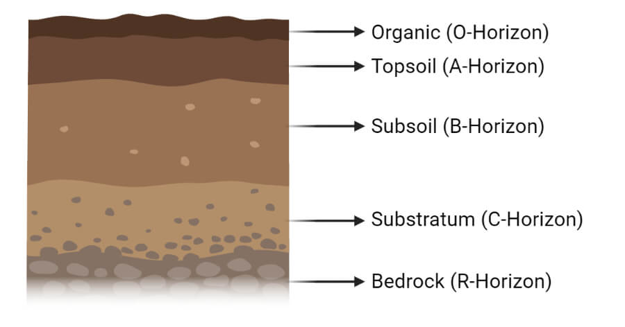
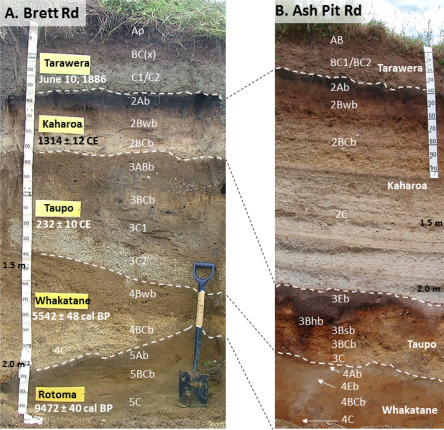

```{r setup, include=FALSE}
library(knitr)
require(tidyverse)
set.seed(453)
# invalidate cache when the package version changes
knitr::opts_chunk$set(tidy = FALSE, echo = FALSE, 
                  message = FALSE, warning = FALSE,
                  out.width = "45%", cache = TRUE, 
                  dev.args=list(bg=grey(0.9), pointsize=11))
options(knitr.table.format = "latex")
options(knitr.kable.NA = "", digits = 2)
options(kableExtra.latex.load_packages = FALSE)
theme_set(theme_bw())
```

# Mating designs [@brown2014plantbreeding]

```{r partial-dial-fun}
partial_dial <- function(n, s, display_mat = c("upper", "lower", "reciprocal")) {
  n <- as.integer(n) # total number of parents
  s <- as.integer(s) # sets of crossess for parent "j" in 1:n
  k <- (n + 1L - s)/2L # possible whole number values for given "n" and "s"
  display <- match.arg(display_mat)
  
  stopifnot( all(k == floor(k)) ) # ensure k is integer
  parent_names <- paste("p", 1:n, sep = "")
  
  partial_matrix <- matrix(nrow = s, ncol = n)
  
  for(i in 1:s) {
    for(j in 1:n) {
      if(display == "reciprocal"){
        if(j > (n-k-i+1) )
          partial_matrix[i, j] <- paste(j, "x", (i+k+j-1)-n)
        else
          partial_matrix[i, j] <- paste(j, "x", i+k+j-1)
      }
      if(display == "upper"){
        if(j < (n-k-i+1) )
          partial_matrix[i, j] <- paste(j, "x", i+k+j-1)
      }
      else
        if(j > (n-k-i+1) )
          partial_matrix[i, j] <- paste(j, "x", (i+k+j-1)-n)
    }
  }
  colnames(partial_matrix) <- parent_names
  return(partial_matrix)
}
```


- Concept based on early work of Louis de Vilmorin from the proposition he made that the only means to determine the value of an individual plant (or genotype) was to grow and evaluate its progeny -- A procedure known as **Progeny testing**.
- Mating designs allow for partitioning of phenotypic effects -- as due to genotype, environment or interacting effects among genes and alleles. 
  - identification of heterotic groups,
  - estimation of general and specific combining abilities and
  - testing of environmental interactions

- Selection methods can be stated as either being forward or backward. Forward selection is synonymous to **within-family selection** whereas the concept of backward selection embodies **selection among families**. 
- Forward selection works best for highly heritable traits -- for those traits regulated by few small genes, as opposed to those involving large number of genes with small cumulative effects. 

<!-- When the interest is to exploit the state of heterosis arising from certain combination of parental individuals, the genetic factors contributing well to superior phenotype should be underpinned. The whole process of determining favorable combination among parental individuals should be met with phenotypic data from many progeny, which is retrospective in purpose -- thus the name backward (family) selection. -->

##

- Selection gets more complicated as data on several different individuals belonging to some families is available. 

\centering Expectation versus Reality

\begin{columns}[T,onlytextwidth]

\column{0.5\textwidth}

```{r soil-profile-simple, out.width="80%"}

```

\column{0.5\textwidth}

```{r soil-profile-complex, out.width="80%"}

```

\end{columns}


##

Broadly, three distinct modes of selection could be practiced:

1. Strict within family selection
2. Selection on within family deviation
3. Combined family and within family selection; family selection index

\footnotesize

- Half-sib selection is used to select superier individuals for their GCA.
- Full-sib selection is used to make distinct parental matings in order to induce hybrid vigor by capturing specific combinining abilities

##

The concept of combining abilities was first laid out by Sprague and Tatum in 1942 [@sprague1942general] in order to generate variance estimates without too much of underlying genetic assumptions. The combining ability test procedure involves making crossess of several different combinations from a set of parents and ascribing the resultant variances statistically to either the genetic additiveness of parental charactersistics or the interacting parental genetic combinations. Thus, the phenotype ($y_i$) of a cross progeny can be modeled as linear combination of additive ($A_i$), dominance ($D_i$) and environmental ($e_i$) effects, is:

$$y_i = \mu + A_i + D_i + e_i$$

## Combining ability

- This mean performance of a line, when expressed as a deviation from the mean of all crosses, gives what is called the general combining ability (**GCA**) of the lines. 
  - Calculated as the average of all $F_1$s having this particular line as one parent
  - Each cross has an expected value (the sum of GCAs of its two parental lines)
  - Differences of GCA are due to the additive and additive x additive interactions in the base population
- The mean genotypic value of offspring from a particular cross may deviate from value expected considering the population mean and the sum of the parental GCA effects -- the specific combining ability (**SCA**) for that cross.
  - differences are attributable to nonadditive (inter-allelic/intra-loci interactions) genetic variance.
- SCA is expected to increase in variance more rapidly as inbreeding in the population reaches high levels.

##

- Mean genotypic value ($G_{AB}$) for the full-sib family produced by crossing parents A and B as the sum of the overall mean $\mu$, the GCAs of the two parents and the SCA value:

$$G_{AB} = \mu + GCA_A + GCA_B + SCA_{AB}$$

- The types of interactions that can be obtained (SCA effects) depend upon the mating scheme used to produce the crosses, the most common being the diallel mating design, developed by B. Griffing (1956). Methods such as top cross and poly-cross are also not uncommon.

##

- A classical method to estimate dominance genetic variance (D) is to estimate the variance associated with SCA effects of many crosses.
- Expected value of the observed SCA variance component is 1/4 of the dominance genetic variance in the reference population.
- The GCA of each line is calculated as follows:

$$
\mathrm{G_x} = \left[\frac{T_x}{n-2}\right]-\left[\frac{\sum T}{n(n-2)}\right]
$$

  - Where $x$ represents a specific line.

##

Using fabricated dataset given in Table \ref{tab:fabricated-diallel} following procedures outlines how GCA for Parent 2 (P2) can be calculated.

\begin{equation}
\begin{split}
\mathrm{GCA_{P2}} & = \left[\frac{T_x}{n-2}\right]-\left[\frac{\sum T}{n(n-2)}\right] \\
 & = \left[\frac{39.7}{8}\right]-\left[\frac{324.7}{10\times 8}\right] \\
 & = 4.96-4.06 \\
 & = 0.9
\end{split}
\end{equation}

# Diallel scheme

##

- Term *diallel cross* was first used by Danish geneticist J. Schmidt in animal breeding work.
- More sophisticated application of Vilmorin's progeny test. 
- Types of diallel mating design:

##

1. **Full/Complete diallels**: All the possible combinations of crosses among parents, including reciprocals and self-fertilization of the parents are made. For a sample of $n$ parents, the full-diallel requires $n \times n$ ($n^2$) progenies, a number that quickly becomes unmanageable as more parents are sampled (Table \ref{tab:full-diallel}).

```{r full-diallel}
# Full diallel mating scheme

ten_ind <- gl(10, k = 1, ordered = T, labels = paste("P", 1:10, sep = ""))
mating_mat <- cross_df(.l = list(M = ten_ind, F = ten_ind)) %>% 
  unite(col = "cross", sep = " x ", remove = F) %>% 
  spread(key = F, value = cross) %>% 
  dplyr::rename(Parents = M)

mating_mat %>%
  knitr::kable(caption = "Full diallel mating scheme using 10 parents", 
               booktabs = TRUE, digits = 2, longtable = TRUE) %>% 
  kableExtra::kable_styling(latex_options = "striped", font_size = 8) %>% 
  kableExtra::column_spec(1, bold = TRUE) %>% 
  kableExtra::column_spec(column = 1:11, width = c(rep("3.0em", 10), "3.5em"))
```

##

2. **Half diallels**: Each parent is mated with every other parent, excluding selfs and reciprocals. This requires making $\frac{n(n-1)}{2}$ crosses for n parents (Table \ref{tab:half-diallel}).

```{r half-diallel}
# Half diallel mating scheme

ten_ind <- gl(10, k = 1, ordered = T, labels = paste("P", 1:10, sep = ""))
mating_mat <- cross_df(.l = list(M = ten_ind, F = ten_ind)) %>% 
  unite(col = "cross", sep = " x ", remove = F) %>% 
  spread(key = F, value = cross) %>% 
  dplyr::rename(Parents = M)

mating_mat[,-1][upper.tri(mating_mat[,-1], diag = TRUE)] = NA
  
mating_mat %>%
  knitr::kable(caption = "Half diallel mating scheme using 10 parents", 
               booktabs = TRUE, digits = 2,
               longtable = TRUE
               ) %>% 
  kableExtra::kable_styling(latex_options = c("striped", "repeat_header", "HOLD_position") , font_size = 8) %>% 
  kableExtra::column_spec(0, bold = TRUE) %>% 
  kableExtra::column_spec(column = 1:11, width = "3.0em")
```

##

3. **Partial diallel**: Not all the crosses are made. There are no reciprocals or selfs. The goal is to reduce the breeding workload for a given sample of parents by making less than $\frac{n(n-1)}{2}$ crosses for n parents (Table \ref{tab:partial-diallel-10p-table} is for example diallel cross involving 10 parental lines and 7 set of cross involving each parent).

With the partial scheme of diallel cross, same number of parents could be tested in a framework with fewer crosses. The number of crosses in a partial diallel scheme is given by,

$$
\large x = \frac{n \times s}{2} \leadsto n = \frac{2x}{s}
$$

<!-- By analogy, we could have said that large number of lines could be tested with lesser crossings under diallel scheme.  -->

<!-- Further, there is restriction as to how $s$ should is selected, for example, is $s = n -1$ it gives half diallel cross. $s$ is a whole number greater than or equal to 2, and $k$ is a whole number -- $k = \frac{n + 1 - s}{2}$. -->

<!-- Each parent occurs in $s$ crosses, hence the number of crosses sampled is $ns/2$. For this to be true, For k to be a whole number, we do not want both $n$ and $s$ to be odd or both even. -->

<!-- Now let's return to our previous example, with number of parents ($n$) to be 10. With $n = 10$ we definitely want each parent to occur in at least 2 sets of crosses. But, note that number of parents too is even (10). Hence, even values of $s$ is not allowed. Thus value of $s$ could be anywhere in $\{3, 5, 7, 9\}$. We could also verify that even values of $s$ does not satisfy the requirement for $k$ to be a wholenumber. -->

<!-- For $s = 2$, $k = \frac{n + 1 - s}{2} = \frac{10 + 1 - 2}{2} = \frac{9}{2} \neq \textrm{whole number}$ -->

<!-- For $s = 4$, $k = \frac{n + 1 - s}{2} = \frac{10 + 1 - 4}{2} = \frac{7}{2} \neq \textrm{whole number}$, and so on. -->

##

```{r partial-diallel-calculated}
diallel_comparison_partial <- tribble(
  ~"design", ~"s",
  "partial", 2, 
  "partial", 3, 
  "partial", 4, 
  "partial", 5, 
  "partial", 6, 
  "partial", 7, 
  "partial", 8, 
  "partial", 9, 
  "full", NA, 
  "half", NA
) %>% 
  mutate(
    number_of_crosses = case_when(
    design == "partial" ~ 10 * s/2,
    design == "full" ~ 10 * 10, 
    design == "half" ~ 10 * (10-1)/2, 
    TRUE ~ NA_real_), 
    k = case_when(
      design == "partial" ~ (10 + 1 - s)/2,
      TRUE ~ NA_real_)
    )
  
# diallel_comparison_partial %>%
#   knitr::kable(booktabs = TRUE, col.names = c("Design", "$s$", "Number of Crosses", "$k$"), escape = FALSE) %>%
#   kableExtra::kable_styling() #%>%
  # kableExtra::collapse_rows(1:2, row_group_label_position = "stack", latex_hline = "major")

```


```{r partial-diallel-10p-data}
# # # generate partial design tidily ?
# diallel_comparison_partial %>%
#   filter(design == "partial") %>%
#   filter((s %% 2) == 1)

partial_diallel_10p <- partial_dial(n = 10, s = 5, display_mat = "lower") %>% 
  as_tibble() %>% 
  pivot_longer(cols = 1:10, names_to = "parent1", values_to = "cross") %>% ## using external vector is uncommon for dplyr so add `all_of`
  dplyr::select(-parent1) %>% 
  dplyr::filter(!is.na(cross)) %>% 
  separate(col = cross, into = c("p1", "p2"), sep = c(" x "), remove = FALSE) %>%
  mutate_at(vars(p1, p2), as.numeric) %>% 
  complete(expand_grid(p1 = 1:10, p2 = 1:10)) %>%
  pivot_wider(names_from = p1, values_from = cross) %>% 
  dplyr::rename("p" = p2) 

```


```{r partial-diallel-10p-table}
partial_diallel_10p %>% 
  knitr::kable(booktabs = TRUE, caption = "Partial diallel cross involving 10 parents combined in 5 set of crossess each.", escape = FALSE, longtable = TRUE) %>% 
  kableExtra::kable_styling(latex_options = c("striped", "HOLD_position"), font_size = 8)
```

# Analysis of diallel cross

##

There are mainly two approaches for analysis and interpretation of data derived from diallel cross. They are:

1. Analysis of general and specific combining ability. These methods are often referred to as Griffing's analyses, after B. Griffing who published his now famous paper _Concept of general and specific combining ability in relation to diallel crossing systems_.
2. Analysis of array variances and covariances, often referred to as Hayman and Jinks' paper of 1953, _The analysis of diallel crosses_

## Griffing analysis

\footnotesize

Griffing's approach provides easy interpretation of results compared to other analyses available. Parents used in diallel crosses can be homozygous or heterozygous; for simplicity, diallel types are described here in terms of homozygous (inbred) parents. Griffing's diallel comprise of full diallel, half diallel (all possible combinations without reciprocals but contains parental selfs), modified diallel (all possible without parental selfs). 

<!-- Griffing's analysis requires no assumptions and has been shown by many researchers to provide reliable information on the combining potential of parents. Once identifid, the "best" parental lines (those with the highest general combining ability) can be crossed to identify optimum hybrid combinations or to produce segregating progeny from which superior cultivars would occur at a high frequency. -->

In simplest terms, the cross between two parents (i.e. parent $i$ and parent $j$) in Griffing's analysis would be expressed as:

$$
X_{ij} = \mu + g_i + g_j + s_{ij}
$$

Where $\mu$ is the overall mean of all entries in the diallel design, $g_i$ is the general combining ability of the $i^{th}$ parent, $g_j$ is the general combining ability of the $j^{th}$ parent, and $s_{ij}$ is the specific combining ability between the $i_{th}$ parent and the $j_{th}$ parent.

##

General combining ability (GCA) measures the average performance of parental lines in cross combination. GCA is therefore related to (but not directly equal to) the proportion of variation that is genetically additive in nature.

Specific combining ability (SCA) is the remaining part of the observed phenotype that is not explained by the general combining ability of both parents that constituted the progeny. By definition, SCA is the portion of genetic variability which is not additive.

##

Griffing's analysis of a diallel is by analysis of variance, where the total variance of all entries is partitioned into; and error variances. In case where reciprocals are included, then reciprocals (or maternal effects) are also partitioned. Error variances are estimated by replication of families. To avoid excessive repetition, only Method 1 (complete diallel) and Method 2 (half diallel), both including parents, will be considered further.

##

\footnotesize

Degrees of freedom (df), sum of squares (SS) and mean squares (MSq) from the analysis of variance for Method 1 for the assumption of model 1 (fixed effects) are shown in Table \ref{tab:complete-diallel-fixed}

```{r complete-diallel-fixed,echo=FALSE}
complete_diallel1 <- read_csv("../data/full_diallel_fixed_anova.csv")

complete_diallel1 %>% 
  kable(format = "latex", booktabs = TRUE, escape = FALSE, caption = "Degrees of freedom, sum of squares and mean squares from the analysis of variance of a full diallel including parent selfs (Method 1) assuming fixed effects. Also shown are the expectations for the mean squares") %>% 
  kableExtra::kable_styling(font_size = 8)
```

that is, sum over rows; $X_j$ is $\sum_ix_{ij} = x_{1j} + x_{2j} + x_{3j} + ...,$ that is, sum over columns; and $X_{...}$ is $\sum_{ij}x_{ij}$, the sum of all observations. Where r is the number of replicates; p is the numeber of parents; $S_g$ is $\frac{1}{p+2}(\sum_i(X_i + x_ii)^2-\frac{4}{pX_{...}^2})$; $S_s$ is $\sum_{i<j}x_{ij}^2-\frac{1}{p+2}\sum_i(X_i + x_{ii})^2 + \frac{2}{(p+1)(P+2)X_{...}^2}$ and $X_{i...}$ is $\sum_j x_{ij} = x_{i1} + x_{i2} + x_{i3} + ...,$ that is, the sum over rows; $X_{...}$ is $\sum_{ij}x_{ij}$, the sum of all observations.

##

\footnotesize

When SCA is relatively small in comparision with GCA, it should be possible to predict the performance of particular cross combinations based only on the values obtained for GCA of parents.

A realtively large SCA/GCA ratio implies the presence of dominance and/or epistatic gene effects. It should be noted that if dominance x additive effects are present, the GCA component will also contain some of these effects in addition to pure additive effects.

For inbred lines, the closer that the following equations are equal to one (i.e. as SCA becomes small or very small compared with GCA), then greater predictability based on GCA will be possible. The ratio equations for each model are:

$$
\begin{aligned}
Model~1 &: \frac{2g_i^2}{[2g_i^2 + s_{ij}^2]} \\
Model~2 &: \frac{2\sigma_g^2}{[2\sigma_g^2 + \sigma_s^2]}
\end{aligned}
$$

Where $g_i^2$, $\sigma_g^2$ are the general combining ability mean square and variance, respectively and $s_{ij}$ and $\sigma_s^2$ are specific combining ability mean square and variance, respectively.

# Example (fabricated) diallel cross data

##

```{r fabricated-diallel}
# Fabricated half diallel mating data

ten_ind <- gl(10, k = 1, ordered = T, labels = paste("P", 1:10, sep = ""))
mating_mat <- cross_df(.l = list(M = ten_ind, F = ten_ind)) %>% 
  unite(col = "cross", sep = " x ", remove = F) %>% 
  spread(key = F, value = cross) %>% 
  dplyr::rename(Parents = M)

mating_mat[,-1][upper.tri(mating_mat[,-1], diag = TRUE)] = NA

# generate a vector of population means of length = n, representing each parental line
mu_list = rnorm(10, mean = 3.5, sd = 1.0)
  
# generate a vector of sds of length = n, representing each parental line
sd_list = rnorm(10, mean = 1.2, sd = 0.3)

# generate a dataframe of random numbers for each column
mating_mat_num <- map2_dfc(.x = mu_list, 
     .y = sd_list, 
     .f = ~cbind(rnorm(10, .x, .y))) %>% 
  magrittr::set_colnames(paste("P", 1:10, sep = ""))
mating_mat_num <- replace(mating_mat_num, !map_df(mating_mat[,-1], ~!is.na(.x)), NA)

mating_mat_num %>%
  add_column(.before = 1, Parents = mating_mat$Parents) %>% 
  knitr::kable(caption = "Fabricated data from a diallel cross scheme using 10 parents", booktabs = TRUE, digits = 2, longtable = TRUE) %>% 
  kableExtra::kable_styling(latex_options = "striped", font_size = 8) %>% 
  kableExtra::column_spec(1, bold = TRUE) %>% 
  kableExtra::column_spec(column = 1:11, width = "3em")
```

\footnotesize

Taking the above table of diallel cross data, total of each individual parental line could be computed by summing over all the crossess involving the common parent. Similarly, the grand totals could be obtained by adding together all the individual parents' total. The individual parents' sum and grand total is shown in the Table \ref{tab:sum-over-ind} below.

##

```{r sum-over-ind}
as.matrix(mating_mat_num) %>% 
  Matrix::forceSymmetric("L") %>% 
  as.matrix() %>% 
  colSums(na.rm = TRUE) %>% 
  as_data_frame() %>% 
  add_column(.before = 1, Parents = mating_mat$Parents) %>% 
  dplyr::rename("Line total" = "value") %>% 
  add_case(`Parents` = "Total", `Line total` = sum(.$`Line total`)) %>% 
  knitr::kable(caption = "Totals of individual lines and grand total of diallel cross\n scheme using 10 parents", 
               booktabs = TRUE, digits = 2) %>% 
  kableExtra::kable_styling(latex_options = "striped", font_size = 8) %>% 
  kableExtra::column_spec(1, bold = TRUE)
```

# Bibliography

## References
