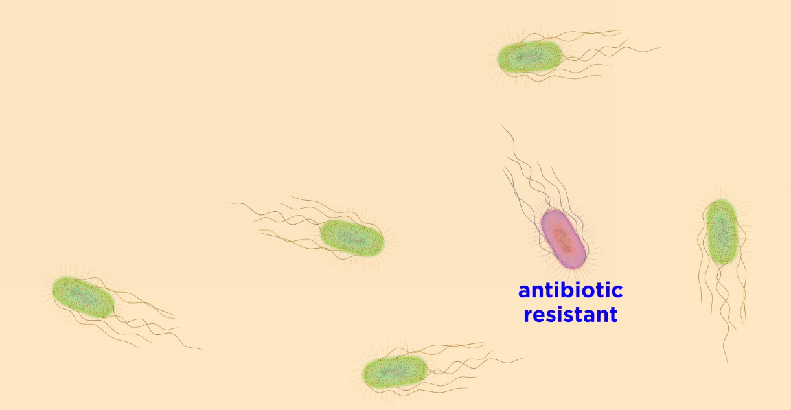

```{r setup, include=FALSE}
library(knitr)
require(tidyverse)
require(janitor)
require(viridis)
require(viridisLite)
set.seed(453)
# invalidate cache when the package version changes
knitr::opts_chunk$set(tidy = FALSE, echo = FALSE, 
                  message = FALSE, warning = FALSE,
                  out.width = "45%", cache = TRUE, 
                  dev.args=list(bg=grey(0.9), pointsize=11))
options(knitr.table.format = "latex")
options(knitr.kable.NA = "", digits = 2)
options(kableExtra.latex.load_packages = FALSE)
theme_set(theme_bw())
```

# Evolution and evidences

## Introduction to key terms

\footnotesize

Mutations alter an organism's genotype and occasionally this causes different phenotypes to appear. Most mutations have little effect on an organism's phenotype, health, or reproductive fitness. Mutations that do have an effect are usually detrimental, but occasionally some can be beneficial. Studies in the fly *Drosophila melanogaster* suggest that if a mutation changes a protein produced by a gene, about 70 percent of these mutations will be harmful with the remainder being either neutral or weakly beneficial.

- A population can be defined as a group of interbreeding individuals and their offspring.
- Population genetics studies the distribution of genetic differences within populations and how these distributions change over time.
- Changes in the frequency of an allele in a population are mainly influenced by **natural selection**.
- Over many generations, the genomes of organisms can change significantly, resulting in evolution. In the process called **adaptation**, selection for beneficial mutations can cause a species to evolve into forms better able to survive in their environment.
- New species are formed through the process of **speciation**, often caused by geographical separations that prevent populations from exchanging genes with each other.
- By comparing the homology between different species' genomes, it is possible to calculate the evolutionary distance (presented as evolutionary trees!) between them and when they may have diverged.
- Genetic comparisons are more accurate than phenotypic.

## Theories of evolution

\begin{columns}[T,onlytextwidth]
\column{0.4\textwidth}

The theory of \textbf{special creation} and the theory of \textbf{descent with modification} make different assertions about species, where they came from, and how they are related, as well as different assertions about the age of Earth. These assertions can be checked against evidence.

\column{0.6\textwidth}

```{r descent-with-modification, fig.cap = "\\textbf{Testing theory of descent with modification with structural homology}. Descent with modification produces nested set of traits (a) The evolutionary history of a suite of hypothetical snail species. (b) The novel traits shared by the extant species.", out.width="78%"}

```

\end{columns}

##

```{r tree-of-life, fig.cap="A bird with a dinosaur's skeleton (a) Archaeopteryx had flight feathers like a modern bird's and a dinasaur-like skeleton with teeth and a long tail. (b) The distribution of traits in dinosaurs, birds, and Archaeopteryx is consistent with idea that they share an ancestor (Phylogeny simplified from Lloyd et al. 2008; Hu et al. 2009. Archaeopteryx reconstruction after Longrich 2006.))", out.width="60%"}


```

## Evidences for evolution

\begin{columns}[T,onlytextwidth]

\column{0.4\textwidth}

\begin{itemize}
\item Direct observation
\item Morphological homology
\item Developmental homology
\end{itemize}

\column{0.6\textwidth}

```{r insect-fooding-change-guides-evolution, out.width="90%"}

```

```{r bacterial-antibiotic-exposure-guides-evolution, out.width="80%"}

```

\end{columns}

##

```{r structural-homologies-bones, fig.cap = "Structural homologies. These vertebrate forelimbs are used for different functions, but have the same sequence and arrangement of bones (Homologous bones are colored in the same way and are labelled on the human arm.)", out.width="86%"}

```

##

\begin{columns}
\column{0.5\textwidth}
\begin{itemize}
\footnotesize
\item Carpels, stamens, petals, and sepals, are homologous with and derived from leaves. The development of these parts through a pattern of gene expression in the growing zones (meristems) is described by the ABC model of flower development. Each of the four types of flower parts is serially repeated in concentric whorls, controlled by a small number of genes acting in various combinations. Thus, A genes working alone result in sepal formation; A and B together produce petals; B and C together create stamens; C alone produces carpels. When none of the genes are active, leaves are formed. Two more groups of genes, D to form ovules and E for the floral whorls, complete the model. The genes are evidently ancient, as old as the flowering plants themselves.
\end{itemize}
\column{0.5\textwidth}

```{r floral-parts-as-leaf-homologues, out.width="98%"}

```

\end{columns}

##

\begin{columns}[T,onlytextwidth]

\column{0.58\textwidth}
\textbf{Sequence homology}
\footnotesize
Vertebrates are the least diverse group; however, most vertebrates still possess a lot of nucleotide diversity. For humans, nucleotide diversity is about 0.001, meaning that two randomly chosen human chromosomes will differ at about 1 bp per thousand. With 3 billion bp in our genome, that adds up to a total of about 3 million differences between the set of chromosomes inherited from a person's mother and the set inherited from a person's father for non-inbred individuals.

```{r nucleotide-diversity, out.width="42%", fig.align='center', fig.pos= "H"}

```

\column{0.42\textwidth}

```{r sequence-homology-g6pd-locus, out.width="68%", fig.cap="Nucleotide variation for 5102 bp of the G6PD gene for a worldwide sample of 47 men. Only the 18 variable sites are shown. The functional allele classes (A-, A+, or B) is shown for each sequence. SNP2 is a non-sysnomymous SNP that causes a valine-to-methionine change that underlies differences in enzyme activity associated with the A- allele. SNP3 is a nonsynomymous SNP that causes an aspartic-acid-to-asparagine amino acid change. (Data from M.A. Saunders et al., Genetics 162, 2002, 1849-1861)", fig.pos="h"}
# pdftools::pdf_convert("/home/deependra/ddhakal/000readables/genetics_breeding/general_textbooks/2015_An Introduction to Genetic Analysis.pdf", format = "png", dpi = 300, filenames = "../images/sequence_homology_variation_g6pd.png", pages = 711)


```

\end{columns}

##

\begin{columns}

\column{0.35\textwidth}

\begin{itemize}
\item Vestigeal organs
\item Fossil records
\end{itemize}

\column{0.65\textwidth}

```{r vestigeal-structures, out.width="95%"}

```

\end{columns}

# Populations structure, stratification and evolution by natural selection

## Natural population

- Natural population are subject to variable conditions of mutation, migration, and selection. They are non constant with respect to size, mating pattern. 
- Multiple loci and multiple alleles per loci interact to cause variable fitness of genotypes.
- Most popular approach to studying natural population is to make measurements of various characteristics present in natural and experimental (hypothesized) population and then, in combination with mathematical analysis, use these observations to derive the genetic structure of populations.

## Optimum phenotypes and selection pressure

- Because of selection over long period of time, most populations may be considered to have achieved phenotypes optimally adapted to their surroundings.
- Large number of phenotypes cluster around value of highest fitness.
- "It is quite as dangerous to be conspicuously above a certain standard of organic excellence as it is to be conspicuously below the standard" (Bumpus, 1899; The elimination of the unfit as illustrated by the introduced sparrows.)

```{r optimal-birth-weight-human}
london_hospital_survivors <- tribble(
  ~"total_female_births", ~"survivors_after_1mo", 
  6693, 6419
)

london_hospital_survivors %>% 
  mutate(dead_at_1mo = total_female_births - survivors_after_1mo) %>% 
  rename_all(function(x)str_to_title(str_replace_all(x, "_", " "))) %>% 
  knitr::kable(caption = "\\textbf{Optimal birth weight in human}. Proportion of suvivors (1 month after) of the female birth at London hospital. Optimal birth weight, that which has highest proportion of survivors is 8 pounds.", booktabs = TRUE) %>% 
  kableExtra::kable_styling(font_size = 8)
```

##

\footnotesize

- In the present case, $\longrightarrow$ Overall mortality = `r (scales::percent(274/6693))` (mortality of optimum 8-pound class was only 1.2 %). In other words, $4.1 - 1.2 = 2.9$ percent additional mortality occurred in the population among the phenotypes which were not of the optimal 8-pound class. This 2.9 percent value may therefore be used as a measure of the intensity or pressure of selection for an optimum birth weight.
- **Selection intensity** (I) can be defined as the difference in survival rates between optimal ($S_0$) and suboptimal ($S_s$) phenotypes, multiplied by the frequency of suboptimal phenotypes ($f_s$).

$$
I = (S_o - S_s)\times f_s
$$

- When selection pressure is 0, all phenotypes are optimal ($f_s = 0$), and when selection pressure is 1, all phenotypes are sub-optimal with a survival rate zero ($S_o - S_s = 1$).
- In London hospital birth case, $S_o = \frac{718}{727} = .988$, $S_s = \frac{5701}{5966} = .956$ and $f_s = \frac{5966}{727+5966} = 0.892$, hence

$$
I = (0.988 - 0.956)\times 0.892 = 0.029
$$

- There was a total of 4.1% deaths, of which 2.9% were caused by selection against suboptimal phenotypes, or $\frac{2.9}{4.1} = 70.8$ percent deaths were caused by selection against these phenotypes at birth.

##

```{r natural-selection-for-optimal-phenotypes, fig.cap="Selection pressure on a population (I) under different frequencies of suboptimal phenotypes ($f_s$) and different departures of the suboptimal survival rate from the optimal ($S_o - S_s$)", out.width="70%"}
sel_in <- function(survival_rate_departure,freq_subopt){survival_rate_departure*freq_subopt}

selection_pressure_sub_phenotypes <- map_dfr(set_names(seq(0, 1, by = 0.15), paste0("freq_subopt_", seq(0, 1, by = 0.15))),
        ~sel_in(seq(0, 1, by = 0.05), .x)) %>% 
  pivot_longer(cols = everything(), names_to = "suboptimal_frequency", "survival_departure")

selection_pressure_fun_df <- tibble(sr_depart = seq(0, 1, by = 0.05))

ggplot(data = selection_pressure_fun_df) +
  # xlim(0, 1) + # will allele frequency ever go beyond (0,1) ? NO
  geom_function(fun = ~sel_in(., 0.1), color = "blue") +
  geom_function(fun = ~sel_in(., 0.2), color = "black") +
  geom_function(fun = ~sel_in(., 0.3), color = "red") +
  geom_function(fun = ~sel_in(., 0.4), color = "turquoise") +
  geom_function(fun = ~sel_in(., 0.6), color = "sky blue") +
  geom_function(fun = ~sel_in(., 0.8), color = "green") +
  geom_text(data = tibble(x = c(0.95), y = c(0.1, 0.2, 0.3, 0.4, 0.6, 0.8)+0.065,
                          text = as.character(c(0.1, 0.2, 0.3, 0.4, 0.6, 0.8))), 
            aes(x = x, y = y, label = text, color = text)) +
  scale_color_manual(values = c("0.1" = "blue", "0.2" = "black", "0.3" = "red", 
                                "0.4" = "turquoise", "0.6" = "sky blue", "0.8" = "green")) +
  labs(color = "Frequency of \nsuboptimal phenotype",
       x = "Departure from optimal survival rate (So - Ss)",
       y = "Selection intensity") +
  scale_x_continuous(limits = c(0, 1)) + # this or xlim()
  guides(color = guide_legend(reverse = TRUE, label.theme = element_text(angle = -20)))

```

##

- Value of $S_o - S_s$ and $f_s$ vary between different populations and undoubtedly at different times in the life cycle of any population. 
- High selection intensities do not persist for many generations , since any increase in $I$ because of a new departure from optimum phenotype is an additional burden on a population that is already suffering from mortality caused by the usual non-selective factors that affect all phenotypes equally.

## Population size and inbreeding

\footnotesize

- In small populations, individuals are more likely to mate with a relative than in large ones. So, effect of population size on the overall level of inbreeding (as measured by $F$\footnote[frame]{"Inbreeding Coefficient" for pedigrees was derived in Chapter "Quantative Genetics".})
- Consider a population with $F_t$ being the level of inbreeding at generation $t$. To form an individual in the next generation $t + 1$, we select the first allele from the gene pool. Suppose the population size is $N$.
- After the first allele is selected, the probability that the second allele we pick will be exactly the same copy is 1/2N and the inbreeding coefficient for this individual is 1.
- The probability that the second allele we pick will be different copy from the first allele is $1 - \frac{1}{2}N$ and the level of inbreeding for the resulting individual would be $F_t$, the average inbreeding coefficient for the initial population at generation $t$.
- The level of inbreeding in the next generation is the sum of these two possible outcomes:

$$
\small
F_{t+1} = \frac{1}{2N}1 + \left(1 - \frac{1}{2N}\right)F_t
$$

##

\footnotesize

- This shows that $F$ will increase over time as function of population size. 
  - When $N$ is large, $F$ increases slowly over time.
  - When $N$ is small, $F$ increases rapidly over time.
- The equation above can be re-written as:

$$
\small
(1 - F_{t+1}) = \left(1 - \frac{1}{2N} \right) (1 - F_t)
$$

##

- We also have the formula for the frequency of heterozygotes ($H$) with inbreeding as,

$$
\small
\begin{aligned}
& H = f_{A/a} &=& 2pq - 2pqF \\
\implies & (1-F) &=& \frac{H}{2pq}
\end{aligned}
$$

- Combining these two equations, we get:

$$
\small
\begin{aligned}
& \frac{H_{t+1}}{2pq}  &=& \left( 1- \frac{1}{2N} \right) \frac{H_t}{2pq}\\
\implies &(H_{t+1}) &=& \left(1 - \frac{1}{2N} \right) H_t
\end{aligned}
$$

##

\footnotesize

- Thus, for each generation, the level of heterozygosity is reduced by the fraction ($1 - \frac{1}{2N}$). The reduction in H over $t$ generations can be combined with the change in $F$ over generations as,

$$
F_t = 1 - \left(1 - \frac{1}{2N} \right)^t (1 - F_0)
$$

```{r increasing-inbreeding-over-time-for-N, out.width="60%", fig.height=3, fig.width=6, fig.align='center'}
inbreed_coef_time_n <- function(F_0 = 0,
                                N = 50, # population size
                                t = time_t){
 return( 1 - ((1 - (1/(2*N)))^t * (1 - F_0))) 
}

inbreed_over_time <- tibble(N = c(10, 20, 50, 90, 100, 200)) %>% 
  mutate(F = inbreed_coef_time_n(N = N, t = 95, F_0 = 0)) %>% 
  mutate(label_at_x = 95) %>% 
  mutate_at("N", as.character)

ggplot() +
  # xlim(0, 1) + # will allele frequency ever go beyond (0,1) ? NO
  geom_function(fun = ~inbreed_coef_time_n(t = ., N = 10), color = "blue") +
  geom_function(fun = ~inbreed_coef_time_n(t = ., N = 20), color = "black") +
  geom_function(fun = ~inbreed_coef_time_n(t = ., N = 50), color = "red") +
  geom_function(fun = ~inbreed_coef_time_n(t = ., N = 90), color = "turquoise") +
  geom_function(fun = ~inbreed_coef_time_n(t = ., N = 100), color = "sky blue") +
  geom_function(fun = ~inbreed_coef_time_n(t = ., N = 200), color = "green") +
  geom_text(data = inbreed_over_time,
            aes(x = label_at_x, y = F+0.05, label = paste0("N = ", N), color = N)) +
  scale_color_manual(values = c("10" = "blue", "20" = "black", "50" = "red",
                                "90" = "turquoise", "100" = "sky blue", "200" = "green")) +
  labs(color = "Population size",
       x = "Time in generations",
       y = "Inbreeding (F)") +
  scale_x_continuous(limits = c(0, 110)) + # this or xlim()
  guides(color = guide_legend(reverse = TRUE, label.theme = element_text(angle = -20)))

```


## Types of selection

- Stabilizing selection
- Directional selection (common in plant/animal breeding)
- Cyclical selection
- Disruptive selection

```{r selection-types, fig.cap="Stabilizing and directional selection types. Parents in the shaded region are selected for producing the next generation.", out.width="70%", fig.height=3, fig.width=7}

require(patchwork)

mean <- 0
sd <- 1
limits <- c(mean - 3 * sd, mean + 3 * sd)
x <- seq(limits[1], limits[2], length.out = 100)

lb <- -qnorm(0.80)
ub <- qnorm(0.80)

xmin <- max(lb, limits[1])
xmax <- min(ub, limits[2])
areax <- seq(xmin, xmax, length.out = 100)
area <- data.frame(x = areax, ymin = 0, ymax = dnorm(areax, mean = mean, sd = sd))

stabilizing_sel <- ggplot() + 
  geom_line(data.frame(x = x, y = dnorm(x, mean = mean, sd = sd)),
            mapping = aes(x = x, y = y)) + 
  geom_ribbon(data = area, mapping = aes(x = x, ymin = ymin, ymax = ymax)) +
  scale_x_continuous(limits = limits) +
  labs(x = "Phenotype value",
       y = "pdf(x)") +
  theme_bw()

lb <- qnorm(0.9)
ub <- 5

xmin <- max(lb, limits[1])
xmax <- min(ub, limits[2])
areax <- seq(xmin, xmax, length.out = 100)
area <- data.frame(x = areax, ymin = 0, ymax = dnorm(areax, mean = mean, sd = sd))
directional_sel <- ggplot() + 
  geom_line(data.frame(x = x, y = dnorm(x, mean = mean, sd = sd)),
            mapping = aes(x = x, y = y)) + 
  geom_ribbon(data = area, mapping = aes(x = x, ymin = ymin, ymax = ymax)) +
  scale_x_continuous(limits = limits) +
  labs(x = "Phenotype value",
       y = "pdf(x)") +
  theme_bw()

stabilizing_sel + directional_sel + plot_layout(ncol = 2)
```


# Gene and genotypes

## Mendel's model of particulate genetics 

- Mendel's first law (Aa): independent segregation of alleles at a single locus occurs due to random sampling without bias

<!-- ```{r, warning=FALSE} -->
<!-- # fusion of two independently sampled gametes from a population of single gene having two alleles is shown by addition -->
<!-- chisq.test(table(rbinom(1000, 1, p=0.5)+rbinom(1000, 1, p=0.5)), c(1,2,1)) -->
<!-- ``` -->

- Mendel's second law (AaBb): independent assortment of multiple loci is due to various linkage groups (apply the product rule)

## What is allele/gene ?

An allele/gene is the bit of DNA at the place called locus (the place on a chromosome where an allele resides). An allele is instantiation of a locus. But by orthology, a locus is not template for an allele. Similarly, a locus is not tangible, rather a map describing where to find a tangible thing, an allele on a chromosome. A diploid individual has two alleles at a particular autosomal locus.

<!-- ## Mechanisms by which alleles at same locus changes -->

<!-- 1. By origin: Same locus but different chromosome. -->

<!-- 2. By state: It is indicative of the context they are put in. i.e. DNA sequence or amino acid sequence. Same amino acid sequence in some alleles may arise due to different DNA sequences (Redundancy of genetic code). -->

<!-- 3. By descent: In practice, we are often concerned with relatively short time in past and are content to say that two alleles differ by descent if they do not share common ancestor in say, the past 10 generations. Two alleles different by descent may or may not be different by state because of mutation. -->

<!-- ## -->

<!-- Converse of the mechanisms which cause differences in alleles are termed as identical by origin, stage or descent. Diploid individuals are said to be heterozygous at a locus if two alleles at that locus are different by state. If we are studying proteins, we may call an individual homozygous at a locus when the protein sequence of the two alleles are identical, even if their DNA sequences differ. -->

<!-- ```{r, message=FALSE, warning=FALSE, fig.cap="An example of pedigree tree showing single pedigree family with 14 subjects", fig.width=8, fig.height=5, echo=FALSE} -->
<!-- require(kinship2) -->

<!-- # load data -->
<!-- data("sample.ped") -->
<!-- # define pedigree list object -->
<!-- sam_ped <- pedigree(id = sample.ped$id, dadid = sample.ped$father, momid = sample.ped$mother, sex = sample.ped$sex, famid = sample.ped$ped) -->

<!-- # pedigree plot -->
<!-- sam_ped[2] %>%  -->
<!--   plot(cex = 0.8) -->
<!-- ``` -->


<!-- ## Kreitman's sample -->

<!-- Kreitman's sample contain II alleles that differ by origin. How many alleles differ by state? If we were interested in the full DNA sequence, the sample contains six alleles that differ by state. If we were interested in the proteins, then sample contains only two alleles that differ by state. Of the two protein alleles, the one with a lysine at position 192 makes up $\frac{6}{10} = 0.55$ of the alleles. The usual way to say this is that the allele frequency is an estimate of the population allele frequency. It's not a particularly precise estimate because of the small sample size. A rough approximation to the 95% confidence interval for a proportion is, -->

<!-- $$ -->
<!-- \hat{p} \pm 1.96 \sqrt{\frac{\hat{p}(1-\hat{p})}{n}} -->
<!-- $$ -->

<!-- Where $\hat{p}$ is the estimate of proportion, 0.55 in our case and $n$ is the sample size. Thus, the probability that the populatoin allele frequency falls within the interval (0.26, 0.84) is 0.95. If more precise estimate is needed, the sample size would have to be increased. -->

## Genotype and allele frequencies

In A loci, suppose, two alleles $A_1$ and $A_2$ are present in a diploid organism the genotype and genotypic frequency of segregating population will be;

$$
\begin{aligned}
\textrm{Genotype} \hspace{20pt} & A_1A_1 & A_1A_2 \hspace{20pt} & A_2A_2 \\
\textrm{Relative frequency} \hspace{20pt} & x_{11} & x_{12} \hspace{20pt} & x_{22}
\end{aligned}
$$

As, relative frequencies must add to 1,

$$
x_{11} + x_{12} + x_{22} = 1
$$

The order of subscripting heterozygous is arbitrary.

Frequency of $A_1$ allele in the population is,

$$
p = x_{11} + \frac{1}{2}x_{12}
$$

##

and frequency of $A_2$ allele is,

$$
q = 1-p = x_{22} + \frac{1}{2}x_{12}
$$

Measure of each allele frequency can be thought of as independent events. For e.g., for allele $p$ to be selected;

$$
p = \left(x_{11} \times \frac{1}{P(p_{A_1A_1})}\right) + \left(x_{12} \times \frac{1}{2}\right) + (x_{22} \times 0)
$$

Where, $P(p, A_1A_1)$ is the probability of getting $p$ allele from $A_1A_1$ genotype, for loci with more than two alleles, frequency of $i^{th}$ allele will be called $p_i$. Frequency of $A_iA_j$ genotype will be called $x_{ij}$ for heterozygotes, $i\neq j$ and, by convention, $i<j$. 

##

If there are $n$ alleles,

$$
\begin{aligned}
1 &= x_{11} + x_{22} + x_{33} + ... + x_{nn} + x_{12} + x_{13} + x_{(n-1)n} \\
  &= \sum^n_{i=1}\sum^n_{j\geq i}{x_{ij}}
\end{aligned}
$$

The frequency of $i^{th}$ allele is

$$
p_i = x_{ii} + \frac{1}{2}\sum^{i-1}_{j = 1}{x_{ji}} + \frac{1}{2}\sum^n_{j = i+1}{x_{ij}}
$$

##

\scriptsize

In a population consisting of 10,000 individuals, 1 individual is of "aa" genotype. If the population is in Hardy-Weinberg equilibrium, find the gene and genotype frequencies of that population.

Total population ($N$) = 10000

Number of individuals of $aa$ genotype = 1

Since the population is in HW equilibrium, gene and genotype frequencies of the population stay constant over generations, i.e.

Gene frequencies = $p^2 + q^2 = 1$, and 

Genotype frequencies = $p^2AA + 2pqAa + q^2aa = 1$

So, 

$\rightarrow$ genotype frequency of homozygous recessive $aa$($q^2$) = $\frac{1}{10000}$ = `r (p = 1/10000)`

$\rightarrow$ gene frequency of minor allele $a$($q$) = $\sqrt{\frac{1}{10000}}$ = `r (q = sqrt(1/10000))`

$\rightarrow$ gene frequency of major allele $A$($p$) = $1 - p$ = `r (p = (1-q))`

$\rightarrow$ genotype frequency of heterogygous $Aa$($2pq$) = `r (2 * p * q)`

$\rightarrow$ genotype frequency of homozygous dominant $AA$($p^2$) = `r (p^2)`


```{r calc-gene-genotype-freq-alt}
# Alternative scheme of calculating gene frequency
# suppose the population is composed of mendel's monhybrid crosses
# in that case, gene frequency of the homozygous recessive can be derived as:

N <- 10000

# Out of total population dominant phenotypes are

N_rec_phen <- 1
N_dom_phen <- N - 1

# Now, since the population genptype frequency is expected to have mendelian segregation,
# freq_dom_phen is composed of 1/3rd homozygous dominant and 2/3rd heterozygous dominant.
# This leads to following
freq_Aa <- (2/3 * N_dom_phen)/10000
freq_aa <- 1/10000

# Here we assume, though the mendel's genotypic ratios are valid for 
# Normal phenotypes, it doesn't hold for recessive phenotype. This could be assumed 
# to be the case if the recessive phenotype is lethal or sublethal in it's expression
# which is not always the case (especially, if single gene conditions body color 
# i.e. albino over normal phenotype) as these genes have weak effects on vitality.

# Since each heterozygote individual has single recessive allele out of 2
# following relation can be used to derive gene frequency of recessive allele

freq_a <- (2 * freq_aa + 1 * freq_Aa)/2
```

# Hardy-Weinberg law

##

- In a random mating population (in which each male gamete has an equal chance of mating with any female gamete), when taken a loci with differences in alleles (A/a), following genotypes are possible: $AA$, $Aa$ and $aa$. 
- With the corresponding frequencies of $p^2$, $2pq$ and $q^2$, respectively for each of the genotypes, and bearing that gene frequencies must add up to unity, $p^2+2pq+q^2 = 1$. This mathematical relationship is called the **Hardy-Weinberg equilibrium**.
- Two scientists showed that the frequency of genotypes in a population depends on the frequency of genes in the preceding generation, not on the frequency of the genotypes.
- HW equation: $p^2 + 2pq + q^2 =1$
- HW equilibrium: $f(A)_t = f(A)_{t+1}$
- Genotype frequencies remain constant over generations as long as the assumptions of HW are met.

## Hardy-Weinberg expected genotype frequency

<!-- ```{r, fig.align='center', echo=FALSE} -->
<!-- geno <- as.data.frame(t(sapply(1:999/1000,  -->
<!--                                function(x){ return(c(x^2,2*x*(1-x),(1-x)^2))}))) -->
<!-- plot(1:999/1000, geno[,1], type="l", lty=2, lwd=2, col="red", xlab="Allele Freq (p)", ylab="Genotype Freq") -->
<!-- lines(1:999/1000, geno[,2], type="l", lty=1, lwd=2, col="blue") -->
<!-- lines(1:999/1000, geno[,3], type="l", lty=3, lwd=2, col="green") -->
<!-- ``` -->


```{r hw-expectation-in-frequencies, fig.pos="center", fig.cap="Attainment of HW-equilibrium in a diploid population shown across different values of starting allele frequencies (An example scenario with starting allele frequencies f(A) = 0.2 and f(a) = 0.8 is shown as marked.)", out.width="70%"}
theme_set(theme_light())

allele_population <- c(rep("A", 2), rep("a", 8))

population_size <- 100
genotypes <- map_dfr(seq_along(1:population_size), ~c(diploid_loci1 = sample(allele_population, 1),
                  diploid_loci2 = sample(allele_population, 1)))

allele_count <- genotypes %>% count(diploid_loci1, diploid_loci2)

# # this finds all columns filled with "A" in every observation
# allele_count %>% 
#   filter(across(everything(), ~ .x == "A"))
#   # filter(if_all(everything(), ~ .x == "A")) # this is similar to above

alleleA_count <- allele_count %>% 
  filter(if_any(everything(), ~ .x == "A")) %>% 
  summarise(sum_alleleA = sum(n)) %>% 
  pull(sum_alleleA)

alleleA_freq <- alleleA_count/(population_size*2)

# why is this meaningless and above not?
# allelea_count <- allele_count %>% 
#   filter(if_any(everything(), ~ .x == "a")) %>% 
#   summarise(sum_allelea = sum(n)) %>% 
#   pull(sum_allelea)
# allelea_freq <- allelea_count/(population_size*2)

homoAA_count <- allele_count %>% 
  filter(if_all(contains("diploid_loci"), ~.x == "A")) %>% 
  summarise(sum_homoAA = sum(n)) %>% 
  pull(sum_homoAA)

heterozygote <- cross_df(.l = list(diploid_loci1 = c("A", "a"), diploid_loci2 = c("A", "a"))) %>% 
  filter(!if_all(everything(), ~ .x == "A") & !if_all(everything(), ~ .x == "a"))

hetero_count <- allele_count %>% 
  right_join(heterozygote) %>% 
  summarise(sum_hetero = sum(n)) %>% 
  pull(sum_hetero)

homoAA_freq <- homoAA_count/population_size
hetero_freq <- hetero_count/population_size

# plotting p, p^2, 2p(1-p)

ggplot(data = tibble(p_allele = alleleA_freq)) +
  # xlim(0, 1) + # will allele frequency ever go beyond (0,1) ? NO
  geom_function(fun = function(p = p_allele){p^2}, color = "blue") +
  geom_function(fun = function(p = p_allele){2*p*(1-p)}, color = "black") +
  geom_function(fun = function(p = p_allele){(1-p)^2}, color = "red") +
  geom_point(x = alleleA_freq, y = alleleA_freq^2, size = rel(2), shape = 1) +
  geom_point(x = alleleA_freq, y = 2*alleleA_freq*(1-alleleA_freq), size = rel(2), shape = 3) +
  geom_point(x = alleleA_freq, y = (1-alleleA_freq)^2, size = rel(2), shape = 1) +
  geom_text(data = tibble(x = c(0.2, 0.5, 0.8), y = c(0.6),
                          text = c("aa", "Aa", "AA")), 
            aes(x = x, y = y, label = text, color = text)) +
  scale_color_manual(values = c("aa" = "red", "Aa" = "black", "AA" = "blue")) +
  labs(color = "Genotype",
       x = "Allele 'A' frequency (p)",
       y = "Genotype frequency") +
  scale_x_continuous(limits = c(0, 1)) + # this or xlim()
  guides(color = guide_legend(reverse = TRUE, label.theme = element_text(angle = -20)))
  
# construct 25 populations of genotypes by randomly constituting alleles from the allele pool
# (with theoretical "p" = 0.2 and sample "p" approximating theoretical "p")
# and check where they occur in the H-W spectrum

genotypes_populations <- map_dfr(set_names(1:25,1:25), ~map_dfr(seq_along(1:population_size),
                                                                    ~c(diploid_loci1 = sample(allele_population, 1),
                                                                       diploid_loci2 = sample(allele_population, 1))),
                                        .id = "population_constitution")


alleleA_count_populations <- genotypes_populations %>%
  group_by(population_constitution) %>% 
  count(diploid_loci1, diploid_loci2) %>% 
  filter(if_any(everything(), ~ .x == "A")) %>% 
  summarise(sum_alleleA = sum(n)) %>% 
  arrange(as.numeric(population_constitution)) %>% 
  pull(sum_alleleA)

alleleA_freq_populations <- alleleA_count_populations/population_size*2

```

## Applications of HW

- Assume HW to compare two genetic models
- Apply HW to estimate the freq of an observed genotype in a forensic DNA typing case
- The $\chi^2$ test gauges whether observed and expected differ more than expected by chance if the null hypothesis is true.

<!-- ## -->

<!-- ```{r hw-alzheimer-data} -->
<!-- library(HardyWeinberg) -->
<!-- data("Alzheimer") # there are tons of data in the package -->

<!-- # help(package = "HardyWeinberg", "Alzheimer") -->
<!-- # for the "Alzheimer" data refer to -->
<!-- # Laird, N. M. and Lange, C. (2011) The fundamentals of modern statistical genetics. Springer. -->


<!-- set.seed(134) -->
<!-- m <- 80 # number of markers -->
<!-- n <- 10000 # sample size -->

<!-- X <- HWData(n, m) -->
<!-- HWTernaryPlot(X, n = n, region = 1, vertex.cex = 2, signifcolour = TRUE) -->

<!-- HardyWeinberg::GenerateSamples(n = 10) %>%  -->
<!--   as_tibble() %>%  -->
<!--   pivot_wider(id_cols = c(`AA`), names_from = AB, values_from = `BB`) %>%  -->
<!--   select(-1) -->

<!-- ``` -->

##

- In each subsequent generation following thereafter, however, gene and genotypic frequencies will remain unchanged, provided that:
  1. Random mating occurs in a very large diploid population;
  2. Allele A and allele a are equally fit (one does not confer a superior trait than the other);
  3. There is no differential migration of one allele into or out of the population;
  4. The mutation rate of allele A is equal to that of allele a.

## Conservation of gene frequencies

\small

- Let us presume that among humans, the difference between those who can and those who cannot taste the chemical phenyl-thiocarbamate (PTC) resides in a single gene difference with two alleles, $T$ and $t$.
- The allele for tasting, $T$, is dominant over $t$, so that heterozygotes, $Tt$ are tasters, and the only nontasters are $tt$.
- If we were to choose an initial population composed of an arbitary number of each genotype, we may ask what will be the frequency of these genes after many generations.
- Let us, for example, place upon an island a group of children in the ratio $.40TT:.40Tt:.20tt$. The gene frequencies in this newly formed population are therefore, $.4 + .2 = .6 T$, and $.2 + .2 = .4t$.
- Let us also assume that the number of individuals in the population is large, and the tasting or nontasting has no effect upon survival (viability), fertility, or attraction between the sexes.

##

- As these children mature, they will choose their mates at random from those of the opposite sex regardless of their tasting abilities.
- Matings between any two genotypes can then be predicted solely on the basis of the frequency of those genotypes in the population.
- Table \ref{tab:random-mating-monogene-gene-freq} shows matings in all possible combination.

```{r random-mating-monogene-gene-freq}
tribble(
  ~"TT", ~"Tt", ~"tt", 
  .16, .16, .08, 
  .16, .16, .08, 
  .08, .08, .04
) %>% 
  add_column(.before = 1, gametes = colnames(.)) %>% 
  kable(booktabs = TRUE, escape = TRUE, caption = "Types of random-mating combinations and their relative frequencies in a population containing .40TT, .40Tt, and .20tt genotypes") %>% 
  kableExtra::kable_styling(position = "center", font_size = 8)
```

##

```{r}
tribble(~"Type of mating", ~"Frequency of mating", 
        "$TT \\times TT$", .16,
        "$TT \\times Tt$", .32,
        "$TT \\times tt$", .16,
        "$Tt \\times Tt$", .16,
        "$Tt \\times tt$", .16,
        "$tt \\times tt$", .04) %>% 
  add_column(.after = 2, TT = c("all(.16)", "1/2(.32)", NA, "1/4(.16)", NA, NA)) %>% 
  add_column(.after = 3, Tt = c(NA, "+1/2(.32)", "all (.16)", "+1/2 (.16)", "1/2(.16)", NA)) %>% 
  add_column(.after = 4, tt = c(NA, NA, NA, "+1/4(.16)", "+1/2(.16)", "all (.04)")) %>% 
  kable(booktabs = TRUE, escape = FALSE, caption = "Relative frequencies of the different kinds of offspring produced by the matings") %>% 
  kableExtra::kable_styling(position = "center", latex_options = "striped") %>% 
  kableExtra::add_header_above(header = c("Parents" = 2, "Offspring ratio" = 3))
```

##

- Note that although the frequencies of genotypes have been altered by random mating, the gene frequencies have not changed.
- For the $T$ gene frequency is equal to $.36 + 1/2(.48) = .60$, and the frequency of $t$ is $.16 + 1/2(.48) = .40$. 
- No matter what the initial frequencies of the three genotypes, the gene frequencies of the next generation will be the same as those of parental generation.

## Assertion

1. Under conditions of random mating ( _panmixis_) in a large population where all genotypes are equally viable, gene frequencies of a particular generation depend upon the gene frequencies of the previous generation and not upon the _genotype frequencies_.
2. The frequencies of different genotypes produced through random mating depend only upon the gene frequencies.
- After the first generation of random mating, genotype frequencies also remain stable. i.e., equilibrium.

## Formal proof

```{r}
tribble(~"Type of mating", ~"Frequency of mating", 
        "$TT \\times TT$", "$p^2 \\times p^2 = p^4$",
        "$TT \\times Tt$", "$2 \\times p^2 \\times 2pq = 4p^3q$",
        "$TT \\times tt$", "$2 \\times p^2 \\times q^2 = 2p^2q^2$",
        "$Tt \\times Tt$", "$2pq \\times 2pq = 4p^2q^2$",
        "$Tt \\times tt$", "$2 \\times 2pq \\times q^2 = 4pq^3$",
        "$tt \\times tt$", "$q^2 \\times q^2 = q^4$") %>% 
  add_column(.after = 2, TT = c("$p^4$", "$2p^3q$", NA, "$p^2q^2$", NA, NA)) %>% 
  add_column(.after = 3, Tt = c(NA, "$2p^3q$", "$2p^2q^2$", "$2p^2q^2$", "$2pq^3$", NA)) %>% 
  add_column(.after = 4, tt = c(NA, NA, NA, "$p^2q^2$", "$2pq^3$", "$q^4$")) %>% 
  add_row("Type of mating" = NA,
          "Frequency of mating" = "$p^2(p^2 + 2pq + q^2) + 2pq(p^2 + 2pq + q^2) + q^2(p^2 + 2pq + q^2) = p^2 + 2pq + q^2 = (p + q)^2 = 1$",
          "TT" = "$p^4 + 2p^3q + p^2q^2 = p^2(p^2 + 2pq + q^2) = p^2$",
          "Tt" = "$2p^3q + 4p^2q^2 + 2pq^3 = 2pq(p^2 + 2pq + q^2) = 2pq$",
          "tt" = "$p^2q^2 + 2pq^3 + q^4 = q^2(p^2 + 2pq + q^2) = q^2$") %>%
  # mutate_at(c(2,3,4,5), ~replace(., 6, kableExtra::cell_spec(., underline = TRUE, format = "latex", escape = FALSE))) %>% # this has some troubles, use row spec instead
  kable(booktabs = TRUE, escape = FALSE, caption = "Mating combinations and frequencies of offspring produced under conditions of random mating when genotypic frequencies are $p^2TT$, $2pqTt$, and $q^2tt$") %>% 
  kableExtra::kable_styling(position = "center", latex_options = "striped", font_size = 6) %>% 
  kableExtra::column_spec(1:5, width = c("6em", "12em", "8em", "8em", "8em")) %>% 
  kableExtra::row_spec(6, hline_after = TRUE) %>% 
  kableExtra::add_header_above(header = c("Parents" = 2, "Offspring ratio" = 3))
```

## Problem

1. How many different genotypes are there at a locus with n alleles that differ by state?

2. Derive the hardy weinberg law for a sex-linked locus. Let the initial frequency A, in female be $p_f$ and in males be $p_m$. Follow the two allele frequencies in successive generations untill you understand the allele frequency dynamics. Then, jump ahead and find the equilibrium genotype frequencies in females and males. Finally, graph the male and female allele frequencies over several generations for a population that is started with all $A_1A_1$ females ($p_f = 1$) and $A_2$ males ($p_m = 0$)

3. A population is consisted of 200 plants. Out of them, 100 plants are of Aa, 50 plants are of AA and 50 plants are of aa genotypes. This is a random mating population and in this population the frequencies of these three genotypes are at H-W equilibrium state. After $5^{th}$ generations of random mating, plants having genotypes AA, Aa and aa are found in 500, 300 and 200 numbers respectively. Are they still in H-W equilibrium? Test the result with the help of $\chi^2$ goodness of fit test.

## Solution

1. When there are n alleles, there are n homozygous genotypes, $A_iA_i$, $i = 1, 2, ...., n$. If we first view an $A_iA_j$ heterozygote as distinct from an $A_jA_i$ heterozygote, there are $n(n-1)$ such heterozygotes. The actual number of heterozygotes will be one half this number, or $\frac{n(n-1)}{2}$. Thus, the total number of genotypes is $\frac{n+n(n-1)}{2}= \frac{n(n+1)}{2}$.

2. As males get their X-chromosomes from their mother, the frequency of A_1 in males is always equal to the frequency in females in the previous generation. As a female gets one X from her mother and one from her father, the allele freq in females is always the average of the male and female frequencies in the previous generation. Thus, the allele frequencies over the first three generation are as follows.

##

```{r three-gen-freq, echo=FALSE}

three_gen_freq <- tribble(~"Generation" , ~"Females" , ~"Males" , ~"Female-male",
1 , "$p_f$" , "$p_m$" , "$p_f - p_m$",
2 , "$\\frac{p_f + p_m}{2}$" , "$p_m$" , "$-\\frac{p_f -p_m}{2}$",
3 , "$\\frac{p_f + \\frac{p_f + p_m}{2}}{2}$" , "$\\frac{p_f+ p_m}{2}$" , "$\\frac{p_f -p_m}{2}$"
)

three_gen_freq %>%
  knitr::kable(booktabs = TRUE, escape = FALSE) %>%
  kableExtra::kable_styling(font_size = 6)
```

Two important things emerge from the table. First, the overall allele frequecy,

$$
p = \frac{2}{3}p_f + \frac{1}{3}p_m
$$

does not change over time. (Convince yourself that this is so by calculating p in generations 2 and 3). Second, the difference between the allele frequencies in females and males is halved each generation, as recorded in table. Taken together, these two observations show that eventually the allele frequencies in male and females will converge to $p$. At that time, the genotype frequencies in females will be at Hardy-Weinberg frequencies.

## Solution

3. Here, the population of 200 plants is stated to be in H-W equilibrium; we already have equilibrium frequencies. Hence a $\chi^2$ test for would show whether or not both the populations are same or have diverged from H-W equilibrium state (i.e. observed frequncy of population after 5th generation is same or different than expected population frequency at initial condition). For facilitating comparison, we convert the given frequencies of observed genotypes (that of $5^{th}$ generation) to the add upto current population count (200 individual). 

##

\footnotesize

Thus observed frequencies are AA: `r 500/1000*200`; Aa: `r 300/1000*200` and aa: `r 200/1000*200`.

Note, however, we commonly compute the expected frequency based on the expected ratios. Therefore it also imperative to show the expected frequency as the proportion of total count of observed frequency.

Now we construct contingency table, as shown in Table \ref{tab:hw-equilibrium-independence-chi}.

```{r hw-equilibrium-independence-chi, echo=FALSE}
hw_contingency_chi <- tribble(~"Dominant (AA)", ~"Homozygous dominant (Aa)", ~"Recessive (aa)",
                           100, 50, 50,
                           100, 60, 40)

hw_contingency_chi %>% 
  add_column(.before = 1, "  " = c("$1^{st}$", "$5^{th}$")) %>% 
  add_column(.before = 1, " Gen " = "Generation") %>% 
  kable(format = "latex", booktabs = TRUE, caption = "2x3 contingency table of frequency of genotypes at equilibrium generation and at 5th generation of mating", 
        escape = FALSE, longtable = TRUE, 
        col.names = c(" ", " ", "Dominant (AA)", "Homozygous dominant (Aa)", "Recessive (aa)")) %>% 
  kableExtra::kable_styling(latex_options = "hold_position", font_size = 8) %>% 
  kableExtra::add_header_above(c("  " = 2, "Genotype frequency" = 3)) %>% 
  kableExtra::collapse_rows(columns = 1)

hw_chi_test <- chisq.test(x = hw_contingency_chi, correct = FALSE)
```

Here since the number of df is `r hw_chi_test$parameter`, we do not apply the Yate's correction. After computation, we find $\chi^2$ = `r hw_chi_test$statistic` with probability of `r hw_chi_test$p.value` which is well within the confidence band of 0.95 to 0.05. We fail to reject the null hypothesis that two observations were taken from same populations. Thus, we conclude that even after $5^{th}$ generation of mating the population continues to be in HW equilibrium state.

<!-- # Conditions that affect equilibrium -->

<!-- ## Population size -->

<!-- The Hardy-Weinberg equilibrium requires a large random mating population (among other factors as previously indicated) to be true. However, in practice, the law has been found to be approximately true for most of the genes in most cross-pollinated species, except when non-random mating (e.g., inbreeding and assortative mating) occur. Whereas inbreeding is a natural feature of self-pollinated species, assortative mating can occur when cross-pollinated species are closely spaced in the field. -->

<!-- ## Multiple loci -->

<!-- Research has shown that it is possible for alleles at two loci to be in random mating frequencies and yet not in equilibrium with respect to each other. Furthermore, equilibrium between two loci is not attained after one generation of random mating as the Hardy-Weinberg law concluded but is attained slowly over many generations. Also, the presence of genetic linkage will further slow down the rate of attainment of equilibrium (Figure ??). If there is no linkage ($c = 0.5$), the differential between actual frequency and the equilibrium frequency is reduced by 50% in each generation. At this rate, it would take about seven generations to reach approximate equilibrium. However, at $c = 0.01$ 01, and $c = 0.001$, it would take about 69 and 693 generations, respectively, to reach equilibrium. A composite gene frequency can be calculated for genes at the two loci. For example, if the frequency at locus $Aa = 0.2$ and that for locus $bb = 0.7$, the composite frequency of a genotype $Aabb = 0.2 \times 0.7 = 0.14$. -->

# Factors affecting gene frequency

##

- Two major types of process identified:
  1. Systematic: Predictable in both direction and in amount
  2. Dispersive: Predictable only in amount

## Migration

Migration is important in small populations. It entails the entry of individuals into an existing population from outside. Because plants are sedentary, migration, when it occurs naturally, is via pollen transfer (gamete migration). The impact that this immigration will have on the recipient population will depend on the immigration rate and the difference in gene frequency between the immigrants and natives. Mathematically, $\Delta q = m(q_m - q_o)$, where $\Delta q$ = the change in frequency of genes in the new mixed population, $m$ = number of immigrants, $q_m$ = the gene frequency of the immigrants, and $q_o$ = the gene frequency of the bost. Plant breeders employ this process to change frequencies when they undertake introgression of genes into their breeding populations. The breeding implication is that for open-pollinated (outbreeding) species, the frequency of the immigrant gene may be low, but its effect on the host gene and genotypes could be significant.

## Mutation

Natural mutations are generally rare. A unique mutation (non-recurrent mutation) would have little impact on gene frequencies. Mutations are generally recessive in gene action, but the dominant condition may also be observed. Recurrent mutation (occurs repeatedly at a constant frequency) may impact gene frequency of the population. Natural mutations are of little importance to practical plant breeding. However, breeders may artificially induce mutation to generate new variability for plant breeding.

## Selection

- Selection is the most important process by which plant breeders alter population gene frequencies. Its effect is to change the mean value of the progeny population from that of the parental population. This change may be greater or lesser than the population mean, depending on the trait of interest. For example, breeders aim for higher yield but may accept and select for less of a chemical factor in the plant that may be toxic in addition to the high yield. For selection to succeed:
  1. there must be phenotypic variation for the trait to allow differences between genotypes to be observed;
  2. the phenotypic variation must at least be partly genetic.

## Random genetic drift

\small

- Nondirectional forces that arises from variable sampling of the gene pool each generation is known as random genetic drift.
- It is caused by the fact that real population are limited in size rather than infinite, so that gene-frequency changes occur because of sampling errors.
- For instance, if only a few parents are chosen to begin a new generation, such a small sample of genes may deviate widely from the gene frequency of the previous generation.
- The extent of the deviation in both cases can be measured mathematically by the standard deviation of a proportion ($\sigma = \sqrt{\frac{pq}{N}}$). Here $p$ is the frequency of one allele, $q$ of the other, and $N$ the number of genes sampled.
- For diploid parents, each carrying two genes, $\sigma = \sqrt{\frac{pq}{2N}}$, where $N$ is the number of actual parents.
- For example, if we begin with a large diploid population, where $p = q = .5$, and continue this population each generation by using 5000 parents, then $\sigma = \sqrt{(.5)(.5)/10000} = \sqrt{.000025} = 0.05$. The values of such populations will therefore fluctuate mostly (68% of the time), around $.5 \pm .005$, or between $0.495$ and $0.505$. On the other hand, a choice of only two parents as "founders" will produce a standard deviation of $\sqrt{(.5)(.5)/4} = 0.25$ or values of $.5 \pm .25$ (.25 to .75).

##

\footnotesize

Genetic drift is the result of Bernouli process on survival of individuals (given some probability for each of them) of a population over a number of independent trials (Generation).

Apparently there are two techniques of seeing such process -- one individual level, other the population level. Both solutions are illustrated below. Let us suppose population of N individuals remains fixed from generation to generation, likewise, Fitness probability of "A" allele ($p(A)$) and "a" allele ($p(a)$) both starts off equal. Now we can generate incremental population survival probability for each individual for given population size:

```{r}

N <- 100
pA <- vector()
pA[1] <- 0.5
i <- 1

while ((pA[i] < 1) & (pA[i] > 0)) {
  nA <- 0

  for (j in 1:N){
    random <- runif(1)
    if(random < pA[i]){nA <- nA + 1}
  }
  pA[i + 1] <- nA/N
  i <- i + 1
}
```

<!-- Alternatively `rbinom` function generates the same but with probabilistic draw from entire population. -->

```{r genetic-drift-simulation, fig.width=10, fig.height=4, out.width="70%"}
drift_generate <- function(N = 100){
  N <- N
  pA <- vector()
  pA[1] <- 0.5
  i <- 1
  
  while ((pA[i] < 1) & (pA[i] > 0)) {
    nA <- rbinom(n = 1, size = N, prob = pA[i])
    pA[i + 1] <- nA/N
    i <- i + 1
  }
  return(tidyr::tibble(i = 1:i, pA = pA))
}

drift_tibble <- purrr::map_dfr(c(pop1 = 1, pop2 = 2, 
                                 pop3 = 3, pop4 = 4, 
                                 pop5 = 5, pop6 = 6), 
                               ~drift_generate(N = 100), .id = "population")

drift_gg <- ggplot(aes(x = i, y = pA), data = drift_tibble) +
  # geom_point(aes(color = population)) +
  geom_path(aes(color = population), size = 1.0) +
  theme_light() +
  scale_color_viridis_d() +
  labs(x = "Generation")

drift_gg
```

## Effect of mating system on selection

1. Random mating
2. Non random mating:
  - Genetic assortative mating: mating occurs such that the mating pair has the same phenotype more often than would occur by chance.
  - Phenotypic assortative mating: the breeder selects and mates individuals on the basis of their phenotypic resemblance to each other compared to the rest of the population.
  - Disassortative mating: may be genetic or phenotypic; entails mating individuals that are less closely related than they would under random mating (genotypic) or breeder may select individuals with contrasting phenotypes for mating (phenotypic).

# Quantifying diversity in populations

## The fixation index and heterozygosity

\footnotesize

- **The Fixation Index** (F) measures deviation from HW expected heterozygote frequency in actual population.
  - Negative values indicate heterozygote excess and positive values indicate homozygote excess relative to HW expectation.
  
$$
F = (H_e - H_o) / H_e
$$

**positive assortative mating**: individuals with like genotypes or phenotypes tend to mate  
**negative assortative mating**: individuals with unlike genotypes or phenotypes tend to mate  
**Consanguineous mating or biparental inbreeding**: mating among related individuals  

- Consanguineous mating **alters genotype freq but not allele freq**
- Inbreeding causes alleles to be packaged more frequently as homozygotes (heterozygosity declines) and inbreeding does not alter allele freq in a population.

##

- Mating among relatives and the probability that two alleles are identical by descent
  - **autozygous**: a homozygous genotype composed of two identical alleles that are inherited from a common ancestor
  - **allozygous**: a homozygous or heterozygous genotype composed of two alleles not inherited from a recent common ancestor
  - **degree of relatedness**: the expected proportion of alleles between two individuals that are identical by descent; twice the autozygosity.
  - **coefficient of inbreeding (f)**: the probability that two alleles in a homozygous genotype are identical by descent.  

The inbreeding coefficient and the fixation index are measures of excess homozygosity and therefore are just different ways of expressing the heterozygosity.

\footnotesize

Refer to the lecture\footnote[frame]{\url{https://www.youtube.com/watch?v=1UOWUC1puLY}} by John Novembre on "Computational tools for understanding geographic structure in genetic variation data" for more on F-index and inference for human population.

## Quantifying variation at G6PD locus

- In the data (Figure \ref{fig:sequence-homology-g6pd-locus}) of G6PD locus, 5084 bp sites out of 5102 bp were fixed (invariant).
- The gene is X-linked and the haplotypes (indicated in the figure) reflect male population genotypes. Why?\footnote[frame]{Because single copy only of an X-linked gene is found in males.}
- A+ allele is associated with SNP2 mutation
- A- allele is associated with SNP2 and SNP3 mutation.
- Number of polymorphic or segregating sites (**S**) -- 18 (14 for African and 7 for non-African sample)
- Number of haplotypes (**NH**) -- 12 (9 for African and 6 for non-African sample)
- African sample has greater variation by both measures.
- Drawback of this simple counting technique is that both depend heavily on sample size. Although **S** is twice as large in African as non-Africans, the difference would likely be even greater if we had an equal number (31) of Africans and non-Africans.

##

\footnotesize

- In place of S and NH, we can calculate allele frequencies, which are not biased by sample size.
  - B, A-, and A+ have worldwide frequencies of 0.83, 0.13, and 0.04, respectively.
  - f(A-) in African population = `r (6/16)`.
  - f(A-) in non-African population = 0.
  - f(A+) in African population = `r (2/16)`.
  - f(A+) in non-African population = 0.

**Gene diversity** (the probability that two alleles drawn at random from the gene pool will be different) can be calculated using allele frequency.

$$
GD = 1 - \sum_{i = 1}^n{p_i}^2
$$
where $p_i$ is the frequency of the i-th allele ranging from $1, 2, ..., n$.

- $GD = 1$ when there is a large number of alleles of roughly equal frequencies. It is 0 when there is a single allele and it it near 0 whenever there is a single very common allele occuring at high frequency.

##

- What is the gene diversity of non-African population at SNP2 ?

- The value of GD is equal to the expected proportion of heterozygotes under Hardy-Weinberg equilibrium -- Heterozygosity ($H$)\footnote[frame]{Concept of $H$ only applies to population of diploids}.

# Multiple alleles and linkage of genes

##

\footnotesize

- Population genetic models become more complex when two or more loci are considered simultaneously.
  - Genetic drift in small populations can cause non-random associations between loci to develop; study of multilocus genotypes provide a method for **detecting effects of genetic drift** in natural populations. 
  - Genetic fingerprinting using multilocus genotypes has applications such as **estimating population size** (essential to forensics)
- **Linkage disequilibrium** refers to the non-random association between alleles at two loci. But *UNlinked* can still be in so-called LD! The term **gametic disequilibrium** is more descriptive.
- Loci on different chromosomes will be unlinked so that heterozygotes at both loci (AaBb) will produce all four gametes (AB, Ab, aB and ab) in equal frequencies (r = 0.5).
- Although linked loci (on same chromosome) tend to give parental types more frequently (i.e., r < 0.5), some loci on the same chromosome can be far enough apart so that there is enough recombination to produce equal frequencies of all four gametes.
- Gamete frequencies can be used to describe non-random association between alleles at different loci.
  - In a system of two loci having two alleles each, there are 9 genotype frequencies (untractable!). However, we can describe this system with just four gametic frequencies.
- The multilocus genotype of a chromosome or gamete is sometimes referred to as its **haplotype**.

##

\begin{columns}[T,onlytextwidth]
\column{0.4\textwidth}
\begin{itemize}
\scriptsize
\item Two hypothetical populations, each with a gene pool containing 25 chromosomes (each as an analogue to a gamete). In studying the genetic structure of these populations, the first thing we might do is calculate allele frequencies. In population 1, for example, 15 of the 25 chromosomes carry allele $A$ at locus A. Thus the frequency of $A$ is `r (15/25)`. The same is true for population 2. In fact, the allele frequencies at both loci are identical in two populations. If we were studying locus A only or locus B only, we would conclude that the two populations are identical.
\item But, to see that population are not (in fact) identical, we calculate the chromosome frequencies.
\item In population 1, for example, 12 of the 25 chromosomes carry haplotype $AB$, giving haplotype frequency of `r (12/25)`. In population 2, the frequency of $AB$ chromosomes is 11 of 25 ( `r (11/25)` ).
\end{itemize}

\column{0.6\textwidth}

```{r linkage-disequlibrium-example, fig.cap="\\textbf{Populations with identical allele frequencies, but different chromosome frequencies}. (a) In population 1 the frequency of allele $B$ among $A$-bearing chromosomes (12 of 15, or 0.8) is the same as it is among $a$-bearing chromosomes (8 of 10, or 0.8). (b) In population 2 the frequencies of $B$ among $A$-bearing versus $a$-bearing chromosomes are different (11 of 15, or 0.73, versus 9 of 10, or 0.9). Population 2 is said to be in linkage disequilibrium.", out.width="82%"}
# /home/deependra/ddhakal/000readables/genetics_breeding/general_textbooks/2013_Evolutionary Analysis.pdf

```

\end{columns}

##

\footnotesize

The coefficient of linkage disequilibrium, symbolized by D, is defined as:

$$
g_{AB}g_{ab} - g_{Ab}g_{aB}
$$

Where $g_{AB}, g_{ab}, g_{Ab}~\text{and}~g_{aB}$ are the frequencies of $AB$, $ab$, $Ab$ and $aB$ chromosomes.

Let $p$ and $q$ be frequencies of $A$ and $a$, and let $s$ and $t$ be the frequencies of $B$ and $b$. If a population is in linkage equilibrium, then $g_{AB} = ps$, $g_{Ab} = pt$, $g_{aB} = qs$, and $g_{ab} = qt$. And furthermore,

$$
D = psqt -ptqs = 0
$$
If, the population is in LD, $D \neq 0$ ($0.25 \geq D \geq - 0.25$). The maximum value occurs when $AB$ and $ab$ are the only chromosomes present and each has a frequency of 0.5. Minimum value is possible when $Ab$ and $aB$ are the only chromosomes present and each is at a frequency of 0.5.

## Equilibrium frequency and linkage disequilibrium

```{r linkage-disequilibrium}
theme_set(theme_bw())

# hardy-wienberg equilibrium and linkage disequilibrium

# Calculation of d and the equilibrium frequencies of gametes
# for a population in which the frequencies of two unlinked
# gene pairs Aa and Bb are A = B = 0.6 and a = b = 0.4, and
# the initial genotypic frequencies are AABB = AAbb = aaBB = 0.30
# and aabb = 0.10

# equilibrium frequency of gametes

eq_freq_gametes <- tribble(
  ~"initial_population", ~"gamete_type", ~"gamete_intial_frequency", ~"gamete_equilibrium_frequency",
  "AABB", "AB", 0.3, "0.3 + d",
  "AAbb", "Ab", 0.3, "0.3 - d",
  "aaBB", "aB", 0.3, "0.3 - d",
  "aabb", "ab", 0.1, "0.1 + d"
)

l_diseq <- function(repulsion_phase_products, coupling_phase_products) {
  return(repulsion_phase_products - coupling_phase_products)
}

l_diseq_value <- l_diseq(repulsion_phase_products = (0.3 * 0.3), coupling_phase_products = (0.3 * 0.1))

# attainment of equilibrium

# note: amount added is borne by (AB, ab) and amount subtracted
# is reduced from (Ab, aB) because that's how we have defined "d"

eq_attainment <- tribble(
  ~"generation", ~"amount_added_or_subtracted", ~"proportion_disequilibrium_remaining", ~"gametes_AB", ~"gametes_Ab", ~"gametes_aB", ~"gametes_ab",
  1, NA, NA, NA, NA, NA, NA,
  2, NA, NA, NA, NA, NA, NA,
  3, NA, NA, NA, NA, NA, NA,
  4, NA, NA, NA, NA, NA, NA,
  5, NA, NA, NA, NA, NA, NA,
  6, NA, NA, NA, NA, NA, NA,
  7, NA, NA, NA, NA, NA, NA
)

generation_exp <- function(generation){
  (1 - (1/2)^(generation-1))
}

eq_attainment <- eq_attainment %>% 
  mutate(amount_added_or_subtracted = generation_exp(generation = 1:nrow(.))) %>% 
  mutate(proportion_disequilibrium_remaining = 1-amount_added_or_subtracted) %>% 
  mutate(gametes_AB = 0.3+amount_added_or_subtracted*0.06) %>% 
  mutate(gametes_Ab = 0.3-amount_added_or_subtracted*0.06) %>% 
  mutate(gametes_aB = 0.3-amount_added_or_subtracted*0.06) %>% 
  mutate(gametes_ab = 0.1+amount_added_or_subtracted*0.06) %>% 
  mutate(recombination_freq = sqrt(lead(amount_added_or_subtracted)/amount_added_or_subtracted)-1) # solving for r in the equation below

ldeq_add_sub <- function(ldeq_init, r, generation){
  ldeq_init * (1 - r)^generation
}

ld_decay <- map_dfc(set_names(seq(0.25,0.05,-0.01), seq(0.25,0.05,-0.01)),
        ~ldeq_add_sub(0.25, .x, seq(1,10, by = 0.2)), .id = "names") %>% 
  mutate(generations = row_number()) %>% 
  relocate(generations, .before = 1) %>% 
  pivot_longer(cols = `0.25`:last_col(),
               names_to = "recombination_frequency",
               values_to = "linkage_disequilibrium")

```

\begin{columns}[T,onlytextwidth]
\column{0.6\textwidth}
\setlength{\tabcolsep}{3pt}

```{r ld-decay-table}
eq_attainment %>% 
  # pivot_longer(cols = 2:last_col(), names_to = "frequency_indicator", values_to = "frequency_value")
  rename_all(function(x)str_replace_all(x, "_", " ")) %>% 
  knitr::kable(booktabs = TRUE) %>% 
  kableExtra::kable_styling(font_size = 7, position = "left") %>% 
  kableExtra::column_spec(column = 1:8, width = c("2.6em", rep("4.25em", 2), rep("3.em", 4), "3.25em"))

```

\column{0.4\textwidth}

```{r ld-decay-plot, fig.width=6, fig.height=4, out.width="99%", fig.align='center', fig.cap="With sexual reproduction and random mating, linkage disequilibrium falls over time. The graph shows the level of linkage disequilibrium between two loci over 40 generations in random-mating populations with different rates of recombination, r. The population starts with the coefficient of LD (D) at its maximum possible value, 0.25."}
ggplot(data = ld_decay, aes(x = generations, y = linkage_disequilibrium))  +
  geom_line(aes(color = recombination_frequency), show.legend = FALSE) +
  geom_text(data = tibble(x = c(40), r = ldeq_add_sub(0.25, seq(0.25,0.05,-0.05), 10),
                          text = paste0("r = ", seq(0.25,0.05,-0.05))), 
            aes(x = x, y = r, label = text, color = text)) +
  scale_color_manual(values = set_names(c("blue", "black", "red", "turquoise", "sky blue"),
                                        seq(0.25, 0.005, -0.05))) +
  labs(x = "Generation", y = "Coefficient of linkage disequilibrium (D)") +
  theme_minimal()

```

\end{columns}

## Gametic disequilibrium (or LD)

- Processes that maintain or increase gametic disequilibrium
  1. Physical linkage  
  2. Natural selection  
  3. Mutation  
  4. Mixing of diverged populations  
  5. mating system  
  6. Chance  

Refer to @varshney2007application for a discourse on population structure using LD, and to @khadka2020population for that in relation to spring wheat in Nepal.

# Gentic load, gentic death and genetic diversity

## Genetic diversity

(Refer to earlier discussion on Gene Diversity of G6PD locus assessed using SNP.)

## Genetic load

\footnotesize

- The difference between the fitness of an average genotype in a population and the fitness of some reference genotype, which may be either the best present in a population, or may be the theoretically optimal genotype.
- The average individual taken from a population with a low genetic load will generally, when grown in the same conditions, have more surviving offspring than the average individual from a population with a high genetic load.
- High genetic load may put a population in danger of extinction. 
- Consider $n$ genotypes $\mathbf{A}_{1},\dots ,\mathbf{A}_{n}$, which have the fitnesses $w_{1},\dots, w_{n}$ and frequencies $p_{1},\dots, p_{n}$, respectively. Ignoring frequency-dependent selection, the genetic load $L$ may be calculated as:

$$
\small
L={{w_{\max }-{\bar {w}}} \over w_{\max }}
$$

##

where $w_{\max }$ is either some theoretical optimum, or the maximum fitness observed in the population. In calculating the genetic load, $w_{1}\dots w_{n}$ must be actually found in at least a single copy in the population, and $\bar{w}$ is the average fitness calculated as the mean of all the fitnesses weighted by their corresponding frequencies:

$$
\small
{\bar {w}}={\sum _{i=1}^{n}{p_{i}w_{i}}}
$$

where the $i^\mathrm{th}$ genotype is $\mathbf{A}_{i}$ and has the fitness and frequency $w_{i}$ and $p_{i}$ respectively. 

## Causes of genetic load

- Deleterious mutations
- Inbreeding
- Recombination/segregation
- Migration

## Genetic death

- The removal of a gene from the gene pool of a population.
- Can be the result of infertility, failure to reproduce, or death before sexual maturity of all indviduals carrying that gene.
- Genetic death is not necessarily associated with poor health or loss of life, but rather refers to the impediment of genes being passed on to future generations.
- Facilitates natural selection -- loss of harmful genes can be beneficial to future generations that are born from that gene pool, potentially increasing fitness.
- Examples of genetic death constituting a catalyst for evolution include genes can be seen in pathogen resistance, such as the genetic loss of certain cellular receptors that inhibit entry of pathogens into target cells exhibited in genotypes with malaria or AIDS resistance.

# Bibliography

## References
