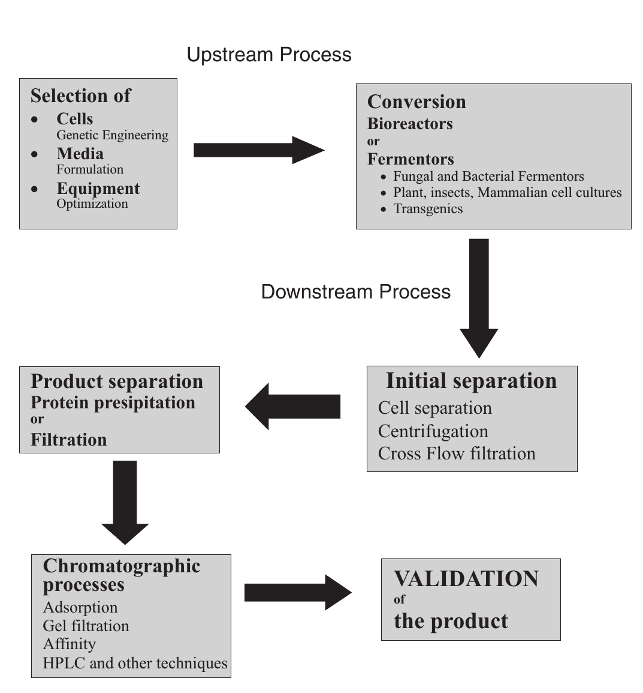
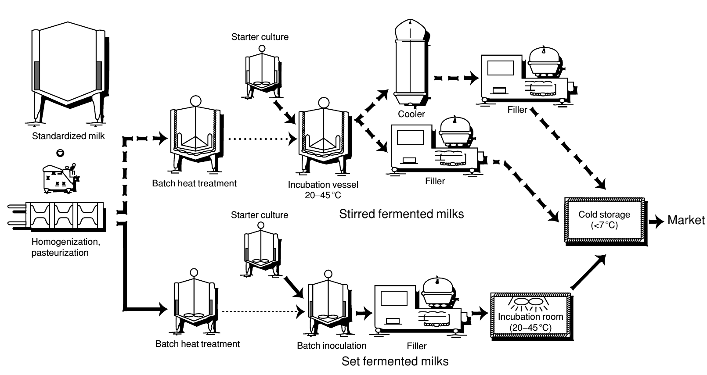

```{r setup, include=FALSE}
library(knitr)
require(tidyverse)
set.seed(453)
# invalidate cache when the package version changes
knitr::opts_chunk$set(tidy = FALSE, echo = FALSE, 
                  message = FALSE, warning = FALSE,
                  out.width = "50%")
options(knitr.table.format = "latex")
options(knitr.kable.NA = "", digits = 2)
options(kableExtra.latex.load_packages = FALSE)
```

# Background

### Overview

\begin{block}{The U.S. Department of Agriculture (USDA)'s classical interpretation}
Agricultural biotechnology is a collection of scientific techniques, including genetic engineering, that are used to create, improve, or modify plants, animals, and microorganisms...
\end{block}

- Agricultural Research Service (ARS), the in-house research agency of USDA, classifies biotechnology research into six components: 
  - basic engineering of recombinant DNA; 
  - DNA sequencing; 
  - genomic mapping with molecular markers; 
  - monoclonal antibodies; 
  - cell fusion and chromosome transfer; 
  - biologically-based processing

### Overview

- Humans have continually improved crop plants and animals by selective breeding, mostly by trial and error. 
- However, the field of genetics is quickly transitting into a highly advanced scientic practice, wherein there is now not much place for trial and error studies.
- The modern biotechnology of interest centers upon the newfound ability to remove DNA from cells of an organism, modify it, and reinsert it into cells where it will be functional. 
- This process is sometimes called "genetic engineering," and products therefrom have often been ingenuously termed "genetically modified organisms" (GMOs), even though all crop plants are genetically modified in one way or another.
- The traditional breeder's available gene pool is predominantly limited to those genes in sexually-compatible organisms, whereas modern biotechnology enables some new, wider-ranging, choices.

### Classical plant breeding

- Practicing classical plant breeding means many thousands of plants must be cross-pollinated to find the one offspring with higher yield. 
- In crossing plants, 
  - Pollen must be taken from one plant and manually placed on another. 
  - The possibility of finding improved traits is limited by the amount of genetic diversity already present in the plants. 
  - Consequently, if the two plants that are crossed share many of the same genes, the amount of possible improvement is limited. 
- Therefore, scientists have searched for better ways to improve plants.

### Mutation breeding

- In the 1920s, scientists realized that *mutations* could be induced in seeds by using chemical mutagens or by exposure to X-rays or gamma rays.
- Outcome of such treatments is even less predictable than traditional breeding methods. 
- Successful in world of flowers; new colors and more petals have been expressed in flowers such as tulips, snapdragons, roses, chrysanthemums, and many others.
- Mutation breeding has also been tried on vegetables, fruits, and crops. For instance, peppermint plants that are resistant to fungus were generated this way.

### Modern breeding

- Introduction of molecular breeding-- more predictable way to enhance crops. 
- Movement of genes from foreign sources into a specific plant, resulting in a *transgenic* plant. 
- The foreign gene, or transgene, may confer specific resistance to an insect, protect the plant against a specific herbicide, or enhance the vitamin content of the crop. 
- With something so powerful as genetic engineering, one mistake could have profound and wide-ranging effects. We must impose tough controls on the genetics supply industry and work to make sure that the new techniques are in the service of the global community

# History

- The science of genetics was transformed by the discovery of DNA (deoxyribonucleic acid)
- Francis Crick and James Watson along with Rosalind Franklin, in 1953, discovered that the DNA structure was a double helix: two strands twisted around each other like a spiral staircase with bars across like rings
- The structure, function, and composition of DNA are virtually identical in all living organisms—from a blade of grass to an elephant
- Difference only in precise ordering of chemical base that make up DNA
- This formed idea that changing this ordering will lead to modification of lifeforms
- Marshall Nirenberg and H. Gobind Khorana carried out the deciphering of the genetic code in 1961

### History

- While some were seeking to alter the genetic make-up of living things by transferring specific genes from one organism to another, they now had tools to alter exactly the hereditary material at the molecular level. 
- Walter Gilbert carried out the first recombinant DNA experiments in 1973
- First hybridomas created in 1975
- The production of monoclonal antibodies for diagnostics was carried out in 1982, 
- The first recombinant human therapeutic protein, insulin (humulin), was produced in 1982. 
- In 1976, the U.S. company Genentech became the first biotech company to develop technologies to rearrange DNA.
- 1980 ruling of the U.S. Supreme Court allowed genetically-engineered microorganisms to be patented. This means that virtually any lifeform on this planet can theoretically become the private property of the company or person who "creates" it.

### History

- Clues to understanding fermentation emerged in the seventeenth century when Dutch experimentalist Anton Van Leeuwenhoek discovered microorganisms using his microscope. 
- He unraveled the chemical basis of the process of fermentation using analytical techniques for the estimation of carbon dioxide. 
- Two centuries later, in 1857, a French scientist Louis Pasteur published his first report on lactic acid formation from sugar by fermentation. He proved that fermentation is the consequence of anaerobic life and identified three of its types:
  - Fermentation, which generates gas;
  - Fermentation that results in alcohol; and
  - Fermentation, which results in acids. 

### History

- At the end of the nineteenth century, Eduard Buchner observed the formation of ethanol and carbon dioxide when cell-free extract of yeast was added to an aqueous solution of sugars. Thus, he proved that cells are not essential for the fermentation process and the components responsible for the process are dissolved in the extract. He named that substance "Zymase". 
- During World war I, 
  - Germany produced glycerine for making the explosive nitroglycerine
  - Bacteria that converts corn or molasses into acetone for making the explosive cordite. 
  - Sir Alexander Fleming’s discovery of penicillin, the first antibiotic, proved highly successful in treating wounded soldiers.

### Transgenic technology vs traditional breeding

- A plant can be transformed with a gene from any source, including animals, bacteria, or viruses as well as other plants, whereas traditional cross-breeding methods move genes only between members of a particular genus of plants.
- Furthermore, transgenes can be placed in precise locations within the genome and have known functions that have been evaluated extensively before being inserted into the plant. 
- In traditional breeding, on the other hand, the identity of genes responsible for improving the crop is rarely known.

### Timeline

```{r biotechnology-history1}
history_biotech <- read_csv("./../data/history_of_biotechnology.csv")
history_biotech[1:16,] %>%
  knitr::kable(caption = "History of biotechnology", 
               booktabs = TRUE, digits = 2) %>% 
  kableExtra::kable_styling(latex_options = "striped", font_size = 5) %>%
  kableExtra::column_spec(1, bold = TRUE) %>%
  kableExtra::column_spec(column = 2, width = "40em")
```

### Timeline 

```{r biotechnology-history2, eval=TRUE}
history_biotech[17:32,] %>%
  knitr::kable(caption = "History of biotechnology (...continued)", 
               booktabs = TRUE, digits = 2) %>% 
  kableExtra::kable_styling(latex_options = "striped", font_size = 5) %>% 
  kableExtra::column_spec(1, bold = TRUE) %>% 
  kableExtra::column_spec(column = 2, width = "40em")
```

### Timeline

```{r biotechnology-history3, eval = TRUE}
history_biotech[33:nrow(history_biotech),] %>%
  knitr::kable(caption = "History of biotechnology (...continued)", 
               booktabs = TRUE, digits = 2) %>% 
  kableExtra::kable_styling(latex_options = "striped", font_size = 5) %>% 
  kableExtra::column_spec(1, bold = TRUE) %>% 
  kableExtra::column_spec(column = 2, width = "40em")
```

### Major cellular techniques in biology

- Microscopy
- Cell sorting
- Cell fractionation
- Cell-growth determination

### Major genetic techniques

- Chromosomal techniques
- Mutagenic technique
- Recombination in bacteria (Recombination DNA technology)
    - Tools
    - Making Recombinant DNA
    - DNA library
    - Transgenics (Introduction of Recombinant DNA into host cells)
    - Identification of recombinants
    - Polymerase chain reaction
    - DNA probes
    - Hybridization techniques
    - DNA sequencing
    - Site-directed mutagenesis
- Pedigree analysis in humans
- DNA isolation and purification techniques
- Molecular markers, TILLING and ZFN technology in plants

### Major applications of biotechnology

- Biological fuel generation
- Single-cell protein
- Sewage treatment
- Environmental biotechnology
- Medical biotechnology
- Agriculture and forest biotechnology
- Food and beverage biotechnology
- Safety in biotechnology

### Biotechnology process

- In previous century, industries linked to the fermentation technology had grown tremendously because of the high demand for various chemicals such as ethanol, butanol, glycerine, acetone, etc. 
- The advancement in fermentation process by its interaction with chemical engineering has given rise to a new area -- the bioprocess technology. 
- Large-scale production of proteins and enzymes can be carried out by applying bioprocess technology in fermentation. 
- Processes to create large quantities of chemicals, antibiotics, proteins, and enzymes in an economical manner.
- Bioprocess technology includes media and buffer preparation, upstream processing and downstream processing. 

### Biotechnology process: Upstream processing
- Includes:
  - microorganism media (development of processes for aseptic treatment of substrates or raw materials with the microorganism or the biocatalyst)
  - substrate, and the correct chemical environment to carry out the required biochemical reactions to produce the product. 
- Unit operations involved in upstream processing are: Milling, Mixing, Media preparation, Sterilization, Cooling, Heating.

### Biotechnology process: Bioreactor

- Initial step: designing of the appropriate type of bioreactor or fermentor. 
- Bioreactors are vessels in which raw materials are biologically converted into specific products, using microorganisms, plants, animals, or human cells or individual enzymes. 
- Bioreactor supports the natural process of cells by trying to maintain their environment to provide optimum growth conditions by providing appropriate temperature, pH, substrates, salts, vitamins, and oxygen. 
- In most of the bioreaction processes the substrate of the biotransformation and the carbon source of the organisms will be the same. 

### Biotechnology process: Bioreactor

- Unit operations involved in bioreactions are: Mixing, Handling of microorganisms, plant or animal cells, Inoculation of the cells, Heating and cooling.
- Bioreactors can be classified according to the type of biocatalysts and the type of bioreaction. 
- The first classification is based on the type of biological agent used:
  - microbial fermentors or
  - enzyme (cell-free) reactors
- Further classification is possible based on biochemical reactions and process requirements.

### Biotechnology process: Downstream processing

- recovery and purification of the required product from the growth medium through a set of separation and purification techniques. 
- each stage in the overall separation procedure is strongly dependent on the history and quality of the biological production process. 
- maximization of production can lead to great difficulties in downstreaming and recently more attention is being paid to overall process optimization. 
- includes techniques such as filtration, centrifugation, sedimentation, various types of chromatographic techniques, electrophoresis, etc.

### Biotechnology process

```{r biotechnology-process, fig.cap="A typical biotechnology flow process", out.width="40%"}
# pdftools::pdf_convert("./../literatures/biotechnology/Introduction to Biotechnology and Genetic Engineering, 2008, p.812.pdf", pages = 25, format = "png", dpi = 250, filenames = "./images/bioprocess_flow_chart.png")
# pdfconvert page 25 of Introduction to biotechnology and genetic eng., 2008

```


### Industrial biotechnology

- Recombinant microorganisms, plant cells, and animal cells can be cultivated and used for large-scale production of industrially-important enzymes and chemicals. A list of such enzymes is given in Table \ref{tab:industrial-chemicals}

```{r industrial-chemicals, echo=FALSE}
industrial_chemicals <- read_csv("./../data/industrial_enzymes_biotechnology.csv")
industrial_chemicals %>%
  knitr::kable(caption = "Some major industrial enzymes and their sources and uses.", 
               booktabs = TRUE, digits = 2, escape = FALSE) %>% 
  kableExtra::kable_styling(latex_options = "striped", font_size = 5) %>% 
  kableExtra::column_spec(1, bold = TRUE) %>% 
  kableExtra::column_spec(column = 1:3, width = c("8em","26em","30em"))
```

### Biotechnology product

- Traditional biotechnology products also include biologically-processed items like bread, cheese, and wine.
- Other modern biotechnologies, such as monoclonal antibodies or molecular markers as aids for traditional breeding and selection, are not relevant to genetic engineering but they constitute biotechnology products.

# Fermentation

### Introduction

- Decomposition of foodstuffs generally accompanied by the evolution of gas. 
- The best-known example is alcoholic fermentation, in which sugar is converted into alcohol and carbon dioxide.
- This conversion, described by the equation below, was established by J. L. Gay-Lussac in 1815.

$$
\begin{aligned}
&C_6 H_{12} O_6 &\rightarrow &2CO_2 + &2C_2H_5OH \\
&\textrm{Sugar} &&\textrm{Carbon dioxide} &\textrm{Alcohol}
\end{aligned}
$$


### History

- Before 1800 the association of yeast or leaven with fermentation had been noted, but the nature of these agents was not understood. 
- Experiments of C. Cagniard-Latour, of F. T. Kutzing, and of T Schwann in 1837 indicated that yeast is a living organism and is the cause of fermentation. 
- This view was opposed by such leading chemists as J. von Liebig and F. Wohler, who sought a chemical rather than a biological explanation of the process. 
- The biological concept became generally accepted following the work of Louis Pasteur, who concluded that fermentation is a physiological counterpart of oxidation, and permits organisms to live and grow in the absence of air (anaerobically). 

### History

- This linked fermentation and putrefaction as comparable processes; both represent decompositions of organic matter brought about by microorganisms in the absence of air. 
- The difference is determined by the nature of the decomposable material; 
  - sugary substances generally yield products with pleasant odor and taste (fermentation), 
  - proteins give rise to evil-smelling products (putrefaction). 
- Pasteur also discovered the lactic acid and butyric acid fermentations, and from his experiments concluded that each kind of fermentation was caused by a specific microbe. 
- Later work supported this idea to a large extent, and considerably increased the number of specific fermentations.

### Process

During fermentation organic matter is decomposed in the absence of air (oxygen); hence, there is always an accumulation of reduction products, or incomplete oxidation products. Some of these products (for example, alcohol and lactic acid) are of importance to society, and fermentation has therefore been used for their manufacture on an industrial scale. With regard to historic roots of the process, Converting dry grains and other seeds into something more appetizing than a gruel must have made agriculture more attractive and valuable. Alcohol, despite its dangers, provided (and still provides), in reasonable moderation, a basis for social interaction. There are also many microbiological processes that go on in the presence of air while yielding incomplete oxidation products. Good examples are the formation of acetic acid (vinegar) from alcohol by vinegar bacteria, and of citric acid from ugar by certain molds (for example, _Aspergillus niger_). These microbial processes, too, have gained industrial importance, and are often referred to as fermentations, even though they do not conform to Pasteur’s concept of fermentation as a decomposition in the absence of air.

### Fermentation technology: Milk fermentation

```{r milk-fermentation-steps, fig.cap="Basic steps in manufacture of fermented milks. From International Dairy Federation (1988) Fermented Milks-Science and Technology. International Dairy Federation Bulletin No. 227.", fig.width=6, out.width="55%"}
# pdftools::pdf_convert("/media/deependra/e4da4ac5-3b38-4b89-9402-397eb940e4d3/Addition/Food Technology/Food Encyclopedia/Food Science, Food Technology and Nutrition.pdf", pages = 2375, format = "png", dpi = 250, filenames = "../images/milk_fermentation.png")

```


# Bibliography

### Further study

Also see: @nair2008introduction

### References
