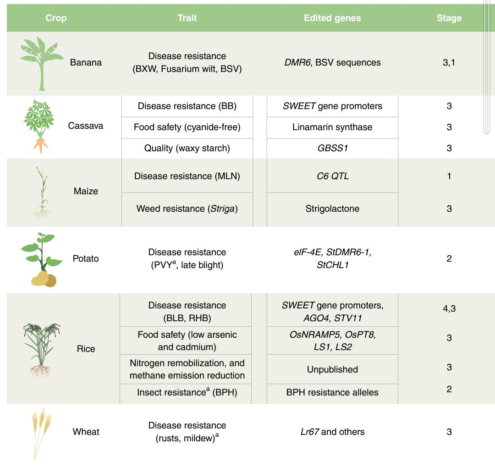
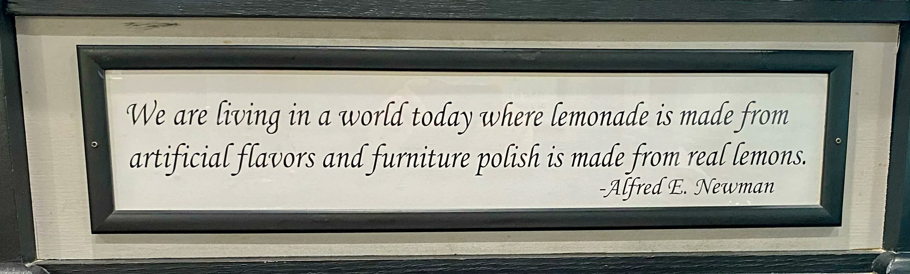
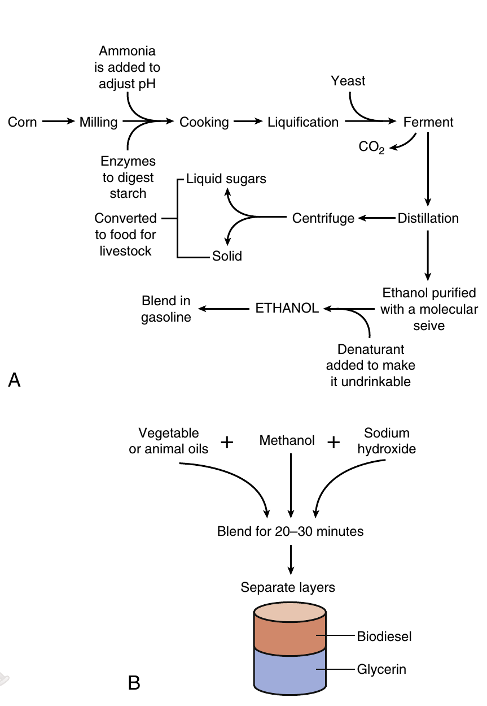
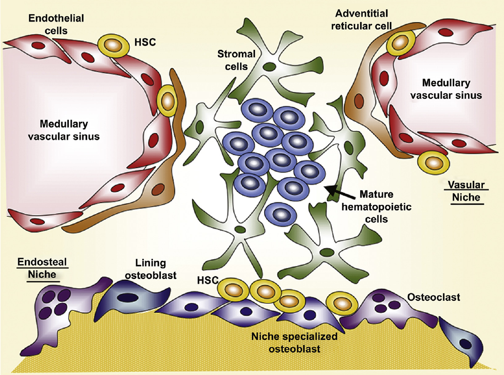
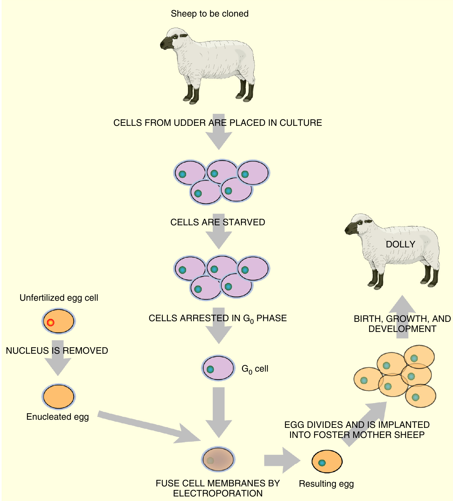

```{r setup, include=FALSE}
library(knitr)
require(tidyverse)
set.seed(453)
# invalidate cache when the package version changes
knitr::opts_chunk$set(tidy = FALSE, echo = FALSE, 
                  message = FALSE, warning = FALSE,
                  out.width = "50%")
options(knitr.table.format = "latex")
options(knitr.kable.NA = "", digits = 2)
options(kableExtra.latex.load_packages = FALSE)

# previous lecture title "Biotechnology types" has been incorporated into current lecture
```

# Background

## Overview

<!-- Biotechnology arose from the field of zymotechnology or zymurgy, which began as a search for a better understanding of industrial fermentation, particularly beer. -->

<!-- In the 1860s, institutes and remunerative consultancies were dedicated to the technology of brewing. The most famous was the private Carlsberg Institute, founded in 1875, which employed Emil Christian Hansen, who pioneered the pure yeast process for the reliable production of consistent beer. -->

<!-- The Hungarian Károly Ereky coined the word "biotechnology" in Hungary during 1919 to describe a technology based on converting raw materials into a more useful product. He built a slaughterhouse for a thousand pigs and also a fattening farm with space for 50,000 pigs, raising over 100,000 pigs a year. The enterprise was enormous, becoming one of the largest and most profitable meat and fat operations in the world. -->

\begin{block}{The U.S. Department of Agriculture (USDA)'s classical interpretation}
Agricultural biotechnology is a collection of scientific techniques, including genetic engineering, that are used to create, improve, or modify plants, animals, and microorganisms...
\end{block}

- Agricultural Research Service (ARS), the in-house research agency of USDA, classifies biotechnology research into six components: 
  - basic engineering of recombinant DNA; 
  - DNA sequencing; 
  - genomic mapping with molecular markers; 
  - monoclonal antibodies; 
  - cell fusion and chromosome transfer; 
  - biologically-based processing

<!-- ## -->

<!-- - Humans have continually improved crop plants and animals by selective breeding, mostly by trial and error.  -->
<!-- - However, the field of genetics is quickly transitting into a highly advanced scientic practice, wherein there is now not much place for trial and error studies. -->
<!-- - The modern biotechnology of interest centers upon the newfound ability to remove DNA from cells of an organism, modify it, and reinsert it into cells where it will be functional.  -->
<!-- - This process is sometimes called "genetic engineering," and products therefrom have often been ingenuously termed "genetically modified organisms" (GMOs), even though all crop plants are genetically modified in one way or another. -->
<!-- - The traditional breeder's available gene pool is predominantly limited to those genes in sexually-compatible organisms, whereas modern biotechnology enables some new, wider-ranging, choices. -->

## Classical plant breeding

- Practicing classical plant breeding means many thousands of plants must be cross-pollinated to find the one offspring with higher yield. 
- In crossing plants, 
  - Pollen must be taken from one plant and manually placed on another. 
  - The possibility of finding improved traits is limited by the amount of genetic diversity already present in the plants. 
  - Consequently, if the two plants that are crossed share many of the same genes, the amount of possible improvement is limited. 
- Therefore, scientists have searched for better ways to improve plants.

## Mutation breeding

\bcolumns
\column{0.6\textwidth}
- In the 1920s, scientists realized that *mutations* could be induced in seeds by using chemical mutagens or by exposure to X-rays or gamma rays.
- Outcome of such treatments is even less predictable than traditional breeding methods. 
- Successful in world of flowers; new colors and more petals have been expressed in flowers such as tulips, snapdragons, roses, chrysanthemums, and many others.
- Mutation breeding has also been tried on vegetables, fruits, and crops. For instance, peppermint plants that are resistant to fungus were generated this way.

\column{0.4\textwidth}

```{r deleted-base-mutation, out.width="90%", fig.align='center'}

```

\ecolumns

## Transgenic technology vs traditional breeding

\small

- A plant can be transformed with a gene from any source, including animals, bacteria, or viruses as well as other plants, whereas traditional cross-breeding methods move genes only between members of a particular genus of plants.
- Furthermore, transgenes can be placed in precise locations within the genome and have known functions that have been evaluated extensively before being inserted into the plant.
- In traditional breeding, on the other hand, the identity of genes responsible for improving the crop is rarely known.
- Introduction of molecular breeding -- more predictable way to enhance crops. 
- Movement of genes from foreign sources into a specific plant, resulting in a *transgenic* plant. 
- The foreign gene, or transgene, may confer specific resistance to an insect, protect the plant against a specific herbicide, or enhance the vitamin content of the crop. 
- With something so powerful as genetic engineering, one mistake could have profound and wide-ranging effects. We must impose tough controls on the genetics supply industry and work to make sure that the new techniques are in the service of the global community

##

```{r gm-plant-traits, fig.align='center', out.width="68%"}

```

# History

<!-- ## -->

<!-- \bcolumns -->

<!-- \column{0.6\textwidth} -->
<!-- - The science of genetics was transformed by the discovery of DNA (deoxyribonucleic acid) -->
<!-- - Francis Crick and James Watson along with Rosalind Franklin, in 1953, discovered that the DNA structure was a double helix: two strands twisted around each other like a spiral staircase with bars across like rings -->
<!-- - The structure, function, and composition of DNA are virtually identical in all living organisms—from a blade of grass to an elephant -->
<!-- <!-- - Difference only in precise ordering of chemical base that make up DNA --> -->
<!-- <!-- - This formed idea that changing this ordering will lead to modification of lifeforms --> -->
<!-- - Marshall Nirenberg and H. Gobind Khorana carried out the deciphering of the genetic code in 1961 -->

<!-- \column{0.4\textwidth} -->

<!-- ```{r xray-diffraction-dna, fig.cap="Rosalind Franklin's X-ray diffraction patterns of DNA molecules rendered the important clue that DNA has the structure of a double helix. The most famous X-ray photograph, Photo 51, is still printed in most Biology textbooks.", out.width="98%"} -->
<!-- knitr::include_graphics("../images/xray_diffraction.jpg") -->
<!-- ``` -->

<!-- \ecolumns -->

<!-- ## History -->

<!-- - While some were seeking to alter the genetic make-up of living things by transferring specific genes from one organism to another, they now had tools to alter exactly the hereditary material at the molecular level.  -->
<!-- - Walter Gilbert carried out the first recombinant DNA experiments in 1973 -->
<!-- - First hybridomas created in 1975 -->
<!-- - The production of monoclonal antibodies for diagnostics was carried out in 1982,  -->
<!-- - The first recombinant human therapeutic protein, insulin (humulin), was produced in 1982.  -->
<!-- - In 1976, the U.S. company Genentech became the first biotech company to develop technologies to rearrange DNA. -->
<!-- - 1980 ruling of the U.S. Supreme Court allowed genetically-engineered microorganisms to be patented. This means that virtually any lifeform on this planet can theoretically become the private property of the company or person who "creates" it. -->

<!-- ## History -->

<!-- - Clues to understanding fermentation emerged in the seventeenth century when Dutch experimentalist Anton Van Leeuwenhoek discovered microorganisms using his microscope.  -->
<!-- - He unraveled the chemical basis of the process of fermentation using analytical techniques for the estimation of carbon dioxide.  -->
<!-- - Two centuries later, in 1857, a French scientist Louis Pasteur published his first report on lactic acid formation from sugar by fermentation. He proved that fermentation is the consequence of anaerobic life and identified three of its types: -->
<!--   - Fermentation, which generates gas; -->
<!--   - Fermentation that results in alcohol; and -->
<!--   - Fermentation, which results in acids.  -->

<!-- ## History -->

<!-- - At the end of the nineteenth century, Eduard Buchner observed the formation of ethanol and carbon dioxide when cell-free extract of yeast was added to an aqueous solution of sugars. Thus, he proved that cells are not essential for the fermentation process and the components responsible for the process are dissolved in the extract. He named that substance "Zymase".  -->
<!-- - During World war I,  -->
<!--   - Germany produced glycerine for making the explosive nitroglycerine -->
<!--   - Bacteria that converts corn or molasses into acetone for making the explosive cordite.  -->
<!--   - Sir Alexander Fleming’s discovery of penicillin, the first antibiotic, proved highly successful in treating wounded soldiers. -->

## Timeline

```{r biotechnology-history1}
history_biotech <- read_csv("./../data/history_of_biotechnology.csv")
history_biotech[1:16,] %>%
  knitr::kable(caption = "History of biotechnology", 
               booktabs = TRUE, digits = 2) %>% 
  kableExtra::kable_styling(latex_options = "striped", font_size = 5) %>%
  kableExtra::column_spec(1, bold = TRUE) %>%
  kableExtra::column_spec(column = 2, width = "40em")
```

## Timeline 

```{r biotechnology-history2, eval=TRUE}
history_biotech[17:32,] %>%
  knitr::kable(caption = "History of biotechnology (...continued)", 
               booktabs = TRUE, digits = 2) %>% 
  kableExtra::kable_styling(latex_options = "striped", font_size = 5) %>% 
  kableExtra::column_spec(1, bold = TRUE) %>% 
  kableExtra::column_spec(column = 2, width = "40em")
```

## Timeline

```{r biotechnology-history3, eval = TRUE}
history_biotech[33:nrow(history_biotech),] %>%
  knitr::kable(caption = "History of biotechnology (...continued)", 
               booktabs = TRUE, digits = 2) %>% 
  kableExtra::kable_styling(latex_options = "striped", font_size = 5) %>% 
  kableExtra::column_spec(1, bold = TRUE) %>% 
  kableExtra::column_spec(column = 2, width = "40em")
```

# Major techniques and applications of biotechnology

## Cellular techniques

- Microscopy
- Cell sorting
- Cell fractionation
- Cell-growth determination

## Genetic techniques

- Chromosomal techniques
- Mutagenic technique
- Recombination in bacteria (Recombination DNA technology)
    - Tools
    - Making Recombinant DNA
    - DNA library
    - Transgenics (Introduction of Recombinant DNA into host cells)
    - Identification of recombinants
    - Polymerase chain reaction
    - DNA probes
    - Hybridization techniques
    - DNA sequencing
    - Site-directed mutagenesis
- Pedigree analysis in humans
- DNA isolation and purification techniques
- Molecular markers, TILLING and ZFN technology in plants

## Major applications of biotechnology

- Biological fuel generation
- Single-cell protein
- Sewage treatment
- Environmental biotechnology
- Medical biotechnology
- Agriculture and forest biotechnology
- Food and beverage biotechnology
- Safety in biotechnology

## Major criticisms against biotechnology

```{r anthropocene-world, fig.align="center", out.width="98%"}

```

# Biotechnology types and processes

## Fermentation

- Decomposition of foodstuffs generally accompanied by the evolution of gas. 
- The best-known example is alcoholic fermentation, in which sugar is converted into alcohol and carbon dioxide.
- This conversion, described by the equation below, was established by J. L. Gay-Lussac in 1815.

$$
\begin{aligned}
&\mathrm{C_6 H_{12} O_6} &\longrightarrow &\mathrm{2CO_2} + &\mathrm{2C_2H_5OH} \\
&\textrm{Sugar} &&\textrm{Carbon dioxide} &\textrm{Alcohol}
\end{aligned}
$$


## History

- Before 1800 the association of yeast or leaven with fermentation had been noted, but the nature of these agents was not understood. 
- Experiments of C. Cagniard-Latour, of F. T. Kutzing, and of T Schwann in 1837 indicated that yeast is a living organism and is the cause of fermentation. 
- This view was opposed by such leading chemists as J. von Liebig and F. Wohler, who sought a chemical rather than a biological explanation of the process. 
- The biological concept became generally accepted following the work of Louis Pasteur, who concluded that fermentation is a physiological counterpart of oxidation, and permits organisms to live and grow in the absence of air (anaerobically). 

## History

- This linked fermentation and putrefaction as comparable processes; both represent decompositions of organic matter brought about by microorganisms in the absence of air. 
- The difference is determined by the nature of the decomposable material; 
  - sugary substances generally yield products with pleasant odor and taste (fermentation), 
  - proteins give rise to evil-smelling products (putrefaction). 
- Pasteur also discovered the lactic acid and butyric acid fermentations, and from his experiments concluded that each kind of fermentation was caused by a specific microbe. 
- Later work supported this idea to a large extent, and considerably increased the number of specific fermentations.

## Process

During fermentation organic matter is decomposed in the absence of air (oxygen); hence, there is always an accumulation of reduction products, or incomplete oxidation products. Some of these products (for example, alcohol and lactic acid) are of importance to society, and fermentation has therefore been used for their manufacture on an industrial scale. With regard to historic roots of the process, Converting dry grains and other seeds into something more appetizing than a gruel must have made agriculture more attractive and valuable. Alcohol, despite its dangers, provided (and still provides), in reasonable moderation, a basis for social interaction. There are also many microbiological processes that go on in the presence of air while yielding incomplete oxidation products. Good examples are the formation of acetic acid (vinegar) from alcohol by vinegar bacteria, and of citric acid from ugar by certain molds (for example, _Aspergillus niger_). These microbial processes, too, have gained industrial importance, and are often referred to as fermentations, even though they do not conform to Pasteur’s concept of fermentation as a decomposition in the absence of air.

## Fermentation technology: Milk fermentation

```{r milk-fermentation-steps, fig.cap="Basic steps in manufacture of fermented milks. From International Dairy Federation (1988) Fermented Milks-Science and Technology. International Dairy Federation Bulletin No. 227.", fig.width=6, out.width="62%"}
# pdftools::pdf_convert("/media/deependra/e4da4ac5-3b38-4b89-9402-397eb940e4d3/Addition/Food Technology/Food Encyclopedia/Food Science, Food Technology and Nutrition.pdf", pages = 2375, format = "png", dpi = 250, filenames = "../images/milk_fermentation.png")

```

<!-- ## Biotechnology process -->

<!-- - In previous century, industries linked to the fermentation technology had grown tremendously because of the high demand for various chemicals such as ethanol, butanol, glycerine, acetone, etc.  -->
<!-- - The advancement in fermentation process by its interaction with chemical engineering has given rise to a new area -- the bioprocess technology.  -->
<!-- - Large-scale production of proteins and enzymes can be carried out by applying bioprocess technology in fermentation.  -->
<!-- - Processes to create large quantities of chemicals, antibiotics, proteins, and enzymes in an economical manner. -->
<!-- - Bioprocess technology includes media and buffer preparation, upstream processing and downstream processing.  -->

<!-- ## Upstream processing -->

<!-- - Includes: -->
<!--   - microorganism media (development of processes for aseptic treatment of substrates or raw materials with the microorganism or the biocatalyst) -->
<!--   - substrate, and the correct chemical environment to carry out the required biochemical reactions to produce the product.  -->
<!-- - Unit operations involved in upstream processing are: Milling, Mixing, Media preparation, Sterilization, Cooling, Heating. -->

<!-- ## Bioreactor -->

<!-- - Initial step: designing of the appropriate type of bioreactor or fermentor.  -->
<!-- - Bioreactors are vessels in which raw materials are biologically converted into specific products, using microorganisms, plants, animals, or human cells or individual enzymes.  -->
<!-- - Bioreactor supports the natural process of cells by trying to maintain their environment to provide optimum growth conditions by providing appropriate temperature, pH, substrates, salts, vitamins, and oxygen.  -->
<!-- - In most of the bioreaction processes the substrate of the biotransformation and the carbon source of the organisms will be the same.  -->

<!-- ## Bioreactor -->

<!-- - Unit operations involved in bioreactions are: Mixing, Handling of microorganisms, plant or animal cells, Inoculation of the cells, Heating and cooling. -->
<!-- - Bioreactors can be classified according to the type of biocatalysts and the type of bioreaction.  -->
<!-- - The first classification is based on the type of biological agent used: -->
<!--   - microbial fermentors or -->
<!--   - enzyme (cell-free) reactors -->
<!-- - Further classification is possible based on biochemical reactions and process requirements. -->

<!-- ## Downstream processing -->

<!-- - recovery and purification of the required product from the growth medium through a set of separation and purification techniques.  -->
<!-- - each stage in the overall separation procedure is strongly dependent on the history and quality of the biological production process.  -->
<!-- - maximization of production can lead to great difficulties in downstreaming and recently more attention is being paid to overall process optimization.  -->
<!-- - includes techniques such as filtration, centrifugation, sedimentation, various types of chromatographic techniques, electrophoresis, etc. -->

## Biotechnology process (overview)

```{r biotechnology-process, fig.cap="A typical biotechnology flow process", out.width="40%"}
# pdftools::pdf_convert("./../literatures/biotechnology/Introduction to Biotechnology and Genetic Engineering, 2008, p.812.pdf", pages = 25, format = "png", dpi = 250, filenames = "./images/bioprocess_flow_chart.png")
# pdfconvert page 25 of Introduction to biotechnology and genetic eng., 2008

```

<!-- ## Biotechnology product -->

<!-- - Traditional biotechnology products also include biologically-processed items like bread, cheese, and wine. -->
<!-- - Other modern biotechnologies, such as monoclonal antibodies or molecular markers as aids for traditional breeding and selection, are not relevant to genetic engineering but they constitute biotechnology products. -->

## Industrial biotechnology

- Recombinant microorganisms, plant cells, and animal cells can be cultivated and used for large-scale production of industrially-important enzymes and chemicals. A list of such enzymes is given in Table \ref{tab:industrial-chemicals}.

```{r industrial-chemicals, echo=FALSE}
industrial_chemicals <- read_csv("./../data/industrial_enzymes_biotechnology.csv")
industrial_chemicals %>%
  knitr::kable(caption = "Some major industrial enzymes and their sources and uses.", 
               booktabs = TRUE, digits = 2, escape = FALSE) %>% 
  kableExtra::kable_styling(latex_options = "striped", font_size = 5) %>% 
  kableExtra::column_spec(1, bold = TRUE) %>% 
  kableExtra::column_spec(column = 1:3, width = c("8em","26em","30em"))
```

<!-- Single-cell proteins (SCP) or microbial proteins refer to edible unicellular microorganisms. The biomass or protein extract from pure or mixed cultures of algae, yeasts, fungi or bacteria may be used as an ingredient or a substitute for protein-rich foods, and is suitable for human consumption or as animal feeds. -->

# Environmental biotechnology

## Applications

<!-- - People have always been fascinated by the environment around them and successful in harnessing the environment for our benefit. -->
<!-- - Curiosity to explore uncharted life forms drives our motivations. -->
<!-- - Virosphere! How big is it? -->
<!-- - Human body harbors $10^{14}$ bacteria, while our own only comprise $10^{13}$. -->

- An increase in the productivity of crops, without an increase in the dependency on environmentally-damaging agrochemicals.
- As a result of increased productivity, a reduced pressure to exploit the remaining uncultivated habitats.
- As a result of increased productivity, a reduction in energy inputs (mostly from reduced agrochemical manufacture).
- The creation of alternative, renewable, sources of energy (e.g., biodiesel).
- The creation of new more environment-friendly raw materials for industry (e.g., biodegradable plastics from plant starches, or high-value speciality chemicals).
- As a result of the development of genetically-modified crops (if properly used), a reduction in the amount of agrochemical (e.g., pesticides and herbicides) released into the environment.

## Bio-environmental processes

\alert{Bioremediation}

- One of the avenues in biotechnology that has made rapid advances
- "biological" means of cleaning the environment.
- Naturally occurring microorganisms often have the ability to degrade human-made pollutants. 
- _Rhodococcus_ sp. has a highly diverse pathways to degrade pollutants, such as short- and long-chain alkanes, aromatic molecules (both halogenated and nitro-substituted), and heterocyclic and polycyclic aromatic compounds, including quino lone, pyridine, thiocarbamate, s-triazine herbicides, 2-mercaptobenzothiazole (a rubber vulcanization accelerator), benzothiophene, dibenzothiophene, MTBE, and the related ethyl tert-butyl ether (ETBE).

## Bio-environmental processes

- \alert{Biostimulation} is the release of nutrients, oxidants, or electron donors into the environment to stimulate naturally occurring microorganisms to degrade a contaminant. 
- \alert{Bioaugmentation} is adding specific microorganisms plus their energy sources to decontaminate a polluted area.
- \alert{Microbial fuel cells} create electricity through the use of microorganisms. Organisms that transfer electrons to the anode are called electrode-reducing organisms. They can pass electrons through a mediator molecule in the solution, directly through proteins in their outer membrane, or through nanowires or pili that coat the outer surface of the bacterium. Electrode-oxidizing organisms take electrons from the cathode to reduce various substances, such as carbon dioxide to acetate.

## Biofuel production

```{r biofuel-production, fig.cap="\\textbf{(A)} Production of ethanol from corn requires the addition of ammonia to adjust the pH and enzymes to help digest starch and yeast to ferment the corn mash. \\textbf{(B)} Biodiesel is created by the blending of methanol, sodium hydroxide, and vegetable oil for 20-30 minutes.", out.width="28%"}
# The ethanol is distilled to 95% purity and then purified further by passing through molecular sieves. The purified ethanol is rendered undrinkable by addition of denaturants. The remaining corn products after distillation include liquid sugars and solids that are used to feed livestock.

# The process creates biodiesel and glycerin that separate naturally because glycerin has a higher density than biodiesel.

# pdftools::pdf_convert("./../../literatures/biotechnology/Biotechnology 2nd ed - David P. Clark, Nanette J. Pazdernik (AP, 2016).pdf", pages = 412, dpi = 250, format = "png", filenames = "../images/biofuel_production.png")

```

## Molecular genetics and protein detection

- PCR is routinely used to amplify random sequences from many environmental samples in the hope of identifying new genes.
- After PCR DNA is sequenced.
- Then bioinformatics reveals whether or not the sequence (or a close relative) has already been identified or if it is completely novel.
- Microarrays are used to compare numbers and types of organisms present in different environment.

## Identifying new genes with metagenomics

- Allows identification of microorganisms, viruses, or free DNA that exist in the natural environment.
- Approaches: next-generation DNA sequencing, PCR, RT-PCR and microarrays
- Metagenomics is the process of statistically combining separate genomic analyses; deals with a mixture of DNA forms.
- Study of marine microbiology, human gut microbiology, assessment of how microorganisms form symbiotic relationships with their hosts, finding novel antibiotics or enzymes, replacement of chemical pesticides with crops genetically engineered for tolerance to microorganisms and nematodes, etc.

## Current concerns and Solutions

\begin{columns}[T,onlytextwidth]
  \column{0.5\textwidth}
  
  \alert {Concerns}
  \begin{itemize}
  \item Herbicide use
  \item Genetic pollution and superweeds
  \item Antibiotic resistance
  \item Unexpected effects
  \item Pest resistance
  \item Persistence and weediness
  \item Damage to wildlife and biodiversity
  \end{itemize}
  
  \column{0.5\textwidth}
  
  \alert {Avenues}
  \begin{itemize}
  \item Genetic modification of plants achieves essentially the same result as conventional plant breeding
  \item Wide-crossing
  \item In Nature, genes are exchanged between species
  \item Gene instability in conventional crops
  \item Conventional breeding is not 'Natural' either
  \item Gene transfer from crops to their 'Wild' relatives
  \item Novel, sustainable, agricultural practices needed
  
  \end{itemize}
  
\end{columns}

## Study techniques

```{r environment-samples-study, fig.cap="Techniques to study environmental samples", out.width="32%"}
# pdftools::pdf_convert("./../../literatures/biotechnology/Biotechnology 2nd ed - David P. Clark, Nanette J. Pazdernik (AP, 2016).pdf", pages = 404, dpi = 250, format = "png", filenames = "../images/environmental_techniques.png")
knitr::include_graphics("../images/environmental_techniques.png")
```

# Medical biotechnology

## Applications

<!-- In December 1967, the first heart transplant by Christian Barnard reminded the public that the physical identity of a person was becoming increasingly problematic. While poetic imagination had always seen the heart at the center of the soul, now there was the prospect of individuals being defined by other people's hearts. During the same month, Arthur Kornberg announced that he had managed to biochemically replicate a viral gene. "Life had been synthesized," said the head of the National Institutes of Health. -->

- Cheaper medicines from biotechnology
- Medicines from 'cultured' cells
- Genetic modification for medicine production
- Immune technology; Killed pathogens, attenuated pathogens, single proteins, or epitopes from a disease-causing pathogen are used as vaccines. They are isolated and injected into people to elicit their immune response without causing the disease. Multivalent vaccines contain antigens to different proteins from a pathogen or family of pathogens.
- Cancer technology; Oncogene detection, oncogene attenuation

## Popular technologies

- Gene therapy; Engineered retroviruses are the most frequently used viral vectors in gene therapy. Defective retrovirus vectors are grown in cells with an integrated helper virus to allow formation of virus particles.
- ELISA assay; Antibodies are used in ELISA assays to determine the relative concentration of the target protein or antigen in a sample. Primary antibodies recognize the target protein or antigen. Secondary antibodies recognize the primary antibody and often carry a detection system. Secondary antibodies are made to recognize any antibody that is made in sheep, cow, rabbit, goat, or mouse.

## Stem cell therapy

- Characteristics of stem cells: 
  - they maintain the ability to divide continually, 
  - they are undifferentiated, and
  - they have the ability to differentiate into multiple cell types 
- Embryonic stem cells are totipotent. 
- Adult or somatic stem cells are able to differentiate into different cell types but are multipotent; that is, they are restricted to the tissues in which they originate. 
- Embryonic stem cell lines are created from the inner cell mass of the blastula stage of an embryo from many different mammals, including humans, mice, and primates. 
- The cell lines can be induced to differentiate by forming embryoid bodies that ultimately differentiate into different cell types.

## Stem cell therapy

```{r stem-cell-therapy, fig.cap="\\textbf{Hematopoietic stem cells} are located near the interface of the bone marrow and bone surface (the endosteal niche) and also near vascular sinuses (vascular niche). The HSCs in each niche divide to form mature hematopoietic cells that populate the marrow tissues.", out.width="45%"}
# pdftools::pdf_convert("./../../literatures/biotechnology/Biotechnology 2nd ed - David P. Clark, Nanette J. Pazdernik (AP, 2016).pdf", pages = 573, dpi = 250, format = "png", filenames = "../images/hematopoietic_stem_cells.png")

```

## Cloning dolly

```{r dolly-sheep-cloning, fig.cap="To clone a mammal such as a sheep, cells from the udder are isolated, grown in culture, and then starved in order to arrest them in $G_0$ of the cell cycle. Unfertilized egg cells from another sheep are also harvested, and the nucleus is removed. An electrical stimulus fuses the $G_0$ udder cell with the enucleated egg, thus placing a somatic cell nucleus into an undifferentiated cytoplasm. The eggs that result are put back into a foster mother, and the offspring are screened for DNA identical to the donor sheep.", out.width="38%"}
# pdftools::pdf_convert("./../../literatures/biotechnology/Biotechnology 2nd ed - David P. Clark, Nanette J. Pazdernik (AP, 2016).pdf", pages = 582, dpi = 250, format = "png", filenames = "../images/dolly_cloning.png")

```

# Forensic biotechnology

##

- Researches and uses the basis of identity to resolve conflicting situations and help create unique database of individuals.
- Fingerprint patterns are multigenic trait.
- Retinal scans take advantage of the unique pattern of blood vessels on the retina at the back of the eyes.
- Blood typing provides identity based on presence of blood antigens groups.

## DNA fingerprinting

- DNA fingerprinting relies on the unique pattern made by a series of DNA fragments after separating them according to length by gel electrophoresis.
- The samples are then processed to generate a set of DNA fragments. When Alec Jeffreys invented DNA fingerprinting in 1985 in England, the DNA was cut with restriction enzymes to generate fragments because PCR had not yet been invented. 
- Nowadays, DNA is prepared by PCR, and fluorescent dyes are used for labeling. In addition, modern DNA fingerprinting uses repeated sequences (short tandem repeats or STRs) for routine identification purposes.

## DNA fingerprinting

- For the first generation of DNA fingerprints, restriction enzymes were used to generate the variation in DNA fragment size between individuals. Variations in the DNA base sequence of restriction enzyme recognition sites result in differences in the size of the fragments. 
- Such sequence differences are called restriction fragment length polymorphisms (**RFLPs**). 
- Many different restriction enzymes with distinct recognition sites are used on each DNA sample.
- Even if mutations have changed a few bases of the target sequence around the cut site, there is usually still enough similarity for probes to bind. 

# Biotechnology in Nepal

##

- Plant tissue culture was started in Nepal in 1976 at the National Herbarium and Plant Research Laboratory in Godawari.
  - clonal propagation of hardwood trees, horticulture crops, medicinal plants, ornamental plants and over 30 kinds of orchids
- Potato Development Center at Khumaltar have also embarked on some tissue activities.
- Basic research on tissue culture is also initiated at Central Department of Botany, Kritipur mainly of medicinal crops. RECAST, Kirtipur has also the facilities available for plant tissue culture.
- KU started undergraduate program in biotechnology starting 2003.
- Center for Biotechnology was established in year 2010 under Agriculture and Forestry University.
  - Molecular diagnostics and detection
  - Isolation and characterization of pathogens of both animals and plants
  - Characterization of livestock breeds

## Scope and opportunities

- Environmental biotechnology for pesticide detection and remediation
- Protection of endangered species
- Scope in animal science and husbandry
  - Production of improved stock with AI
  - Embryo Transfer (ET)
  - Improving nutrition of animals
  - Increasing livestock productivity
  - Enhancing animal products
  - Industrial uses
  - Veterinary application
    - Disease diagnostics
    - DNA fingerprinting
    - Xenotransplantation
- Crop science
  - Micropropagation/tissue culture
  - Sex determination
  - Virus and related pathogen detection

# Bibliography

## Further study

Also see: @nair2008introduction

## References
