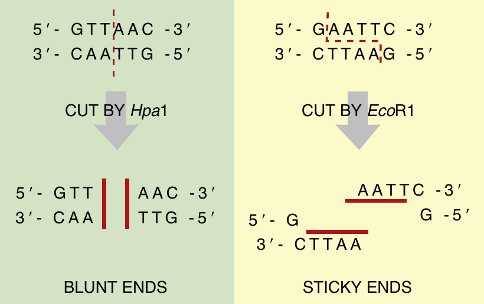
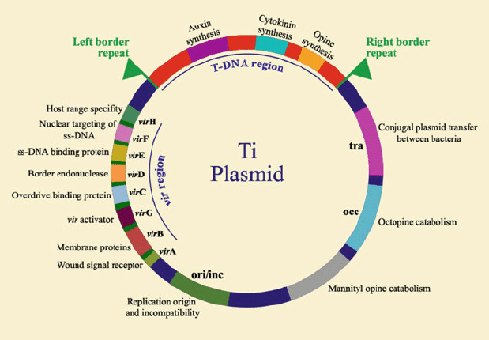

```{r setup, include=FALSE}
library(knitr)
require(tidyverse)
set.seed(453)
# invalidate cache when the package version changes
knitr::opts_chunk$set(tidy = FALSE, echo = FALSE, 
                  message = FALSE, warning = FALSE,
                  out.width = "50%")
options(knitr.table.format = "latex")
options(knitr.kable.NA = "", digits = 2)
options(kableExtra.latex.load_packages = FALSE)
```

# Genetic Structure

### History

- 1972, two researchers (Herbert W. Boyer, UCSD and Stanley N. Cohen, Stanford) met at a conference in Hawaii to discuss *plasmids*.
- One studied Plasmids
- Other studied restriction and modification enzymes (EcoRI)
- After talks, ideas combined.

### Structure of DNA

```{r nucleic-acid-dna, fig.cap=c("DNA has two strands antiparallel to each other. The structure of the subcomponents is shown to the sides."), out.width="45%"}
# pdftools::pdf_convert("./../literatures/biotechnology/Biotechnology 2nd ed - David P. Clark, Nanette J. Pazdernik (AP, 2016).pdf", pages = 14, dpi = 250, format = "png", filenames = "./images/dna_structure.png")

knitr::include_graphics("./../images/dna_structure_a.png")
```

### Structure of RNA

```{r nucleic-acid-rna, fig.cap=c("RNA is usually single-stranded and has two chemical differences from DNA. First, an extra hydroxyl group (-OH) is found at the 2 prime position of ribose, and second, thymine is replaced by uracil."), out.width="45%"}
# pdftools::pdf_convert("./../literatures/biotechnology/Biotechnology 2nd ed - David P. Clark, Nanette J. Pazdernik (AP, 2016).pdf", pages = 14, dpi = 250, format = "png", filenames = "./images/dna_structure.png")

knitr::include_graphics("./../images/dna_structure_b.png")
```

### DNA modification: simplified

- Identification and isolation of the desired gene/DNA fragment to be cloned from different animals, other bacteria, and viruses. Restriction endonucleases are used for producing desired fragments of a given genome.
- Insertion of the gene/DNA segment in a vector; plasmid, virus, cosmid, etc.
- Introduction of the recombinant vector into a suitable host (transformation).
- Integration of the desired gene into the nuclear/organeller genome of the host cell.
- Selection of the transformed host cells.
- Expression of the cloned genes.
- Regeneration of the cloned genes.
- Transmission to the progenies.

# DNA isolation and purification

### Overview

- Cell structure and organelles present a natural barrier
- Bacteria are easiest to manipulate. How?
- Distinction between two DNAs is made based on their sizes.

### Isolation steps

1. Destruction of cell membrane. (Lysozyme digestion of peptidoglycan in bacteria)
2. Bursting of cell membrane by destruction of lipid bilayer (by detergent such as sodium dodecyl sulfate (SDS)). In plants and animals, tissue samples are generally ground up to release the intracellular components.
3. Separation of intracellular components from the insoluble remains (cellular membranes, bones, cartilage, etc.) by either centrifugation or chemical extraction.
4. Extraction of unwanted proteins from DNA with phenol (Dissolves 60%-70% of all living matter).

### Purification procedure

- The two phases (one that of proteins dissolved in phenol and the other of nucleic acids in the aqueous layer) are separated by centrifugation, and the aqueous DNA layer is removed form the phenol
- Use enzyme ribonuclease (RNase) to digests RNA into small ribonucleotide fragments
- Treat this solution with alcohol to precipitate large DNA out of the aqueous phase, while ribonucleotides stay soluble, thus favoring centrifugation extraction of DNA

# DNA fragment separation using Electrophoresis

### Initial preparation

- Gel electrophoresis is used to separate DNA fragments by size
- Gel consists of agarose, a polysaccharide extracted from seaweed that behaves like gelatin (commercial powder).
- For visualizing DNA agarose gel is solidified, after subsequent cooling once the powder-water mixture is heated, into a rectangular slab about 1/4 inch thick by casting the molten liquid into a special tray. 
- To make small wells or holes  at one end of the gel, comb is inserted before the gel hardens.

### Process

Gel electrophoresis uses electric current to separate DNA molecules by size. The agarose slab is immersed in a buffer-filled tank that has a positive electrode at one end and a negative electrode at the other. DNA samples are loaded into the wells, and when an electrical field is applied, the DNA migrates through the gel. The phosphate backbone of DNA is negatively charged, so it moves away from the negative electrode and toward the positive electrode. Polymerized agarose acts as a sieve with small holes between the tangled chains of agarose. The DNA must migrate through these gaps. Agarose separates the DNA by size because larger pieces of DNA are slowed down more by the agarose.

### Visualization 

- The agarose gel is removed from the tank and immersed into a solution of ethidium bromide (mutagenic). 
- This dye intercalates between the bases of DNA or RNA, although less dye binds to RNA because it is single-stranded. When the gel is exposed to ultraviolet light, it fluoresces bright orange.
- In Figure \ref{fig:gel-electrophoresis}, the DNA fragments are visualized by a positively charged dye from the thiazin family. The dye interacts with the negatively charged backbone of the DNA and is a nontoxic alternative that does not require ultraviolet light sources.

### Notes

- Size of DNA being examined affects what type of gel is used. 
- Size of DNA molecules can be determined by comparing to a set of molecular weight standards run in a different well. 
- Because the standards are of known size, the experimental DNA fragment can be compared directly.
- Resolvability of some gel matrix is different than other.

\begin{block}{}
\textrm{Fragments of DNA are separated by size using gel electrophoresis. A current causes the DNA fragments to move away from the negative electrode and toward the positive. As the DNA travels through agarose, the larger fragments get stuck in the gel pores more than the smaller DNA fragments. Pulsed field gel electrophoresis separates large pieces of DNA by alternating the electric current at right angles.}
\end{block}

### Electrophoresis apparatus and visualization

```{r gel-electrophoresis, fig.cap=c("(A) Photo of electrophoresis supplies. Electrophoresis chamber holds an agarose gel in the center portion, and the rest of the tank is filled with buffer solution. The red and black leads are then attached to an electrical source. FisherBiotech Horizontal Electrophoresis Systems, Midigel System; Standard; 13 $\\times$ 16-cm gel size; 800 mL buffer volume; Model No. FB-SB-1316. (B) Agarose gel separation of DNA. The size of the fragments can be calculated by comparing them to the standard DNA marker in lane 1. The brighter bands in the marker are 1000 base pairs and 500 base pairs, with the 1000 base-pair marker closer to the wells (marked with numbers 1–8)."), out.width="45%"}
# pdftools::pdf_convert("./../literatures/biotechnology/Biotechnology 2nd ed - David P. Clark, Nanette J. Pazdernik (AP, 2016).pdf", pages = 72, dpi = 250, format = "png", filenames = "./images/electrophoresis.png")

knitr::include_graphics("./../images/electrophoresis.png")
```

# DNA modification

### DNA cutters: Restriction enzymes

- DNA should be cut to fragments of different sizes because entire set of nuclear DNA is not of particular interest in visualization
- Naturally occuring *restriction enzymes* or *restriction endonucleases* come into rescue in this operation. 
- These bacterial enzymes bind to specific recognition sites on DNA and cut the backbone of both strands.
- These enzymes are methylation sensitive.
- Bacteria produce *modification enzymes* that recognize the same sequence as the corresponding restriction enzyme. These methylate each recognition site in the bacterial genome.

### DNA cutters: Restriction enzymes

```{r restriction-enzymes, fig.cap=c("\\textbf{Type II Restriction Enzymes -- Blunt versus Sticky ends} \\newline \\textit{Hpal} is a bunt-end restriction enzyme; that is, it cuts both strands of DNA in exactly the same position. \textit{EcoR}I is a sticky-end restriction enzyme. The enzyme cuts between the G and A on both strands, which generates four base-pair overhangs on the ends of the DNA. Since these ends may base pair with complementary sequences, they are considered 'sticky'.")}
# pdftools::pdf_convert("./../literatures/biotechnology/Biotechnology 2nd ed - David P. Clark, Nanette J. Pazdernik (AP, 2016).pdf", pages = 73, dpi = 250, format = "png", filenames = "./images/restriction_enzymes.png")


```

### DNA cutters: Restriction enzymes

- Restriction enzymes have been exploited to cut DNA at specific sites, since each restriction enzyme has a particular recognition sequence. Difference in cleavage site determine the type of restriction enzyme.

  - Type I restriction enzymes cut the DNA strand 1000 or more base pairs from the recognition sequence. 
  - Type II restriction enzymes cut in the middle of the recognition sequence and are the most useful in genetic engineering. The Type II restriction enzymes can form *both* sticky or *blunt* ends.

- The recognition sequences of Type II restriction enzymes are usually inverted repeats so that the enzymes cut between the same bases on the both strands.

### DNA cutters: Restriction enzymes

```{r restriction-enzymes-ex, fig.cap=c("Common restriction enzymes")}
# pdftools::pdf_convert("./../literatures/biotechnology/Biotechnology 2nd ed - David P. Clark, Nanette J. Pazdernik (AP, 2016).pdf", pages = 74, dpi = 250, format = "png", filenames = "./images/restriction_enzymes_ex.png")


```

### DNA cutters: Restriction enzymes

- The number of base pairs in the recognition sequence determines the likelihood of cutting. 
- So to generate fewer, longer fragments, restriction enzymes with six or more base-pair recognition sequences are used. 

### DNA joiners: Ligase -- Overview

- When two different DNA samples are cut with the same sticky-end restriction enzyme, all fragments will have identical overhangs. 
- This allows DNA fragments from two sources (e.g., two different organisms) to be linked together (Figure \ref{fig:restriction-ligation}). 
- Fragments are linked or ligated using DNA ligase
- The efficiency of ligases depends on the total concentration of the substrates and also on the closeness of the ends to be ligated.

### DNA joiners: Ligase -- Types

- There are 3 kinds of mammalian DNA ligases.
- Joining of Okazaki fragments and sealing of excision repair nicks, repair of double-strand breaks and nonhomologous end joining, joining of recombining plasmid vectors.

### DNA joiners: Ligase

```{r restriction-ligation, fig.cap=c("\\textbf{Compatible overhangs are linked using DNA Ligase}\\newline BamHI and Bgl Il generate the same overhanging or sticky ends: a $3^\\prime$-CTAG-$5^\\prime$ overhang plus a $5^\\prime$-GATC-$3^\\prime$ overhang. These are complementary and base pair by hydrogen bonding. The breaks in the DNA backbones are sealed by T4 DNA ligase, which hydrolyzes ATP to energize the reaction."), out.width="14%"}
# pdftools::pdf_convert("./../literatures/biotechnology/Biotechnology 2nd ed - David P. Clark, Nanette J. Pazdernik (AP, 2016).pdf", pages = 76, dpi = 250, format = "png", filenames = "./images/restriction_ligation.png")


```

# DNA detection

### Background

- In 1969, Mary Lou Pardue and Joseph Gall developed a procedure by which they could hybridize radioactive single strands of DNA with complementary strands
of DNA in chromosomes on glass slides. 
- This procedure, called in situ hybridization, Pardue and Gall were able to determine the chromosomal locations of repetitive DNA sequences. 
- Classical in situ hybridization involved spreading mitotic chromosomes on a glass slide, denaturing the DNA in the chromosomes by exposure to alkali (0.07 N NaOH) for a few minutes, rinsing with buffer to remove the alkaline solution, incubating the slide in hybridization solution containing radioactive copies of the nucleotide sequence of interest, washing off the radioactive strands that have not hybridized with complementary sequences in the chromosomes, exposing the slide to a photographic emulsion that is sensitive to low-energy radioactivity, developing the autoradiograph, and superimposing the autoradiograph on a photograph of the chromosomes.

### In situ hybridization

```{r insitu-hybridization, fig.cap="Steps in in-situ hybridization", out.width="65%"}
# pdftools::pdf_convert("./../../literatures/textbooks/[D._Peter_Snustad,_Michael_J._Simmons]_Principles of Genetics.pdf", 
#                       pages = 709, dpi = 250, format = "png", filenames = "../images/insitu_hybrid_steps.png")


```

### Fluorescent In Sity Hybridization

- A repetitive DNA sequence can be identified as satellite DNA (generally non-transcribing) only if the sequence has a base composition sufficiently different from that of main-band DNA to produce a distinct band during density-gradient centrifugation. Therefore, centrifugation cannot be used to identify all repetitive DNA sequences.
- Today, in situ hybridization experiments are often done by using hybridization probes that are linked to fluorescent dyes or antibodies tagged with fluorescent compounds \ref{fig:fish-hybridization1}. 

### Fluorescent In Sity Hybridization

- In one protocol, DNA or RNA hybridization probes are linked to the vitamin biotin, which is bound with high affinity by the egg protein avidin \ref{fig:fish-hybridization1}. 
- By using avidin covalently linked to a fluorescent dye, the chromosomal location of the hybridized probe can be detected by the fluorescence of the dye. 
- This procedure, called FISH (Fluorescent In Situ Hybridization), has been used to demonstrate the presence of the repetitive sequence TTAGGG in the telomeres of human chromosomes \ref{fig:fish-hybridization2}. 
- The FISH procedure is very sensitive and can be used to detect the locations of single-copy sequences in human mitotic and interphase chromosomes.

### FISH: Procedure

\begin{columns}[T,onlytextwidth]
  \column{0.5\textwidth}

```{r fish-hybridization1, fig.cap="Localization of repeated DNA sequences in chromosomes by in situ hybridization performed with fluorescent probes", out.width="80%"}
# pdftools::pdf_convert("./../../literatures/textbooks/[D._Peter_Snustad,_Michael_J._Simmons]_Principles of Genetics.pdf", 
#                       pages = 709, dpi = 250, format = "png", filenames = "../images/fish_hybridization1.png")

knitr::include_graphics("./../images/fish_hybridization1.png")
```

  \column{0.5\textwidth}

```{r fish-hybridization2, fig.cap="The use of fluorescent dyes to localize the TTAGGG repeat sequence to the telomeres of human chromosomes and a photomicrograph demonstrating its telomeric location is shown in.", out.width="50%"}
# pdftools::pdf_convert("./../../literatures/textbooks/[D._Peter_Snustad,_Michael_J._Simmons]_Principles of Genetics.pdf", 
#                       pages = 709, dpi = 250, format = "png", filenames = "../images/fish_hybridization2.png")

knitr::include_graphics("./../images/fish_hybridization2.png")
```

\end{columns}

# Gene cloning

###

- DNA technologies involve the cutting and pasting of DNA segments to produce new arrangements.
<!-- - rDNA technology is the use of *in vitro* molecular techniques that manipulate fragments of DNA to produce new arrangements. -->

```{r rDNA-technology, fig.width=4, out.width="50%", fig.cap="Steps in rDNA technology", fig.pos="H"}
DiagrammeR::mermaid(
  "
  graph TB

  11[Isolation of DNA fragments from different sources] --> 21[Integration of DNA fragments<br>with gene of interest to a suitable vector]
  21 --> 31[Introduction of rDNA to a host cell]
  31 --> 41[Cloning of gene by replication of rDNA molecule inside host cell]
  "
)
```


###

<!-- - Because proteins are the workhorses of cells and because they are the product of genes, many molecular biologists focus their attention on the structure and fuction of proteins or the genes that encode them. -->
<!-- - Researchers may focus their efforts on the study of just one or perhaps a few different genes or proteins. At the molecular level, this poses a daunting task. -->
- The term gene cloning refers to the process of making many copies of a gene.
- There are two general strategies used to make copies of a gene:
  - insertion of a gene into a vector that is then propagated in living cells
  - cloning via polymerase chain reaction
- Obvious use cases of gene cloning are summarized in Table \ref{tab:gene-cloning-uses}.

```{r gene-cloning-uses}
tribble(
  ~"Technique", ~"Description",
  "DNA sequencing", "Cloned genes provide enough DNA to subject the gene to DNA sequencing. The sequence of the gene can reveal the gene's promoter, regulatory sequences, and coding sequence. DNA sequencing is also important in the identification of alleles that cause cancer and inherited human disease.",
  "Site-directed mutagenesis", "A cloned gene can be manipulated to change its DNA sequence. Mutations within genes help to identify gene sequences, such as promoters and regulatory elements. The study of a mutant gene can also help to elucidate its normal function and how its expression may affect the roles of other genes. Mutations in the coding sequence may reveal which amino acids are important for a protein's structure and function.", 
  "Gene probes", "Labeled DNA strands from a cloned gene can be used as probes for identifying RNA. This method of analysis, known as Northern blotting. Probes are also used to localize genes within intact chromosomes.",
  "Expression of cloned genes", "Cloned genes can be introduced into a different cell type of different species. This expression of cloned genes has many uses: Research, Biotechnology and Clinical trials."
) %>% 
  knitr::kable(booktabs = TRUE, caption = "Some applications of gene cloning.") %>% 
  kableExtra::kable_styling(font_size = 6) %>% 
  kableExtra::column_spec(column = 1:2, width = c("8em", "42em"))
```


###

- A gene (or a segment of DNA containing the gene) is **removed** from its native site within a chromosome and inserted into a smaller segment of DNA known as a vector.
- A vector (carrier) is a small DNA molecule that replicates independently of the chromosomal DNA and produces many identical copies of an inserted gene.
  - A vector is replicated within a living cell (called a host cell)
- Common gene-cloning vectors are plasmids or viruses.
- Plasmids are found naturally in many strains of bacteria and occasionally in eukaryotic cells.
  - generally involved with antibiotic resistance -- R factors

<!-- Plasmids also contain a DNA sequence, known as an origin of replication, that is recognized by the replication enzymes of the host cell, which allows the plasmid to be replicated. The sequence of the origin of replication determines whether or not the vector can replicate in a particular type of host cell. Some plasmids have origin of replication with a broad host range while many have a limited host range. -->

<!-- The origin of replication also determines the copy number of a plasmid. Some plasmids are said to have strong origins because they achieve a high copy number -- perhaps 100-200 copies of the plasmid per cell. -->

<!-- Commercially available plasmids have been genetically engineered for effective use in cloning experiments. They contain unique sites where geneticists insert pieces of DNA. cloning vectors contain resistance genes, which provide host cells with the ability to grow in the presence of a toxic substance. Such a gene is called a selectable marker because the expression of the gene selects for the growth of the host cells. For example, the gene $amp^{R}$ encodes an enzyme known as $\beta$-lactamase. This enzyme degrades ampicillin, an antibiotic that normally kills bacteria. In a cloning experiment in which the $amp^{R}$ gene is found within the plasmid, the growth of cells in the presence of ampicillin identifies bacteria that carry the plasmid. -->

### Gene cloning vectors

\bcolumns
\column{0.5\textwidth}

```{r cloning-vectors, fig.cap="Vectors commonly used in cloning small segments of DNA.", out.width="76%"}

```

\column{0.5\textwidth}

```{r ti-plasmid, fig.cap="The structure of Ti-plasmid.", out.width="98%"}

```

\ecolumns

###

\bcolumns
\column{0.5\textwidth}

```{r steps-gene-cloning, fig.cap="Steps in gene cloning.", out.width="86%"}
# pdftools::pdf_convert("../../../000readables/plbgen/general_textbooks/2018_Genetics_Analysis and Principles 6th ed.pdf", format = "png", pages = 531, filenames = "../images/steps_in_gene_cloning.png", dpi = 280)


```

\column{0.5\textwidth}

\scriptsize
Following ligation, the rDNA is introduced into host cells treated with agents that render them permeable to DNA molecules. Cells that can take up DNA from the extracellular medium are called competent cells (small proportion of bacterial cell). This step is called transformation.

<!-- How can the experimenter distinguish between bacterial colonies that have a recircularized vector versus those with a recombinant vector carrying a piece of chromosomal DNA ? -->

The chromosomal DNA has been inserted into a region of the vector that contains the lacZ gene, which encodes the enzyme $\beta$-galactosidase. The insertion of chromosomal DNA into the vector disrupts the $lacZ$ gene so it no longer produces a functional enzyme. By comparison, a recircularized vector has a functional $lacZ$ gene. The functionality of $lacZ$ is determined by providing the growth medium with a colorless compound, X-Gal (5-bromo-4-chloro-3-indolyl-$\beta$-D-galactoside), which is converted by $\beta$-galactosidase into a blue dye. Bacteria grown in the presence of X-Gal and IPTG (isopropyl-$\beta$-D-thiogalactopyranoside, an inducer of the $lacZ$ gene) form blue colonies if they have a functional lacZ gene and white colonies if they do not. In this experiment, therefore, bacterial colonies containing recircularized vectors form blue colonies, whereas colonies containing recombinant vectors are white.

\ecolumns

<!-- In the experiment, one of the white colonies contains cells with a recombinant vector that carries a human gene of interest; the segment containing the human gene is shown in red. The goal of gene cloning is to produce an enormous number of copies of a recombinant vector that carry the gene of interest. During transformation, a single bacterial cell usually takes up a single copy of a recombinant vector. However, two subsequent events lead to the amplification of the cloned gene. First, because the vector has an origin of replication, the bacterial host cell replicates the recombinant vector to produce many identical copies per cell. Second, the bacterial cells divide approximately every 20 minutes. After overnight growth, a bacterial colony may be composed of 10 million cells, with each cell containing 50 copies of the recombinant vector. Therefore, this bacterial colony would contain 500 million copies of the cloned gene! -->

###

```{r bac-vector, fig.cap="A simplified drawing of a BAC cloning vector. The vector contains several genes that function in vector replication and segregation. The origin of replication is designated $oriS$, and the $repE$ gene encodes a protein essential for replication at $oriS$. The $parA$, $parB$, and $parC$ genes encode proteins required for the proper segregation of the vector into daughter cells. A chloramphenicol resistance gene, $cm^R$, provides a way to select for cells that have taken up the vector, based on their ability to grow in the presence of the antibiotic chloramphenicol. The vector also contains unique restriction enzyme sites, such as HindIII, BamHI, and SphI, for the insertion of large fragments of DNA. These sites are located within the $lacZ$ gene, which encodes the enzyme $\\beta$-galactosidase. Vectors with DNA inserts can be determined by plating cells on media containing the compound X-Gal.", fig.align='center', out.width="56%"}

```

<!-- YAC, BAC, and PAC cloning vectors have been very useful in the construction of contigs that span long segments of chromosomes. They have been used as the first step in creating a rough physical map of a genome. Although this is an important step in physical mapping, the long inserts make these types of vectors difficult to use in gene cloning and sequencing experiments. Therefore, libraries containing recombinant vectors with shorter insert sizes are needed. In many cases, a type of cloning vector called a cosmid is used. A cosmid is a hybrid between a plasmid vector and phage $\lambda$; its DNA can repli cate in a cell like a plasmid or be packaged into a protein coat like a phage. Cosmid vectors typically can accept DNA fragments that are tens of thousands of base pairs in length. -->

# PCR

### Background

- An in vitro technique that enables DNA fragments to be copied in a process that is referred to as *amplification*.
- Usefulness is because sufficient DNA can be generated to characterize and analyze it.
  - e.g.: tracking disease processes by characterizing genetic fingerprints of pathogenic organisms
- The polymerase chain reaction makes copies of dissociated DNA or single - stranded copies of mRNA.

### PCR steps

- Denaturing of the target sequence so that the polynucleotide is in a single stranded, unwound form. For DNA, this requires a temperature of $94-96^\circ$ C for 5 min.
- Hybridization so that the primers bind to complementary bases that flank the regions on either side of the polynucleotide of interest. This step requires about 30 s and is carried out at $30-65^\circ$.
- Polymerization (i.e., polynucleotide or DNA synthesis) by DNA polymerase. The enzyme reads the template strand between the flanking primers, and matches the bases with complementary ribonucleotides, which are then incorporated into the primer strand. This is carried out at $72-80^\circ$C for several minutes at pH = 8.4 in Tris buffer containing ribonucleotides representing all 4 bases (A, G, C, T).

###

```{r pcr-steps, fig.cap="Graphical representation of amplifying a target DNA sequence through the polymerase chain reaction (PCR) [reproduced from Brown (2006), Fig. 9.2] .", out.width="36%"}
# pdftools::pdf_convert("./../../literatures/biotechnology/Modern Biotechnology - Nathan S. Mosier, Michael R. Ladisch (Wiley-AIChE, 2009).pdf",
#                       pages = 431, dpi = 250, format = "png", filenames = "../images/pcr_steps.png")

knitr::include_graphics("./../images/pcr_steps.png")
```

### PCR ingredient: Thermally tolerant DNA polymerase

- Polymerase from the thermophilic bacterium _Thermus aquaticus_ resolved issues of specificity and speed. 
- _T. aquaticus_ (abbreviated _Taq_) is found in hotsprings and grows at $75^\circ$C. Its enzyme has an optimum temperature of $72^\circ$C and is sufficiently stable at $96^\circ$C so that fresh Taq enzyme does not need to be added after each cycle.
- Taq polymerase allows primer annealing and extension to be carried out at temperatures significantly higher than those for E. coli polymerase. This reduces imperfect annealing and subsequent amplification of an imperfect (nonspecific) product.
- This enabled researchers to design and build automated PCR machines, and thereby accelerated the rapid application of this technology.

### PCR: Classic protocol

\begin{block}{Watson et al. ( 1992, p. 8) state:}
The standard PCR is typically done in a 50 - or 100 $\mu l$ volume and, in addition to the sample DNA, contains 50 mM KCl, 10 mM Tris/HCl (pH 8.4 at room temp.), 1.5 mM MgCl 2, 100 $\mu$g/ml gelatin, 0.25 $\mu$M of each primer, 200 $\mu$M of each deoxynucleotide triphosphate (dATP, dCTP, dGTP, and dTTP), and 2.5 units of Taq polymerase. The type of the DNA sample will be variable but it will usually have between $10^2$ to $10^5$ copies of the template (e.g., 0.1 $\mu$g DNA). A few drops of mineral oil are often added to seal the reaction and prevent condensation ... The amplification can be conveniently performed in a DNA Thermal Cycler (Perkin -Elmer Instruments) using the “Step-Cycle” program set to denature at $94^\circ$C for 20 sec, anneal at $55^\circ$C for 20 sec, and extend at  $72^\circ$C for 30 sec for a total of 30 cycles. (The “Step-Cycle” program causes the instrument to heat and cool to the target temperatures as quickly as possible. In the current instrument, this results in a heating rate of about  $0.3^\circ$C per sec and a cooling rate of about  $1^\circ$C per sec, for an overall single cycle time of approximately 3.75 min).
\end{block}

### PCR: Detailed methodology

- A sequence of a small stretch of nucleotides on either side of the target must be known, these flanking sequences are then used to specify and synthesize single-stranded oligonucleotide fragments, or primers (~20 bp).
- A mixture of the template sequence (primers), Taq polymerase, triphosphorylated deoxyribonucleotides, and buffer then doubles the amount of DNA each cycle.
- The amount of DNA is doubled during each cycle, with n cycles producing $2^n$ as present to begin with.
- Rate of misincorporation: 1 base out of 10,000 - 1 base out of 200,000 per PCR cycle.
- This limitation was overcome for sequencing long fragments of genomic DNA through use of in vivo DNA amplification using yeast or BACs.

### Applications

- Detection of pathogenic microorganisms ( _H. pylori_, tuberculosis, chlamydia, viral meningitis, viral hepatitis, AIDs, etc.)
- Disease epidemiology and forcasting.
- Crime detection and forensic application.
- Crop variety characterization by DNA fingerprinting.

# RFLP Fingerprinting

### Steps

- The DNA is cut with a restriction enzyme.
- The DNA fragments are separated by length or molecular weight by gel electrophoresis.
- The fragments are visualized by Southern blotting. The separated fragments are transferred from the gel to nylon paper. Then a radioactively labeled DNA probe is added.
- The probe binds to those DNA fragments with complementary sequences.
- The blot is covered with radiation-sensitive film to give an autoradiograph. This shows the location of those DNA fragments that reacted with the radioactive probe.
- The final product of a DNA fingerprint is an autoradiograph that contains at least five essential lanes (Figure \ref{fig:fingerprint-lanes}). The markers are standardized DNA fragments of known size, which have been radioactively labeled.

###

```{r rflp-fingerprinting, fig.cap="Outline of RFLP based DNA fingerprinting", out.width="32%"}
# pdftools::pdf_convert("./../../literatures/biotechnology/Biotechnology 2nd ed - David P. Clark, Nanette J. Pazdernik (AP, 2016).pdf", pages = 722, dpi = 250, format = "png", filenames = "../images/rflp_fingerprinting.png")
knitr::include_graphics("../images/rflp_fingerprinting.png")
```

###

```{r fingerprint-lanes, fig.cap="Actual DNA fingerprint showing that the pattern of DNA fragments of the victim (V) were found on the defendant's clothing (jeans/shirt). The first two and last two lanes are the standard size markers (labeled $\\lambda$ and 1 kb). The lane marked TS is a positive control showing that the fingerprint technique was successful. The lane marked D is the defendant's DNA pattern.", out.width="40%"}
# pdftools::pdf_convert("./../../literatures/biotechnology/Biotechnology 2nd ed - David P. Clark, Nanette J. Pazdernik (AP, 2016).pdf", pages = 723, dpi = 250, format = "png", filenames = "../images/fingerprint_lanes.png")
knitr::include_graphics("../images/fingerprint_lanes.png")
```
