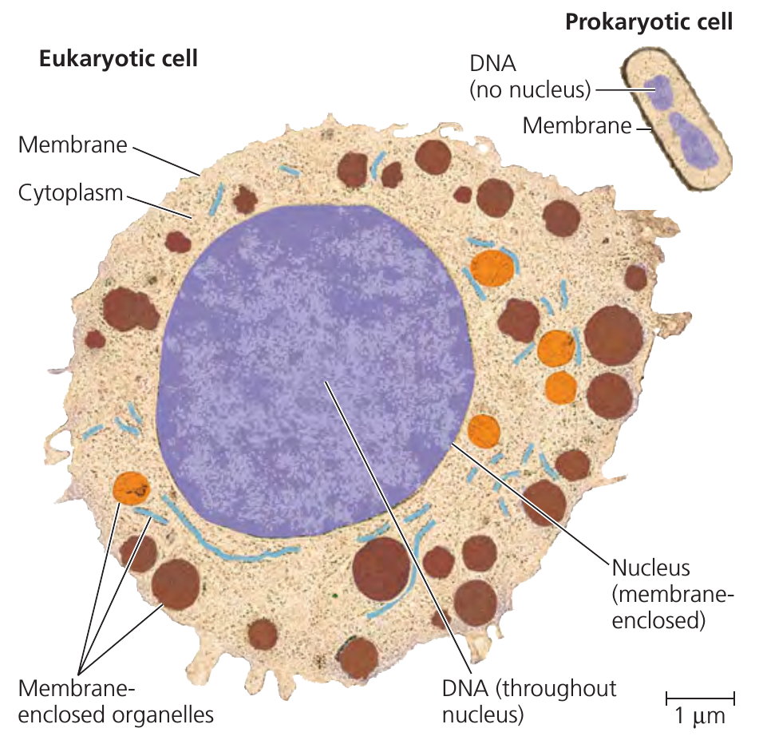
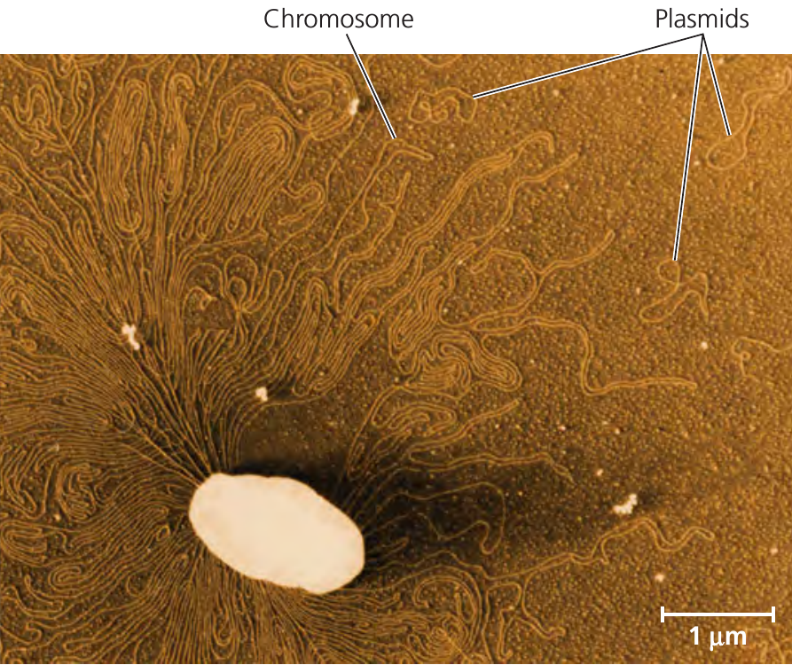
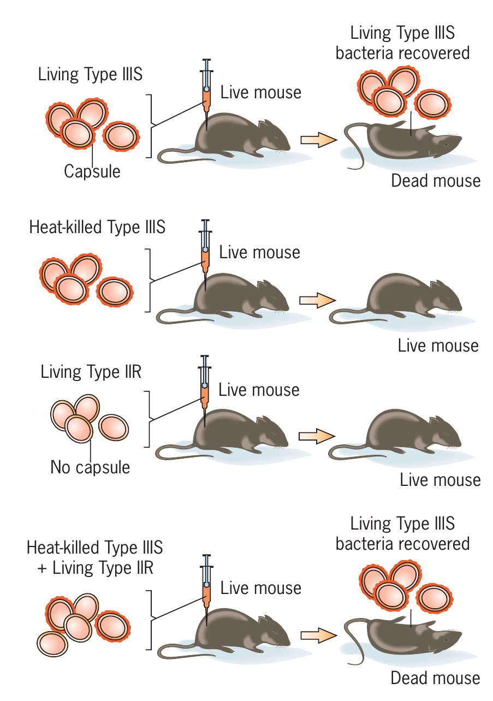
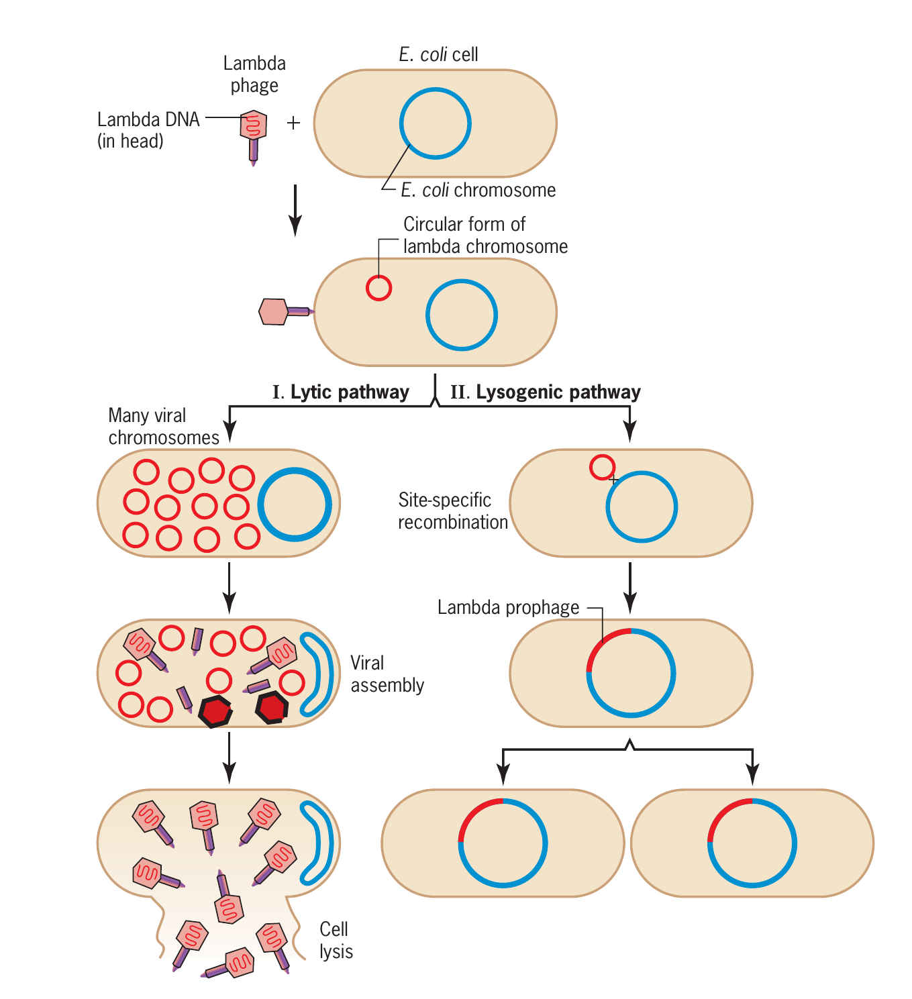
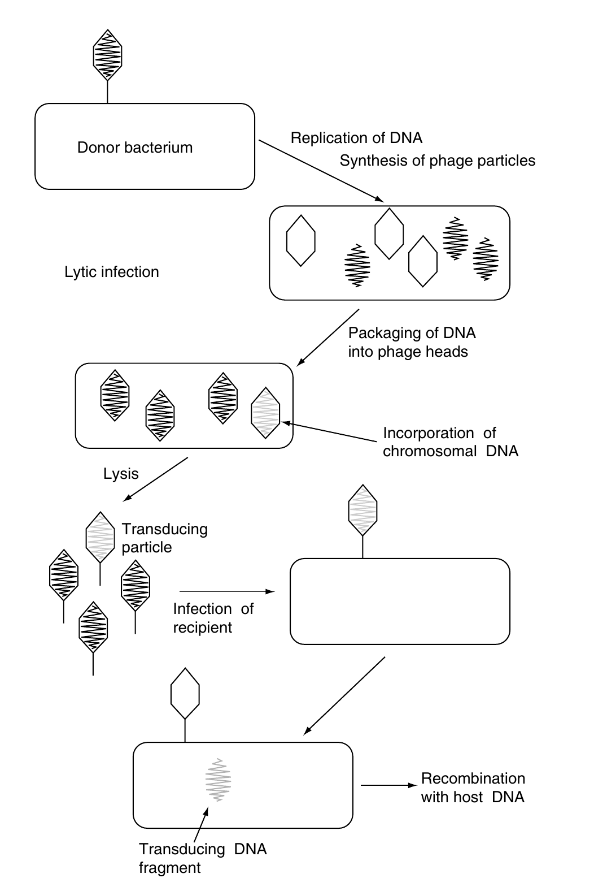
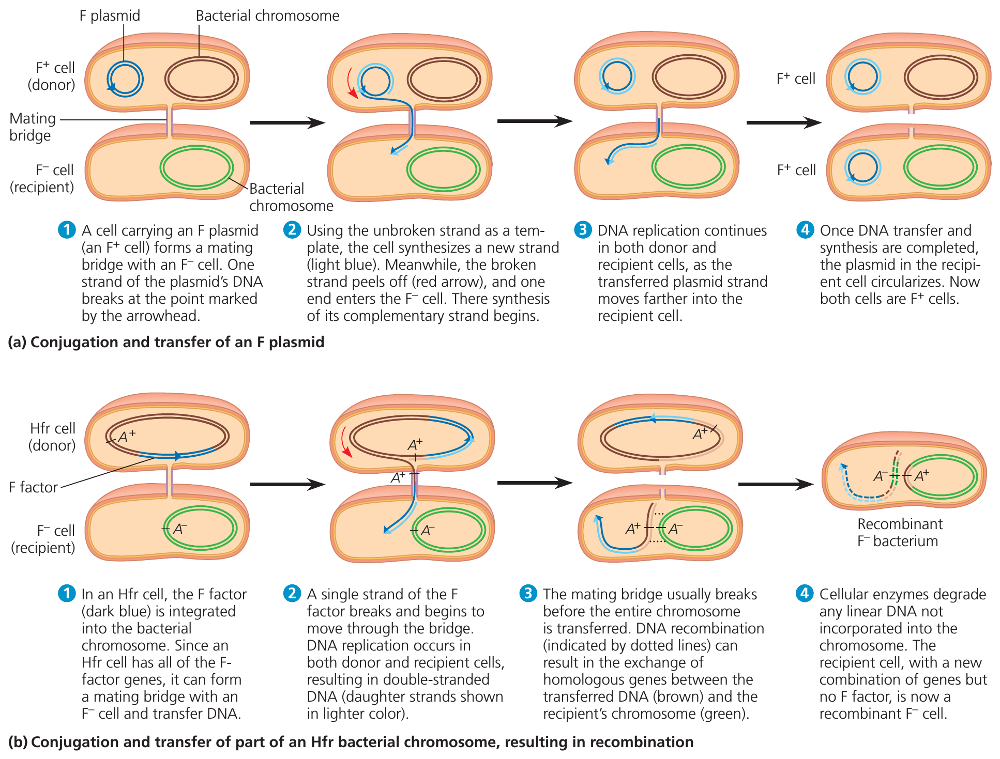
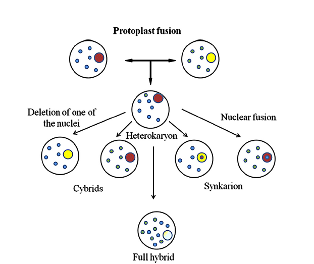

```{r setup, include=FALSE}
library(knitr)
require(tidyverse)
set.seed(453)
# invalidate cache when the package version changes
knitr::opts_chunk$set(tidy = FALSE, echo = FALSE, 
                  message = FALSE, warning = FALSE,
                  out.width = "45%")
options(knitr.table.format = "latex")
options(knitr.kable.NA = "", digits = 2)
options(kableExtra.latex.load_packages = FALSE)
```

# Bacterial genetics

### Features of prokaryotic and eukaryotic cells

- A eukaryotic cell is subdivided by internal membranes into various membrane-enclosed organelles (Figure \ref{fig:eu-prokaryotic-cell}). 
- In eukaryotic cells, nucleus contains the cell's DNA. 
- The other organelles are located in the cytoplasm, the entire region between the nucleus and outer membrane of the cell.
- The chloroplast is a characterstic organelle found in eukaryotic cells that carry out photosynthesis.
- Prokaryotic cells are much simpler and generally smaller than eukaryotic cells.
- In a prokaryotic cell, the DNA is not separated from the rest of the cell by enclosure in a membrane-bounded nucleus. 
- Prokaryotic cells also lack the other kinds of membrane-enclosed organelles.

### Features of prokaryotic and eukaryotic cells

```{r eu-prokaryotic-cell, fig.cap="Contrasting eukaryotic and prokaryotic cells in size and complexity.", out.width="35%"}
# pdftools::pdf_convert("/media/deependra/e4da4ac5-3b38-4b89-9402-397eb940e4d3/Addition/Generalized Study/Reece Campbell Biology 9th txtbk.pdf", pages = 56, dpi = 250, format = "png", filenames = "./../images/eukaryotic_prokaryotic.png")


```

### DNA and chromosome structure

```{r prokaryotic-dna, fig.cap="A prokaryotic chromosome and plasmids. The thin, tangled loops surrounding this ruptured E. coli cell are parts of the cell’s large, circular chromosome (colorized TEM). Three of the cell’s plasmids, the much smaller rings of DNA, are also shown.", out.width="38%"}
# pdftools::pdf_convert("/media/deependra/e4da4ac5-3b38-4b89-9402-397eb940e4d3/Addition/Generalized Study/Reece Campbell Biology 9th txtbk.pdf", pages = 607, dpi = 250, format = "png", filenames = "./../images/prokaryotic_chr_plasmid.png")


```

# Major genetic material transfer processes

### Genetic transformation

- First observed in bacteria and first bacterial system for genetic transfer to be discovered. 
- Naturally occurs in only certain bacteria, but under laboratory conditions it seems to be possible with any cell type, prokaryotic or eukaryotic.
- When a bacterial cell (living or dead) releases some DNA into the surrounding medium, this DNA is, of course, vulnerable to degradation but may encounter another bacterial cell before any significant change can occur. 

### Genetic transformation

- The second cell may take up the DNA, transport it across the cell wall and cell membrane, and allow it to recombine with the homologous portion of the resident bacterial chromosome. 
- The resulting recombinant cell is called a transformant. 
- The amount of DNA transferred per event is small, on the order of 10 kb in length.

### Transformation

```{r transformation-griffith, fig.cap="Griffith's discovery of transformation in Streptococcus pneumoniae", out.width="25%"}
# pdftools::pdf_convert("../../literatures/textbooks/[D._Peter_Snustad,_Michael_J._Simmons]_Principles of Genetics.pdf", pages = 193, dpi = 250, format = "png", filenames = "./../images/bacterial_transformation.png")


```

### Transduction

- Bacterial virus (bacteriophage) is intimately involved in the genetic transfer process.
- Phage infections begin with adsorption of virus particles to specific receptor sites on the host cell surface. The nucleic acid contained inside the viral protein coat is then transferred to the cytoplasm of the bacterial cell, where it becomes metabolically active and undergoes replication and transcription.
- Typically there are two possible outcomes of phage infection.

### Transduction
 
- During a **lytic response**, the virus produces structural components of new phage particles, packages its nucleic acid inside them, and then causes the cell to lyse and release progeny phage. 
- During a **temperate response**, the virus establishes a stable relationship with a host cell in which some phage functions are expressed, but not those that lead to uncontrolled DNA replication or the production and assembly of new particles. 

### Transduction: responses

```{r transduction-bacteriophage, fig.cap="The life cycle of bacteriophage $\\lambda$. The two intracellular states of bacteriophage lambda: lytic growth and lysogeny. Lambda is smaller than T4; however, its life cycle is more complex. Note, bacteriophage T4 is a lytic phage; when it infects a bacterium, it replicates and kills the host", out.width="25%"}
# pdftools::pdf_convert("../../literatures/textbooks/[D._Peter_Snustad,_Michael_J._Simmons]_Principles of Genetics.pdf", 
#                       pages = 187, dpi = 250, format = "png", filenames = "./../images/bacteriophage_stages.png")


```

### Transduction

- Instead, viral DNA is replicated along with host DNA, usually as an integral part of the same molecule, and is transmitted to all progeny cells. 
- Occasionally **lysogens** (cells carrying a temperate phage) undergo a metabolic shift that reactivates the viral DNA. The result is the same as for an initial lytic response. - Some phages may give only lytic responses and some only temperate ones; some, however, may give either response, depending on growth conditions.

### Transduction: Transducing bacterial cell

- During the course of a phage infection of a bacterial cell, some or all of the viral DNA inside an individual virion (virus particle) may be replaced by bacterial DNA, and this process may occur only rarely or with great frequency.
- After such an altered phage particle is released into the medium, it may encounter another bacterial cell and attempt to initiate an infection. In so doing, however, it transfers the DNA fragment from the previous host’s chromosome. 
- If the newly infected cells are not killed and the DNA fragment can either replicate or recombine, the result is the production of **transductants**. 

### Transduction: Amount of change

- The amount of DNA transferred by these means varies considerably, but generally is not more than the amount of DNA normally present in a single bacteriophage particle (~200 kbp).
- The actual amount of DNA recombined is significantly less in most cases and, in addition, depends on whether the transduction is generalized or specialized.

### Transduction: Generalized and specialized

- During **generalized transduction** the phage enzyme system that packages viral DNA attaches to the bacterial chromosome and packages some of that DNA instead. The DNA that is packaged is chosen on a more or less random basis, and as a result it is possible for any piece of host genetic information to be transferred. 
- **Specialized transduction** involves a temperate phage that has physically integrated its DNA into the bacterial chromosome at a specific site. As mentioned earlier, such an integrated phage may be stable for long periods of time.

### Transduction: Generalized and specialized

- However, it may reactivate and replicate itself independent of the bacterial chromosome. During the reactivation process, it is possible for a mistake to occur so that some bacterial DNA located adjacent to one end of the viral DNA is also excised from the chromosome instead of the appropriate DNA from the other end of the viral genome.
- Because the overall size of the excised DNA must be nearly constant, only certain pieces of genetic information can be transferred, and their size depends on the physical nature of the mistake that caused their production.

### Transduction: Generalized

```{r transduction-gen, fig.cap="Generalized transduction", out.width="25%"}
# pdftools::pdf_convert("../../literatures/molecular_genetics/Molecular Genetics of Bacteria, 4th.pdf", pages = 193, dpi = 250, format = "png", filenames = "./../images/transduction_generalized.png")


```

### Conjugation

- In yeast the result of conjugation is fusion of haploid cells and formation of a diploid cell type. 
- In a bacterium such as E. coli, instead of cell fusion there is unidirectional transfer of DNA from a donor cell (which carries a conjugative plasmid) to a recipient cell beginning at a definite point on the DNA molecule and proceeding in a linear fashion. The transferred DNA may be all or part of the plasmid and may include a portion of the host DNA as well. 
- By analogy the recombinant bacteria are called transconjugants. 
- The amount of bacterial DNA that can be transferred by conjugation ranges from a few kb to the entire chromosome.

### Conjugation

```{r conjugation, fig.cap="Conjugal transfer of a resistance plasmid. The donor strain is sensitive to nalidixic acid and carries a plasmid conferring ampicillin resistance (amp). The recipient is resistant to nalidixic acid, due to a chromosomal mutation, and sensitive to ampicillin. After growth of the mixed culture, plating on agar containing both ampicillin and nalidixic acid selects those recipients that have received the plasmid (transconjugants). The bacterial chromosome is omitted for clarity", out.width="25%"}
# pdftools::pdf_convert("../../literatures/molecular_genetics/Molecular Genetics of Bacteria, 4th.pdf", pages = 183, dpi = 250, format = "png", filenames = "./../images/bacterial_conjugation.png")

knitr::include_graphics("./../images/bacterial_conjugation.png")
```

### Conjugation

```{r conjugation2, fig.cap="Conjugation and recombination in E. coli. The DNA replication that accompanies transfer of an F plasmid or part of an Hfr bacterial chromosome is called rolling circle replication. In effect, the intact circular parental DNA strand “rolls” as its other strand peels off and a new complementary strand is synthesized.", out.width="50%"}
# pdftools::pdf_convert("/media/deependra/e4da4ac5-3b38-4b89-9402-397eb940e4d3/Addition/Generalized Study/Reece Campbell Biology 9th txtbk.pdf", pages = 611, dpi = 250, format = "png", filenames = "./../images/bacterial_conjugation2.png")


```


### Protoplast fusion

- Mostly successful in eukaryotic cells.
- The protoplasts (cells that have been stripped of their walls) must be prepared by various enzymatic or antibiotic treatments. 
- Fusion of cell membranes is aided by a high concentration of polyethylene glycol. 
- The resulting diploid cell usually segregates haploid offspring, many of which show extensive recombination of parental characters. 

### Protoplast fusion

- The diploid state can be stable over many generations, as evidenced by successful transformation of parental genes whose phenotype was not present in the diploid donor cell.
- Successful fusions have been reported with _Actinoplanes_, _Brevibacterium_, _Bacillus_, _Mycobacterium_, _Providencia_, _Staphylococcus_, and _Streptomyces_.

### Protoplast fusion

```{r protoplast-fusion, fig.cap="Formation of recombinants using protoplast fusion techniques", out.width="30%"}


```

### Electroporation

- When a high voltage (as much as 2500 V) is passed from a capacitor through a solution containing living cells, significant damage occurs to cell membranes, and many cells die. 
- Among the survivors, however, are cells that developed small holes (pores) in their cell membranes as a result of the brief passage of current. 
- These pores are quickly sealed, but while they are open, solutes can pass into or out of the cytoplasm. 
- Plasmid DNA molecules can also enter a cell if the exterior concentration is sufficiently high. 
- This technique has been very successful with Gram-negative bacteria and somewhat less successful with Gram-positive bacteria.

### Bacteriophage genetic exchange

- Viral genetics can be studied effectively by arranging the virus/cell ratio so that a cell is simultaneously infected by more than one virus particle.
- Assuming that the two viruses are genetically distinguishable, selection is applied to prevent parent-type phage particles from successfully completing an infection. 
- Under these conditions, only cells in which phages carrying recombinant DNA have been produced yield progeny virus particles. 
- The resulting virions are tested for phenotype, and recombination frequency is calculated in the same manner as for bacteria.
