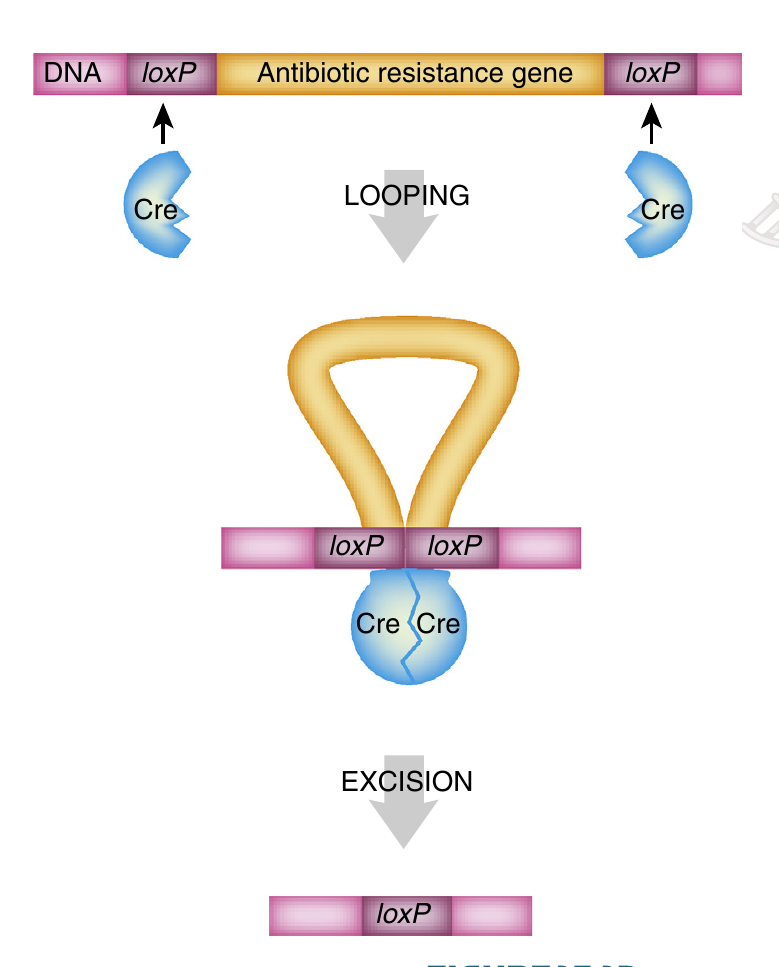

```{r setup, include=FALSE}
library(knitr)
require(tidyverse)
set.seed(453)
# invalidate cache when the package version changes
knitr::opts_chunk$set(tidy = FALSE, echo = FALSE, 
                  message = FALSE, warning = FALSE,
                  out.width = "45%")
options(knitr.table.format = "latex")
options(knitr.kable.NA = "", digits = 2)
options(kableExtra.latex.load_packages = FALSE)
```

# Overview

### History and rationale

\bcolumns

\column{0.5\textwidth}

- Finding desirable genes can be difficult because multiple interacting genes usually control certain beneficial traits. 
- So far, most successful genetic engineering of plants has relied on inserting one or a few genes that supply simple, yet useful, properties.

\column{0.5\textwidth}

```{r genetic-engineering-meme, fig.align='center', out.width="99%"}
# pigs might fly someday
# but pigs can't see upwards towards the sky

```

\ecolumns

### Genetically modified organism

- A task force of the Codex Alimentarius Commission, a U.N. agency responsible for an international code for food standardization, has advanced the following language to standardize the labeling of foods derived from GMOs for purposes of international commerce:

\begin{block}{GMO}
Genetically modified/engineered organism means an organism in which the genetic material has been changed through gene technology in a way that does not occur naturally by multiplication and/or any natural recombination.
\end{block}

# Agrobacterium mediated transformation

### Background

- Plants suffer tumors!
- Commonly due to bacteria ( _Agrobacterium tumefaciens_) containing plasmid DNA (Ti)
- Specific segment of the plasmid DNA is transferred to the host plant
- Modern Ti plasmids are disarmed to suit genetic engineering
- Binary vectors: Agrobacterium vectors with disarmed T-DNA segment in Ti-plasmids (modified)

### Background (Infected and non-infected plants)

\begin{columns}[T,onlytextwidth]
  \column{0.5\textwidth}

```{r agrobacterium-gall1, fig.cap="Crown gall tumors are caused by Agrobacterium tumefaciens", out.width="40%"}
# pdftools::pdf_convert("./../literatures/biotechnology/Biotechnology 2nd ed - David P. Clark, Nanette J. Pazdernik (AP, 2016).pdf", pages = 467, dpi = 250, format = "png", filenames = "../images/agrobacterium_gall.png")

```

  \column{0.5\textwidth}

```{r agrobacterium-gall2, fig.cap="But plants expressing inhibitors of key proteins for Agrobacterium infection do not develop any tumors (B)\\newline Crown gall disease in walnut (Juglans regia L.)", out.width="40%"}
# pdftools::pdf_convert("./../literatures/biotechnology/Biotechnology 2nd ed - David P. Clark, Nanette J. Pazdernik (AP, 2016).pdf", pages = 467, dpi = 250, format = "png", filenames = "../images/agrobacterium_gall.png")

```    
    
\end{columns}

### Ti-plasmid structure

```{r ti-plasmid, fig.cap=c("The structure of the Ti plasmid"), out.width="50%"}

knitr::include_graphics("../images/Ti_plasmid.png")
```

### Ti-plasmid structure

- Genes in the virulence region are grouped into the operons virABCDEFG, which code for the enzymes responsible for mediating conjugative transfer of T-DNA to plant cells [@stachel1986genetic].
  - virA codes for a receptor which reacts to the presence of phenolic compounds such as acetosyringone, syringealdehyde or acetovanillone which leak out of damaged plant tissues.
  - virB encodes proteins which produce a pore/pilus-like structure.
  - virC binds the overdrive sequence.
  - virD1 and virD2 produce endonucleases which target the direct repeat borders of the T-DNA segment; virD4 is the coupling protein.
  - virE binds to T-strand protecting it from nuclease attack, and intercalates with lipids to form channels in the plant membranes through which the T-complex passes, beginning with the right border.
  - virG activates vir-gene expression after binding to a consensus sequence, once it has been phosphorylated by virA.

### Infection by Ti-plasmid

- Wounded plant tissues produce special compound called _acetosyringone_
- The plant inducers (Phenolic compounds) activate expression of the virulence genes on the Ti plasmid. This is under control of a two-component regulatory system.
- This initiates the T-DNA transfer machinery
- Plants may employ defense mechanism to prevent the infection and T-DNA transfer

### Infection by Ti-plasmid

::: incremental 

- \alert<1>{Once the vir genes are activated, the T-DNA\only<1>{ on the binary vector} is processed for transport to the target plant cell.}
- _VirA_ transfers the phosphate to the DNA-binding protein, _VirG_, which activates transcription of the vir genes of the Ti plasmid. 
- Two of the gene products ( _VirD1_ and _VirD2_) clip the T-DNA borders to form a single-stranded immature T-complex. 
- _VirD2_ then attaches to the $5^\prime$ end of the T-DNA, and bacterial helicases unwind the T-DNA from the plasmid. 
- The single-stranded gap on the plasmid is repaired, and the T-DNA is coated with _VirE2_ protein to give a hollow cylindrical filament with a coiled structure.

:::

### Infection by Ti-plasmid

- Yet additional vir gene products bind to the T-DNA to act as navigators or signals to direct the mature DNA out of the bacterium, through the plant cytoplasm, and to the nucleus. 
- Through the action of other vir genes, the bacterium produces a pillus, which is the conduit for transfer of the T-strand (the single-stranded, coated, signal containing T-DNA is the "T-strand") from the bacterium to the target plant cell.
- The last role of the signal protein on the T-strand is to find and nick the host DNA as an insertion point for the T-DNA.
- The T-DNA appears to insert primarily into gene-rich and transcriptionally active regions of DNA that are more exposed and accessible.

### Mechanism of T-DNA transfer

- Similar to bacterial conjugation. 
- Agrobacterium forms a pilus (rod-like structure) which opens a channel through which the T-DNA is actively transported into the plant cytoplasm. 
- Both pilus and transport complex consist of proteins that are vir gene products. 
- Once inside the plant cytoplasm, T-DNA is imported into the nucleus. Both VirE2 and VirD2 have nuclear localization signals that are recognized by plant cytosolic proteins. These proteins take the T-complex to the nucleus, where it is actively transported through a nuclear pore. The single T-DNA strand is integrated directly into the plant genome and converted to a double-stranded form. 
- The integration requires DNA ligase, polymerase, and chromatin remodeling proteins, all of which are supplied by the plant.

### Expression of T-DNA genes

- T-DNA genes have eukaryote-like promoters, transcriptional enhancers, and poly(A) sites and therefore are expressed in the plant nucleus rather than in the original bacterium. 
- The proteins they encode synthesize two plant hormones: auxin and cytokinin. The infected plant cells begin to grow rapidly and without control, resulting in a tumor (Figure \ref{fig:agrobacterium-gall1}). 
- T-DNA also carries genes for the synthesis of a variety of different amino acid and sugar phosphate derivatives called opines.
- The Ti plasmid, which is still inside the Agrobacterium, carries genes that allow the bacteria to utilize opines
- Strains of Agrobacterium are differentiated based on the kinds of opines they produce.

### Infection by Ti-plasmid (Interesting remarks)

- The Ti plasmid is lost when Agrobacterium is grown above $28^\circ C$. Such cured bacteria do not induce crown galls, i.e. they become avirulent
- Ti plasmids are classified into different types based on the type of opine produced by their genes. The different opines specified by pTi are octopine, nopaline, succinamopine and leucinopine
- The plasmid has 196 genes that code for 195 proteins
- There is one structural RNA
- The plasmid is 206,479 nucleotides long, the GC content is 56% and 81% of the material is coding genes. 
- There are no pseudogenes.

### Modification of T-DNA

- Genes of interest are cloned between the borders, which are recognition sequences for the T-DNA processing machinery
- After disarmment and stripping off of unnecessary segments, the transferred segment must also have other elements in order for this technique to be successful (Figure \ref{fig:ti-plasmid}).
- Modified T-DNA region must contain a selectable marker, such as an herbicide or antibiotic resistance gene that is used to track whether the foreign DNA has been inserted into plant cells. 
- Expression of the transgene requires a promoter that works efficiently in plant cells.
- Two common promoters are used: Constitutive and inducible

### In vitro Agrobacterium infection 

```{r agrobacterium-infection-culture, fig.cap=c("\\textbf{Transfer of modified Ti plasmid into a plant.} Agrobacterium carrying a Ti plasmid is added to plant tissue growing in culture. The T-DNA carries an antibiotic resistance gene (neomycin in this figure) to allow selection of successfully transformed plant cells. Both callus cultures (A) and liquid cultures (B) may be used in this procedure."), out.width = "35%"}
# pdftools::pdf_convert("./../literatures/biotechnology/Biotechnology 2nd ed - David P. Clark, Nanette J. Pazdernik (AP, 2016).pdf", pages = 469, dpi = 250, format = "png", filenames = "../images/agrobacterium_infection_culture.png")

```

### Agrobacterim mediated transformation in practice

- Agrobacterium is used to transfer genes of interest into plants using tissue culture. 
- Either protoplasts or a piece of callus are cultured with Agrobacterium harboring a Ti plasmid with modified T-DNA. 
- After coculture, the plant cells are harvested and incubated with the herbicide or antibiotic used as the selectable marker (Figure \ref{fig:agrobacterium-infection-culture}). 
- The small transgenic plants can then be screened for transgene expression levels.

### Agrobacterium mediated transformation in practice (Floral dip method)

```{r agrobacterium-infection-intact, fig.cap="\\textbf{Floral dip method of plant transformation} Flower buds exposed to Agrobacterium containing modified T-DNA can result in the production of transgenic seeds. Adapted from Curtis IS (2003). The noble radish: past, present and future. Trends Plant Sci 8, 305–307."}
# pdftools::pdf_convert("./../literatures/biotechnology/Biotechnology 2nd ed - David P. Clark, Nanette J. Pazdernik (AP, 2016).pdf", pages = 469, dpi = 250, format = "png", filenames = "../images/agrobacterium_infection_intact.png")


```

### Agrobacterim mediated transformation in practice (Floral dip method)

- *In planta Agrobacterium transformation* (also called floral dip method; Figure \ref{fig:agrobacterium-infection-intact}) has revolutionized plant transgenics. 
- The method was developed using the model plant Arabidopsis but has been extended to other plants, such as wheat and maize. 
- First, Arabidopsis plants are grown until flower buds begin to form. These buds are removed and allowed to regenerate for a few days. Once they begin to regenerate, the plants are dipped into a suspension of Agrobacterium containing a surfactant, which decreases surface tension and allows the Agrobacterium to adhere to the plant and transfer its T-DNA. Because the flower buds are just beginning to form, the T-DNA becomes part of the germline through the ovarian tissue. The plant is allowed to finish growing and produce seed. 
- Seeds are harvested and grown in selective media to find those that have integrated and expressed T-DNA.

# Particle bombardment transformation

### Background

- A gun blasts microscopic metal particles carrying DNA through the tough plant cell walls (Figure \ref{fig:gene-gun-transfer}). 
- Unlike Ti plasmid transfer by Agrobacterium, this technique works with all types of plants.
- Heavy metal particles (~1 micrometers gold or tungsten) coated with DNA, accelerated toward the target tissue, and penetrate the cell wall to rest either adjacent to or directly in the nucleus.
- Particle bombardment = Mircoprojectile bombardment = Biolistics = Particle acceleration = Gene gun technology

### Gene gune

- Physical method of DNA delivery
- Analogy to bullet firing from a gun
- Developed by John Sanford and colleagues in mid 1980s and optimized by Ted Klein.
- Today, in most laboratories, high-pressure helium is used to generate the force needed to accelerate small gold particles toward the target tissue. 
- DNA is first precipitated onto the particles, which are then placed as a monolayer on a Mylar carrier sheet, called a macrocarrier (term is dubious!)

### Gene gun (apparatus)

```{r gene-gun-transfer, fig.cap="A gene gun that operates via (A) pressurized air or (B) high-voltage discharge is depicted. In both cases, the stop plate halts the projectile, and the microscopic metal particles carrying the DNA penetrate the plant tissue.", out.width="16%"}
# pdftools::pdf_convert("./../literatures/biotechnology/Biotechnology 2nd ed - David P. Clark, Nanette J. Pazdernik (AP, 2016).pdf", pages = 470, dpi = 250, format = "png", filenames = "../images/gene_gun_transfer.png")


```

### Mechanism of bombardment (Pre-requisite)

- DNA is first precipitated onto the particles using either calcium chloride or ethanol, which are commonly used for DNA precipitation. 
- The precipitated DNA must be able to withstand the incredible force of acceleration and cell wall/cytoplasm penetration and also come off the particles after delivery.
- During bombardment, the majority of the metal particles do not find their target.

### Mechanism of bombardment (Process)

- A round piece of leaf tissue or a callus is isolated from the plant, placed on a dish, and put in a vacuum chamber.
- DNA to be inserted (carrying the transgene, proper regulatory elements, and selectable marker) is coated on microscopic gold beads. 
- Beads are placed at the end of chamber. One variant of the method uses a blast of air or helium to drive the filter containing the gold beads toward the stop screen and sample.

### Mechanism of bombardment (Process)

- Between the bullet and plant tissue is a stop plate. Filter and gold beads hit this stop screen, the DNA-coated beads are thrown forward into the plant tissue.
- An alternative method is to accelerate the beads by a strong electrical discharge. The high voltage vaporizes a water droplet, and the resulting shock wave proels a thin metal sheet covered with the particles at a mesh screen. The screen blocks the metal sheet but allows the DNA-coated particles to accelerate through into the plant tissue. 
- Advantage of this latter method is that the strength of the electrical discharge can be controlled; therefore, the amount of penetration into the tissue can be regulated.

### Fate of introduced DNA

- Mechanism of integration of introduced DNA to host DNA is real mess; many modes:
  - Single locus
  - Multiple sites
  - Multiple copies in single site
  - Partial copies with varying orientations
  - Interspersed with plant genomic DNA
- For particle bombardment, it is unclear whether the particles actually physically break the chromosomal DNA or merely deposit DNA in the proximity of the replicating parts of chromosomes.

# Detecting the inserted DNA

### Detection system

- Simplest of all ways is to include a selectable marker or reporter gene on the same segment of DNA as the transgene. 
  - *npt*:  Encodes neomycin phosphotransferase. This enzyme confers neomycin resistance by attaching a phosphate group to the molecule. Transformed cells are directly selected with the antibiotic neomycin, which kills any cells that did not integrate the DNA.
  - *luciferase*: This enzyme emits light when provided with its substrate, luciferin. Key advantage is that the protein is not stable for long time, so the amount of active protein correlates with the level of gene expression at any given time. Therefore, _luc_ can be used to determine the activity of specific promoters.
  
### Marker removal

- Removal of selectable markers (genes), which may even have unfounded concerns in the public is catalyzed by _Cre/lox_ P gene system, which produces Cre ("Causes recombination") protein, that recognized 34 base-pair DNA sequence, the *_loxP_* site. The Cre protein catalyzes recombination between two loxP sites.
- The cre gene can be added to the system by cross-pollination of two different plants: One plant carrying the transgene plus a selectable marker that is flanked by two _lox_ P sites is crossed with another plant carrying the _cre_ gene. First, the _lox_ P pollen from the plant with the _cre_ gene is added to the stigma of the plant with the transgene. The resulting seeds are grown and checked for sensitivity to the selective agent (e.g., neomycin). If the Cre protein is present in the progeny, the selectable marker gene will be excised and lost during growth. This plant now has the transgene and the cre gene, but no longer has the gene for antibiotic resistance.

### Marker removal (procedure)

```{r marker-removal, fig.cap="\\textbf{The Cre/\\textit{lox}P System of Bacteriophage P1}\\newline The Cre protein binds to \\textit{lox}P recognition sites in the DNA. Two nearly \\textit{lox}P sites are brought together, and recombination between them eliminates the intervening DNA. A single \\textit{lox}P 'scar' site remains in the target DNA molecule", out.width="35%"}
# pdftools::pdf_convert("./../literatures/biotechnology/Biotechnology 2nd ed - David P. Clark, Nanette J. Pazdernik (AP, 2016).pdf", pages = 473, dpi = 250, format = "png", filenames = "./images/marker_removal.png")


```

# Applications

### Engineered crops I

- In general, to increase yield or to confer resistance to drought or pests
- Corn lines have been modified to express
  - tolerance to either the herbicide glyphosate (RoundUp(R)) (single gene), or to the herbicide glufosinate-ammonium (Liberty(R)); 
  - resistance to the pest, european corn borer (Ostrinia nubilalis) ECB; 
  - or a combination of herbicide tolerance to either glyphosate or glufosinate-ammonium and ECB resistance.
- Rice have been engineered with two gene pathway to enhance drought tolerance

### Engineered crops II

\bcolumns
\column{0.6\textwidth}
\footnotesize

- Soybean lines have been modified to express
  \begin{itemize}
  \footnotesize
  \item tolerance to either glyphosate, or to (Liberty), 
  \item modified oil (high oleic acid) content.
  \end{itemize}
- Cotton lines have been modified to express
  \begin{itemize}
  \footnotesize
  \item herbicide tolerance to either glyphosate, bromoxynil or sulfonylurea, 
  \item insect resistance to the pest, pink bollworm (\textit{Pectinophora gossypiella}) PBW and tobacco budworm (\textit{Heliothis virescens}) TBW. 
  \item bromoxynil tolerance and PBW resistance. 
  \end{itemize}

\column{0.4\textwidth}

```{r golden-rice, fig.align='center', out.width="80%"}
knitr::include_graphics("../images/golden_rice.jpg")
```

\ecolumns

### Engineered crops III

\bcolumns
\columns{0.6\textwidth}
\footnotesize
- Tomato lines have been modified to
  \begin{itemize}
  \footnotesize
  \item delay fruit ripening
  \item express resistance to the pests tomato pinworm, (\textit{Kieferia lycopersicella}) TPW and tomato fruitworm (\textit{Helicoverpa zea}) TFW 
  \item express a lower polygalacturonase level which makes for a more meaty tomato for processing. 
  \end{itemize}
- Modified potato lines are
  \begin{itemize}
  \footnotesize
  \item resistant to the Colorado Potato Beetle (\textit{Leptinotarsa decemlineata}) CPB , 
  \item expresses resistance to the potato virus Y (PVY) in addition to being resistant to the CPB.
  \end{itemize}

\columns{0.4\textwidth}

```{r antioxidants-enriched-tomato, fig.align='center', out.width="80%"}
knitr::include_graphics("../images/purple_tomato_enriched_antioxidants.jpg")
```

\ecolumns

### Genetically modified crop approvals and plant acerages
    
### Molecular information and approval status of selected events

### Transgenic technique for weed control: Glyphosate tolerance in plants

Glyphosate is environmentally friendly because it quickly breaks down to nontoxic compounds in the soil. The glyphosate molecule is a phosphate derivative of the amino acid glycine. Glyphosate kills plants by blocking the synthetic pathway for the aromatic amino acids phenylalanine, tyrosine, and tryptophan by inhibiting one particular enzyme, EPSPS (5-enolpyruvoylshikimate-3-phosphate synthase), which is the product of the aroA gene and localized to the chloroplast. This target enzyme is found naturally in all plants, fungi, and bacteria, but not in animals. Aromatic amino acids are therefore essential to the diets of all animals, including humans, because those organisms cannot produce them. When glyphosate is sprayed onto plants, the herbicide penetrates the chloroplasts and binds to EPSPS, blocking the pathway for aromatic amino acids. The plant essentially starves to death.

### Transgenic technique for weed control: Glyphosate tolerance in plants

```{r glyphosate-tolerance, fig.cap="EPSPS pathway in plants", out.width="50%"}
# pdftools::pdf_convert("./../../literatures/biotechnology/Biotechnology 2nd ed - David P. Clark, Nanette J. Pazdernik (AP, 2016).pdf", pages = 478, dpi = 250, format = "png", filenames = "../images/epsps_pathway_plants.png")

```    

### Transgenic technique for protection against insect: Bt-toxin technology

```{r bt-toxin-mechanism, fig.cap="\\textbf{Insect Larvae Are Killed by Bt Toxin}Bacterial spores of Bacillus are found on food eaten by caterpillars. The crystalline protein is released by digestion of the spore, and its breakdown produces a toxin that kills the insect larvae.", out.width="60%"}
# pdftools::pdf_convert("./../../literatures/biotechnology/Biotechnology 2nd ed - David P. Clark, Nanette J. Pazdernik (AP, 2016).pdf", pages = 479, dpi = 250, format = "png", filenames = "../images/bt_toxin_mechanism.png")

```

### Transgenic technique for protection against insect: Insect avoidance technique

```{r aphid-avoidance, fig.cap="Aphids feed on sap, but plants expressing (E) -$\\beta$ farnesene can scare them away. Photo courtesy of Shipher Wu and Geeway Lin, National Taiwan University.", out.width="40%"}
# pdftools::pdf_convert("./../../literatures/biotechnology/Biotechnology 2nd ed - David P. Clark, Nanette J. Pazdernik (AP, 2016).pdf", pages = 480, dpi = 250, format = "png", filenames = "../images/aphid_avoidance.png")

```

### Transgenic Ornamental Crops

- Refer to Page 125, Plant Breeding Reviews, Volume 28.

# Bibliography

### Further study

Also see: @rajasekaran2002crop, @clark2016biotechnology

### References
