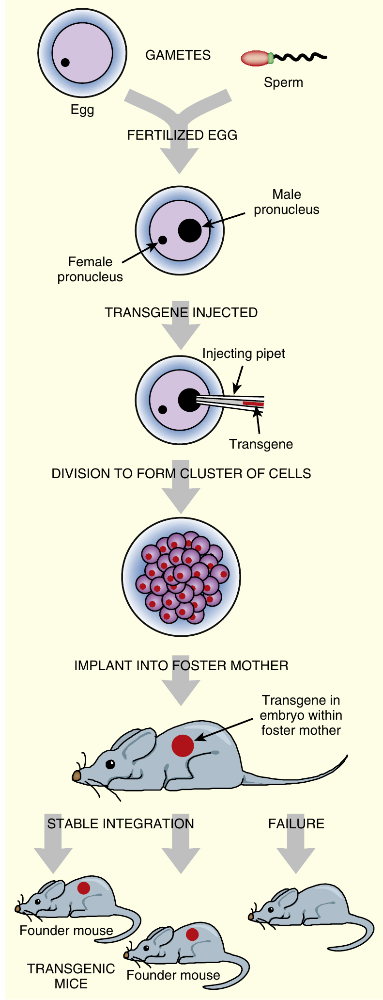
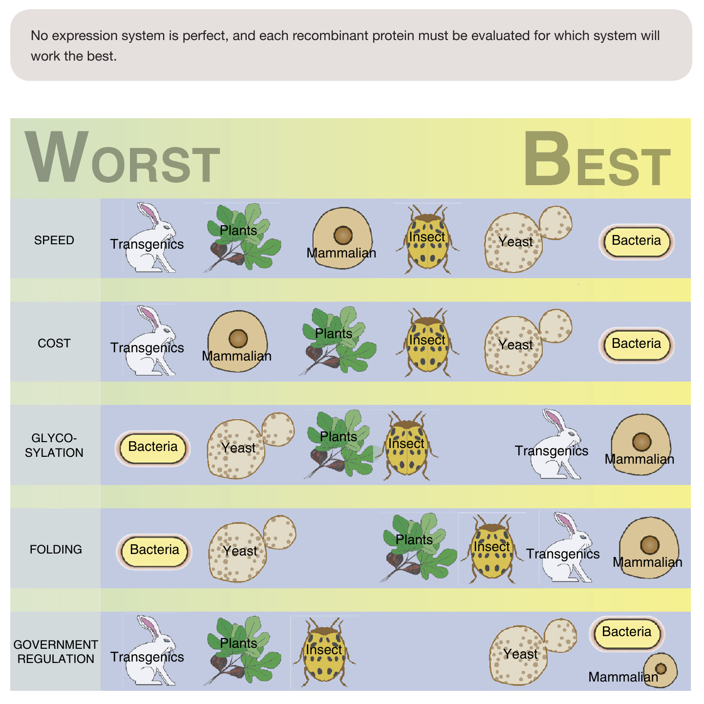
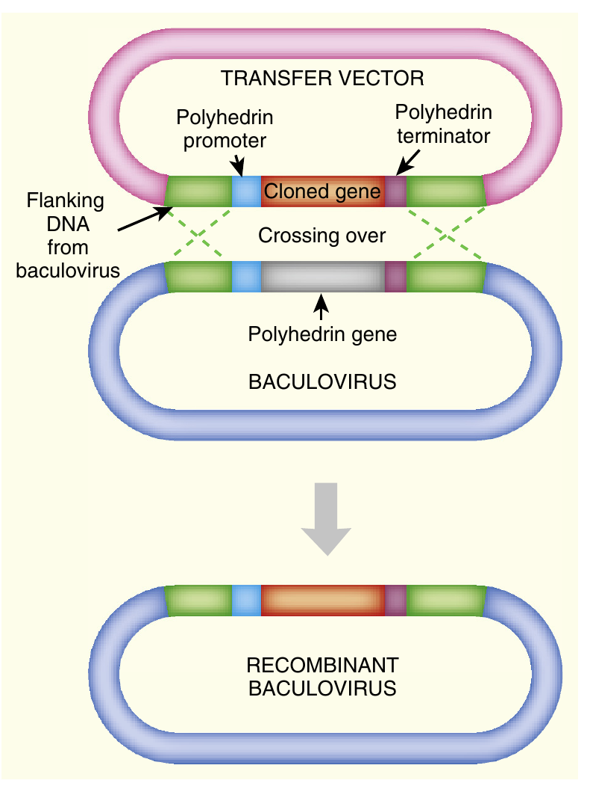
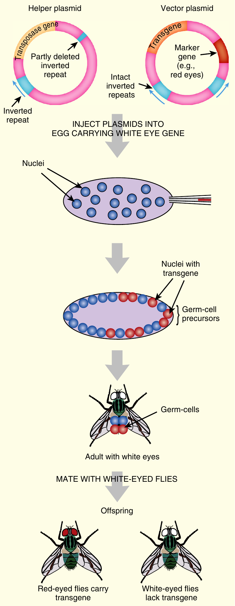

```{r setup, include=FALSE}
library(knitr)
require(tidyverse)
set.seed(453)
# invalidate cache when the package version changes
knitr::opts_chunk$set(tidy = FALSE, echo = FALSE, 
                  message = FALSE, warning = FALSE,
                  out.width = "45%")
options(knitr.table.format = "latex")
options(knitr.kable.NA = "", digits = 2)
options(kableExtra.latex.load_packages = FALSE)
```

# Transgenic animals

### Background

- Woollier sheep and smarter sheep dogs have both been improved through many generations of selective breeding
- Obviously, the more we know about genetics, the faster and more effectively we can improve our crops and livestock
- Most early experiments in animal transgenics were done with mice
- Now engineered animals: 
  - Sheep, goats, cats, dogs and monkeys
- Transgene may be derived from same or from distantly related animals, or even from unrelated organisms.

### Creating transgenic animals: Nuclear microinjection

```{r transgenic-animals, fig.cap="\\textbf{Creation of Transgenic Animals by Nuclear Injection}\\newline In vitro fertilization is used to start a transgenic animal. Harvested eggs and sperm are fertilized, and before the pronuclei fuse, the transgene is injected into the male pronucleus. The embryo continues to divide in culture and is then implanted into a mouse. The “foster mother” mouse has been treated with hormones so that she accepts the embryo and carries on with the pregnancy. The offspring are screened for stable integration of the transgene. Founder mice have one copy of the transgene.", out.width="16%"}
# pdftools::pdf_convert("./../../literatures/biotechnology/Biotechnology 2nd ed - David P. Clark, Nanette J. Pazdernik (AP, 2016).pdf", pages = 495, dpi = 250, format = "png", filenames = "../images/transgenic_mice.png")

```

### Creating transgenic animals: Nuclear microinjection

- Transgene is injected into fertilized egg cells
- Soon after fertilization, individual nuclei from both sexes are separate as pronuclei.
- Before pronuclei fuse together, DNA is injected into male pronucleus.
- Success rate: 5% - 40%
- After culturing for few days _in-vitro_, embryo is then implanted into womb of a female animal -- the **foster mother**.
- Those that received the transgene and maintain it stably are called founder animals.
- Sometimes, chimera may be formed.
- Integration of the incoming DNA into the host cell chromosomes occurs at random at the sites of spontaneous chromosomal breaks.

### Comparison of recombinant protein expression systems

```{r system-comparision, fig.cap="Each protein expression system falls on a continuum of worst to best for characteristics such as speed, cost, glycosylation, folding, and government regulations. The other symbols include cultured mammalian cells, insect cells, yeast, and bacteria.", out.width="40%"}
# pdftools::pdf_convert("./../../literatures/biotechnology/Biotechnology 2nd ed - David P. Clark, Nanette J. Pazdernik (AP, 2016).pdf", pages = 362, dpi = 250, format = "png", filenames = "../images/system_comparison.png")

```

### Comparison of recombinant protein expression systesm: Insects

```{r baculovirus-insect, fig.cap="\\textbf{Baculovirus Expression Vector} \\newline To express a gene in insect cells, the gene must be inserted into a baculovirus genome. First, the gene of interest is cloned into a transfer vector containing the baculovirus polyhedrin gene promoter followed by a multiple cloning site and the polyhedrin terminator. This is done in E. coli. The construct is transfected into insect cells along with the normal baculovirus genome. A double crossover between the polyhedrin promoter and terminator replaces the polyhedrin gene with the gene of interest.", out.width="30%"}
# pdftools::pdf_convert("./../../literatures/biotechnology/Biotechnology 2nd ed - David P. Clark, Nanette J. Pazdernik (AP, 2016).pdf", pages = 358, dpi = 250, format = "png", filenames = "../images/baculovirus_expression_vector.png")

```    

### Comparison of recombinant protein expression systesm: Insects

- One of most often used is multiple nuclear polyhedrosis virus (MNPV). 
- It infects many insects and replicates well in many cultured insect cell lines. A popular cell line used to propagate this baculovirus is from the fall armyworm ( _Spodoptera frugiperda_).

### Control of expression

- Transgenes may be artificially regulated by a variety of control systems. 
- Engineered versions of the bacterial lac and tet regulators are widely used.
- Transgene expression may be controlled by site-specific recombination. Either the Cre or Flp recombinase can rearrange segments of transgenic DNA to turn transgenes on or off. 
- A similar approach uses bacterial recombinases, such as the $\Phi$ C31 integrase.

### Applications

Marathon Mouse can run about 1800 meters -- more than a mile -- before exhaustion. This is twice as far as a normal mouse can last. Marathon mouse has enhanced PPAR-delta-a regulator of several genes involved in burning fat and in muscle development.

Mighty Mouse was engineered to lack myostatin, a protein that slows muscle growth. The result is colossal muscle development. There is one known case of a human with a genetic defect leading to lack of myostatin. A German boy, born in Berlin in 2000, has muscles twice the size of other children his age.

### Applications

```{r insect-transgenics, fig.cap="\\textbf{Element engineering in Drosophila} \\newline Two different plasmids are used to insert transgenes into Drosophila. The helper supplies the transposase. It carries an immobile P element with one of the inverted repeats deleted but with functional transposase. The second plasmid has the transgene plus marker (a gene for red eyes) flanked by the P element inverted repeats. Both vectors are injected into the posterior end of an egg, which has 2000 to 4000 nuclei within one membrane. The transposase is expressed, which results in random transposition of the transgene (plus marker) into various chromosomes in different nuclei. Hopefully, some insertions occur in germ cell nuclei. The egg is then allowed to form an adult (with white eyes in this case). This fly is then mated to another white-eyed adult. If insertion into the germline was successful, some offspring will express the marker gene and have red eyes.", out.width="16%"}
# pdftools::pdf_convert("./../../literatures/biotechnology/Biotechnology 2nd ed - David P. Clark, Nanette J. Pazdernik (AP, 2016).pdf", pages = 508, dpi = 250, format = "png", filenames = "../images/transgenic_insects.png")

```

### Applications: other

- Transgenic animals help fight diseases (Lysozyme fortified livestock milk to prevent diarrhoeal disease)
- Genetically modified mosquitoes
- Growth promoter genes in Atlantic salmon