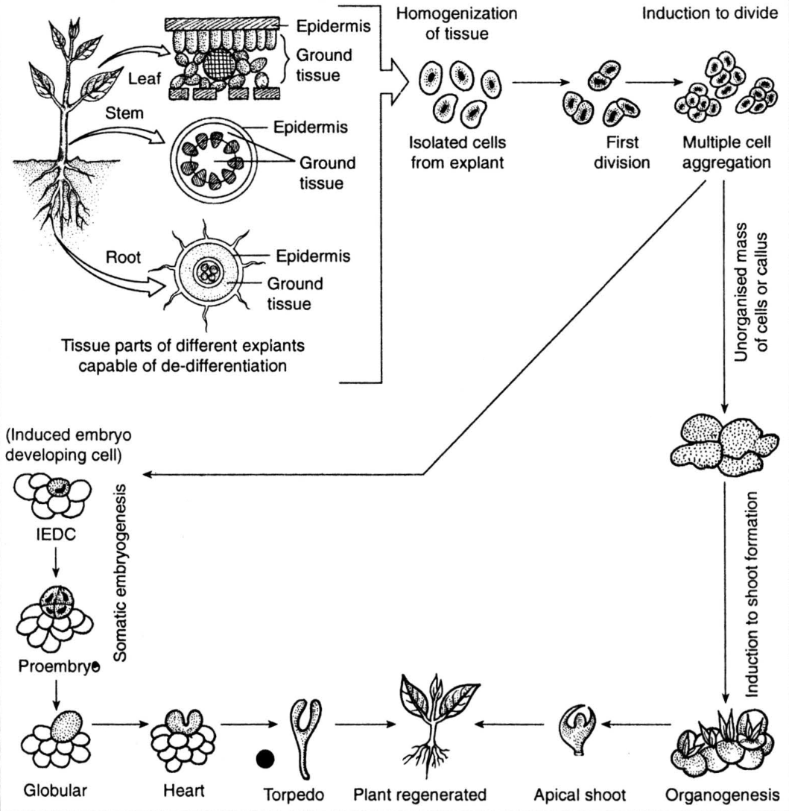
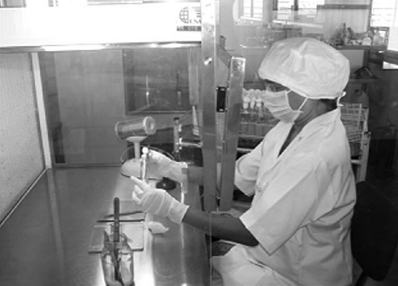
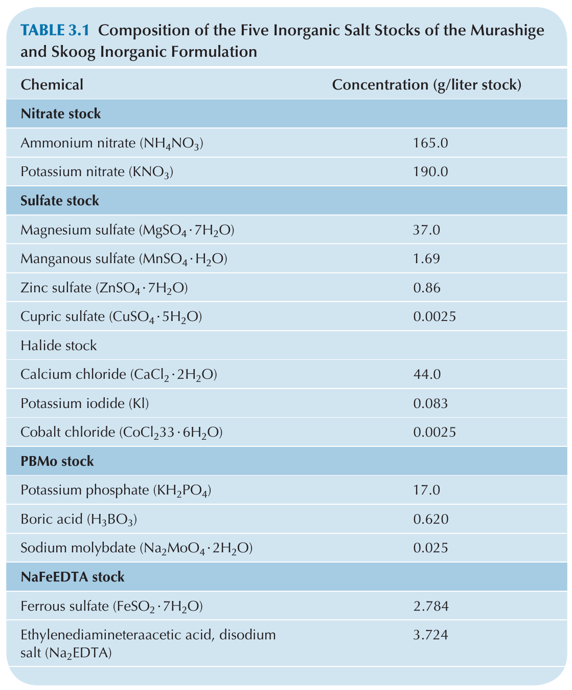
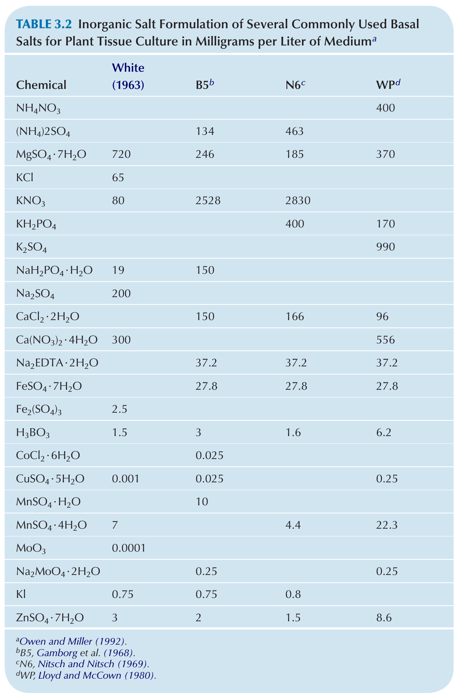
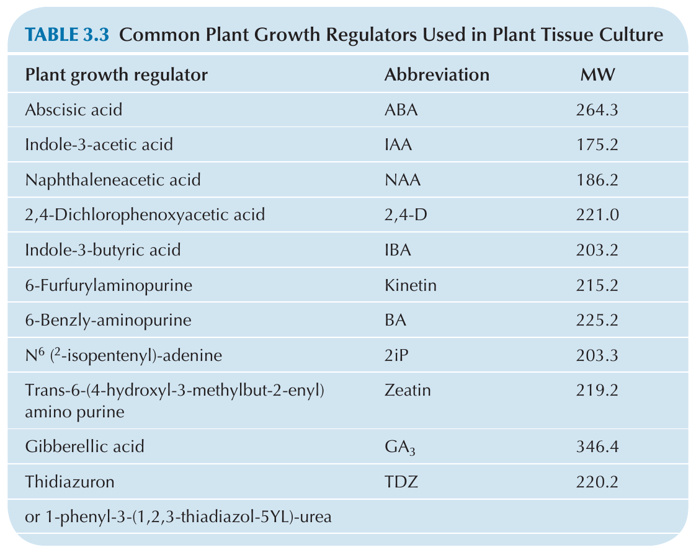
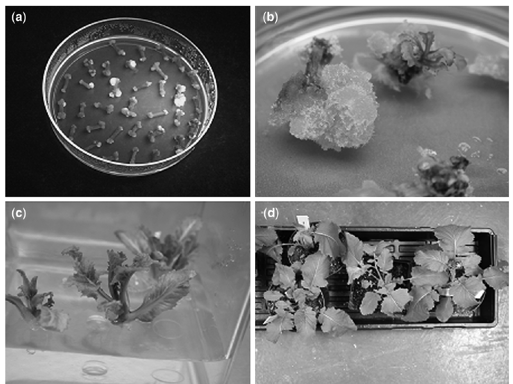
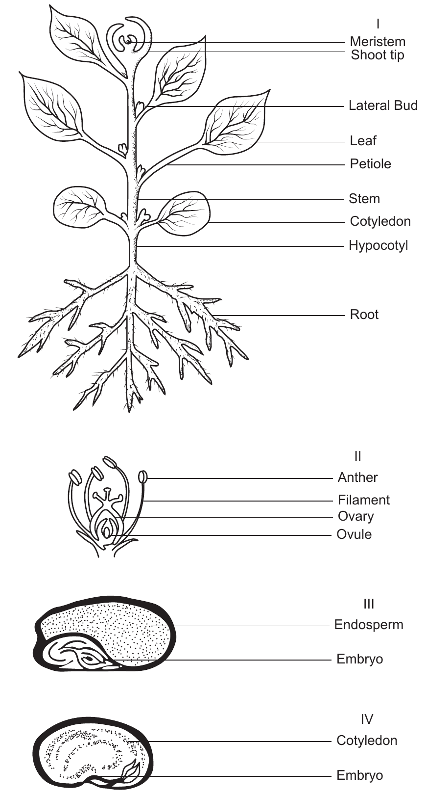
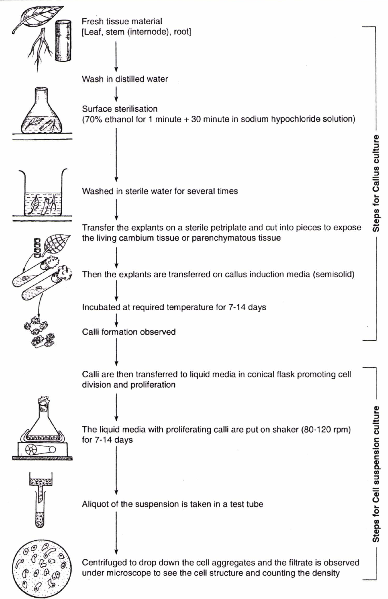
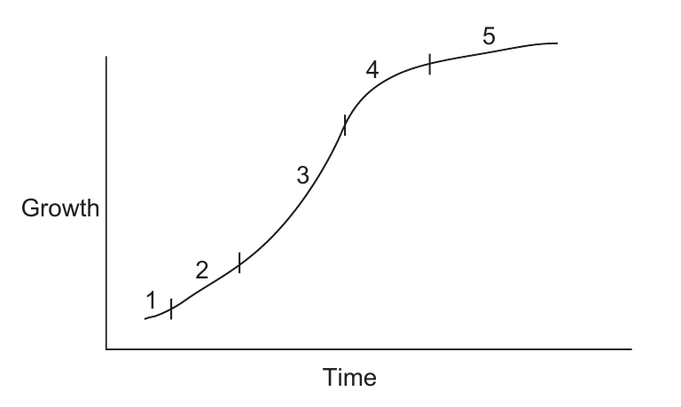
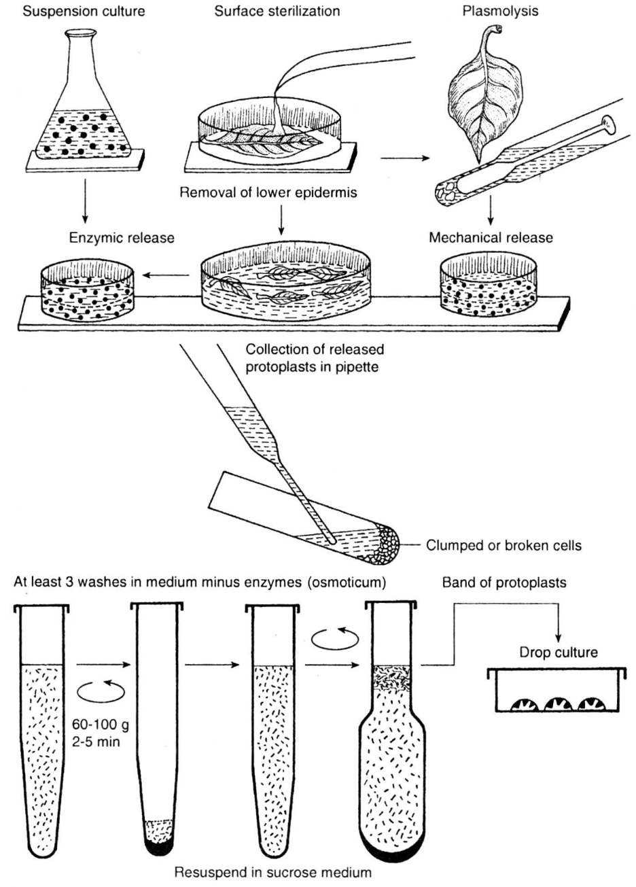

```{r setup, include=FALSE}
library(knitr)
require(tidyverse)
set.seed(453)
# invalidate cache when the package version changes
knitr::opts_chunk$set(tidy = FALSE, echo = FALSE, 
                  message = FALSE, warning = FALSE,
                  out.width = "45%")
options(knitr.table.format = "latex")
options(knitr.kable.NA = "", digits = 2)
options(kableExtra.latex.load_packages = FALSE)
```

# Overview

###

- In vitro; a-xenic = sterile culture
- Plant tissue culture is generally used for the aseptic culture of cells, tissues, organs, and their components under defined physical and chemical conditions _in vitro_.
- "Tissue culture" is commonly used as a collective term to describe all kinds of in vitro plant culture although strictly it should refer only to cultures of unorganized aggregates of cells.
- First approach made by Henri-Louis Duhumel du Monceau in 1756 (observed callus formation in plants)
- Development of cell theory by Schleiden and Schwann during 1830s
- Theoretical basis for plant tissue culture was proposed by Gottlieb Haberlandt in his address to the German Academy of Science in 1902 on his experiments on the culture of single cells.
<!-- His original idea presented in 1902 was called totipotentiality: “Theoretically all plant cells are able to give rise to a complete plant.” -->

<!-- It can be exhibited by some differentiated cells, e.g. cambial cells and leaf palisade cells but not those which have developed into terminally differentiated structures (e.g. sieve tubes or tracheids). -->

<!-- Note that in animals, growth and differentiation is irreversible. -->

### History

- The first true plant tissue cultures were obtained by Gautheret (1934, 1935) from cambial tissue of _Acer pseudoplatanus_ (large deciduous, temperate Maple tree).
- The first plant growth hormone indoleacetic acid (IAA) was discovered in the mid-1930s by F. Kogl and his coworkers. 
- In 1934 Professor Philip White successfully cultured tomato roots. 
- In 1939 Gautheret successfully cultured carrot tissue. 
- Later in 1955 Carlos Miller and Folke Skoog published their discovery of the hormone kinetin, a cytokinin. 
- In 1962, Toshio Murashige and Skoog published the composition a plant tissue culture medium known as MS (named for the first letters of their last names) medium. 
- Murashige was a doctoral student in Professor Skoog’s lab, and they developed the now-famous MS medium working with tobacco tissue cultures.

### Some terminologies

<!-- The non-dividing differentiated quiescent cells of the explant, when grown on a medium, first undergo changes to achieve the meristematic state. The phenomenon of mature cells reverting to a meristematic state and forming undifferentiated callus tissue is termed as differentiation. -->

- Dedifferentiation: The phenomenon of mature cells reverting to a meristematic state and forming undifferentiated callus tissues.
- Redifferentiation: The ability of the component cells of the callus to differentiate into a whole plant or a plant organ is termed as redifferentiation.
- Cellular totipotency: These two phenomena of dedifferentiation and redifferentiation are inherent in the capacity of a plant cell, and thus giving rise to a whole plant in known as cellular totipotency.

### Regeneration and morphogenesis

\bcolumns
\column{0.3\textwidth}
\small
- Organogenesis
  - Direct organogenesis: Without callus phase
  - Indirect organogenesis: Via a callus phase
- Somatic embryogenesis\footnote[frame]{Refer to the Chapter on "Genetic control of Embryogenesis in Rice", Rice Breeding in the Genomics Era (Volume 62), Biotechnology in Agriculture and Forestry, for a more formal discussion on general mechanism of embryogenesis.}

\column{0.7\textwidth}

```{r culture-embryo-organ, fig.cap="Cellular totipotency as used in Tissue culture.", out.width="70%"}

```

\ecolumns

### Basic steps

- Select the source of explant
- Trimming
- Several washes in running water
- Surface sterilization
- Basic sterilization
- Preparation of culture media 
- Culture in a good environmental condition
- Sub culture, if necessary
- Plant regeneration, hardening and transfer to soil

# Tissue culture laboratory setup

### Media preparations/culture evaluation

\begin{columns}[T,onlytextwidth]
  \column{0.5\textwidth}
  \begin{itemize}

  \item Bench
  \item Gas outlet
  \item Hot plate and magnetic stirrer
  \item Analytical and top-loading balances
  \item pH meter
  \item Refrigerator, freezer
  \item Water purification and storage system
  \item Dish-washing area
  \end{itemize}

  \column{0.5\textwidth}
  
  \begin{itemize}

  \item Storage facilities-glassware, chemicals
  \item Autoclave (pressure-cooker will work for small media volume)
  \item Low bench with inverted light and dissecting microscopes (avoid locating next autoclaves or other high-humidity areas)
  \item Fume hood
  \item Desk and file cabinets
  \item Desktop centrifuge, spectrophotometer, microwave (transformation studies and protoplast isolation)

  \end{itemize}

\end{columns}

### Aseptic transfer area

1. Laminar air flow transfer hood and comfortable chair
2. Dissecting microscope
3. Gas outlet
4. Vacuum lines
5. Forceps, spatulas, scalpel, and disposable blades

###

```{r aseptic-transfer, fig.cap="Working in the laminar flow hood", out.width="40%"}
# pdftools::pdf_convert("./../../literatures/biotechnology/Plant Biotechnology and Genetics, 2008, p.402.pdf", pages = 137, dpi = 250, format = "png", filenames = "../images/laminar_flow_hood.png")

```

### Environmentally Controlled Culture Area

1. Shelves with lighting on a timer and controlled temperature
2. Incubators—with controlled temperature and light
3. Orbital shakers

### Conditions

- High humidity in culture room should be avoided.
- Most cultures can be incubated at $25-27~^\circ C$ under a 16:8-h light:dark photoperiod controlled by clock timers.
- Light conditions can be manipulated by mounted fluorescent lamps with light readings (by quantum radiometer-photometer) of 40-200 foot candles (full sun is approximately 10000 foot candles).

# Basal media components and preparation

- No single medium will support the growth of all cells.
- Literature serves best to the purpose, else suitable medium is based on trial and error.
- Medium contains in general, inorganic salts, and organic compounds like plant growth regulators, vitaims, a carbohydrate, hexitols, and a gelling agent.
- Iron stably provided in chelated form with EDTA.
- Medium can also include amino acids, antibiotics, or natural complexes.
- Sometimes cultures are grown in the dark and do not photosynthesize at all.
- Most media are adjusted to a pH of 5.2-5.8.
- Solidification is done using agar derived from seaweed or agar substitutes such as $Gelrite^{TM}$ or $Phytagel^{TM}$.
- WPM medium is suitable for culturing trees.

### Inorganic salts

- The Murashige and Skoog (MS) (1962) formulation is the most widely used formulation.
- The MS formulation was developed to insure that no increases in cell growth in vitro were due to the introduction of additional salts from plant tissue extracts which were being tested at that time. 
- The MS formulation insured that the inorganic nutrients were not limiting to tobacco cell growth and organic supplements such as yeast extract, coconut milk, casein hydrolysate, and plant extracts were no longer essential sources of the inorganic salts.

### 

- The distinguishing feature of the MS inorganic salts is their high content of nitrate, potassium, and ammonium in comparison to other salt formulations.
- These salt stocks
are prepared at 100 times the final medium concentration, and each stock is
added at the rate of 10 ml per 1000 ml of medium prepared. The NaFeEDTA
stock should be protected from light by storing it in a bottle that is amber
colored or wrapped in aluminum foil. Concentrated salt stocks enhance the
accuracy and speed of media preparation.
- Salt stocks are best stored in refrigerator and are stable for several months.

### 

```{r inorganic-salts, fig.cap="Composition of the five inorganic salt stocks of the Murashige and Skoog Inorganic formulation", out.width="38%"}
# pdftools::pdf_convert("./../../literatures/tissue_culture/Plant Tissue Culture_Techniques and Experiments.pdf", pages = 38, dpi = 250, format = "png", filenames = "../images/inorganic_salt_ms.png")

```

### 

```{r is-formulation, fig.cap="Inorganic Salt Formulation of Several Commonly Used Basal Salts for Plant Tissue Culture in Milligrams per Liter of Medium", out.width="35%"}
# pdftools::pdf_convert("./../../literatures/tissue_culture/Plant Tissue Culture_Techniques and Experiments.pdf", pages = 39, dpi = 250, format = "png", filenames = "../images/is_formulation_mediums.png")

```

### Growth regulators

```{r pgr, fig.cap="Common plant growth regulators used in plant tissue culture", out.width="40%"}
# pdftools::pdf_convert("./../../literatures/tissue_culture/Plant Tissue Culture_Techniques and Experiments.pdf", pages = 40, dpi = 250, format = "png", filenames = "../images/pgr_tissue_culture.png")

```

### PGRs

- Type and concentration will vary according to the cell culture purpose. List is provided in Figure \ref{fig:pgr}.
- Auxin (IAA, NAA, 2,4-D or IBA) is required by most plant cells for division and root initiation.
- 2,4-D is widely used for callus induction.
- IAA, IBA and NAA are used for root induction.
- Auxins can be dissolved either in alkali or in ethanol (latter is toxic to plants).
- IAA stocks have a working duration of 1 weeks when kept away from light, they are thermostable, however.

### 

- Cytokinins (kinetin, BA, zeatin and 2iP) promote cell division, shoot proliferation, and shoot morphogenesis.
- Cytokinins are prepared in a fashion alike Auxins, except that 1 N HCL and a few drops of water are used to dissolve the crystals.
- They can be stored for longer terms in the refrigerator and are thermostable.
- Normally, gibberellin is infrequently used in plant cell culture due to callus growth and auxin induced adventitious root inhibition.

### 

- Since stocks are highly susceptible to isomeric conversions, it should be made up fresh before addition to the medium by filter sterilization.
- Abscisic acid (ABA), a plant hormone involved in leaf and fruit abscission and dormancy, is useful in embryo culture. Its stock solutions can be prepared in water. It is heat stable but light sensitive (conversion of cis to trans form in presence of light results in lesser biological activity).
- Addition of ethylene biosynthetic inhibitors such as silver nitrate is beneficial.

### 

```{r stages-of-tc, fig.cap="\\textit{Brassica juncea} plants produced from hypocotyl explants. Shoots are produced when a combination of auxin and cytokinin is used.\\newline (a) Callus from hypocotyl explants (note the green fluorescent protein fluorescent sectors on some of the calli); (b) shoots from callus; (c) shoots elongating; (d) whole plantlets transferred to soil.", out.width="45%"}
# pdftools::pdf_convert("./../../literatures/biotechnology/Plant Biotechnology and Genetics, 2008, p.402.pdf", pages = 136, dpi = 250, format = "png", filenames = "../images/stages_of_tc.png")

```

### Vitamins

- Catalytic functions in enzyme reactions.
- Thiamine (B1), Nicotinic acid (B3) and Pyridoxine (B6) are added to cell culture media.
- Stocks best stored in freezer.
- 10-ml aliquots used per liter of medium prepared.
- Vitamin stocks used in these exercises contain 5 mg of nicotinic acid and 5 mg pyridoxine-hydrochloride per 100 ml of water. 
- The thiamine stock has 40 mg thiamine-hydrochloride in 1000 ml.

### 

- **Common formulations**:

  - White (White 1963); in milligram-per-liter: 0.5 nicotinic acid, 0.1 pyridoxine-hydrochloride, and 0.1 thiamine-hydrochloride; 
  - B5 Gamborg (Gamborg et al., 1976) with in milligram-per-liter medium: 100 inositol, 1.0 nicotinic acid, 1.0 pyridoxine-hydrochloride, and 10.0 thiamine-hydrochloride;
  - Murashige and Skoog (1962) with in milligram-per-liter medium: 100 inositol, 0.5 nicotinic acid, 0.5 pyridoxine-hydrochloride, and 0.1 thiamine-hydrochloride.

### Carbohydrates

- Green cells require carbohydrate source (as sucrose, glucose, fructose or even starch at 2-5% (w/v)) until they are photosynthetically active.
- Embryo and anther culture require higher levels of carbohydrates than that by protoplast culture.
- Sugars undergo caramelization if autoclaved too long.

### Gelling agent

- Provide stationary support
- Can include filter paper, cotton, cheesecloth, vermiculite, special membrane rafts with a liquid medium.
- Must include \alert{purified} agar.
- Gelrite is transparent in appearance and is a polysaccharide produced from fermentation from _Pseudomonas_ sps.
- Gelling should be done slowly in motion, while heating (in flask).
- Medium is then dispensed in measured amounts in the culture container.
- The agar can also be melted in the autoclave in a foil-capped Erlenmeyer flask for 15 min at $121^\circ C$, 15 psi.

### Amino acids

- Important in morphogenesis.
- L-forms are natural forms, which is also the only detectable form.
- L-tyrosine can contribute to shoot initiation, L-arginine can facilitate rooting, L-serine can be used in microspore cultures to obtain haploid embryos.
- Casein hydrolysate, an enzymatic digest of milk protein (caution: do not use the acid digest of milk proteins), was a common ingredient in many early media formulations as it provided a mixture of amino acids to enhance tissue response.

### Antibiotics

- Incorporation of bactericides and fungicides is to overcome contamination.
- Generally not desired because they can be toxic to explants.
- Transformaiton experiments using agrobacterium make it necessary to incorporate antibiotics (e.g. Timentin, carbenicillin (500 mg/liter), cefotaxime (300 $\mu$g/ml)).
- Should be added to medium after autoclaving.

### Natural complexes

- Antioxidants, absorbents (charcoal), coconut endosperm, yeast extract, malt extract, tomato juice, etc.
- Activated charcoal may be growth promoting (promotes morphogenesis and absorbs inhibitory compounds)

### Media pH

- Agar will not gel properly above 6.0 (too firm gel).
- pH naturally drops by 0.6-1.3 units after autoclaving and after cetain period of culturing.
- Medium pH is adjusted with 1.0 or 0.1 N HCL or NaOH by using a medicine dropper

# Explant preparation

### 

**Explant age**

- Younger tissue is more responsive _in vitro_.
- Older tissues might not form callus.

**Season**

- Spring season is appropriate time for good response in culture.
- Tissues that have met dormancy requirements are useful.
- Artificial chilling might also help enable break dormancy.
- Contamination is associated with summer season.

###

**Explant size**

- Smaller the explant, the harder it is to culture.
- Internal differences in hormone balance in the tissue can result in varying
in vitro responses.

**Plant Quality**

- Healthy, unstressed, virus free.

### Goal

- If clonal propagation is the goal, then the explant will usually be a lateral or terminal bud or shoot. 
- For callus induction, pieces of the cotyledon, hypocotyl, stem, leaf, or embryo are usually used. 
- Excellent explants for callus induction are seedling tissues from aseptically germinated seeds or imma ture inflorescences. 
- Leaf tissue from the aseptically germinated seed is a good source of tissue for protoplast isolation. 
- To produce haploid plants or callus, the anther or pollen is cultured.

### Explant source

```{r explant-source, fig.cap="Schematic drawings (from top to bottom) of a plant, a flower, and monocotyledenous and dicotyldenous seeds indicate potential explant tissues.", out.width="20%"}
# pdftools::pdf_convert("./../../literatures/tissue_culture/Plant Tissue Culture_Techniques and Experiments.pdf", pages = 51, dpi = 250, format = "png", filenames = "../images/explant_sources.png")

```

### Other factors

- Genotype: The ability to form regenerable callus in sorghum is heritable, and acted as a dominant trait (Ma et  al., 1987). Also, rice regeneration is under control of both nuclear and cytoplasmic genes.
- Aseptic technique
- Asceptic germination of seeds
- Contamination

# Technology

### Organ culture (not strictly tissue culture)

- Root: excised radical tip.
- Leaf: Immature young leaf of shoot apex.
- Shoot tip: 0.1-1.0 mm terminal portion of shoot.
- Meristem : < 0.1 mm.
- Flower: excised floral bud.
- Ovary : isolated ovary.
- Ovule culture
- Embryo culture

### Callus induction

- Explants may be an aseptically germinated seedling or surface-sterilized roots, stems, leaves, or reproductive structures. 
- _Callus_ is a wound tissue produced in response to injury. It is a proliferation of cells from the wounded or cut region of an explant. Callus is generally made up of friable, large, vacuolated parenchymatous cells that are unorganized.
- Callus can be hard and compact, and can contain regions of small meristematic cell clusters.
- Generally meristematic cells (undifferentiated), are competent to regenerate via somatic embryo or organ initiation.
- Culture media (level of growth regulators) and conditions (temperature, light, solid vs. agar media) are important for callus formation and development.

###

\bcolumns
\columns{0.5\textwidth}
\footnotesize

\textbf{Callus (or tissue) culture}

The growth and maintenance of largely unorganized cell masses, which arise from the uncoordinated and disorganized growth of small plant organs, pieces of plant tissues, or previously cultured cells.

\textbf{Suspension (or cell) culture}

Populations of plant cells and small cell lumps, dispersed in an agitated, that is aerated, liquid medium.

\columns{0.5\textwidth}

```{r callus-cell-suspension-culture, fig.cap="A typical scheme for callus culture and cell suspension culture.", out.width="75%"}
# pdftools::pdf_convert("E:/000readables/plbgen/2020_Plant Breeding, Biometry and Biotechnology.pdf", format = "png", pages = 262, filenames = "newfie.png", dpi = 260)

```

\ecolumns

### Callus growth progression

```{r growth-curves, fig.cap="The rate of growth of callus tissue usually has five stages: (1) a lag phase in which cells prepare to divide; (2) a period of exponential growth in which cell division is maximal; (3) a period of linear growth in which division slows down and cells enlarge; (4) a period of decelerating growth; and (5) a stationary or no-growth period in which the number of cells is constant.", out.width="60%"}
# pdftools::pdf_convert("./../../literatures/tissue_culture/Plant Tissue Culture_Techniques and Experiments.pdf", pages = 75, dpi = 250, format = "png", filenames = "../images/growth_curve.png")

```


### Haploid plants from anther/microspore culture

- Culture of anthers or isolated micropsores to produce haploid plants is known as anther culture or microspore culture.
- Embryos can be produced via a callus phase or be a direct recapitulation of the developmental stages characteristic of zygotic embryos.
- late uninucleate to early binucleate microspores are the best explants for embryogenesis.
- Somatic embryos develop into haploid plants.
- Chromosome doubling can be further used to produce doubled haploids (homozygous).
- In addition, haploid embryos are used in mutant isolation, gene transfer, studies of storage product biochemistry, and physiological aspects of embryo maturation.

### Procedure for Anther culture

- Take young flower buds with immature anthers. Wash the buds.
Surface sterilise and rinse with sterilise water.
- Take one anther and crush in acetocarmine to test the stage of pollen. If found good, separate each anther from filament.
- Discard immature, overmature and injured anthers.
- Inoculate anthers horizontally on nutrient medium (liquid, solid).
- In case of Brassica, microspore is used for dissecting the anthers. In case of cereals, spikes are harvested at uninucleate stage of microspore and then surface sterilise.
- Place 10-20 anthers in a six cm petri dishes. 
- If anthers are cultured in liquid medium then 50 anthers can be cultured in 10 ml of liquid.
- Shoots/plantlets (3-5 cm) transfer to another medium.

### Procedure for Microspore culture

- Collect anthers from sterilised flower buds in a beaker containing basal media (50 anthers of tobacco in 10 ml media).
- Squeeze out microspores in pressing them against the side of beaker with a glass rod.
- Remove anther tissue debris by filtering through nylon sieve (pore size $40\mu$ for tobacco and $100\mu$ for maize)
- Again filter the microspore suspension to obtain larger, good and viable microspore through nylon sieves.
- Centrifuse the pollen suspension at low speed for 5 minutes.
- Take pellet of pollen and resuspend in fresh medium and wash twice.
- Culture on a medium at a density of $10^3-10^4$ microspores/ml by pipetting.
- Seal each etri dish containing microspores and medium with parafilm to avoid dehydration.
- Incubate and observe.

###

\begin{figure}
  \begin{columns}[T,onlytextwidth]

  \column{.45\linewidth}
  \begin{center}
  \includegraphics[width=0.98\linewidth]{../images/isolated_pollen_culture.png}
  \end{center}
  
  \column{.55\linewidth}
  \caption{\newline\tiny \textbf{Protocol for isolated pollen culture of \textit{Brassica napus}.} The surface sterilized buds (A) of suitable size are crushed to release the pollen grains in B5 medium containing 13\% sucrose (B5-13) in a glass homogenizer (B) and the medium is filtered through 42 $\mu$m nylon mesh to remove large debris (C). The filterate is centrifuged at 1000 rev. per min for 3 minutes (D) and, after discarding the supernatant solution, the pellet is suspended in the B5-13 medium and gently loaded on the 24\%/32\%/40\% Percoll gradient solution (E) and centrifuged at 1000 rev. per min for 5 minutes. The two upper layers (F) are pipetted out and mixed with the B5-13 medium. The suspension is again centrifuged at 1000 rev. per min. for 5 minutes (G) and the supernatant medium is pipetted out and the pollen grains are suspended in NLN medium adjusting the plating density of the pollen grains to 2-5 x $10^4$ per mililiter. The suspension is plated as thin layer in petri plates (H) and incubated in the dark at 32 degree C for 3-5 days and then at 25 degree C. The regenerated tissue/embryos are transferred to 18 ml of hormone-free NLN medium in conical flasks (I) maintained on a shaking machine at 60 rev. per min at 32 degree C. Finally, the mature embryos are transferred to solidifed B5 medium containing 2\% sucrose for germination (J, K). Fertile plants can be obtained by diploidization of pollen plants (Okhawa, 1988). For a protocol on media composition and procedure refer to Page 223, Plant Tissue Culture: Theory and Practice, a Revised Edition by Bhojwani and Razdan (1996).}
  \label{fig:isolated-pollen-culture}
  
  \end{columns}
\end{figure}

### Embryo culture/rescue

<!-- Zygotic or seed embryos are often used advantageously as explants in plant tissue culture, for example, to initiate callus cultures. In embryo culture however, embryos are dissected from seeds, individually isolated and 'germinated' in vitro to provide one plant per explant. -->

- Embryos are isolated from immature ovules or seeds are cultured in vitro. 
- Useful tool for direct regeneration in species where seeds are dormant, recalcitrant, or abort at early stages of development.
- Embryo **rescue** also finds use in the production of interspecific hybrids between inviable crosses, whose seeds are traditionally condemned and discarded because of their inability to germinate. 
- Generally, embryo culture goes hand in hand with in vitro control of pollination and fertilization to ensure hybrid production. 
- Immature embryos can be used to produce embryogenic callus and somatic embryos or direct somatic embryos.

### Embryo rescue

- Prezygotic incompatibility: Prevents pollen germination and/or pollen tube growht so that a zygote is never formed.
- Postzygotic incompatibility: A zygote is produced but not accepted by the endosperm. The embryo, not receiving sufficient nutrition, disintegrates or aborts.

<!-- Many genes that confer tolerance or resistance to biotic or abiotic stresses have been lost because of the intense process of domestication imposed by humans on species of cultivated plants. Therefore, a consequence of the reduced genetic variability is the difficulty breeders experience in locating sources of resistance or tolerance in accessions of the same species, making it necessary to resort to wild species to isolate new tolerance and resistance genes. Although sexual crossing between different species is possible, in gamete fusion and embryo formation, embryo abortion (because of endosperm malformation) as a post-zygotic barrier is common. -->

<!-- Embryo rescue in culture media promotes normal development, enabling the generation of interspecific hybrids and in some cases hybrids between different families, which greatly facilitate the breeder's search for genes of interest. The culture medium must contain all the nutritional requirements to replace the endosperm function of nourishing the embryo. Depending on the developmental stage, the embryo should require only inorganic nutrients and a carbohydrate source in the culture medium, although supplementation with growth regulators, antioxidants, vitamins, and other substances is required for very young embryos. Promising results have been observed using the zygotic embryo culture method for the propagation of palm trees, demonstrated by the increased germination rate, plant uniformity, and conversion of viable seedlings in species including _Cocos nucifera_ [@ake2007effect], and _Hyophorbe lagenicaulis_ [@sarasan2002vitro]. -->

<!-- In an experiment evaluating the effect of different concentrations of mineral salts and coconut water on the in vitro germination of macauba palm ( _Acrocomia aculeata_) seedlings, which take approximately 2 years to germinate in nature. Embryos were excised and were inoculated into test tubes containing 15 mL of MS culture medium at 50 and 100% concentrations of mineral salts, supplemented with coconut water (0, 50, 100, and 150 $mL L^{-1}$). The cultures were maintained in a growth room at approximately $42 W m^{-2}$ irradiance, $25\pm 2^\circ C$, and a 16-hour photoperiod. A higher percentage of embryo germination was observed at 60 days in the MS medium at the original concentration of salts (95.6%). The growth and conversion of viable or normal seedlings that were acclimatized required MS culture medium containing half the salt concentration supplemented with $50 mL L^{-1}$ coconut water. -->

<!-- **Applications of Embryo Cultures** -->

<!-- Nonviable Hybrid Embryo Rescue -->

<!-- The hybridization process involves a sequence of events that includes pollen germination, pollen tube growth, fertilization, embryo and endosperm development, and seed maturation. There are a number of barriers to hybridization, which can be classified as pre fertilization (geographic isolation, apomixes,and pollen-pistil incompatibility) and post-fertilization (different ploidy levels, chromosome alterations, elimination of chromosomes, incompatible cytoplasms, seed dormancy, and embryo collapse) barriers. Interspecific and intergeneric crossings offer plant breeders a method to increase genetic variability and the transfer of desirable genes between species, mainly from wild to cultivated species. Barriers to pre- and post-fertilization can occur during the crossings, resulting in wilting seeds and abortive embryos. For example, pollen failure during penetration in an odd pistil or in two distantly related genomes may be incapable of producing a viable embryo when combined. However, the use of hybridization between closely related species is often limited by failures in post-fertilization endosperm development, that is, fertilization occurs and the embryos begin to develop but degenerate before reaching maturity given the inability of the endosperm to supply the embryos with nutrition. Therefore, hybrid embryos can be rescued if they are removed before the abortion occurs and are artificially cultivated on a nutrient medium. According to @alves2011vitro, the African oil palm tree (Elaeis guineensis) is the world's greatest source of vegetable oil. However, a fatal yellowing disease is decimating crops in the state of Par?, Brazil. Interspecific hybrids of Elaeis oleifera ? Elaeis guineensis are a viable alternative to overcome this problem. The study demonstrated that different varieties require different concentrations of 2,4-D for callus induction, and the appropriate concentrations of 2,4-D were 375 and 625 $\mu M$ for the SJ-167 and SJ-165 varieties, respectively. -->

<!-- Overcoming Seed Sterility -->

<!-- A number of species produce sterile seeds that fail to germinate. This infertility can result from incomplete embryo development, mutations in structures covering the embryos resulting in their death, or a type of recalcitrant dormancy for which no method of breaking dormancy has been developed. Methods of embryo culture can produce viable "seedlings" from the seeds. -->


### Meristem culture for virus free plants

- For the production of pathogen-free plants
- Apical meristem tips is used (hence, aka. meristem culture, meristem tip culture, or shoot tip culture)
- The apical meristem is usually a dome of tissue located at the extreme tip of a shoot and measures 0.1 mm in diameter and 0.25-0.3 mm in length. The apical meristem together with one or three young leaf primordial measuring 0.1-0.5 mm constitutes the shoot apex
- Meristem culture in combination with thermotherapy has resulted in successful production of virus-free plants.
- Culture involves the development of an already existing shoot apical meristem and the regeneration of adventitious roots. 
- Usually, 5-10 mm shoot apices containing the shoot meristem along with several leaf primordia are used.

###

- Benefits of meristem culture:
  - Rate of cell division is high than virus multiplication.
  - High metabolic activity, No virus replication.
  - No vascular system, no movement of viruses.
  - Endogenous auxin level high, inhibit virus multiplication.

### Procedure for meristem culturing

1. Selection
  - Take apical meristematic dome or apical dome with leaf primordial by applying V-shaped cut with a sterised knife and cut is applied 0.3-0.5 mm below the tip of dome. (0.3 – 0.5 mm: virus free, less than 2 cm: contamination but survival/success rate is high)

###

2. Culture establishment
- According to Murashige, there are 3 stages of cultures to be needed.
  - Stage I: culture establishment stage: supplemented with cytokinin, if large sized explant used, supply auxin (0.45-10 micro mole).
  - Stage II: axillary shoot proliferation is followed. Supply high level of cytokinin (4.5 – 25 micro mole)
  - Stage III: de novo regeneration of adventitious roots from the shoots obtained at stage II
- In vitro produced shoots of sufficient length are cut and placed on another medium containing high level of auxins and low cytokinin  at stage III.

###

3. Growing
  - Temperature should be $20-28^\circ C$ to $24-26^\circ C$.  
  - Light duration: 16 day hour and 8 night hour.
  - Light intensity: 1-10 k lux.
  - Relative humidity
  - Oxygen
	
### Protoplast isolation and fusion/Somatic hybridization

\bcolumns
\column{0.35\textwidth}
\footnotesize
- Using protoplast, it is possible to regenerate whole plants from single cells
- Following enzymatic digestion of cell wall (by pectinase, cellulase) and then of cell membrane.
- Isolated from cellular debris using filtering mesh and then floatation (in sucrose) technique.
- Cultured in high osmotic medium (solid or liquid); if solid also embedded in an alginate matrix.

\column{0.65\textwidth}
```{r protoplast-isolation, fig.cap="Protoplast isolation.", out.width="56%"}

```

\ecolumns

<!-- Because protoplasts lack a cell wall, the cell membrane is the only barrier between the extracellular and intracellular environments.  -->

###

\bcolumns
\column{0.5\textwidth}

- Plant somatic hybridization involves four distinct stages: 
  - protoplast isolation; 
  - protoplast fusion; 
  - regeneration of plants from selected tissues; and 
  - analysis of regenerated plants. 
- Fusion is accomplished by use of PEG (polyethylene glycol)
- Protoplast fusion produces heterokaryons and homokaryons, and a number of the protoplasts remain unfused.

\column{0.5\textwidth}

```{r protoplast-fusion, echo = FALSE, fig.cap = "Diagram of full hybrid formation from protoplast fusion.", out.width="90%"}
knitr::include_graphics("../images/protoplast_fusion.png")
```

\ecolumns

<!-- Somatic hybridization provides a means to overcome sexual barriers in plant breeding because technically, any protoplast combination can be induced to undergo fusion. This method not only provides a means to generate hybrids between sexually compatible plants but also facilitates the genetic modification of sterile or subfertile plants of vegetatively propagated species and plants with long reproductive cycles. -->

<!-- Protoplast fusion produces heterokaryons and homokaryons, and a number of the protoplasts remain unfused. The heterokaryons containing nuclei from both of the genera, species, or varieties used initially in the cytoplasm mixing are the fusion product of the intended genetic manipulation and can develop within hybrid cells (\ref{fig:protoplast-fusion}). Hybrid somatic cells are totipotent and can form plants through organogenesis or embryogenesis. -->

<!-- The incompatibility between the two nuclear genomes or the nucleus-cytoplasmic combinations may become apparent, leading to the elimination of chromosomes or, in extreme cases, failure of the heterokaryons to sustain growth and division. Certain treatments, including the irradiation of protoplasts, can increase the elimination of chromosomes, resulting in fusion products that retain the nuclear genome of one parent in a mixed cytoplasm (Cybrids). These treatments facilitate the intergeneric and interspecific transfer of extranuclear genetic elements, including mitochondria and chloroplasts, and the treatments are used to facilitate the transfer of genes that control chlorophyll content, resistance to herbicides, and cytoplasmic male sterility. Normally, cytoplasmic genomes are inherited maternally following sexual hybridization. Consequently, new nuclear-cytoplasmic combinations can be produced sexually only through backcrossing, which is a time-consuming and random process, and the cybridization technique reduces this time considerably. -->

<!-- Protoplast Fusion Method -->

<!-- Protoplast fusion can be induced using *chemical* or *electrical* methods. In both cases, the plasma membranes are disrupted temporarily, resulting in the formation of pores and cytoplasmic connections between adjacent protoplasts. These connections are known to inhibit pore closing and enable lipid molecules randomly oriented in the pores to unite and form membranes between adjacent protoplasts. -->

<!-- Chemical Fusion -->

<!-- High concentrations of chemicals, including polyethylene glycol (PEG), dextran, and polyvinyl alcohol (PVA), have been used to induce pore formation. PEG is the chemical most commonly used for this purpose. PEG with a low carbonyl content, such as 30% PEG 1500 solution, must be used to obtain a high frequency of heterokaryon formation (above 10% of the treated protoplasts) and to ensure viability. -->

<!-- The development of biotechnological tools, including protoplast fusion, provides a means of circumventing the natural barriers of the reproductive biology of various species found in conventional breeding systems. @pereira2003somatic reported the production of four somatic interspecific hybrids, Cleopatra mandarin + Volkamer lemon, Ruby Blood orange + Volkamer lemon, Rohde Red Valencia orange + Volkamer lemon, and Rangpur lime + Sunki mandarin and an intergeneric somatic hybrid Valencia orange + Fortunella obovata (Tanaka), which have been included and evaluated in breeding program rootstocks. To generate the hybrids, protoplasts were isolated from embryogenic calli and leaves and were chemically fused using polyethylene glycol. The plants were regenerated via somatic embryogenesis, and somatic hybridization was confirmed through leaf morphology, cytology, and DNA (RAPD) analyses. -->

<!-- Electrofusion -->

<!-- The following steps are used in protoplast electrofusion:  -->

<!-- 1. alternating current is used to transfer the protoplasts and to promote a close contact between the membranes, and  -->

<!-- 2. continuous short pulses are used to induce membrane disruption at the contact points. Despite the need for expensive and sophisticated equipment to generate alternating current fields and continuous current pulses, the electrofusion method has become increasingly popular because it is less damaging to protoplasts than chemical procedures.  -->

<!-- @geerts2008protoplast performed a study using protoplast fusion technology by somatic hybridization in Phaseolus. The success of interspecific breeding between _Phaseolus vulgaris_ L. (PV) and the two donor species, _Phaseolus coccineus_ L. (PC) or _Phaseolus polyanthus_ Greenm. (PP), required the use of donor species as the female parents. Although the incompatibility barriers were postzygotic, the success of the phase-F1 cross was very limited given the hybrid embryo abortion. The study described the use of protoplast fusion methods within the genera Phaseolus as an alternative to conventional crosses between PV, PC, or PP. A large number of heterokaryons were generated through different genotypes using protoplast fusion procedures based on both electrical (750 or $1500 Vcm^{-1}$) and chemical fusion using polyethylene glycol (PEG 6000) as the fusing agent. -->

# Bibliography
