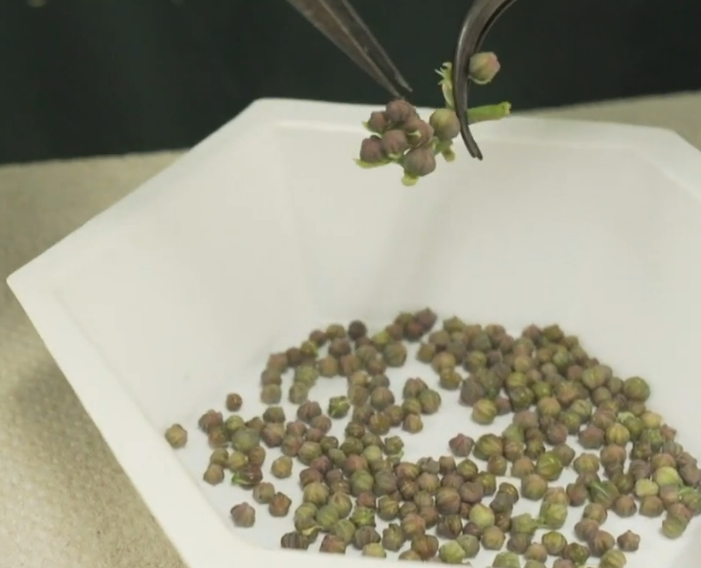
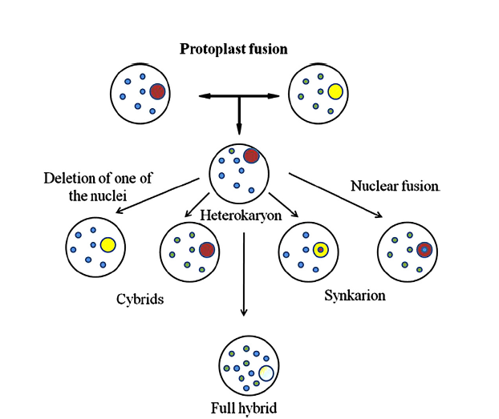

```{r setup, include=FALSE}
library(knitr)
require(tidyverse)
set.seed(453)
# invalidate cache when the package version changes
knitr::opts_chunk$set(tidy = FALSE, echo = FALSE, 
                  message = FALSE, warning = FALSE,
                  out.width = "45%")
options(knitr.table.format = "latex")
options(knitr.kable.NA = "", digits = 2)
options(kableExtra.latex.load_packages = FALSE)
```

# Haploid and triploid production

## Haploid production

- In nature, haploids occur at 0.001-0.01% frequency.
- Spontaneous production of haploids, usually occurs through parthenogenesis, but rarely though 'ovule androgenesis'.
- Until 1964, artificial production of haploids was attempted through:
  - Distant hybridization
  - Delayed pollination
  - Application of irradiated pollen
  - Hormone treatments
  - Temperature shocks
- Guha and Maheshwari, 1964 first reported the development of numerous pollen plantlets in anther cultures of _Datura innoxia_.

<!-- Ovule androgenesis: Embryo development inside the ovary by the activity of the male nucleus alone. -->
<!-- Anther androgenesis: Anther culture  -->

## Distant hybridization for haploid production

\bcolumns
\column{0.6\textwidth}

```{r distant-hybridization-haploid, fig.align='center', out.width="82%"}
# Selective elimination of chromosomes following distant hybridization is another technique to obtain haploids of some cereals. Kasha and Kao (1970) observed that in the interspecific crosses between the tetraploids of Hordeum vulgare and H. bulbosum nearly all the plants were dihaploids. Similarly, in the crosses of the dihaploids of these species the progeny comprised haploids. Morphologically as well as cytologically the progeny represented H. vulgare. Treatment of fertilized florets with low concentrations of GA3 (25-150 micro g per ltr) for a couple of days considerably enhanced the frequency of seed-set and the recovery of haploid.


```

\column{0.4\textwidth}

Interspecific crosses between cultivated barley ( _Hordeum vulgare_) and the wild species _H. bulbosum_ followed by in vitro culture of rescued immature embryos results in haploid plants as a result of exclusion of the H. bulbosum chromosomes during embryo development.

\ecolumns

## Haploid inducer lines in Maize

- Refer to lecture slide on Polyploidy in plant breeding, Introductory Plant Breeding, 4th Semester.

## Anther culture: Steps (case of Cassava)

1. Selection and collection of plant material
2. Pre-treatment
  - cold pre-treatment for 4 days at 10 degree C
  - heat pre-treatment for 24 hours at 37 degree C
3. Sterilization
  - heat (open flame sterilization of flower bud using burner)
  - chemical
4. Separation of anther tissue from flower bud
5. Culturing
  - androgenesis
  - callus proliferation or somatic embryogenesis
  - plantlet regeneration

##

\bcolumns
\column{0.4\textwidth}

```{r, out.width="80%"}

```

\column{0.3\textwidth}

```{r, out.width="95%"}

```

\column{0.3\textwidth}

```{r, out.width="95%"}

```

\ecolumns

```{r, out.width="52%", fig.align='center'}

```

##

```{r, fig.align='center', out.width="48%"}
# plating of anther in androgenesis induction medium

```

```{r, out.width="48%"}

# or
knitr::include_graphics("../images/somatic_embryogenesis_induction.png")
```

##

```{r protocol-dh-anther-pollen-culture, fig.align='center', out.width="60%"}

```

For protocol based exposition refer to: @broughton2014vitro (Book: Crop Breeding Methods and Protocols).

## Triploid production

\bcolumns
\column{0.5\textwidth}

- Monoploids: Number of chromosome in a single set of chromosomes (denoted by x).
- Dihaploids: Two sets of chromosomes in gametes (gametes of tetraploids)
- Polyploidy arises due to:
  - Unreduced gametes
  - Polyspermy
  - Chromosome doubling
- Triploids have three copies of monoploid sets

\column{0.5\textwidth}

```{r triploidy, fig.align='center', out.width="58%"}

```

\ecolumns

##

- Have several desirable characters such as larger organs -- leaves, fruits and flowers.
- Exhibit greater vigor, higher biomass and stress resistance.
- Are sterile and fruits are seedless, i.e., grapes, watermelon, citrus fruits etc.
- Natural triploids exist in nature -- _Populus tremula_, _P. alba_, _Quercus_ spp., _Miscanthus_ spp.
- Artificial triploids have been created using wide hybridization (example presented in respective section)

##

\bcolumns
\column{0.5\textwidth}

**Natural hybridization**

- The success of hybridization depends on
  - pollen viability
  - compatibility between parent
  - frequency of unreduced gametes

```{r triploid-production-natural, out.width="60%", fig.align='center'}

```

\column{0.5\textwidth}

**Artificial/_invitro_ fertilization**

- Triploid production could be brought about artificially by
  - polyspermy: Fertilization of more than one male gametes with the egg cell

```{r triploid-production-artificial, out.width="60%", fig.align='center'}

```

\ecolumns

## Callusing

- Earliest attempt to grow endosperm tissue in culture was made during 1933.
  - Lampe and Mills grew young corn endosperm on a nutrient medium enriched with the extract of potato or young corn and obtained slight proliferation.
- To ensure good proliferation in cereals, **young** explant should be excised
  - 9-10 days after pollination in _Lolium perenne_
  - 8 DAP in _Triticum aestivum_ and _H. vulgare_
  - 4-7 DAP in _Oryza sativa_
- In fact, mature cereal endosperm is considered dead.
- However, in tomato endosperm culture is deemed most successful 37-50 days from fruit-set.
- Initial association of embryo to the endosperm may be necessary for inducing proliferation.
  
## 

- Early culturing media contained supplements such as tomato juice (derived from young age fruit has been shown to cause cytokinin-like activity), grape juice, green-corn juice, yeast extract (YE) or cow's milk.
- Ideally, the media contains 2,4-D, Kinetin and YE or Casein hydrolyaste.
- Endosperm callus of maize growth occurs best at sucrose concentration of 2-4%.
- Corn endosperm grows better in dark than in light (opposite in _Ricinus_)
- Optimum temperature is reported to be around 25 degree C.
- pH of 6.1 is deemed favorable for maize, while several other crops respond well at more acidic pH.

##

- Corn endosperm becomes cellular 3 DAP and divisions continue upto 7-8 days.
- On a medium fortified with 2,4-D, kinetin, and YE the proliferation of mature endosperm begins 10-12 days after inoculation. 
- The endosperm tissue is well known for a high degree of polyploidization of its cells during in vivo development. It also exhibits various kinds of mitotic irregularities such as chromosome bridges and laggards.

## Applications

- Refer to Chapter 19 (Applications of Triploids in Agriculture), Plant Biology and Biotechnology, Volume 2, 2015.

# Invitro pollination and fertilization

##

- Most common reasons for use of in-vitro techniques in recent years has been to crop improvement using gene technology\footnote[frame]{For a REALLY long discussion on the topic refer to \cite{bhojwani1986plant} or the more recent \cite{bhojwani2013plant}}.
- Techniques such as invitro fertilization and protoplast fusion enable the recombination of genotypes otherwise limited by incompatibility.
- In vitro pollination has been used to overcome crossing barriers in interspecific hybridization within the genus _Cucumis_.

<!-- - For a (short and sweet) description of protocol and comparison of different medium, refer to "Optimizing culture for in-vitro pollination and fertilization in Cucumis sativus and C. melo.". -->
<!-- Abovementioned text is available in `literatures/` -->

# Somatic hybridization and cybridization

##

- Tao et al. (2004) indicated that cytoplasmic and cytoplasmic-nuclear genomes interaction played important roles in yield, low temperature tolerance, and some important agronomic traits in japonica rice. Further Tao et al. (2011) detected that cytoplasmic genes had a significant effect on grain weight and filled-grain ratio on indica rice. In maize , Tang et al. (2013) reported that plant height and ear height are also controlled by cytoplasmic genes.

- Cybrids produced as a result of protoplast fusion between _Nicotiana plumbaginifolia_ TBR2 mutant and _N. tabacum_ were resistant to high levels of herbicide atrazine (Menczel et al. 1986 ). They also found that these plants were male sterile due to the protruding stigma and shorter than normal fi laments of the cybrid plants.

<!-- - Refer to -->
<!--   - Page 167, Chapter 6, Plant Breeding Reviews (Volume 20) on Somatic Hybridization and Applications in Plant Breeding. -->
<!--   - Lecture slide on Plant cell and tissue culture -->

##

```{r traits-transmission-protoplast-fusion, fig.cap="Examples of transfer of traits by Protoplast fusion.", out.width="60%"}

```


# Genetic transformation and wide hybridization

##

- Use of invitro techniques in wide hybridization is generally associated with the rescue of developing interspecific or intergeneric hybrid.
- Embryo rescue involves the excising of embryos and placing them onto sterile culture medium.
  - Tukey first grew embryo of cherry on an artificial medium in 1933.
- In events of wide hybridization, endosperm develops poorly or does not develop at all due to hybridization barriers.
  - post-fertilization barriers can be caused by ploidy differences, chromosome elimination and seed dormancy. 

##

- Applied in rescuing young embryos of successful interspecific crosses of
  - _Lycopersicon esculentum_ x _L. peruvianum_
  - _Medicago sativa_ x _M. rupestris_
  - _Brassica napus x Sinapsis alba_
- Seedless triploid embryos resulting from crosses between diploids and tetraploids of the same species.
  - Fujiminori (2n = 4x = 76) x Jingxiu (2n = 2x = 38) grape varieties
  - Diploid (2n = 22) x Tetraploid (2n = 44) daylily ( _Hemerocallis_ spp.)

<!-- - Refer to page 199 with Chapter "Molecular biology/Genetic tranformation in distant hybridization", "1992_Monographs on Theoretical and Applied Genetics 16 - Distant Hybridization.pdf". -->

<!-- Worldwide, several efforts are underway to transform cultivated strawberry with various genes and constructs. The earliest reports of A. tumefaciens-mediated transformation of strawberry leaf disks were made by James et al. (1990) and Nehra et al. (1990). In the James study, leaf and petiole explants from "Rapella" were transformed with the binary vector pBIN6, which carries genes for nopaline synthase (NOS) and neomycin phosphotransferase (NPTII), which confers resistance to the antibiotic kanamycin. One plant derived from a transformed leaf disk displayed NOS activity in multiple tests with multiple tissue samples. The same plant tested positive in Southern hybridization, showing the predicated fragments in diagnostic restriction digests. The author also detected plants that apparently had escaped selection as well as chimeric ones. When the transgenic plant was self-pollinated, the NOS gene segregated 3:1 in the F1 progeny, suggesting a single insertion event. Among in vitro germinated seedlings, the presence of nopaline synthase activity was tightly associated with the ability to produce callus on kanamycin containing medium. -->

##

```{r protocol-agrobacterium-mediated-transformation, fig.align='center', out.width="55%"}

```

For protocol based exposition, refer to: @ismagul2014agrobacterium (Book: Crop Breeding Methods and Protocols).

# Somaclonal/gametoclonal variants selection

##

- Genetic variation, which is essential in plant breeding, is often not available under invitro conditions\footnote[frame]{For a full 34 page discussion on selecting somaclonal variants, refer to Chapter 9 (Variant selection) of \cite{bhojwani1986plant} or the more recent \cite{bhojwani2013plant}}.
- Jain (1998) suggested that such variation can be induced in-vitro from somatic cells or tissues resulting in somaclonal variation leading to added genetic variability.
- Characteristics for which somaclonal mutants can be improved during in vitro culture includes resistance to disease, herbicides and tolerance to environmental or chemical stress, as well as for increased production of secondary metabolites. 
- Selection is done by employing a stress-causing agent in tissue culture containing dividing cells.

##

- Such variation has been associated with changes in chromosome number (ploidy and aneuploidy), chromosome structure, point mutations, and DNA methylation -- hence both genetic and epigenetic.
- Molecular markers have been applied successfully to detect somaclonal variations of several plant species: _Solanum tuberosum_, _Gossypium hirsutum_ and _Musa_ spp.

# Bibliography
