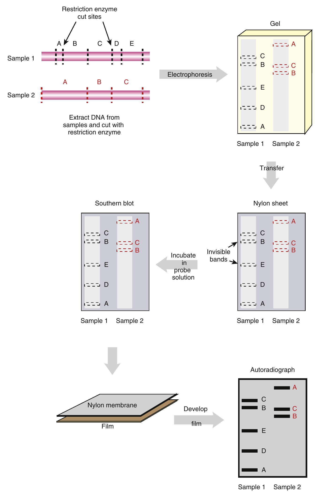

```{r setup, include=FALSE}
library(knitr)
require(tidyverse)
set.seed(453)
# invalidate cache when the package version changes
knitr::opts_chunk$set(tidy = FALSE, echo = FALSE, 
                  message = FALSE, warning = FALSE,
                  out.width = "45%")
options(knitr.table.format = "latex")
options(knitr.kable.NA = "", digits = 2)
options(kableExtra.latex.load_packages = FALSE)
```

# Environmental biotechnology

## Overview

### Background

- People have always been fascinated by the environment around them and successful in harnessing the environment for our benefit.
- Curiosity to explore uncharted life forms drives our motivations.
- Virosphere! How big is it?
- Human body harbors $10^14$ bacteria, while our own only comprise $10^13$.

## Applications

### Wide applications

- An increase in the productivity of crops, without an increase in the dependency on environmentally-damaging agrochemicals.
- As a result of increased productivity, a reduced pressure to exploit the remaining uncultivated habitats.
- As a result of increased productivity, a reduction in energy inputs (mostly from reduced agrochemical manufacture).
- The creation of alternative, renewable, sources of energy (e.g., biodiesel).
- The creation of new more environment-friendly raw materials for industry (e.g., biodegradable plastics from plant starches, or high-value speciality chemicals).
- As a result of the development of genetically-modified crops (if properly used), a reduction in the amount of agrochemical (e.g., pesticides and herbicides) released into the environment.

### Bio-environmental processes

\alert{Bioremediation}

- One of the avenues in biotechnology that has made rapid advances
- "biological" means of cleaning the environment.
- Naturally occurring microorganisms often have the ability to degrade human-made pollutants. 
- _Rhodococcus_ sp. has a highly diverse pathways to degrade pollutants, such as short- and long-chain alkanes, aromatic molecules (both halogenated and nitro-substituted), and heterocyclic and polycyclic aromatic compounds, including quino lone, pyridine, thiocarbamate, s-triazine herbicides, 2-mercaptobenzothiazole (a rubber vulcanization accelerator), benzothiophene, dibenzothiophene, MTBE, and the related ethyl tert-butyl ether (ETBE).

### Bio-environmental processes

- \alert{Biostimulation} is the release of nutrients, oxidants, or electron donors into the environment to stimulate naturally occurring microorganisms to degrade a contaminant. 
- \alert{Bioaugmentation} is adding specific microorganisms plus their energy sources to decontaminate a polluted area.
- \alert{Microbial fuel cells} create electricity through the use of microorganisms. Organisms that transfer electrons to the anode are called electrode-reducing organisms. They can pass electrons through a mediator molecule in the solution, directly through proteins in their outer membrane, or through nanowires or pili that coat the outer surface of the bacterium. Electrode-oxidizing organisms take electrons from the cathode to reduce various substances, such as carbon dioxide to acetate.

### Biofuel production

```{r biofuel-production, fig.cap="\\textbf{(A)} Production of ethanol from corn requires the addition of ammonia to adjust the pH and enzymes to help digest starch and yeast to ferment the corn mash. \\textbf{(B)} Biodiesel is created by the blending of methanol, sodium hydroxide, and vegetable oil for 20-30 minutes.", out.width="28%"}
# The ethanol is distilled to 95% purity and then purified further by passing through molecular sieves. The purified ethanol is rendered undrinkable by addition of denaturants. The remaining corn products after distillation include liquid sugars and solids that are used to feed livestock.

# The process creates biodiesel and glycerin that separate naturally because glycerin has a higher density than biodiesel.

# pdftools::pdf_convert("./../../literatures/biotechnology/Biotechnology 2nd ed - David P. Clark, Nanette J. Pazdernik (AP, 2016).pdf", pages = 412, dpi = 250, format = "png", filenames = "../images/biofuel_production.png")
knitr::include_graphics("../images/biofuel_production.png")
```

### Mechanism

- PCR is routinely used to amplify random sequences from many environmental samples in the hope of identifying new genes.
- After PCR DNA is sequenced.
- Then bioinformatics reveals whether or not the sequence (or a close relative) has already been identified or if it is completely novel.
- Microarrays are used to compare numbers and types of organisms present in different environment.

### Identifying new genes with metagenomics

- Allows identification of microorganisms, viruses, or free DNA that exist in the natural environment.
- Approaches: next-generation DNA sequencing, PCR, RT-PCR and microarrays
- Metagenomics is the process of statistically combining separate genomic analyses; deals with a mixture of DNA forms.
- Study of marine microbiology, human gut microbiology, assessment of how microorganisms form symbiotic relationships with their hosts, finding novel antibiotics or enzymes, replacement of chemical pesticides with crops genetically engineered for tolerance to microorganisms and nematodes, etc.

### Current concerns and Solutions

\begin{columns}[T,onlytextwidth]
  \column{0.5\textwidth}
  
  \alert {Concerns}
  \begin{itemize}
  \item Herbicide use
  \item Genetic pollution and superweeds
  \item Antibiotic resistance
  \item Unexpected effects
  \item Pest resistance
  \item Persistence and weediness
  \item Damage to wildlife and biodiversity
  \end{itemize}
  
  \column{0.5\textwidth}
  
  \alert {Avenues}
  \begin{itemize}
  \item Genetic modification of plants achieves essentially the same result as conventional plant breeding
  \item Wide-crossing
  \item In Nature, genes are exchanged between species
  \item Gene instability in conventional crops
  \item Conventional breeding is not 'Natural' either
  \item Gene transfer from crops to their 'Wild' relatives
  \item Novel, sustainable, agricultural practices needed
  
  \end{itemize}
  
\end{columns}

### Study techniques

```{r environment-samples-study, fig.cap="Techniques to study environmental samples", out.width="32%"}
# pdftools::pdf_convert("./../../literatures/biotechnology/Biotechnology 2nd ed - David P. Clark, Nanette J. Pazdernik (AP, 2016).pdf", pages = 404, dpi = 250, format = "png", filenames = "../images/environmental_techniques.png")

```

# Medical biotechnology

## Applications

### Popular technologies

- Cheaper medicines from biotechnology
- Medicines from 'cultured' cells
- Genetic modification for medicine production
- Immune technology; Killed pathogens, attenuated pathogens, single proteins, or epitopes from a disease-causing pathogen are used as vaccines. They are isolated and injected into people to elicit their immune response without causing the disease. Multivalent vaccines contain antigens to different proteins from a pathogen or family of pathogens.
- Cancer technology; Oncogene detection, oncogene attenuation

### Popular technologies

- Gene therapy; Engineered retroviruses are the most frequently used viral vectors in gene therapy. Defective retrovirus vectors are grown in cells with an integrated helper virus to allow formation of virus particles.
- ELISA assay; Antibodies are used in ELISA assays to determine the relative concentration of the target protein or antigen in a sample. Primary antibodies recognize the target protein or antigen. Secondary antibodies recognize the primary antibody and often carry a detection system. Secondary antibodies are made to recognize any antibody that is made in sheep, cow, rabbit, goat, or mouse.

### Stem cell therapy

- Characteristics of stem cells: 
  - they maintain the ability to divide continually, 
  - they are undifferentiated, and
  - they have the ability to differentiate into multiple cell types 
- Embryonic stem cells are totipotent. 
- Adult or somatic stem cells are able to differentiate into different cell types but are multipotent; that is, they are restricted to the tissues in which they originate. 
- Embryonic stem cell lines are created from the inner cell mass of the blastula stage of an embryo from many different mammals, including humans, mice, and primates. 
- The cell lines can be induced to differentiate by forming embryoid bodies that ultimately differentiate into different cell types.

### Stem cell therapy

```{r stem-cell-therapy, fig.cap="\\textbf{Hematopoietic stem cells} are located near the interface of the bone marrow and bone surface (the endosteal niche) and also near vascular sinuses (vascular niche). The HSCs in each niche divide to form mature hematopoietic cells that populate the marrow tissues.", out.width="45%"}
# pdftools::pdf_convert("./../../literatures/biotechnology/Biotechnology 2nd ed - David P. Clark, Nanette J. Pazdernik (AP, 2016).pdf", pages = 573, dpi = 250, format = "png", filenames = "../images/hematopoietic_stem_cells.png")
knitr::include_graphics("../images/hematopoietic_stem_cells.png")
```

### Cloning dolly

```{r dolly-sheep-cloning, fig.cap="To clone a mammal such as a sheep, cells from the udder are isolated, grown in culture, and then starved in order to arrest them in $G_0$ of the cell cycle. Unfertilized egg cells from another sheep are also harvested, and the nucleus is removed. An electrical stimulus fuses the $G_0$ udder cell with the enucleated egg, thus placing a somatic cell nucleus into an undifferentiated cytoplasm. The eggs that result are put back into a foster mother, and the offspring are screened for DNA identical to the donor sheep.", out.width="38%"}
# pdftools::pdf_convert("./../../literatures/biotechnology/Biotechnology 2nd ed - David P. Clark, Nanette J. Pazdernik (AP, 2016).pdf", pages = 582, dpi = 250, format = "png", filenames = "../images/dolly_cloning.png")
knitr::include_graphics("../images/dolly_cloning.png")
```

# Forensic biotechnology

- Researches and uses the basis of identity to resolve conflicting situations and help create unique database of individuals.
- Fingerprint patterns are multigenic trait.
- Retinal scans take advantage of the unique pattern of blood vessels on the retina at the back of the eyes.
- Blood typing provides identity based on presence of blood antigens groups.

## Applications 

### DNA fingerprinting

- DNA fingerprinting relies on the unique pattern made by a series of DNA fragments after separating them according to length by gel electrophoresis.
- The samples are then processed to generate a set of DNA fragments. When Alec Jeffreys invented DNA fingerprinting in 1985 in England, the DNA was cut with restriction enzymes to generate fragments because PCR had not yet been invented. 
- Nowadays, DNA is prepared by PCR, and fluorescent dyes are used for labeling. In addition, modern DNA fingerprinting uses repeated sequences (short tandem repeats or STRs) for routine identification purposes.

### DNA fingerprinting

- For the first generation of DNA fingerprints, restriction enzymes were used to generate the variation in DNA fragment size between individuals. Variations in the DNA base sequence of restriction enzyme recognition sites result in differences in the size of the fragments. 
- Such sequence differences are called restriction fragment length polymorphisms (**RFLPs**). 
- Many different restriction enzymes with distinct recognition sites are used on each DNA sample.
- Even if mutations have changed a few bases of the target sequence around the cut site, there is usually still enough similarity for probes to bind. 

### RFLP steps

- The DNA is cut with a restriction enzyme.
- The DNA fragments are separated by length or molecular weight by gel electrophoresis.
- The fragments are visualized by Southern blotting. The separated fragments are transferred from the gel to nylon paper. Then a radioactively labeled DNA probe is added.
- The probe binds to those DNA fragments with complementary sequences.
- The blot is covered with radiation-sensitive film to give an autoradiograph. This shows the location of those DNA fragments that reacted with the radioactive probe.
- The final product of a DNA fingerprint is an autoradiograph that contains at least five essential lanes (Figure \ref{fig:fingerprint-lanes}). The markers are standardized DNA fragments of known size, which have been radioactively labeled.

### RFLP fingerprinting

```{r rflp-fingerprinting, fig.cap="Outline of RFLP based DNA fingerprinting", out.width="32%"}
# pdftools::pdf_convert("./../../literatures/biotechnology/Biotechnology 2nd ed - David P. Clark, Nanette J. Pazdernik (AP, 2016).pdf", pages = 722, dpi = 250, format = "png", filenames = "../images/rflp_fingerprinting.png")

```

### RFLP fingerprinting

```{r fingerprint-lanes, fig.cap="Actual DNA fingerprint showing that the pattern of DNA fragments of the victim (V) were found on the defendant's clothing (jeans/shirt). The first two and last two lanes are the standard size markers (labeled $\\lambda$ and 1 kb). The lane marked TS is a positive control showing that the fingerprint technique was successful. The lane marked D is the defendant's DNA pattern.", out.width="40%"}
# pdftools::pdf_convert("./../../literatures/biotechnology/Biotechnology 2nd ed - David P. Clark, Nanette J. Pazdernik (AP, 2016).pdf", pages = 723, dpi = 250, format = "png", filenames = "../images/fingerprint_lanes.png")
knitr::include_graphics("../images/fingerprint_lanes.png")
```

# Bibliography
