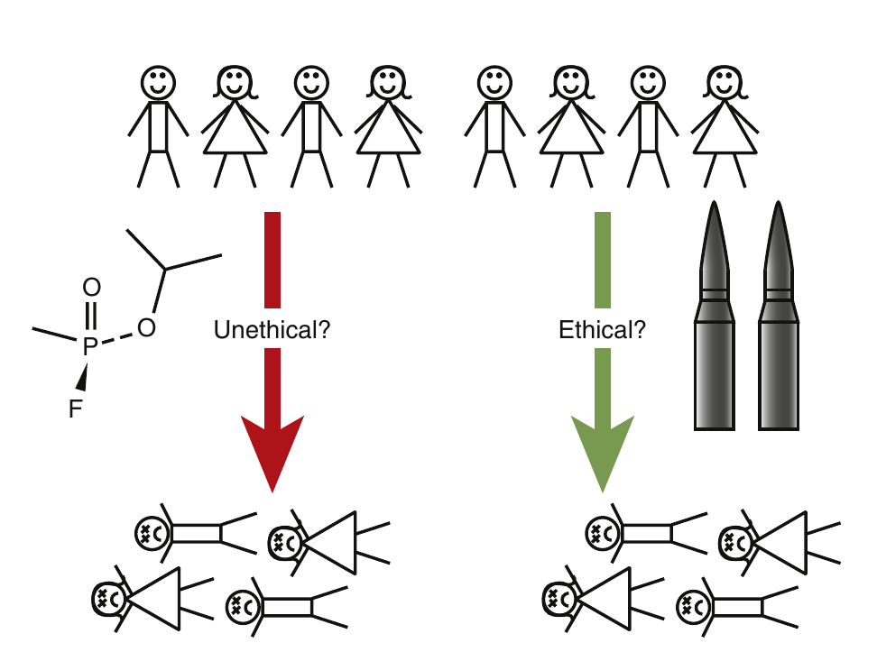
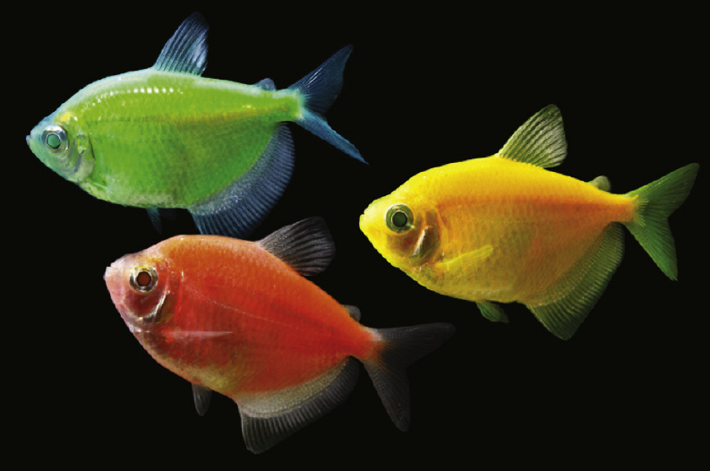
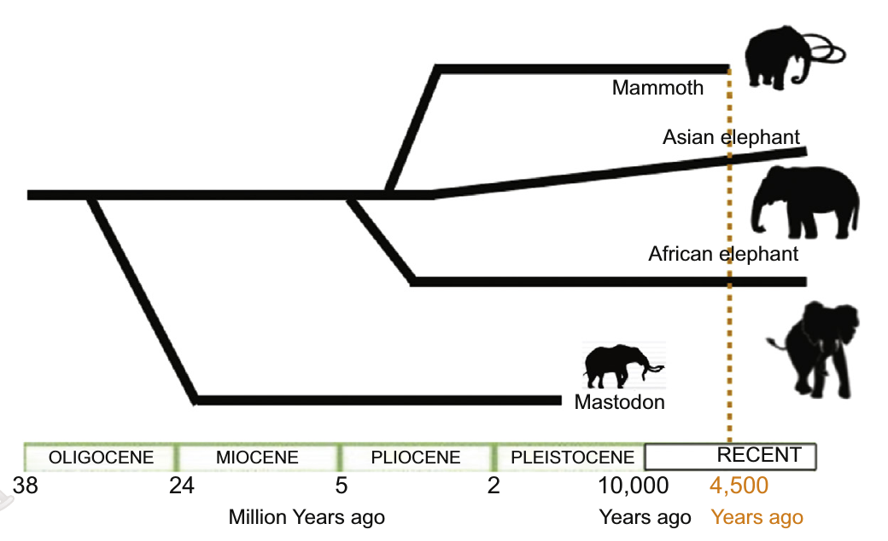

```{r setup, include=FALSE}
library(knitr)
require(tidyverse)
set.seed(453)
# invalidate cache when the package version changes
knitr::opts_chunk$set(tidy = FALSE, echo = FALSE, 
                  message = FALSE, warning = FALSE,
                  out.width = "45%")
options(knitr.table.format = "latex")
options(knitr.kable.NA = "", digits = 2)
options(kableExtra.latex.load_packages = FALSE)
```

# Introduction

## Principles

### Background

\framesubtitle{Why be ethical?}

- As biotechnology continues its march forward, it will inevitably raise new moral and legal questions.
- There are few "black and white" issues in bioethics, but instead varying shades of gray.
- Questions such as:
  - Who should control technology ?
  - Who should be excluded or permitted, and who should decide ?
  - Who should profit ?
  - Should access to novel technology be made affordable ?
  - Who should pay for the technology ?
- Much of "official" regarded bioethics derives from clinical biotechnology.

### Principles of bioethics

\begin{block}{Ethics}
"The philosophical study of the moral value of human conduct and of the rules and principles that ought to govern it; moral philosophy"
\end{block}

- The National Commission for the Protection of Human Subjects of Biomedical and Behavioral Research issued the Belmont Report in 1979. Although primarily aimed at biomedical research with human subjects,
- Its basic principles-- _autonomy_, _beneficence_, and _justice_ Belmont Report in 1979 -- have often been applied to the broader areas of biotechnology.
- Autonomy refers to informed consent and related issues and applies especially to medical research and clinical applications.
- Privacy and confidentiality receive greater emphasis in biotechnology. In particular, access to personal genome information has become a thorny problem.
- Beneficence involves promoting benefit and avoiding harm to people (and animals)—physically, mentally, and to their rights.

### Precautionary principle

- The precautionary principle states that if a proposed change has a possible risk of causing harm to people or to the environment, the burden of proving that it is safe (or very unlikely to cause harm) falls on those proposing the change.
- In biotechnology the precautionary principle has been applied to such issues as
  - Spreading disease accidentally by using technology (such as the transmission of AIDS or hepatitis by blood transfusions or the emergence of mad cow disease by changing animal food processing).
  - Introducing new pharmaceutical products, especially those generated by genetic engineering. Requiring pharmaceutical companies to perform clinical trials to show that new medications are safe is a well-established practice.
  - Introducing genetically modified organisms into the environment.
  - Creating artificial life.

### Declaration

- In 2005, the United Nations issued a **Universal Declaration on Bioethics and Human Rights**, including a much-expanded set of principles:

\begin{columns}[T,onlytextwidth]
  
  \column{0.2\textwidth}
  \alert {General Provisions}
  \tiny{
  \begin{itemize}
  \item Article 1 Scope
  \item Article 2 Aims
  \end{itemize}
  }
  
  \column{0.4\textwidth}
  \alert {Principles}
  \tiny{
  \begin{itemize}
  \item Article 3 Human dignity and human rights
  \item Article 4 Benefit and harm
  \item Article 5 Autonomy and individual responsibility
  \item Article 6 Consent
  \item Article 7 Persons without capacity to consent
  \item Article 8 Respect for human vulnerability and personal integrity
  \item Article 9 Privacy and confidentiality
  \end{itemize}
  }
  
  \column{0.4\textwidth}
  
  \tiny{
  \begin{itemize}
  \item Article 10 Equality, justice and equity
  \item Article 11 Non-discrimination and non-stigmatization
  \item Article 12 Respect for cultural diversity and pluralism
  \item Article 13 Solidarity and cooperation
  \item Article 14 Social responsibility and health
  \item Article 15 Sharing of benefits
  \item Protecting future generations
  \item Protection of the environment, the biosphere and biodiversity
  \end{itemize}
  }

\end{columns}

# Power of information

## Use and misuse of digital information

### Privacy and personal genetic information

- What are the ethical implications of possessing, or being denied access to certain types of biological information.
- Settlement of criminal cases
- Creation of national criminal DNA database...is it ethical?
- Identity theft and digital infromation hack
- In future it may be possible to predict potential health problems by analyzing individual's DNA (now being done for Huntington's disease). However, many people prefer not to know!
- Personal genetic information is used by health care providers, insurance companies, government database.
- Does government possessing genetic information constitute invasion of privacy ?
- Legislation regarding use of genetic information has been passed in US: Genetic Information Nondiscrimination Act, 2008.

### The problem of dual-use research

- The World Health Organization defines

\begin{block}{Dual use research of concern (DURC)} 
Life sciences research that is intended for benefit, but which might easily be misapplied to do harm.
\end{block}

- Factors of consideration for DURC:
  \begin{itemize}
  \footnotesize{
  \item Increasing the harmful consequences of a biological agent or toxin.
	\item Disrupting immunity (or effective immunization) toward a biological agent or toxin.
	\item Making a biological agent or toxin resistant to useful preventative or therapeutic countermeasures.
	\item Improving the ability of a biological agent or toxin to evade detection.
	\item Improving the stability or transmissibility of a biological agent or toxin.
	\item Altering the host range (including tropism to particular tissues within the body) of a biological agent or toxin.
	\item Enhancing the susceptibility of a target population to a biological agent or toxin.
	\item Generating a novel pathogenic agent or toxin.
	\item Re-creating an extinct or eradicated pathogenic agent or toxin.
  }
	\end{itemize}

### Ownership of genetic information

- In the United States, products of nature cannot be patented, but until very recently, human gene sequences could.
- The company Myriad Genetics patented the DNA sequences of two genes linked to breast cancer, BRCA1 and BRCA2. The company also developed a diagnostic assay based on these gene sequences. Thus, the effect of the patents was to eliminate all competition from the market because no other company could create a DNA-based test for these breast cancer genes.
- Should scientists working at universities with public funding be allowed to patent their discoveries ?

# Possible dangers to health from biotechnology

## Creating a healthy future

### Biological weapons

```{r biofuel-production, fig.cap="\\textbf{Syrian civil war} The victims are just as dead whether killed 'ethically' by bullets or 'unethically' by sarin nerve gas.", out.width="28%"}
# pdftools::pdf_convert("./../../literatures/biotechnology/Biotechnology 2nd ed - David P. Clark, Nanette J. Pazdernik (AP, 2016).pdf", pages = 749, dpi = 250, format = "png", filenames = "../images/biological_weapon.png")

```

- Anthrax attack in US in 2001. Are biological weapons more "destructive" or more "scarier"?

### Antibiotic and antiviral resistance

- MSRA; Tuberculosis
- The United States in 2009 consumed over 36 million pounds of antibiotics, only 20% of which were administered to humans.
- Overprescription and underprescription
- Retroviral therapies

# Genetically modified organisms

## Playing with nature

### Transgenic plants

- Haven't humans been already practicing artificial monocultures, historically?
- Are the adamant opposition of environmental and consumer groups against GMOs scientifically grounded?
- According to the International Service for the Acquisition of Agribiotech Applications (ISAAA), 20 developing nations grow 52% of the world’s GMOs, while 8 developed nations grow the remaining 48%.
- The case of _terminator seed_
- US has 93% of Soybeans, 80% of Cotton and 80% of Corn acerage planted with GMO crops.

### Transgenic animals

\begin{columns}[T,onlytextwidth]
  
  \column{0.6\textwidth}
  \begin{itemize}
    \item If we do not grow as much corn as we do today, European corn borer insects will likely be a rare insect.
    \item it has been proposed that manipulating Hox genes could “de-evolve” a chicken to a more ancestral form that somewhat resembles a dinosaur
    \item GFP bunny project
    \item Is it ethical to genetically modify animals for purely aesthetic reasons?
  \end{itemize}
  
  \column{0.4\textwidth}

```{r glofish-tetra, fig.cap="\\textbf{GloFish Tetra} \\newline You can purchase transgenic animals for your children's amusement and enlightenment! Courtesy of GloFish; http://www.glofish.com/meet-glofish/glofish-gallery/.", out.width="50%"}
# pdftools::pdf_convert("./../../literatures/biotechnology/Biotechnology 2nd ed - David P. Clark, Nanette J. Pazdernik (AP, 2016).pdf", pages = 754, dpi = 250, format = "png", filenames = "../images/glofish_tetra.png")

```  

\end{columns}

### De-extinction

```{r mammoth-resurrection, fig.cap="\\textbf{Mammoth and elephant evolution} The extinct mammoth is actually more closely related to the Asian elephant than the Asian and African elephants are to each other. Note also that modern-day elephants are larger than the mammoth, which in turn was larger than the mastodon.", out.width="45%"}
# pdftools::pdf_convert("./../../literatures/biotechnology/Biotechnology 2nd ed - David P. Clark, Nanette J. Pazdernik (AP, 2016).pdf", pages = 756, dpi = 250, format = "png", filenames = "../images/mammoth_deextinction.png")

```  

# Human enhancement, cloning and engineering

## Eugenics

### Avenues

- Pregnancy screening
- Stem cell therapy
- Human genetic enhancement and cyborgs
- Human cloning
- Human genetic engineering

# Bibliography
