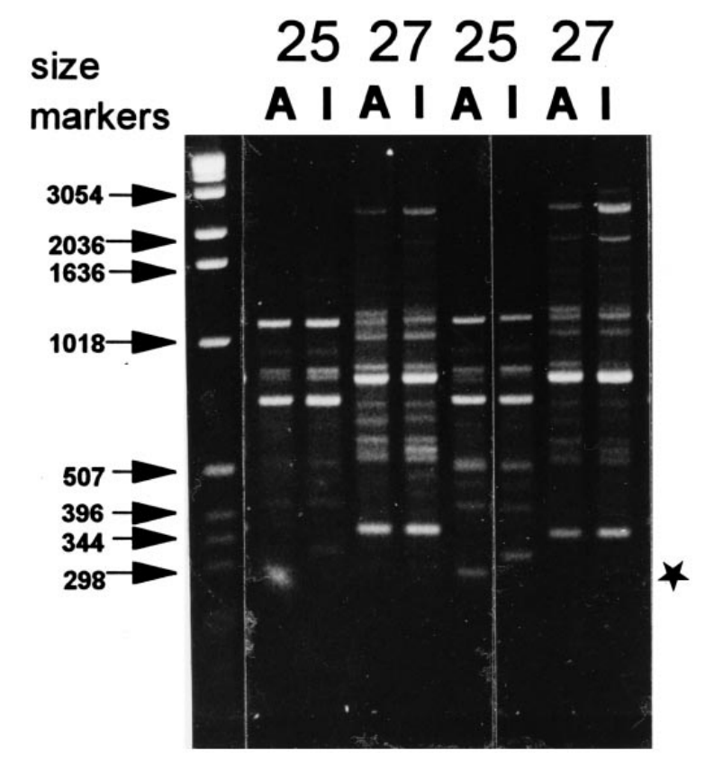
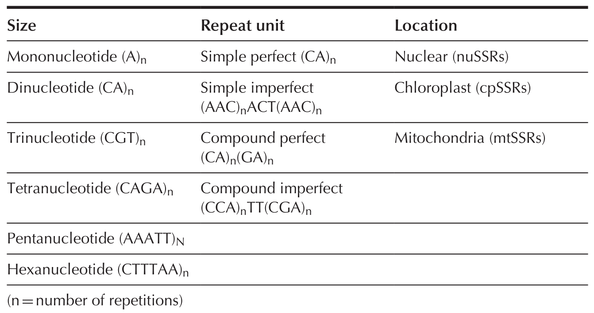
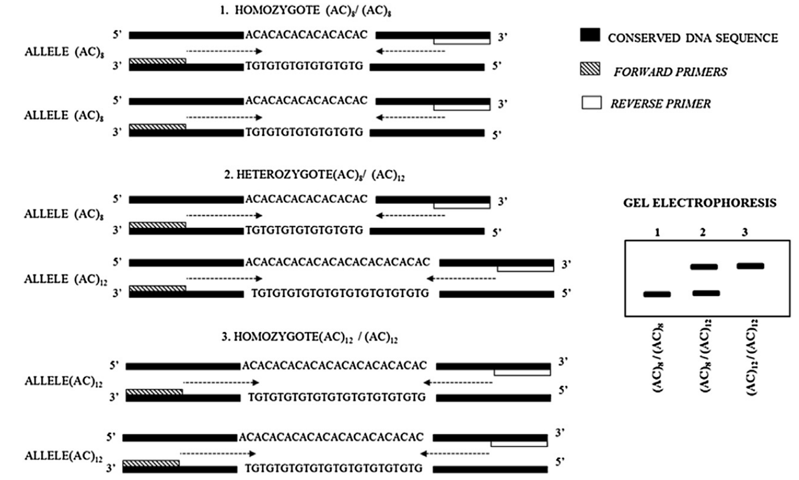
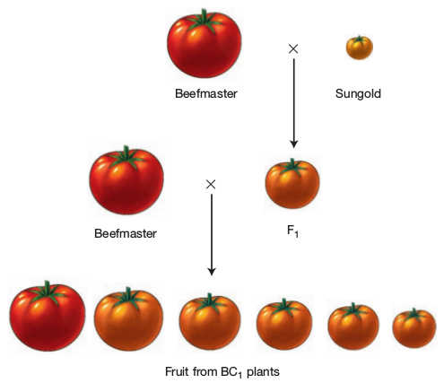
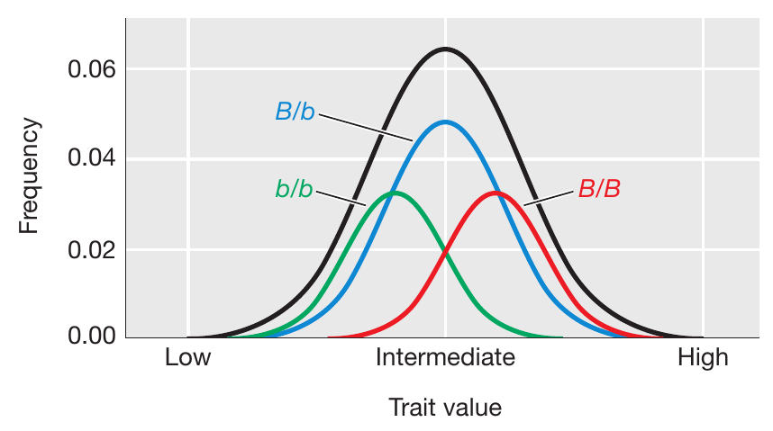
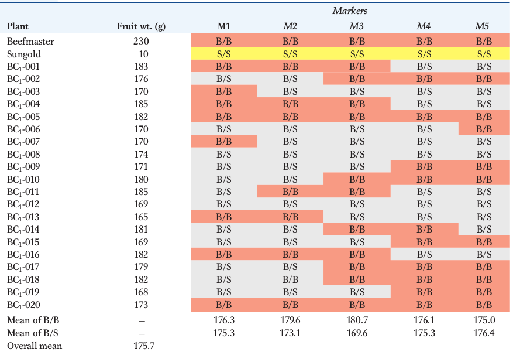
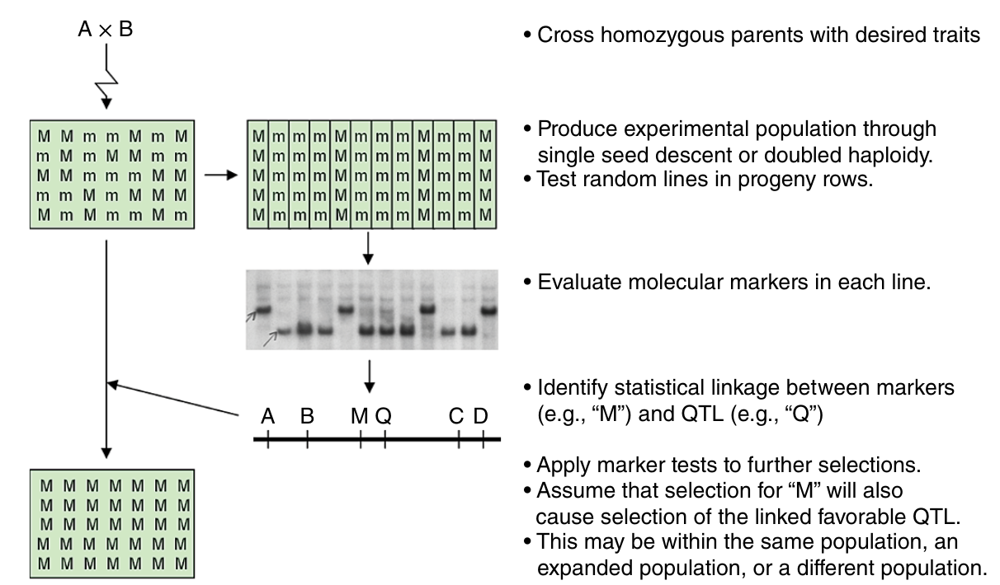

```{r setup, include=FALSE}
library(knitr)
require(tidyverse)
require(janitor)
require(viridis)
require(viridisLite)
set.seed(453)
# invalidate cache when the package version changes
knitr::opts_chunk$set(tidy = FALSE, echo = FALSE, 
                  message = FALSE, warning = FALSE,
                  out.width = "45%", cache = TRUE, 
                  dev.args=list(bg=grey(0.9), pointsize=11))
options(knitr.table.format = "latex")
options(knitr.kable.NA = "", digits = 2)
options(kableExtra.latex.load_packages = FALSE)
theme_set(theme_bw())
```

# Molecular markers

##

- Central idea is that different loci located on the same chromosome are \alert{linked}.
  - Crop species have few chromosomes (2n = 2x = 38 in rapeseed, 2n = 6x = 42 in wheat, 2n = 2x = 14 in barley, 2n = 2x = 24 in rice, 2n = 2x = 22 in bean, 2n = 2x = 20 in maize and 2n = 4x = 48 in potato) and a number of genes influence quantitative traits
- Of all the questions about nature of inheritance, we mostly seek to answer:
  - whether all loci have equal effects on the quantitative trait expression or whether there are some loci that have major effects while other have minor effects;
  - whether the multiple loci are distributed evenly throughou the genome, or whether they are clustered on specific chromosomes, or in specific regions of the genome ('hot spots').
- Genes that control variation in quantitative (or complex traits) are known as Quantitative Trait Loci (QTL) -- like genes!
- QTL have allelic variants that typically make relatively small, quantitative contributions to phenotype.

##

- Karl Sax (1923) first raised the concept of QTL from a study in a \alert{segregating population} of _Phaseolus vulgaris_.
  - A single gene at P-locus determined seed color -- $PP$ produced colored seed and $pp$ produced white seed.
  - $PP$ lines produced seeds with an average weight of 30.7 g/100, heterozygous ($Pp$) produced that with 28.3g/100 and $pp$ lines produced 26.4 g/100 seeds.
  - seed weight loci $\longleftrightarrow$ seed color loci
- On the basis of \alert{Morphological markers}, few advantages were achieved because plant breeders were forced to work with visible single gene traits and major-gene mutants. Factors contributing to their being of unsuitable:
  - few in number
  - usually recessive, expression masked
  - deleterious effects (or pleiotropic effects) on traits of interest

## Molecular markers

\bcolumns
\column{0.5\textwidth}
\small

```{=latex}

\begin{tikzpicture}[scale=0.7]
% \draw[step=0.5cm,gray!50,very thin] (-6,-6) grid (6,6);
% \draw[->,thin] (0,-6) -- (0,6);
% \draw[->,thin] (-6,0) -- (6,0);
% \draw (0,0) node[below] {$0$};
% \foreach \j in {-6, -5, ..., -1, 1, 2, ..., 6} {
%   \draw (\j,0) node[below=0.1]{\j};
%   \draw (0,\j) node[right=0.1]{\j};
% }

\coordinate (m) at (1,3);
\coordinate (q) at (3,3);
\coordinate (M) at (1,2);
\coordinate (Q) at (3,2);

\filldraw[fill=green!30, draw=black!80, line width=1pt] (m) circle (0.25cm) node[above=0.35cm] {$m$};
\filldraw[fill=blue!30, draw=black!80, line width=1pt] (q) circle (0.25cm) node[above=0.35cm] {$q$};
\filldraw[fill=green!70, draw=black!80, line width=1pt] (M) circle (0.25cm) node[below=0.35cm] {$M$};
\filldraw[fill=blue!70, draw=black!80, line width=1pt] (Q) circle (0.25cm) node[below=0.35cm] {$Q$};
\draw[<->,line width=1.5pt] ($(m)-(1,0)$)   -- ($(q)+(1,0)$);
\draw[<->,line width=1.5pt] ($(M)-(1,0)$)   -- ($(Q)+(1,0)$);


\coordinate (m) at (6,3);
\coordinate (Q) at (8,3);
\coordinate (M) at (6,2);
\coordinate (q) at (8,2);

\filldraw[fill=green!30, draw=black!80, line width=1pt] (m) circle (0.25cm) node[above=0.35cm] {$m$};
\filldraw[fill=blue!30, draw=black!80, line width=1pt] (Q) circle (0.25cm) node[above=0.35cm] {$Q$};
\filldraw[fill=green!70, draw=black!80, line width=1pt] (M) circle (0.25cm) node[below=0.35cm] {$M$};
\filldraw[fill=blue!70, draw=black!80, line width=1pt] (q) circle (0.25cm) node[below=0.35cm] {$q$};
\draw[<->,line width=1.5pt] ($(m)-(1,0)$)   -- ($(Q)+(1,0)$);
\draw[<->,line width=1.5pt] ($(M)-(1,0)$)   -- ($(q)+(1,0)$);

\end{tikzpicture}
```

\column{0.5\textwidth}

- Moleculars markers address the limitations of phenotypic markers
- QTLs have greatest potential in Marker-Assisted Selection (MAS) for quantitatively inherited traits that have low heritability or that are difficult or expensive to screen or evaluate.

\ecolumns

## Types

\bcolumns
\column{0.6\textwidth}
\footnotesize
- Genomic markers, have particular strengths and weakness, so, consideration and knowledge of the markers is necessary before use.
- For instance, a RAPD marker is dominant (identifying only one band of distinction) and it may be sensitive to reproducible results. This is typically due to the conditions in which it was produced. RAPD's are used also under the assumption that two samples share a same locus when a sample is produced.

\column{0.4\textwidth}

```{r rapd-markers, fig.cap="The RAPD Genetic Screening Package. The RAPD profile as obtained by the package assembler Milan group (one of the participants of the study). Size markers for assessing base pair lengths are shown in the ladder of the far left track. Two profiles using primers FS-25 (given as 25) and FS-27 (given as 27) both of which are decamers are shown for the two cultivars Adige (A) and I-214 (I). The polymorphic bands observed with FS-25 are indicated by *. Source: \\cite{jones1997reproducibility}", out.width="50%"}


# Reproducibility testing of RAPD, AFLP and SSR markers in plants by a network of European laboratories
```

\ecolumns

##

\bcolumns
\column{0.35\textwidth}
\footnotesize
- Commonly used molecular markers:
  \begin{itemize}
  \scriptsize
  \item Restriction Fragment Length Polymorphism -- RFLP
  \item Random Amplified Polymorphic DNA -- RAPD
  \item Amplified Fragment Length Polymorphism -- AFLP
  \item Variable Number Tandem Repeat -- VNTR
  \item Oligonucleotide Polymorphism -- OP
  \item Single Nucleotide Polymorphism -- SNP
  \item Allele Specific Associated Primers -- ASAP
  \item Inverse Sequence-tagged Repeats -- ISTR
  \end{itemize}

\column{0.65\textwidth}

```{r molecular-markers-distinction}
tribble(
  ~"Attribute", ~"Isozyme", ~"RFLP", ~"RAPD", ~"AFLP", ~"SSR", ~"SNP",
  "Abundance", "Low", "Medium", "Very high", "Very high", "High", "Very high",
  "Types of polymorphism", "Amino acid change in polypeptide", "Single base change, indel, inversion", "Single base change, indel, inversion", "Single base change, indel, inversion", "Repeat length variation", "Single base change",
  "DNA quality", NA, "High", "Medium", "High", "Medium", "Medium",
  "DNA sequence information", NA, "Not required", "Not required", "Not required", "Required", "Required",
  "Level of polymorphism", "Low", "Medium", "High", "High", "High", "High",
  "Inheritance", "Codominance", "Codominance", "Dominance", "Dominance", "Codominance", "Codominance",
  "Reproducibility", "Medium", "High", "Low", "Medium", "High", "Medium",
  "Technical complexity", "Medium", "High", "Low", "Medium", "Low", "Medium",
  "Developmental cost", "Medium", "High", "Low", "Low", "High in the beginning", "High",
  "Transferability", "High", "Medium", "High", "High", "Medium", "Low",
  "Automation", "Low", "Low", "Medium", "Medium", "High", "High"
) %>% 
  knitr::kable(booktabs = TRUE, caption = "A general comparison of molecular markers.", linesep = "") %>% 
  kableExtra::kable_styling(font_size = 4) %>% 
  kableExtra::column_spec(column = 1:7, width = c("8em", rep("6.5em", 6)))
```

\ecolumns

##

\begin{description}
\small
\item[Random-amplified polymorphic DNA (RAPDs)] involve the use of a single 'arbitrary' primer (purchasable from commercial companies) in a PCR reaction and result in the amplification of several discrete DNA products. Each product is derived from a region of the genome that contains two short segments in inverted orientation, on opposite strands, that are complementary to the primer and sufficiently close together for the amplification to work. In RAPDs, the amplification products are separated on agarose gels in the presence of ethidium bromide and visualised under ultraviolet light.
\item[Amplified fragment length polymorphism(AFLP)] is another PCR-based method which first involves restriction digestion of the genomic DNA. Adapters are ligated to the ends of the restricted fragments and either a pre-selection step performed using magnetic beads followed by a round of selective PCR, or two selective rounds of PCR amplification are applied. The amplified products are separated on a sequencing gel and can be visualised using radioactive or fluorescent labelling.
\end{description}

## Microsatellite (SSR) marker and genetic basis

\bcolumns
\column{0.4\textwidth}

```{r microsatellite-marker-classification, fig.cap="Types of microsatellite locus.", out.width="95%"}

```

\column{0.6\textwidth}

```{r microsatellite-marker-basis, fig.cap="Genetic basis of microsatellite marker.", out.width="98%"}

```

\ecolumns

## Applications

- Assessing variability of genetic differences and characteristics within a species.
- Identification and fingerprinting of genotypes.
- Estimating genetic distances between species and offspring.
- Identifying location of QTLs.
- Identification of DNA sequence from useful candidate genes.

## Application of molecular marker: QTL mapping

\footnotesize

- QTL mapping is based on idea that location of QTL in the genome can be identified using marker loci linked to a QTL.
  - Suppose you make a cross between two inbred strains -- P1 (with high trait value) and P2 (with low trait value).
  - The F1 can be backcrossed to P1 to create a BC1 population in which the alleles at all the genes in the two parental genomes will segregate.
  - Marker loci such as SNP or microsatellites can be scored unambiguously as homozygous P1 or heterozygous for each BC1 individual.
  - If there is a QTL linked to the marker locus, then the mean trait value for individuals that are homozygous P1 at the marker locus will be different from the mean trait value for the heterozygous individual.
  - Contribution of the alleles to a QTL to the trait value can be observed by looking at the frequency distributions associated with each genotype at a QTL as shown in Figure \ref{fig:allele-freq-distribution}.

##

\bcolumns
\column{0.55\textwidth}

```{r tomato-beefmaster-sungold-cross, fig.cap="Breeding scheme for a BC population between Beefmaster and Sunglod tomatoes. In the BC1 generation, there is a continuous range of fruit sizes.", out.width="72%"}

```

\column{0.45\textwidth}

```{r allele-freq-distribution, fig.cap="Frequency distribution show the contributions of alleles at a QTL to a complex trait. Distributions for the different genotypic classes at QTL locus B relate to the overall distribution for the population (black lines)", out.width="92%"}
# pdftools::pdf_convert("/home/deependra/ddhakal/000readables/genetics_breeding/general_textbooks/2015_An Introduction to Genetic Analysis.pdf", pages = 769, filenames = "frequency_distribution_showing_contribution_qtl.png", format = "png", dpi = 250)

```

\ecolumns

##

\begin{columns}[T,onlytextwidth]
  \column{0.4\textwidth}
  \begin{itemize}
  \footnotesize
  \item Let us take two inbred lines of tomato that differ in fruit weight -- Beefmaster with fruits of 230 g and Sungold with fruits of 10 g weights.
  \item Cross the two lines to produce F1, then backcross the F1 to the beefmaster line to produce BC1 generation.
  \item Several hundered BC1 plants are grown and their fruit weights measured.
  \item Extract DNA from each of the BC1 plants. These DNA samples are used to determine the genotype of each plant at a set of marker loci (SSRs) (~100)  that are distributed across all of the chromosomes such that we have marker locus every 5 to 10 centimorgans.
  \end{itemize}
  \column{0.6\textwidth}

```{r tomato-fruit-weight-marker-data, fig.cap="Example data of fruit weight and marker-locus data for BC population between inbred lines.", out.width="95%"}

```

\end{columns}

##

- For each BC1 plant, we have the weight of its fruit and the genotypes at the marker loci. (Note: Trait values for the BC1 are intermediate between the two parents, but closer to the Beefmaster)
- Since this is BC population, the genotypes at each marker locus is either B/B or B/S.
- Crossover results in two markers appearing in recombinant/non-parental alignments (eg, BC1-001 has crossover between marker loci M3 and M4).
- The expectation is that there is no QTL affecting fruit weight near M1 -- For M1, the mean for genotypic classes B/B is 176.3 adn that for B/S is 175.3 (both lying close to overall mean 175.7). Now determine that for M3 ?
- For M3, it matches the expectation that there is a QTL affecting fruit weight near M3.

## Requirements of QTL mapping

- Breeding facilities with environmental control, accurate phenotyping and trained manpower
- Incomplete linkage between a marker and the target QTL reduces the effectiveness of MAS
- Marker must be polymorphic on the parents
- MAS is effective only if the alleles being selected are important relative to other alleles in the population; For example a breeder might identify that allele A1 at locus A has a positive effect on yield. But this prediction would be made in a limited set of environments, and with a limited set of germplasm. A breeder who crossed a parent containing allele A1 with a new parent containing allele A4, and selected for A1 using a linked marker, might never discover that A4 is actually better than allele A1, or perhaps that allele A1 causes plants to be susceptible to a disease that was not present when A1 was first characterized. Hence, MAS should never to applied independently of phenotypic selection.

## Factors affecting QTL mapping using biparental populations

1. Size of mapping population
2. Nature of mapping populations
3. Density and coverage of markers in the linkage map
4. Statistical methods used
5. Heritability of the trait
6. Significance criteria used
7. Effect of environment
8. Experimental errors

# Marker assisted selection

##

- Individual genes contributing to complex plant traits can sometimes be discovered through their association with genetic markers -- \alert{QTL analysis}.
- Use of molecular markers in detecting regions of genome and discriminating between genotypes based on genomic features that enhance chances of inheriting favorable quantitative trait loci is called MAS.
- Rather than selecting traits, which are outcome of many genes, MAS is based on selecting specific alleles at marker loci that are known to be linked to the genes that cause the desired trait.

## Requirements

- Marker should co-segregate or map as close as possible to the target gene (e.g. less than 2cM), in order to have low recombination frequency between the target gene and the marker.

<!-- Accuracy of MAS will be improved if, rather than a single marker, two markers flanking the target gene are used. Ideally, gene-based markers that are developed from the sequence of the target gene, or functional markers that reveal functional differences associated with the target gene, are more preferred as segregation between the marker and the target gene will no longer exist or will be reduced to a minimum. -->

- For unlimited use in MAS, markers should display polymorphism between genotypes that have and do not have the target gene.
- Cost-effective, simple and high-throughput markers are required to ensure genotyping power needed for the rapid screening of large populations.

<!-- Hybridization-based non-PCR markers that can reveal differences from DNA samples directly would be more preferred. -->

- Marker-assisted background selection depends on molecular markers that are well characterized and distributed over the whole genome.

## Advantages

1. Avoids errors caused by environmental variance
2. Can be applied at a juvenile stage before a trait is expressed
3. Can be applied on a single plant
4. May be less expensive than phenotypic selection (it is debatable!)

```{r marker-assisted-selection, fig.cap="A simplified strategy for MAS. Here, a significant association between a QTL (Q) and a molecular marker allele (M) is identified in an experimental population. This information is applied in future populations in order to select Q indirectly through its linkage to M.", out.width="38%"}
# pdftools::pdf_convert("~/Desktop/readers_block/plb_gen_books/2016_Plant biotechnology and genetics _ principles, techniques, and applications.pdf", pages = 93, filename = "marker_assisted_selection.png", format = "png", dpi = 240)

```

## MAS: A simulated case study

\footnotesize
- Two homozygous parents are hybridized to produce $\mathrm{F_1}$ plants. One parent was homozygous AABBCC\footnote[frame]{Note that A is not dominant to a, etc.} at the A-, B- and C-bands (molecular bands), respectively, while the other parent was homozygous aabbcc.
  \begin{itemize}
  \footnotesize
  \item 32 homozygous lines were derived from $\mathrm{F_1}$ using DH techniques.
  \item all lines were grown in 4 replicated field trial to determine yield of each
  \item lines are polymorphic for 3 loci that appeared to be located on the same chromosome
  \end{itemize}

##

\renewcommand{\arraystretch}{0.8}

```{r marker-phenotype-data}
mas_qtl_genphen <- read_csv("../data/mas_qtl_analysis.csv", skip = 1)

mas_qtl_genphen %>% 
  knitr::kable(booktabs = TRUE, caption = "Yield of 32 double haploid canola lines, and genotype of each line at the A-, B-, and C- loci.", linesep = "") %>% 
  kableExtra::kable_styling(font_size = 5)
```

##

\bcolumns
\column{0.6\textwidth}
\small
- Steps in QTL analysis
  \begin{enumerate}
  \footnotesize
  \item Determine whether there are indeed significant differences between the progeny lines -- accomplished by Analysis of Variance.
  \item Can significant differences in yield detected between the parental lines be explained by association between yield and the single marker bands ?
    \begin{itemize}
    \footnotesize
    \item average yield of each single band genotype can be calculated by adding the yield of lines carrying the same bands at each locus and dividing by the number of individual lines in that class
    \item there appears to be a pattern that lines carrying $AA$ band rather than $aa$, lines carrying $BB$ rather than $bb$ and lines carrying $CC$ band rather than $cc$ have an advantage in yield.
    \end{itemize}
  \end{enumerate}

\column{0.4\textwidth}

\renewcommand{\arraystretch}{1}

```{r marker-phenotype-data-summary}
mas_qtl_genphen %>%
  pivot_longer(cols = 2:4, names_to = "loci", values_to = "genotype") %>% 
  group_by(`genotype`) %>% 
  summarise_at("Yield", ~mean(.)) %>% 
  rename_all(~str_to_title(.)) %>% 
  knitr::kable(booktabs = TRUE, caption = "Average yield of each band genotype") %>% 
  kableExtra::kable_styling(font_size = 6)

```
 
\ecolumns

<!-- Complete from page 75, Plant Breeding, 2nd Edition -->

##

\begin{figure}
  \begin{columns}[T,onlytextwidth]

  \column{.6\linewidth}
  \begin{center}
  \includegraphics[width=0.94\linewidth]{../images/sorghum_backcross_breeding_marker_assisted.png}
  \end{center}
  
  \column{.4\linewidth}
  \caption{\newline An overview on improvement of sorghum downy (\textit{Peronosclerospora sorghi}) mildew resistance of Maize by marker-assisted back crossing (MABC). Two QTLs for SDM on Chromosome 3 and 6 from UMI 936 (w) were transferred into an elite maize inbred line UMI-79. For foreground selection, plants carrying heterozygous allele for the QTLs for SDM were selected from F1 and three backcross (BC1-BC3) generations using SSR markers linked to the targeted QTL region of SDM. Consequently foreground positive plants from BC3F1 generation selfed to produce BC3F2 and plants carrying the favorable alleles for the QTLs for SDM were selected followed by stringent phenotyping against SDM and advanced to BC3F3. As a result, two improved lines (79/936-1-7-7-7-46-46 and 79/936-1-7-7-10-80-80) possessing QTLs for SDM were obtained. Background selection using 146 SSR markers distributed evenly across maize genome revealed 92.45\% and 89.68\% recovery of recurrent parent genome in two improved lines. Phenotypic characterization showed more than 90\% recovery of the parents in morphological traits and resistance to SDM. Source: \cite{sumathi2020introgression}}
  \label{fig:sorghum-mas}
  
  \end{columns}
\end{figure}

## Progress in MAS

- It is now possible to select across a genome rather than select for one or several markers for single QTLs. Genomic selection is an extension of MAS.
- In soybean, 50,000 single nucleotide polymorphic (SNP) markers are now available for use by breeders.


# Bibliography

## See also

- Refer to Chapter 4 on "Marker-assisted selection as a component of conventional plant breeding", Plant breeding reviews, Volume 33.
- Refer to Chapter 12 on "Marker-assisted selection", Plant Breeding Reviews, Volume 24, Part 1.
