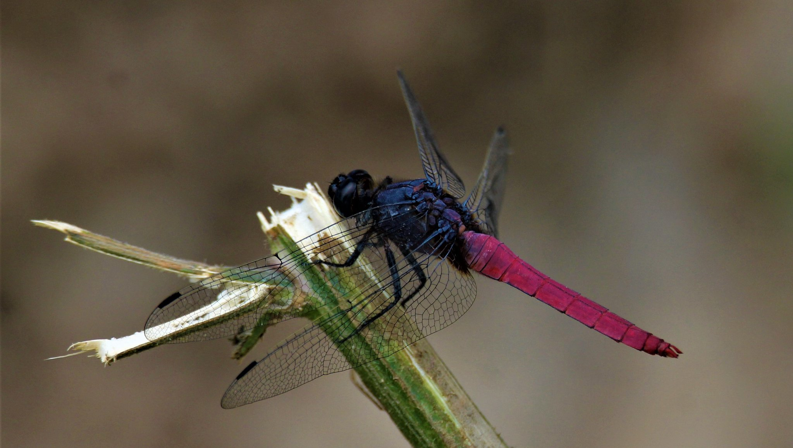
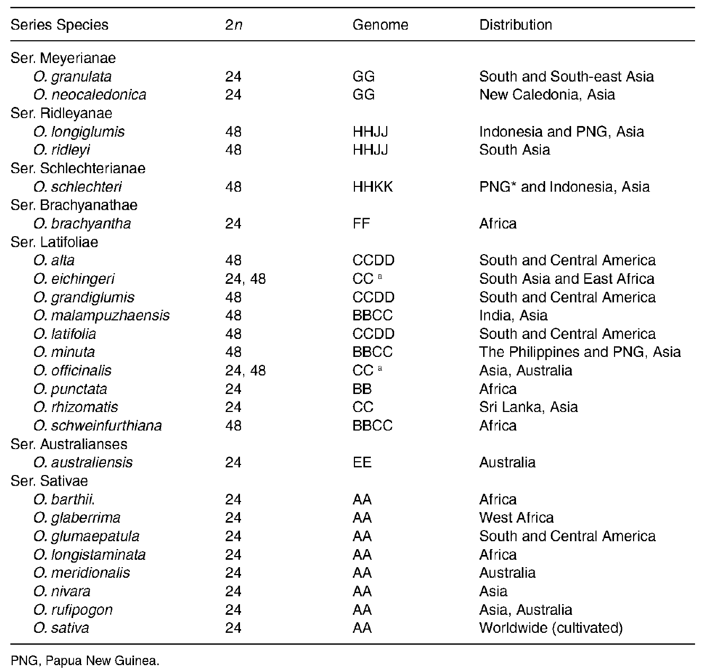
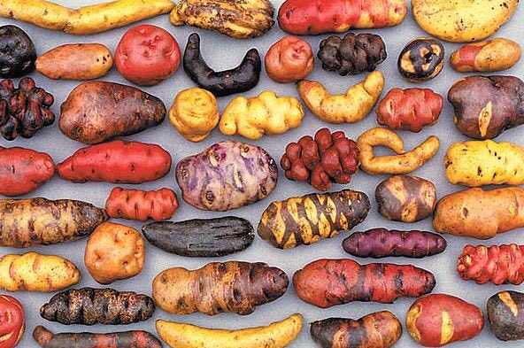
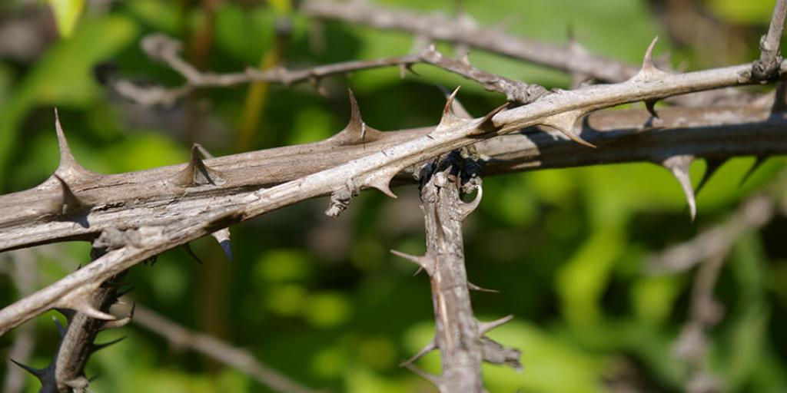
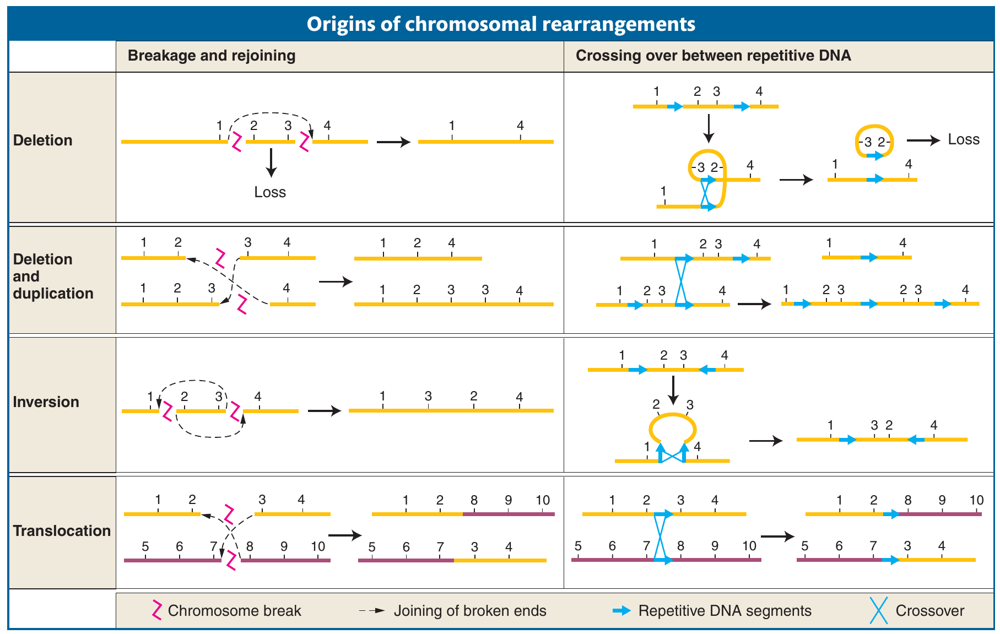
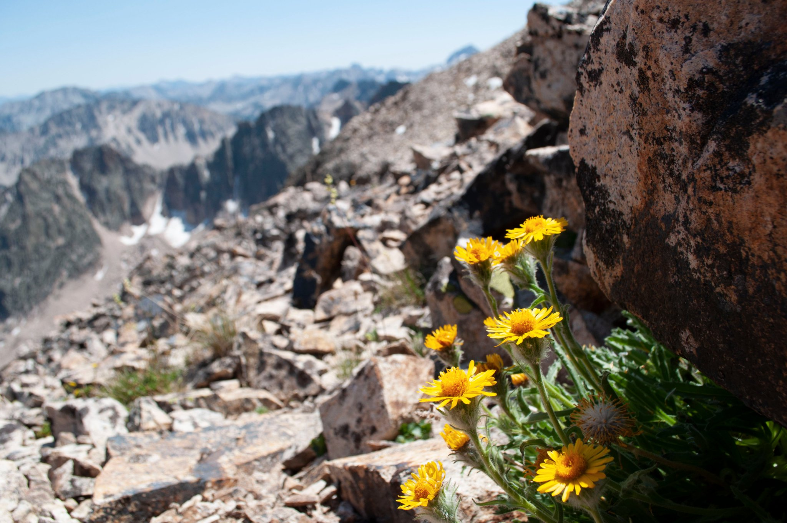
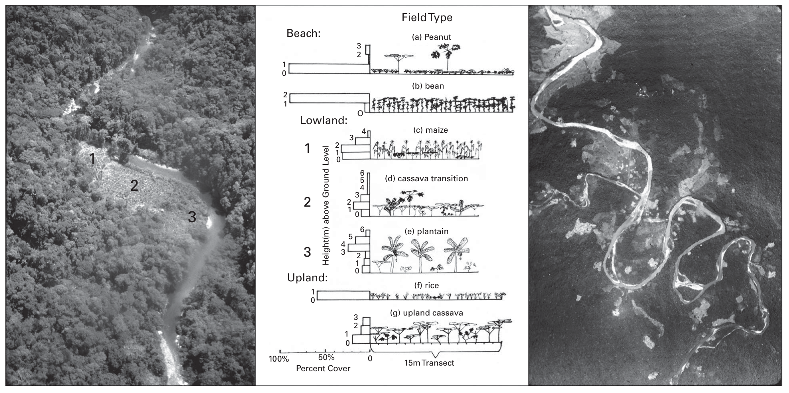

```{r setup, include=FALSE}
library(knitr)
require(tidyverse)
set.seed(453)
# invalidate cache when the package version changes
knitr::opts_chunk$set(tidy = FALSE, echo = FALSE, 
                  message = FALSE, warning = FALSE,
                  out.width = "45%")
options(knitr.table.format = "latex")
options(knitr.kable.NA = "", digits = 2)
options(kableExtra.latex.load_packages = FALSE)
```

# Concept

## Biodiversity

###

\begin{quote}
The extinction of species, each one a pilgrim of four billion years of evolution, is an irreversible loss. The ending of the lines of so many creatures with whom we have traveled this far is an occasion of profound sorrow and grief. Death can be accepted and to some degree transformed. But the loss of lineages and all their future young is not something to accept. It must be rigorously and intelligently resisted.
\end{quote}
\begin{flushright} --Gary Snyder (1990) \end{flushright}

### Meaning

- Refers to all the living things on Earth and the ecological processes associated with them. 
- Mixture of \alert{Biology} and \alert{Diversity}
- Walter G. Rosen coined the term 'Biodiversity'.
- Described in hierarchical terms including ecosystem diversity, species diversity, and genetic diversity. 
- Can be increased by natural evolutionary processes and genetic change or reduced by threats which lead to population decline and species extinction. 
- The capacity of an ecosystem to respond to changes and threats determines the rate of biodiversity loss.
- Biodiversity tends to cluster in hotspots.
- Current species inhabitation of earth is estimated at 10-14 million.
- Mass composition of biosphere is estimated at 4 Trillion mt of Carbon.
- The term 'biodiversity' emerged in the 1980s as a result of the changing understanding of the role of diversity in natural processes.

###

\begin{columns}[T,onlytextwidth]
  \column{0.5\textwidth}

```{r dragonfly, fig.cap="Arthropod diversity; Dragonfly", out.width="80%"}

```


  \column{0.5\textwidth}
  
```{r plantlice, fig.cap="Plants have lice too", out.width="50%"}
knitr::include_graphics("./../images/twttr/plant_lice_D4Ti2L6XsAI4xsQ.jpg")  
```

\end{columns}  

### Definition

\begin{block}{Diversity}
The existence of a wide variety of species (species diversity), other taxa of plants or other organisms in a natural environment or habitat, or communities within a particular environment (ecological diversity), or of genetic variation within a species (genetic diversity).
\end{block}

\begin{block}{Biodiversity defined under CBD Article 2(1)}
the variability among living organisms from all sources including, inter alia, terrestrial, marine and other aquatic ecosystems and the ecological complexes of which they are part; this includes diversity within species, between species and of ecosystems
\end{block}

\begin{block}{Agrobiodiversity}
The variety and variability of animals, plants, and microorganisms used directly or indirectly for food and agriculture (crops, livestock, forestry, and fisheries). it comprises the diversity of genetic resources (varieties, breeds, etc.) and species used for food, fuel, fodder, fiber, and pharmaceuticals.
\end{block}

### 

```{r chromosome-distribution-oryza, fig.cap="Chromosome number, genome and distribution of species in Oryza", out.width="50%"}
# pdftools::pdf_convert("./../../literatures/ecological_genetics/Agrobiodiversity-conservation-securing-the-diversity-of-crop-wild-relatives-and-landraces.pdf", pages = 235, dpi = 250, format = "png", filenames = "./../images/oryza_distribution_chromosome.png")


```

### Distribution

- Generally, diversity is more in warmer and wetter climates than in cooler and drier ones (McNeely et al., 1990). Seventy per cent of the world’s biodiversity is found in only 12 "mega-diverse" countries -- Colombia, Ecuador, Peru, Brazil, Zaire, Madagascar, China, India, Malaysia, Indonesia, Australia and Mexico – which, with the exception of Australia, are all developing, non-Western nations.

- South africa contains the most biological diversity in plant species. [Wilson, 1992, p. 260]

- Mainly conditioned by
  - temperature, 
  - precipitation, 
  - altitude, 
  - soils,
  - geography and 
  - presence of other species

## Importance

### General values

- Species have utilitarian (subsistence and commercial) value to human,
- Biodiversity represents the natural balance within an ecosystem that provides a number of ecological services, including nutrient cycling and pollination of plants, and 
- Species have intrinsic value; value of life
- Linked to daily livelihood and economic wellbeing of Nepalese
- Specifically,
  - Genetic diversity provides resources for genetic resistance to pests and diseases; 
  - In agriculture, biodiversity is a production system characterized by the presence of multiple plant and/or animal species

###

```{r potato-diversity, fig.cap="Potato diversity", out.width="70%"}

```


### Ecosystem services: beneficial consequences of biodiversity

- Provisioning services which involve the production of renewable resources (e.g.: food, wood, fresh water). Greater species diversity 
  - increases fodder yield
  - increases overall crop yield
  - increases overall wood production, in trees
- Regulating services which are those that lessen environmental change (e.g.: climate regulation, pest/disease control). Greater species diversity
  - of fish increases the stability of fisheries yield
  - of natural pest enemies decreases herbivorous pest populations
  - of plants decreases disease prevalence on plants
  - of plants increases resistance to plant invasion
  - of plants increases carbon sequestration, but note that this finding only relates to actual uptake of carbon dioxide and not long term storage
  - plants increases soil nutrient remineralization

### Ecosystem services: mixed and negative consequences of biodiversity

```{r biodiversity-thorns, fig.cap="Thorns of biodiversity", out.width="55%"}


```

### Nonmaterial services

- Cultural services represent human value and enjoyment (e.g.: landscape aesthetics, cultural heritage, outdoor recreation and spiritual significance
- Betterment of knowledge systems
- Educational value

```{r pollinator-bees, fig.cap="Bees are excellent ecosystem service providers", out.width="45%"}
knitr::include_graphics("./../images/twttr/bee_D8bkT-lUEAMzS8c.jpg")
```


## Status

### National

- Geographic diversity that ranges from alluvial plains in the tropical lowlands to very rugged and permanently snow and ice covered Himalayan Mountains. 
- Five major **physiographic** landscapes extending from east to west, namely 
  - High Himal, 
  - High Mountains, 
  - Middle Mountains, 
  - Siwaliks and 
  - Tarai 
- The **climate** varies from alpine cold semi-desert type in the trans-Himalayan zone to tropical humid type in the Tarai lowlands.
- Forests (with shrubland): 39.6%
- Grasslands and pastures: 12%

### National

- A total of 118 ecosystems
- Forest ecosystems can be categorized into ten major groups, namely 
  - tropical, 
  - subtropical broadleaved, 
  - subtropical conifer, 
  - lower temperate broadleaved, 
  - lower temperate mixed broadleaved, 
  - upper temperate broadleaved, 
  - upper temperate mixed broadleaved,
  - temperate coniferous, 
  - subalpine, and 
  - alpine scrub.

### National

- Wetlands characterized by high diversity. Nine of the country’s wetlands have been listed as Ramsar sites. 
- 12 of the 867 global terrestrial ecoregions.
- Occupies about 0.1% of the global area, but harbors 3.2% and 1.1% of the world’s known flora and fauna, respectively. 
- This includes 5.2% of the world's known mammals, 9.5% birds, 5.1% gymnosperms, and 8.2% bryophytes.
- The country is also rich in diversity of agricultural crops, their wild relatives, and domestic animal species and varieties. 

### National

- Over 550 crop species identified as having food value, and around half of those species are believed to be currently under cultivation. 
- Horticultural diversity includes:
  - ~ 400 species and subspecies of crops 
  - 45 species of seasonal fruits, 200 species of vegetables, including 11 local varieties of potatoes 
- Diversity of domestic animals.
- Endemic organisms:
  - 284 flowering plants, 
  - 160 species of animals (including one species of mammal), 
  - 1 species of bird, 
  - 14 species of herpeto-fauna 
- The high altitude rangelands are especially important from the perspective of endemism.

###

```{r genetic-variation, fig.cap="Each of the four types of chromosomal rearrangements can be produced by either of two basic mechanisms: chromosome breakage and rejoining or crossing over between repetitive DNA. Chromosome regions are numbered 1 through 10. Homologous chromosomes are the same color.", out.width="65%"}
# pdftools::pdf_convert("./../../literatures/textbooks/Introduction to Genetic Analysis/Anthony_J.F._Griffiths,_Susan_R._Wessler,_Sean_B.pdf", pages = 633, dpi = 250, format = "png", filenames = "./../images/genetic_variation_chromosome_mutation.png")


```

## Types

### On the basis of organisation

- Within species diversity (Genetic diversity) 
- Between species diversity ($\alpha$ diversity)
- Habitat diversity ($\beta$ diversity)
- Landscape diversity ($\gamma$ diversity)
- Temporal diversity
- Latter three are also recognized as ecological diversity.

### On the basis of ecological function

- Terrestrial biodiversity
- Marine biodiversity

### 

```{r landscape-diversity, fig.cap="Wildflowers in cliffs", out.width="70%"}

```

## Agrobiodiversity

### Classification: feature of life form

- Interspecific diversity
- Intraspecific diversity

### Classification: functional

- Planned
- Associated

::: incremental
- \alert{To what extent should we control associated diversity?}
:::

```{r tomato-diversity, fig.cap="Diversity of cocona (Solanum sessiliflorum) fruit size and shape has been created by selection for novel fruit types by Yanesha and other indigenous peoples of the upper Amazon; An example of Genetic diversity", out.width="48%"}
knitr::include_graphics("./../images/tomato_wild_domestic.png")
```

### 

```{r habitat-landscape, fig.cap="Yanesha agricultural diversity over time: habitat (left) and landscape (right) diversities. Three lowland agricultural fields (left) are at three different agricultural successional stages (center): (1) corn, beans, and minor crops, (2) cassava and minor crops, and (3) bananas, plantains, and minor crops. Different habitats (beaches, lowlands, and uplands) each have different agricultural successional stages (center), resulting in a very diverse, patchy landscape (right), constantly changing over time.", out.width="70%"}
# pdftools::pdf_convert("./../../literatures/ecological_genetics/Biodiversity in Agriculture_ Domestication, Evolution, and Sustainability.pdf", pages = 470, dpi = 250, format = "png", filenames = "./../images/yanesha_habitat_landscape_diversity.png")


```

### Forms

\begin{columns}[T,onlytextwidth]
  
  \column{0.5\textwidth}
  \alert{Phenotypic variation in natural populations}
  \begin{itemize}
  \item Color pattern
  \item Morphology
  \item Behavior
  \item Phenology
  \item Differences among populations
  \item Nongenetic inheritance
  \end{itemize}

  \column{0.5\textwidth}
  \alert{Genetic variation}
  \begin{itemize}
  \item DNA
  \item Protein
  \item Chromosomes
  \item Genetic variation within natural populations
  \item Genetic divergence among populations
  \end{itemize}

\end{columns}

### Mechanisms

- Mutation
- Selection
- Genetic drift
- Migration
- Inbreeding

## Domestication

### Unanswered questions

::: incremental

- Why did agricultrue originate where it did ?
- What are some of the local ecological or palaeo-ecological conditions, including climate change and human population growth, that would have favored or impeded the transition from hunting–gathering to agriculture?
- Are there specific characteristics in plants and animals that predispose them to domestication?
- What is the pattern of domestication for crops and animals?
- What is the timeline of the origins of agriculture? How quickly did agriculture
become a major alternative to hunting–gathering?

:::

### Unanswered questions

::: incremental

- How did agricultural ecosystems develop ?
- How did agricultural ecosystems spread from the centers of origin?
- How can biodiversity be maintained or enhanced in agroecosystems?
- How does California benefit from agricultural biodiversity?
- What can crop evolution studies tell us about the potential for future domestications?

:::

# Aim

### Identification and characterization

### Conservation

### Sustainable resource allocation

### Awareness and appreciation

# Scope

### Opportunity 

- To enhance food and nutrition security
- To mitigate anthropogenic climate change
- To understand fundamental ecological processes
- To gain technological efficiency
- Enhance food systems production and productivity
- Enable lesser use of non-renewable sources of energy
- Generation of robust and reusable technologies
- To discover new ecological functions and ecosystems in its entirety

### Uses

- Economic welfare and policy formulation
- Human health and medicine
- Lifestyle/livelihood betterment
- Dealing with natural calamities and epidemics
- Meeting the needs of growing population: Fresh water, healthy and nutritious food, reliable shelter and accessories of daily life.
- Fostering social harmony
- Providing for extant ecosystem
- Remedying environmental troubles
- Commerce and industry sustenance
- Leisure, cultural and aesthetic value