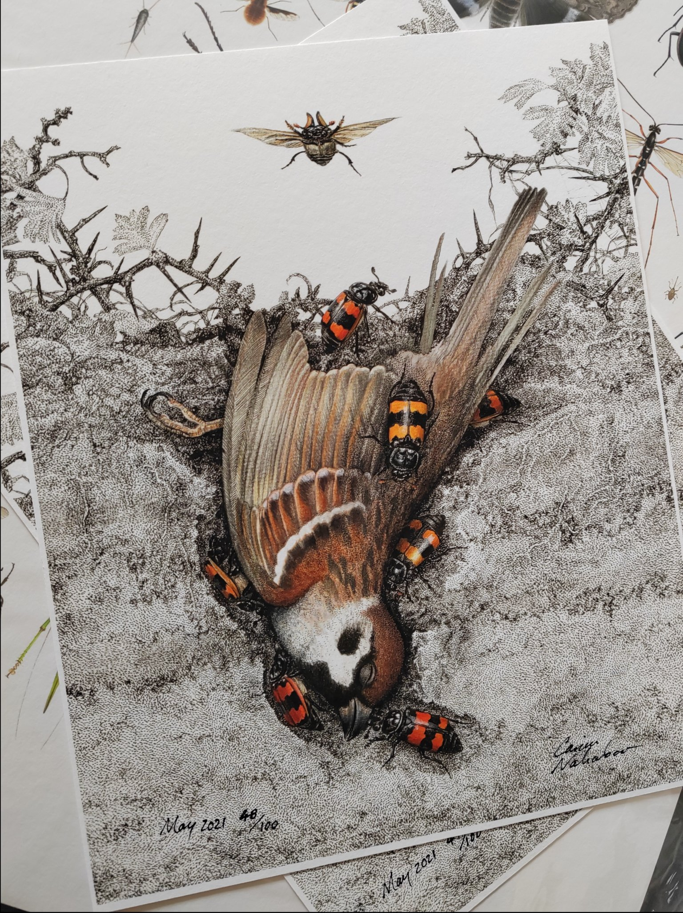

```{r setup, include=FALSE}
library(knitr)
require(tidyverse)
set.seed(453)
# invalidate cache when the package version changes
knitr::opts_chunk$set(tidy = FALSE, echo = FALSE, 
                  message = FALSE, warning = FALSE,
                  out.width = "45%")
options(knitr.table.format = "latex")
options(knitr.kable.NA = "", digits = 2)
options(kableExtra.latex.load_packages = FALSE)
```

# Biodiversity

###

\begin{quote}
The extinction of species, each one a pilgrim of four billion years of evolution, is an irreversible loss. The ending of the lines of so many creatures with whom we have traveled this far is an occasion of profound sorrow and grief. Death can be accepted and to some degree transformed. But the loss of lineages and all their future young is not something to accept. It must be rigorously and intelligently resisted.
\end{quote}
\begin{flushright} --Gary Snyder (1990) \end{flushright}

###

```{r biodiversity-champions, fig.align='center', out.width="44%"}

```


### Meaning

- Refers to all the living things on Earth and the ecological processes associated with them. 
- Walter G. Rosen coined the term 'Biodiversity' (\alert{Biology} and \alert{Diversity}).
- Described in hierarchical terms including ecosystem diversity, species diversity, and genetic diversity. 
- Can be increased by natural evolutionary processes and genetic change or reduced by threats which lead to population decline and species extinction. 
- The capacity of an ecosystem to respond to changes and threats determines the rate of biodiversity loss.
- Biodiversity tends to cluster in hotspots.
- Current species inhabitation of earth is estimated at 10-14 million.
- Mass composition of biosphere is estimated at 4 Trillion mt of Carbon.
- The term 'biodiversity' emerged in the 1980s as a result of the changing understanding of the role of diversity in natural processes.

###

\bcolumns

\column{0.5\textwidth}

<!-- When a strongly channeled outflow cools down to 40 degree C or below, the diversity goes up rapidly. Metazoan animals can adapt to live directly in the warm water, and eucaryotic algae such as green algae and diatoms invade. Although cyanobacteria are still abundant, they are heavily grazed, and do not form a thick mat. In different expressions of this community are found crustacea, midges (Diptera), and water mites (Hydrachnellae), dominated by a top predator, the larva of the dragonfly, Erythemis collocatta. The net effect on diversity is to increase the species numbers to 50 to 60, exclusive of the nonphotosynthetic microorganisms. -->

```{r dragonfly, fig.cap="Arthropod diversity; Dragonfly", out.width="92%"}
knitr::include_graphics("./../images/dragonfly_D7is9PFUEAAoQyS.jpg")
```

\column{0.5\textwidth}
  
```{r plantlice, fig.cap="Plants have lice too", out.width="54%"}
  
```

\ecolumns

###

```{r tomato-diversity-use, out.width="90%", fig.align='center'}

```

###

```{r chestnut-diversity, out.width="44%", fig.align='center'}

```

###

\bcolumns
\column{0.5\textwidth}

```{r walnut-diversity1, out.width="80%", fig.align='center'}

```

\column{0.5\textwidth}

```{r walnut-diversity2, out.width="80%", fig.align='center'}
knitr::include_graphics("../images/walnut_diversity2.jpg")
```

\ecolumns

###

```{r banana-diversity, out.width="60%", fig.align='center'}

```


### Definition

\begin{block}{Diversity}
The existence of a wide variety of species (species diversity), other taxa of plants or other organisms in a natural environment or habitat, or communities within a particular environment (ecological diversity), or of genetic variation within a species (genetic diversity).
\end{block}

###

\begin{block}{Biodiversity defined under CBD Article 2(1)}
the variability among living organisms from all sources including, inter alia, terrestrial, marine and other aquatic ecosystems and the ecological complexes of which they are part; this includes diversity within species, between species and of ecosystems
\end{block}

\begin{block}{Agrobiodiversity}
The variety and variability of animals, plants, and microorganisms used directly or indirectly for food and agriculture (crops, livestock, forestry, and fisheries). it comprises the diversity of genetic resources (varieties, breeds, etc.) and species used for food, fuel, fodder, fiber, and pharmaceuticals.
\end{block}

<!-- Refer to Chapter 6 (Plant biodiversity), Plant Biology and Biotechnology, Volume 1, 2015. -->

### 

```{r chromosome-distribution-oryza, fig.cap="Chromosome number, genome and distribution of species in Oryza", out.width="50%"}
# pdftools::pdf_convert("./../../literatures/ecological_genetics/Agrobiodiversity-conservation-securing-the-diversity-of-crop-wild-relatives-and-landraces.pdf", pages = 235, dpi = 250, format = "png", filenames = "./../images/oryza_distribution_chromosome.png")

knitr::include_graphics("./../images/oryza_distribution_chromosome.png")
```

### Distribution

- Generally, diversity is more in warmer and wetter climates than in cooler and drier ones (McNeely et al., 1990). Seventy per cent of the world’s biodiversity is found in only 12 "mega-diverse" countries -- Colombia, Ecuador, Peru, Brazil, Zaire, Madagascar, China, India, Malaysia, Indonesia, Australia and Mexico – which, with the exception of Australia, are all developing, non-Western nations.

- South africa contains the most biological diversity in plant species. [Wilson, 1992, p. 260]

- Mainly conditioned by
  - temperature, 
  - precipitation, 
  - altitude, 
  - soils,
  - geography and 
  - presence of other species

## Importance

### General values

- Species have utilitarian (subsistence and commercial) value to human,
- Biodiversity represents the natural balance within an ecosystem that provides a number of ecological services, including nutrient cycling and pollination of plants, and 
- Species have intrinsic value; value of life
- Linked to daily livelihood and economic wellbeing of Nepalese
- Specifically,
  - Genetic diversity provides resources for genetic resistance to pests and diseases; 
  - In agriculture, biodiversity is a production system characterized by the presence of multiple plant and/or animal species

###

```{r fungal-fruiting-body-diversity, fig.align='center', out.width="85%"}

```


### Ecosystem services: beneficial consequences of biodiversity

- Provisioning services which involve the production of renewable resources (e.g.: food, wood, fresh water). Greater species diversity 
  - increases fodder yield
  - increases overall crop yield
  - increases overall wood production, in trees
- Regulating services which are those that lessen environmental change (e.g.: climate regulation, pest/disease control). Greater species diversity
  - of fish increases the stability of fisheries yield
  - of natural pest enemies decreases herbivorous pest populations
  - of plants decreases disease prevalence on plants
  - of plants increases resistance to plant invasion
  - of plants increases carbon sequestration, but note that this finding only relates to actual uptake of carbon dioxide and not long term storage
  - plants increases soil nutrient remineralization

###

```{r lesser-known-tigers, out.width="58%", fig.align='center'}

```

###

```{r natural-scavengers, out.width="65%", fig.align='center'}

```


### Ecosystem services: positive and negative consequences of biodiversity

\bcolumns
\column{0.5\textwidth}

```{r pollinator-bees, fig.cap="Bees are excellent ecosystem service providers", out.width="80%"}
knitr::include_graphics("./../images/bee_D8bkT-lUEAMzS8c.jpg")
```

\column{0.5\textwidth}

```{r biodiversity-thorns, fig.cap="Thorns of biodiversity", out.width="96%"}

# invasive species
# wild gene intogression
knitr::include_graphics("./../images/biodiversity_thorns.jpg")
```

\ecolumns

### Nonmaterial services

\bcolumns

\column{0.4\textwidth}
- Cultural services represent human value and enjoyment (e.g.: landscape aesthetics, cultural heritage, outdoor recreation and spiritual significance)
- Betterment of knowledge systems
- Educational value

\column{0.6\textwidth}

```{r aesthetic-birds, out.width="62%", fig.align='center'}

```

\ecolumns

## Status

### National

- Geographic diversity that ranges from alluvial plains in the tropical lowlands to very rugged and permanently snow and ice covered Himalayan Mountains. 
- Five major **physiographic** landscapes extending from east to west, namely 
  - High Himal, 
  - High Mountains, 
  - Middle Mountains, 
  - Siwaliks and 
  - Tarai 
- The **climate** varies from alpine cold semi-desert type in the trans-Himalayan zone to tropical humid type in the Tarai lowlands.
- Forests (with shrubland): 39.6%
- Grasslands and pastures: 12%

### National

- A total of 118 ecosystems
- Forest ecosystems can be categorized into ten major groups, namely 
  - tropical, 
  - subtropical broadleaved, 
  - subtropical conifer, 
  - lower temperate broadleaved, 
  - lower temperate mixed broadleaved, 
  - upper temperate broadleaved, 
  - upper temperate mixed broadleaved,
  - temperate coniferous, 
  - subalpine, and 
  - alpine scrub.

### National

- Wetlands characterized by high diversity. Nine of the country’s wetlands have been listed as Ramsar sites. 
- 12 of the 867 global terrestrial ecoregions.
- Occupies about 0.1% of the global area, but harbors 3.2% and 1.1% of the world’s known flora and fauna, respectively. 
- This includes 5.2% of the world's known mammals, 9.5% birds, 5.1% gymnosperms, and 8.2% bryophytes.
- The country is also rich in diversity of agricultural crops, their wild relatives, and domestic animal species and varieties. 

### National

- Over 550 crop species identified as having food value, and around half of those species are believed to be currently under cultivation. 
- Horticultural diversity includes:
  - ~ 400 species and subspecies of crops 
  - 45 species of seasonal fruits, 200 species of vegetables, including 11 local varieties of potatoes 
- Diversity of domestic animals.
- Endemic organisms:
  - 284 flowering plants, 
  - 160 species of animals (including one species of mammal), 
  - 1 species of bird, 
  - 14 species of herpeto-fauna 
- The high altitude rangelands are especially important from the perspective of endemism.

## Types

### On the basis of organisation

- Within species diversity (Genetic diversity) 
- Between species diversity ($\alpha$ diversity)
- Habitat diversity ($\beta$ diversity)
- Landscape diversity ($\gamma$ diversity)
- Temporal diversity
- Latter three are also recognized as ecological diversity.

<!-- Spatially heterogeneous area composed of a mosaic of interacting components (patches, corridors, and area of matrix). -->

### On the basis of ecological function

- Terrestrial biodiversity
- Marine biodiversity

- **Guild**: A group of species having similar functional roles in the community (e.g. a guild of herbivores, a guild of nitrogen fixers).

### 

```{r landscape-diversity, fig.cap="Wildflowers in cliffs", out.width="70%"}

```

# Agrobiodiversity

### Classification: feature of life form

\bcolumns
\column{0.5\textwidth}

- Interspecific diversity
- Intraspecific diversity

\column{0.5\textwidth}

```{r gene-pools-coffee, fig.cap="Primary (GP-1), Secondary (GP-2) and Tertiary (GP-3) gene pools of \\textit{Coffea arabica} in relation to some studied species of Eucoffea and Mascarocoffea.", out.width="85%"}


# Polyploidy is certainly involved in the origin of C. arabica (2n = 44), since 2n equals 22 in all other species. Since more than 40 traits thus far investigated all show disomic inheritance and only occassional bivalents are formed in meiosis of haploids (dihaploids), autopolyploidization of a diploid species is very unlikely. C. arabica can probably be properly considered a segmental allopolyploid in the sense defined by Stebbins (1950), as several authors have suggested.

# For an extended reading about origins and germplasm of Coffee refer to Volume 2, Plant Breeding Reviews (page: 181).
```

\ecolumns

### Classification: functional

- Planned
- Associated

::: incremental
- \alert{To what extent should we control associated diversity?}
:::

```{r tomato-diversity, fig.cap="Diversity of cocona (Solanum sessiliflorum) fruit size and shape has been created by selection for novel fruit types by Yanesha and other indigenous peoples of the upper Amazon; An example of Genetic diversity", out.width="48%"}
knitr::include_graphics("./../images/tomato_wild_domestic.png")
```

### 

```{r habitat-landscape, fig.cap="Yanesha agricultural diversity over time: habitat (left) and landscape (right) diversities. Three lowland agricultural fields (left) are at three different agricultural successional stages (center): (1) corn, beans, and minor crops, (2) cassava and minor crops, and (3) bananas, plantains, and minor crops. Different habitats (beaches, lowlands, and uplands) each have different agricultural successional stages (center), resulting in a very diverse, patchy landscape (right), constantly changing over time.", out.width="70%"}
# pdftools::pdf_convert("./../../literatures/ecological_genetics/Biodiversity in Agriculture_ Domestication, Evolution, and Sustainability.pdf", pages = 470, dpi = 250, format = "png", filenames = "./../images/yanesha_habitat_landscape_diversity.png")

knitr::include_graphics("./../images/yanesha_habitat_landscape_diversity.png")
```

### Forms

\begin{columns}[T,onlytextwidth]
  
  \column{0.5\textwidth}
  \alert{Phenotypic variation in natural populations}
  \begin{itemize}
  \item Color pattern
  \item Morphology
  \item Behavior
  \item Phenology
  \item Differences among populations
  \item Nongenetic inheritance
  \end{itemize}

  \column{0.5\textwidth}
  \alert{Genetic variation}
  \begin{itemize}
  \item DNA
  \item Protein
  \item Chromosomes
  \item Genetic variation within natural populations
  \item Genetic divergence among populations
  \end{itemize}

\end{columns}

### Mechanisms

- Mutation
- Selection
- Genetic drift
- Migration
- Inbreeding

# Aim

### Identification and characterization

<!-- Classifying and naming organisms is probably as old as human language. Linnean binomial nomenclature laid the foundations of taxonomy, i.e. naming species scientifically, and evolved into Codes defining rules for scientific naming of animals, plants, bacteria and viruses. Additional frameworks and databases were established to deal with genetic variability, as observed in cultivars, animal races, genetic sequences and transgenic organisms. Only 1.75 million extant species have hitherto been named scientifically. Classification of biodiversity is hierarchical.-->

\bcolumns
\column{0.65\textwidth}
\small

- Biodiversity is characterized by classification and naming of its elements -- genes, species and ecosystems.
- Both cultural expressions as well as scientific endeavours such as genetic sequencing may be used in the approach.
- Classification of biodiversity is **hierarchical**.
- Modern **systematics** tries to reflect the "natural" system, based on the relation and genealogy of species as "products" of evolution, based on Darwin´s theory and its extensions through the "modern synthesis" -- visualized as a "tree of life".
<!-- The exact relation between its branches is still a matter of research and discussion. -->
- Major issues with systematics:
  - Basis of grouping (morphology, form, DNA sequences, etc.)
  - Definition of "species"

\column{0.35\textwidth}

<!-- Characterization of biodiversity is not only a scientific exercise, but a fundamental trait of humans, deeply rooted within all cultures. It might be motivated by ecological or economic dependence, religious or aesthetic empathy (Wilson 1984), or, to put it more simply, curiosity, fascination or pastime. The very early representations are restricted to wildlife, and therefore clearly represent a hunter´s background. Cultural artefacts were made from animal products, such as bones or ivory. Among the earliest cultural artifacts are astoundingly accurate representations of wildlife in caves. Research combining archaeology and zoological analysis of cave paintings revealed that these were accurate documentations of the extant fauna and must be considered as early documents in the chain of evidence for ecological change in recent times. -->

<!-- For example, hunters and fishermen have their own arcane terminology, and breeders characterize thousands of races, sports or varieties. Plant breeders require exact knowledge of cultivars, including the taxonomy and genomics of their wild relatives. Hunting, fishery and logging needs data on stocks of reliably identified species. Agriculturists must identify pest species, potential invaders and their natural enemies. In summary, all these applied fields need solid, fundamental data from biodiversity research. -->

```{r zaraysk-bison, fig.cap="The bison, sculpted in mammoth ivory and coloured with red ochre, is one of the largest ivory sculptures of the Ice Age. Its distinct naturalism is exceptional. Archaeologists also know that the two left legs of the sculpture were deliberately broken before it was carefully buried.", out.width="90%"}

# Discovered at Zaraysk, Russia, and dated at roughly 20,000 years, this piece depicts a female bison and was fully sculpted in the round.
```

\ecolumns

### Conservation

```{r potato-germplasm-conservation, fig.cap="Potato diversity", out.width="70%"}
# Diversity panel of potato germplasm maintained at CIP
knitr::include_graphics("./../images/potato_diversity_D7N0aiUXYAIXcLq.jpg")
```

### Sustainable resource allocation

\bcolumns
\column{0.65\textwidth}

<!-- 1980s and early 1990s produced a plethora of sustainable agriculture development writings. Future Horizons: Recent Literature in Sustainable Agriculture (Hegyes and Francis, 1997) is an excellent review of this broad literature. -->
- The terms "low-input sustainable" and "alternative agriculture" appeared frequently and are still being used (most in relation to organic production systems).
- Alternative agriculture system is defined as any food or fiber production that has:
  \begin{itemize}
  \footnotesize
  \item a more thorough incorporation of natural processes;
  \item reduced use of off-farm inputs, with less harm to the environment and consumers;
  \item a more productive use of biological and genetic potentials of plant and animals;
  \item a better match between cropping patterns and the physical capacity of lands; and
  \item an improved emphasis on conservation of soil, water, energy and biological resources.
  \end{itemize}

\column{0.35\textwidth}

```{r mixed-enterprises-sustainable, fig.cap="Combination of enterprises in mixed farming systems.", out.width="95%"}

```

\ecolumns

### Awareness and appreciation

```{r plant-more-trees, fig.align='center'}

```

# Scope

### Opportunity 

- To enhance food and nutrition security
- To mitigate anthropogenic climate change
- To understand fundamental ecological processes
- To gain technological efficiency
- Enhance food systems production and productivity
- Enable lesser use of non-renewable sources of energy
- Generation of robust and reusable technologies
- To discover new ecological functions and ecosystems in its entirety

### Uses

- Economic welfare and policy formulation
- Human health and medicine
- Lifestyle/livelihood betterment
- Dealing with natural calamities and epidemics
- Meeting the needs of growing population: Fresh water, healthy and nutritious food, reliable shelter and accessories of daily life.
- Fostering social harmony
- Providing for extant ecosystem
- Remedying environmental troubles
- Commerce and industry sustenance
- Leisure, cultural and aesthetic value