```{r setup, include=FALSE}
library(knitr)
require(tidyverse)
set.seed(453)
# invalidate cache when the package version changes
knitr::opts_chunk$set(tidy = FALSE, echo = FALSE, 
                  message = FALSE, warning = FALSE,
                  out.width = "45%")
options(knitr.table.format = "latex")
options(knitr.kable.NA = "", digits = 2)
options(kableExtra.latex.load_packages = FALSE)
```

# Background

## Basics

###

```{r properties-life, fig.cap="Some properties of life", out.width="46%"}
# pdftools::pdf_convert("/media/deependra/e4da4ac5-3b38-4b89-9402-397eb940e4d3/Addition/Generalized Study/Reece Campbell Biology 9th txtbk.pdf", pages = 50, dpi = 250, format = "png", filenames = "./../images/properties_of_life.png")

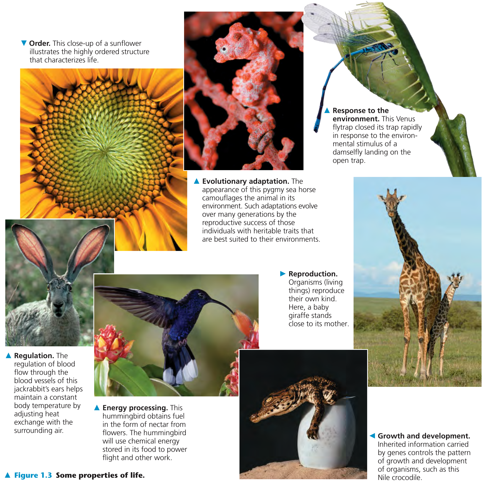
```

<!-- \\footnote<.->{Reece et al. (2014)} -->

### Level of organisation

- Biosphere
- Ecosystems
- Communities
- Populations
- Organisms
- Organs and organ systems
- Tissues
- Cells
- Organelles
- Molecules

### Systematics

- \textbf{Systematics} is a field of research which aims to organize the huge diversity of organisms.
- Objective is to use phylogenies that reflect natural relationships between organisms.
- Based on "relatedness"
- Who tests and verifies: Cytologists, geneticists, morphologist and evolutionary biologist.
- Traditionally morpho-anataomy was used to distinguish between organisms.
- In many cases, DNA sequences -- so-called DNA barcodes can be used to identify species (see http://barcoding.si.edu).
- **Monographs** are works concerning whole groups of related species (e.g., monograph of the genus Primula), and **floras** are systematic works concerning the plant inventory of a geographical area (e.g., flora of Germany).
- Monographs and floras contain descriptions of the species involved and also, by means of a key, the tools for identifying a plant.

### Relationships

```{r taxon-relationships, fig.cap="Relationships. The degree of relationship is defined by the relative age of the last common ancestor. Taxon B is more closely related to taxon C than to taxon A.", out.width="50%"}
# pdftools::pdf_convert("./../../literatures/Plant Science Straussberger.pdf", pages = 676, dpi = 250, format = "png", filenames = "./../images/relationship_common_ancestor.png")

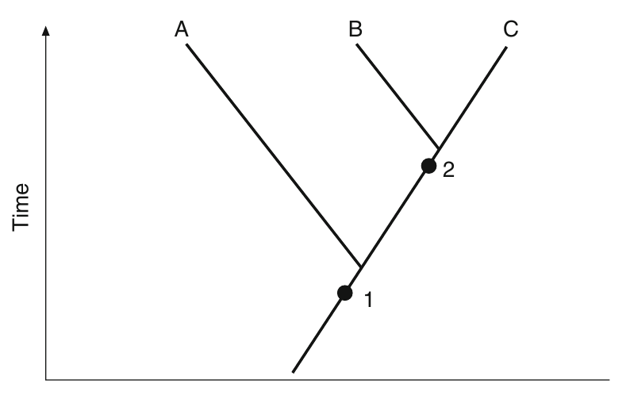
```

### Characters

- Microscopic and macroscopic
- Morphology describes the external structure of plants and is very important in systematics.
- Anatomy is the study of internal plant structure. Includes: Histology, Cytology, Karyology, Palynology, Embryology
- The structure of plant compounds is dealt with in phytochemistry. 
- A systematist can also draw on characters from physiology, ecology, chorology (the geographical distribution of taxa), and phytopathology and can also consider information on fossil forms taken from paleobotany.
- Experimental systematics, using breeding experiments and crossing success as a criterion for relationships, is not applied now. Instead, the analysis of proteins and nucleic acids has taken on special significance in phylogenetic research.

### Taxonomic ranks

```{r taxonomic-ranks, fig.cap="Overview of the more important taxonomic ranks, their standardized ending, and the taxonomic units using yarrow (Achillea millefolium L.) as an example", out.width="25%"}
# pdftools::pdf_convert("./../../literatures/Plant Science Straussberger.pdf", pages = 683, dpi = 250, format = "png", filenames = "./../images/taxonomic_rank_yarrow.png")

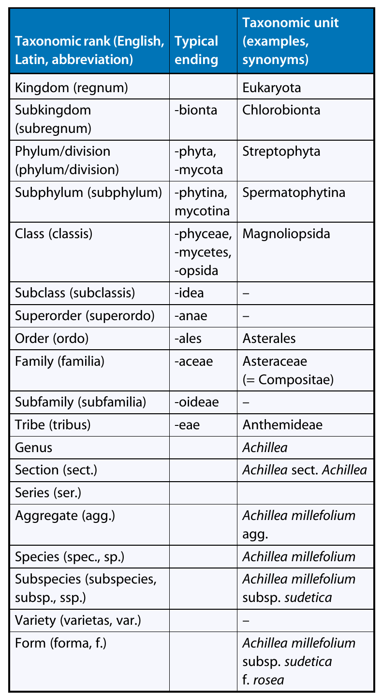
```

# Classifying life

## Approaches and trend

###

```{r classifying-life, fig.cap="Linnaean classification of \\textit{Ursus americanus}", out.width="55%"}
# pdftools::pdf_convert("/media/deependra/e4da4ac5-3b38-4b89-9402-397eb940e4d3/Addition/Generalized Study/Reece Campbell Biology 9th txtbk.pdf", pages = 60, dpi = 250, format = "png", filenames = "./../images/classification_ursus.png")

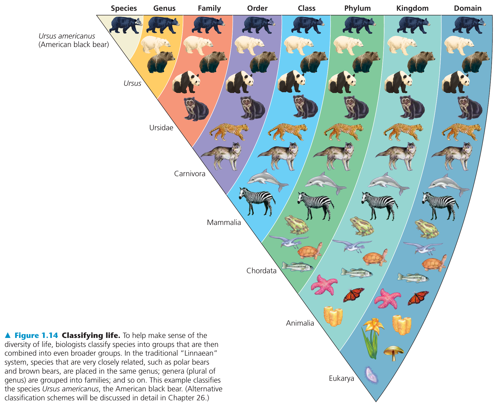
```

### Approaches to classification

- The terms "plants" and "animals" were originally used to describe the main groups of living organisms (Regnum Plantae and Regnum Animale) defined by early systematics and taxonomy. 
- Nowadays, it is well accepted that these groups reflect organizational levels with nutritional and physiological differences and are not natural groups. The term "plant kingdom" does not refer to an evolutionary unit with shared common ancestry and therefore does not refer to a taxon. Plants can be defined as photoautotrophic organisms.
- Ultrastructure of cell reveals two cell forms: Prokaryotic and eukaryotic
- Modern molecular phylogenetic methods indicate differentiation into three groups: the \textbf{Archaea}, \textbf{Bacteria} and \textbf{Eukarya}.

###

```{r domains-life, fig.cap="Three domains of life.", out.width="55%"}
# pdftools::pdf_convert("/media/deependra/e4da4ac5-3b38-4b89-9402-397eb940e4d3/Addition/Generalized Study/Reece Campbell Biology 9th txtbk.pdf", 
#                       pages = 61, dpi = 250, format = "png", filenames = "./../images/three_domains_life.png")

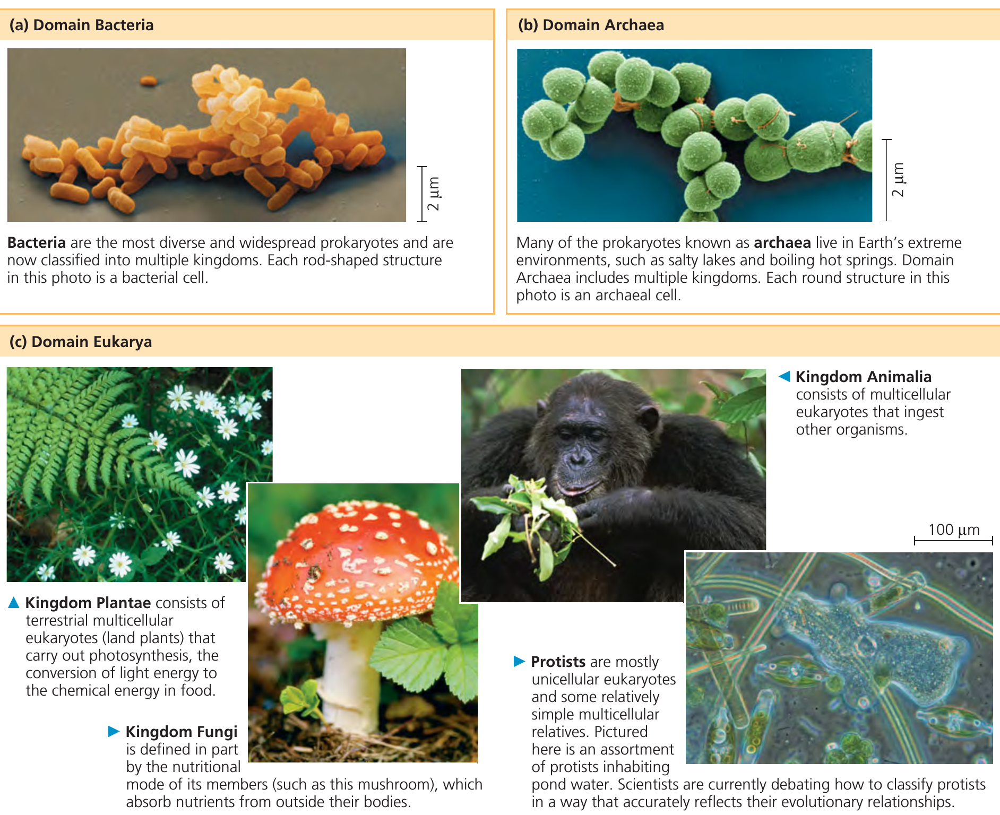
```

## Domains of life

### Classification

\begin{columns}[T,onlytextwidth]
  \column{0.33\textwidth}
  \alert{Bacteria} phylums \\
  \begin{itemize}
  \item Primobacteriota: Deeply rooted
  \item Posibacteriota: Gram positive
  \item Negibacteriota: Gram negative
  \item Cyanobacteriota: Cyanoprokaryota, Cyanophyta, BGA
  \end{itemize}
  
  \column{0.33\textwidth}
  \alert{Archaea} phylums \\  
  \begin{itemize}
  \item Crenarchaeota
  \item Euryarchaeota
  \end{itemize}
 
  \column{0.33\textwidth}
  \alert{Eukarya} subkingdoms \\
  \begin{itemize}
  \item Acrasiobionta
  \item Myxobionta
  \item Heterotrophic heterokontobionta
  \item Mycobionta
  \item Glaucobionta
  \item Rhodobionta
  \item Autotrophic heterokontobionta
  \end{itemize}
  
\end{columns}

### Comparison of domains of life

```{r eu-arch-prokaryotic-cell, echo=FALSE}
eu_arc_pro <- read_csv("./../data/bacteria_archea_eukaryotes.csv") %>% 
  rename(" " = "X1")
eu_arc_pro %>%
  knitr::kable(caption = "Comparison of some lower life forms", 
               booktabs = TRUE, digits = 2, escape = FALSE) %>% 
  kableExtra::kable_styling(latex_options = "striped", font_size = 6) %>% 
  kableExtra::column_spec(1, bold = TRUE) %>% 
  kableExtra::column_spec(column = 1:3, width = c("15em","15em","15em"))
```

## Bacteria

### Introduction

- Prokaryotic organisms having special chemical cell wall structure (murein sacculus).
- Eubacteria constitutes phyla other than Cyanobacteria.
- Mostly heterotrophic mode of nutrition.
- Average cell width: 1 $\mu m$, length: 3-10 $\mu m$
- May form colony or remain solitary
- Cell filaments, if present, can be branched or unbranched.
- DNA localized in nucleoid (coil-shaped structure)
- Gene maps have been plotted for several bacteria types ( _E. coli_, _Salmonella typhimurium_).

### Bacterial life

- \alert{Nutrition}: The nutrition of bacteria differs according to the energy source, the electron donor, and the carbon source. Energy acquisition occurs either as a result of breakdown of substances in the substrate (chemotrophy) or by using light energy.
- \alert{Motility}: Exhibit chemotaxis. Flagella may be present (single to multiple to scattered over entire surface)
- \alert{Reproduction and genetic matter exchange}:
  - Binary fission
  - Endospore formation
  - Transformation
  - Transduction
  - Conjugation

###

```{r bacteria, fig.cap="Bacterial forms. (a) Staphylococcus. (b) Lactobacillus. (c) Bdellovibrio. (d) Spirillum. (e) Caulobacter (x4,000). (f) Sarcina. (g–i) Sphaerotilus. (g) Motile stage (x700). (h) Sphaerotilus (x330). (i) Start of cell division (x800). (j) Streptomyces. (k–m) Chondromyces. (k) Rods (x200). (l) Sporocarps. (m) 'Fruit bodies' (x30)", out.width="55%"}
# pdftools::pdf_convert("./../../literatures/Plant Science Straussberger.pdf", pages = 689, dpi = 250, format = "png", filenames = "./../images/bacteria.png")

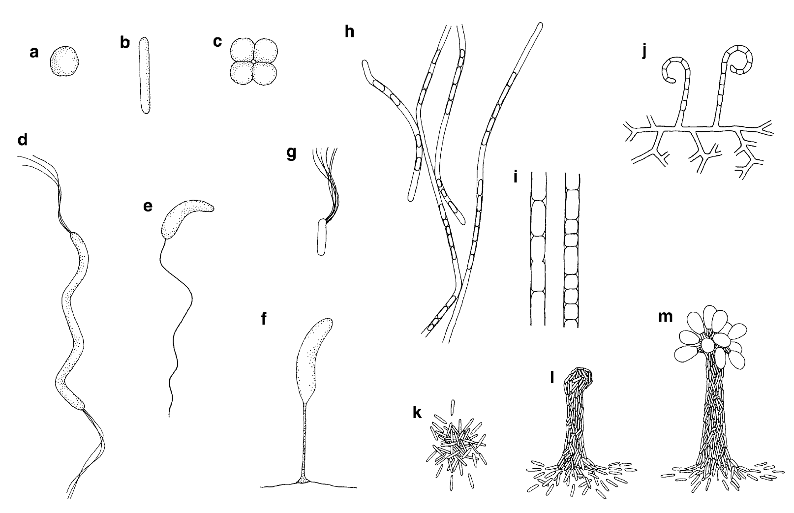
```

###

```{r bacterial-nutrition-modes, fig.cap="\\textbf{Major nutritional modes of bacteria.}", out.width="55%"}
# pdftools::pdf_convert("/media/deependra/e4da4ac5-3b38-4b89-9402-397eb940e4d3/Addition/Generalized Study/Reece Campbell Biology 9th txtbk.pdf", pages = 613, dpi = 250, format = "png", filenames = "./../images/nutritional_modes_bacteria.png")

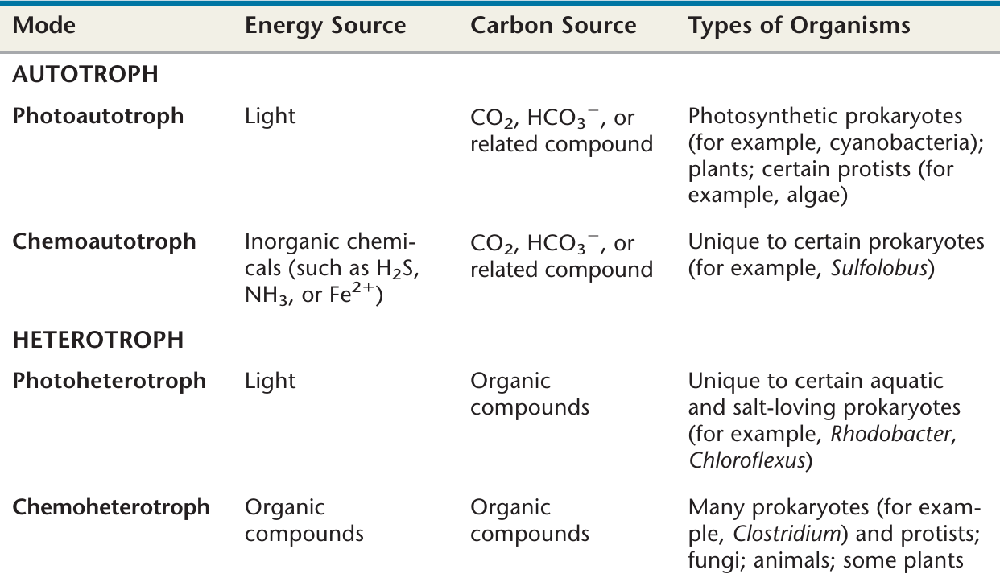
```

###

```{r bacterial-conjugation, fig.cap="\\textbf{Bacterial conjugation.} \\newline The E. coli donor cell (left) extends a pilus that attaches to a recipient cell, a key first step in the transfer of DNA. The pilus is a flexible tube of protein subunits (TEM).", out.width="55%"}
# pdftools::pdf_convert("/media/deependra/e4da4ac5-3b38-4b89-9402-397eb940e4d3/Addition/Generalized Study/Reece Campbell Biology 9th txtbk.pdf", pages = 610, dpi = 250, format = "png", filenames = "./../images/bacterial_conjugation_pilus.png")

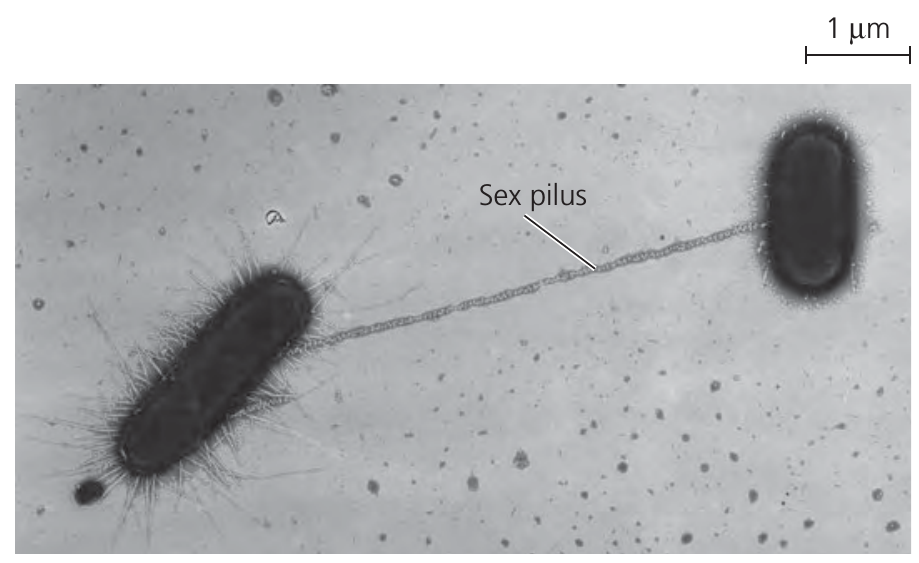
```

###

```{r gram-staining, fig.cap="Gram staining", out.width="70%"}
# pdftools::pdf_convert("/media/deependra/e4da4ac5-3b38-4b89-9402-397eb940e4d3/Addition/Generalized Study/Reece Campbell Biology 9th txtbk.pdf", pages = 605, dpi = 250, format = "png", filenames = "./../images/gram_staining.png")

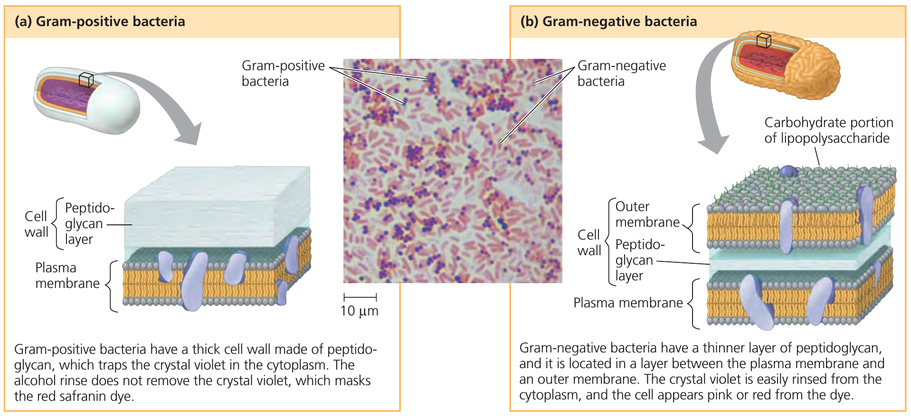
```

## Major groups of bacteria

### Proteobacteria

- Negibacteriota consists of 15 groups altogether.
- Proteobacteria are a group of gram negative bacteria.
- They are phototrophic, chemolithotrophic, or chemoorganotrophic. 
- A genus of $\alpha$-subgroup of this group, Bradyrhizobium, lives in symbiosis with soybean (in root nodules) and is capable of fixing atmospheric nitrogen.
- Both anaerobic and aerobic
- Recognized subgroups: 
  - $\alpha$ Proteobacteria
  - $\beta$ Proteobacteria
  - $\gamma$ Proteobacteria
  - $\delta$ Proteobacteria
  - $\epsilon$ Proteobacteria

### 

```{r proteobacteria, fig.cap="Common bacteria in proteobacteria group", out.width="55%"}
# pdftools::pdf_convert("/media/deependra/e4da4ac5-3b38-4b89-9402-397eb940e4d3/Addition/Generalized Study/Reece Campbell Biology 9th txtbk.pdf", pages = 616, dpi = 250, format = "png", filenames = "./../images/proteobacteria_group.png")

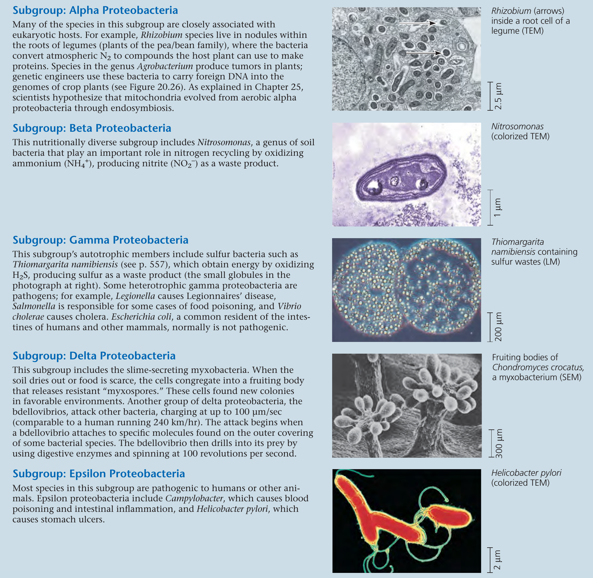
```

### Chlamydias and spirochetes

- These parasites can survive only within animal cells, depending on their hosts for resources as basic as ATP. 
- The gram-negative walls of chlamydias are unusual in that they lack peptidoglycan. 
- One species, Chlamydia trachomatis, is the most common cause of blindness in the world and also causes nongonococcal urethritis, most common STD in US.
- These helical heterotrophs spiral through their environment by means of rotating, internal, flagellum-like filaments. 
- Many spirochetes are free-living, but others are notorious pathogenic parasites: _Treponema pallidum_ causes syphilis, and _Borrelia burgdorferi_ causes Lyme disease.

### Cyanobacteria

- Plantlike prokaryotes with oxygen-generating photosynthesis. 
- Both solitary and filamentous cyanobacteria are abundant components of freshwater and marine phytoplankton, the collection of photosynthetic organisms that drift near the water's surface. 
- Some filaments have cells specialized for nitrogen fixation, the process that incorporates atmospheric $N_2$ into inorganic compounds that can be used in the synthesis of amino acids and other organic molecules.

###

\begin{columns}[T,onlytextwidth]
  \column{0.33\textwidth}

```{r chlamydias, fig.cap="Chlamydias", out.width="90%"}
# pdftools::pdf_convert("/media/deependra/e4da4ac5-3b38-4b89-9402-397eb940e4d3/Addition/Generalized Study/Reece Campbell Biology 9th txtbk.pdf", pages = 617, dpi = 250, format = "png", filenames = "./../images/bacteria_chlamydias.png")

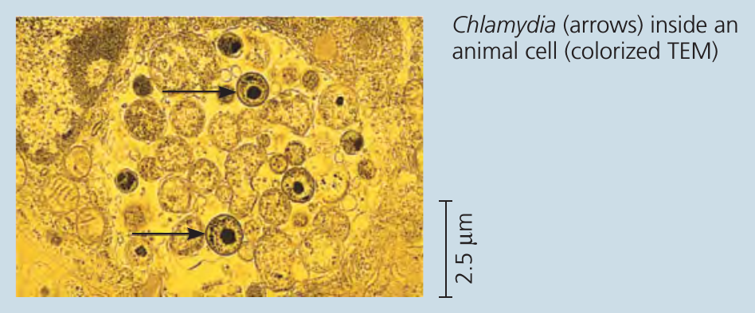
```

  \column{0.33\textwidth}

```{r spirochetes, fig.cap="Spirochetes", out.width="90%"}
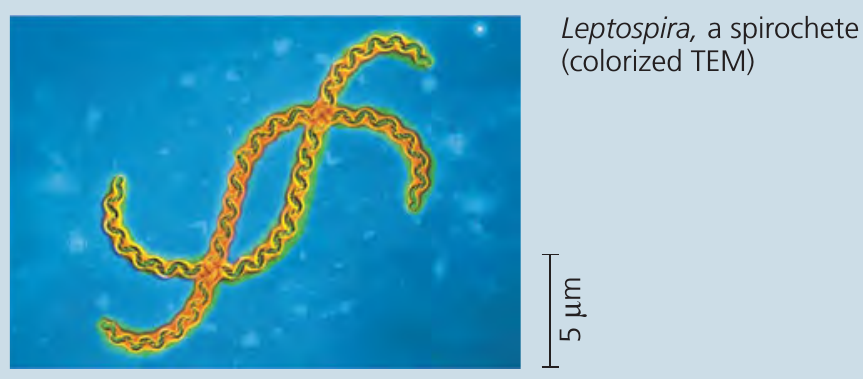
```  
  
  \column{0.33\textwidth}

```{r cyanobacteria, fig.cap="Cyanobacteria", out.width="90%"}
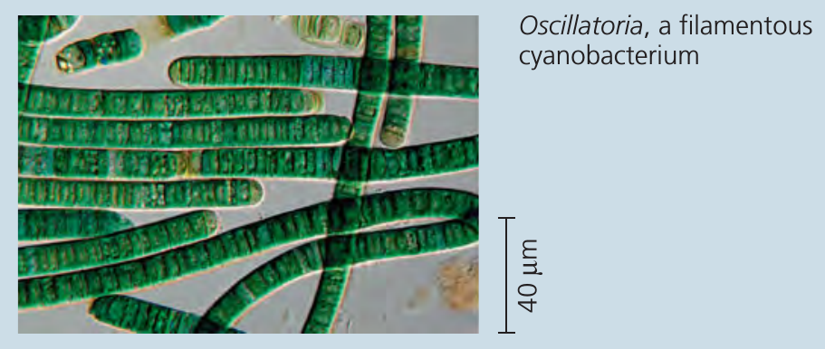
```  
  
\end{columns}  

### Gram positive bacteria

- Highly diverse group
- Subgroups include:
  - Actinomycetes; form colonies or fee-living, Cause "earthy" order of soil
  - Cocci
  - Rods not forming spores
  - Spore forming rods
  - Coryneform
  - Mycoplasmas

### 

```{r gram-positive, fig.cap="Gram positive bacteria", out.width="55%"}
# pdftools::pdf_convert("/media/deependra/e4da4ac5-3b38-4b89-9402-397eb940e4d3/Addition/Generalized Study/Reece Campbell Biology 9th txtbk.pdf", pages = 617, dpi = 250, format = "png", filenames = "./../images/gram_positive_str_myc.png")

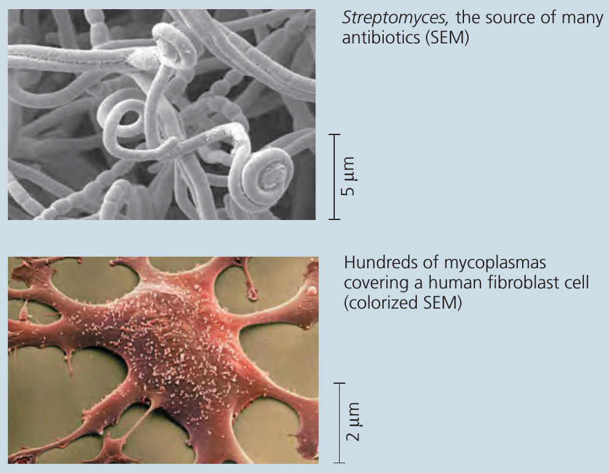
```

## Archaea

###

- Archaea share certain traits with bacteria and other traits with eukaryotes.
- Includes **extremophiles**:
  - extreme halophiles: _Halobacterium_ spp.
  - extreme thermophiles: _Pyrococcus furiosus_
- Includes methanogens (within guts of cattle, termites, in swamps)
- Euryarchaeota, Crenarchaeota, Korarchaeota, Nanoarchaeota (smallest known organism)

## Eukarya

### Acraciobionta

- Includes slime molds that lack flagellate cells.
- Pseudoplasmodia formed by the aggregation of single cells, without fusion.
- Cell walls are made of cellulose.

###

```{r acraciobionta-dictyostelium, fig.cap="Life cycle of Dictyostelium discoideum (right x100, left x8 enlarged)", out.width="35%"}
# pdftools::pdf_convert("./../../literatures/Plant Science Straussberger.pdf", pages = 706, dpi = 250, format = "png", filenames = "./../images/acraciobionta_dictyostelium.png")

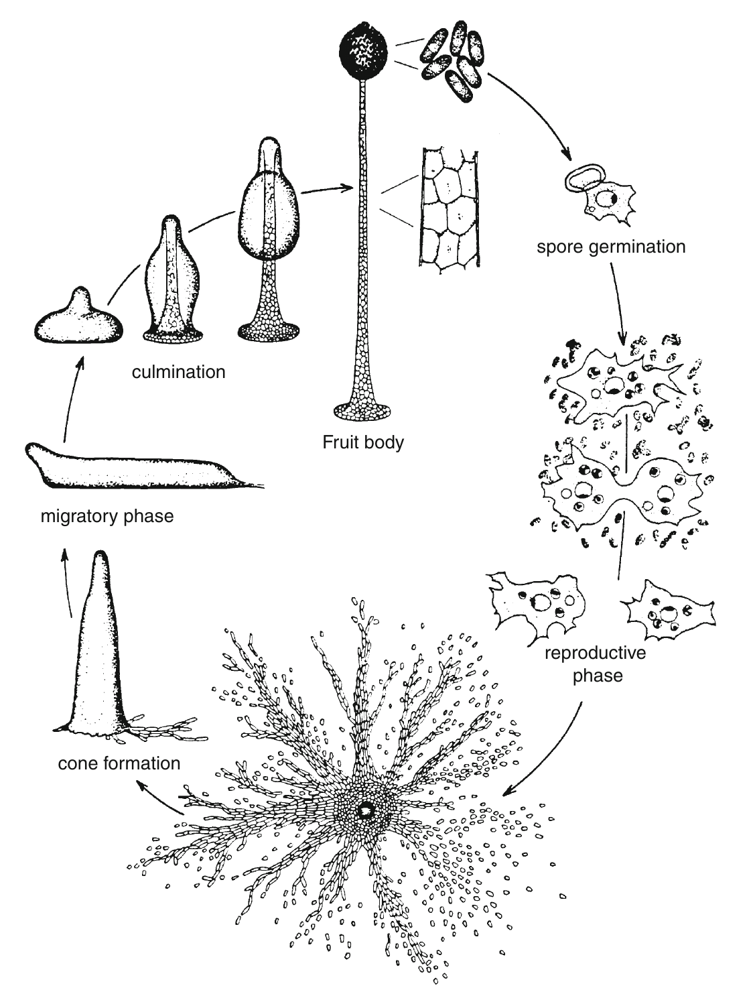
```

### Myxobionta

- Fusion plasmodia arise as a result of fusion between myxoflagellates or myxamoeba, or they can develop from single cells without any previous sexual process.
- Contains phylum: Myxomycota, Plasmodiophoromycota

```{r myxomycota, fig.cap="Plasmodium and sporocarps of \\textit{Badhamia utricularis}", out.width="25%"}
# pdftools::pdf_convert("./../../literatures/Plant Science Straussberger.pdf", pages = 707, dpi = 250, format = "png", filenames = "./../images/myxomycota_pasmodium.png")

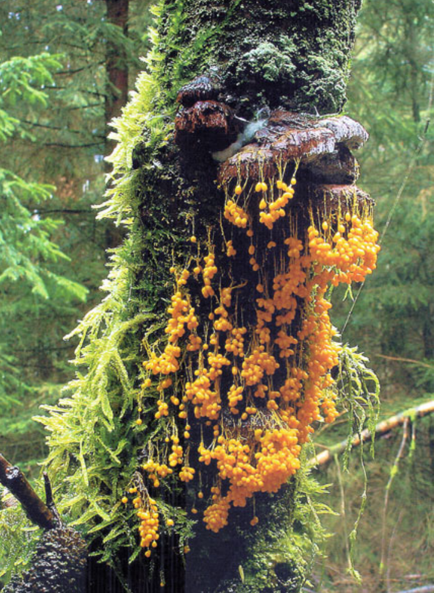
```

### Heterotrophic heterokontobionta

- Contains phylum: Labyrinthulmycota, Oomycota

```{r oomycota, fig.cap="Oomycota, Peronosporales. (a) \\textit{Peronospora bulbocapni} on leaves of \\textit{Corydalis cava}; left, for comparison, an unaffected leaf. (b) Yellowing of oak leaves caused by root infections of \\textit{Phytophthora quercina}; right, normally colored leaf", out.width="25%"}
# pdftools::pdf_convert("./../../literatures/Plant Science Straussberger.pdf", pages = 714, dpi = 250, format = "png", filenames = "./../images/oomycota_peronosporales.png")

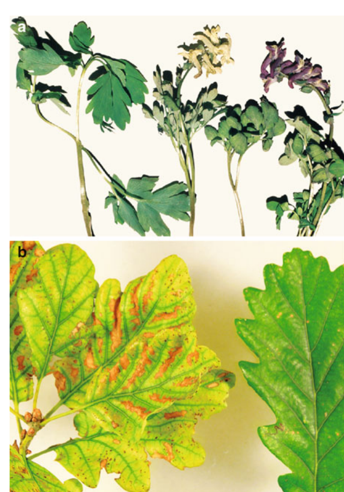
```

### 

```{r oomycota-peronosporales2, fig.cap="Oomycota, Peronosporales. (a–d) \\textit{Plasmopara viticola}. (a) Sporocystophore emerging from a stoma. (b) Oogonia (with a male gametangium) and zygotes (x100). (c) Formation and liberation of zoospores (x600). (d) Germination of the zoospores through the stomata penetrating the intercellular cavity (x250). (e) \\textit{Peronospora parasitica}, young multinuclear oogonium and male gametangium (x600). (f, g) \\textit{Albugo candida}. (f) Oogonium penetrated by the fertilization tube of a male gametangium which is donating the male nucleus (x600). (g) Zygote in the oogonium, surrounded by the young zygote wall and the periplasma (x600). (h) \\textit{Pythium ultimum}; zygotes germinating with zoospores (x800). b fertilization tube of the male gametangium, g male gametangium, p periplasma, o oogonium, oz central uninucleate part of the oogonium, z zoospore, 1, 2, 3 developmental stages", out.width="40%"}
# pdftools::pdf_convert("./../../literatures/Plant Science Straussberger.pdf", pages = 715, dpi = 250, format = "png", filenames = "./../images/oomycota_peronosporales_structure.png")

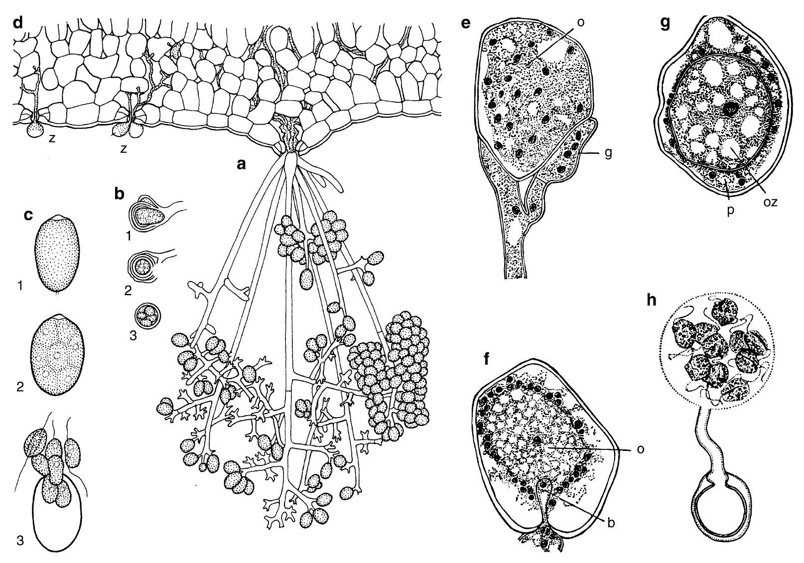
```

### Mycobionta (Fungi)

- Simple structured heterotrophic organisms, lineages derive from basal animal lineages.
- Phylum includes: Chytridiomycota, Zygomycota, Glomeromycota, Ascomycota, Basidiomycota
- Other categories: Deuteromycetes (Fungi imperfecti)
- The Oomycota (water molds) are related to algae within the Heterokontobionta. 
- Within the Unikontae, the protozoan-related Acrasiobionta (cellular slime molds) and Myxobionta (slime molds), as well as the Mycobionta (chitin fungi) -- related to basic multicellular animals (metazoans) -- represent further lineages. 
- Independent ectosymbiosis events between various Mycobionta and cyanobacteria or green algae have resulted in the Lichenes (lichens).

### 

```{r oomycota-peronosporales, fig.cap="Chytridiomycota, Chytridiomycetes. (a) \\textit{Rhizophydium halophilum}, zoosporangia with discharge papillae and with protruding opisthokont zoospores, on a pollen grain of Pinus with haustoria inside (x400). (b) \\textit{Polychytrium aggregatum}, small multinuclear tubular mycelium with variously developed sporocysts and two opisthokont zoospores (x400). (c–i) \\textit{Polyphagus euglenae} (about x450). (c) Zoospore. (d) Thallus sending out rhizoids. (e) Conjugation between the smaller male and the larger female individual. (f) Male nucleus in the future zygote. (g) Zygote with as yet unjoined male and female nuclei. (h, i) Development and emptying of the zoosporocyst. (j–o) \\textit{Zygochytrium aurantiacum} (x350). (j) Hyphae with two final-stage, discharged zoosporangia and two fusing gametangia. (k) Zoosporocyst at discharge. (l–o) Zygote formation between fused gametangia. (o) Mature hypnozygote ('zygospore'). g gametangium, s zoosporocyst, z zygote, zygospore, hypnozygote", out.width="40%"}
# pdftools::pdf_convert("./../../literatures/Plant Science Straussberger.pdf", pages = 718, dpi = 250, format = "png", filenames = "./../images/chytridiomycota_structure.png")

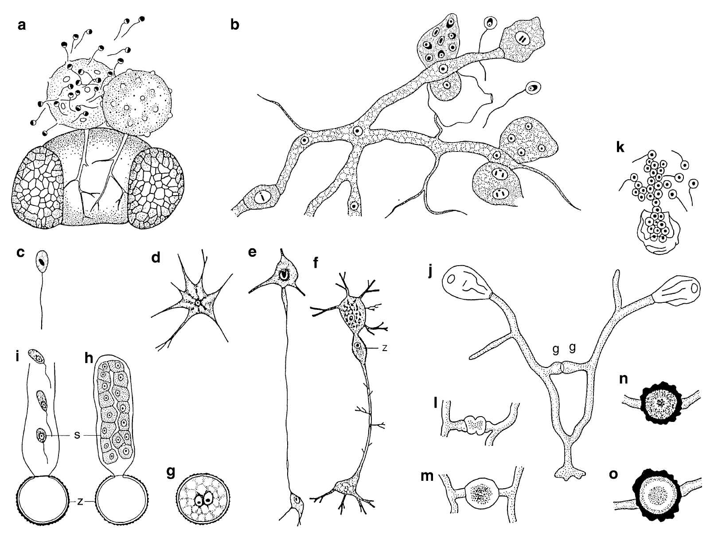
```

### Glaucobionta

```{r glaucobionta, fig.cap="Characteristics of algal classes", out.width="48%"}
# pdftools::pdf_convert("./../../literatures/Plant Science Straussberger.pdf", pages = 765, dpi = 250, format = "png", filenames = "./../images/algal_classes.png")

# After van den Ch. van den Hoeck; summary of the xanthophylls after H. Metzner. 4-Ketocarotene is not included in the table, e.g., echinenone in the Euglenophyta and Chlorophyta as an important pigment or storage polysaccharide and in the Heterokontophyta as a pigment * with simple plastids (arose through primary endocytobiosis), $\\circ$ with complex plastids and nucleomorph (arose through secondary endocytobiosis), $\\Delta$ with complex plastids without nucleomorph (arose through secondary endocytobiosis), + important pigment or storage polysaccharide, (+) pigment present, (.) pigment rarely present or present only in small quantities, A pigment or storage polysaccharides absent. For starches, + stored outside the chloroplasts, stored in the chloroplasts. A 8-ketocarotene, e.g., fucoxanthin and siphonoxanthin (latter only in the Prasinophyceae and Chlorophyceae), B allene carotenoids, e.g., vaucheriaxanthin and neoxanthin (the latter in the Euglenophyta, Chlorophyta, Eustigmatophyta, Heterokontophyta, and some members of the Rhodophyta), C alkyne carotenoids, D carotenoid esters, i.e., xanthophylls with a fatty acid on one or both hydroxyl groups \\newline $^a$ Photosynthetic organelles with peptidoglycan wall Rhodophyta plastids and their derived photosynthetic organelles \\newline $^b$ \\newline $^c$Chlorophyta plastids and their derived photosynthetic organelles

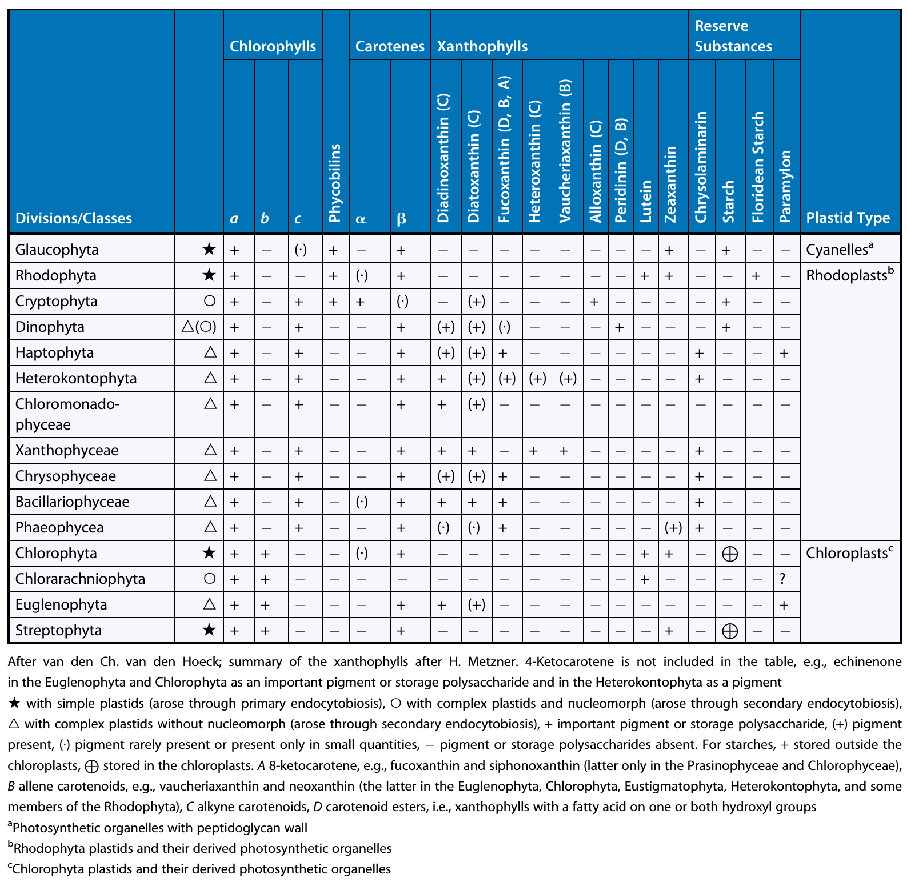
```

### Rhodobionta

```{r rhodobionta, fig.cap="Rhodophyceae, Nemalionales. \\textit{Batrachospermum moniliforme}. (a) Habitus (x3). (b) Piece of gametophyte thallus with a whorl of branches (x20). (c) Diploid Chantransia sporophyte with two haploid gametophytes on it (x100). (d) Branch of the gametophyte with four spermatangia, left the emerging spermatium (x540). (e) Carpogonium. (f) Mature carpogonium. (g) Carpogonium after fertilization by spermatium, fusion of the sex nuclei at the base. (h) Diploid carposporophyte with haploid sheath filaments. (i) Mature carposporophyte with carposporocysts. g carposporophyte, h sheath filaments, k1 and k2 emptied carposporocysts, o sex nuclei, s spermatium, t trichogyne", out.width="45%"}
# pdftools::pdf_convert("./../../literatures/Plant Science Straussberger.pdf", pages = 771, dpi = 250, format = "png", filenames = "./../images/rhodophyceae_nemalionales.png")

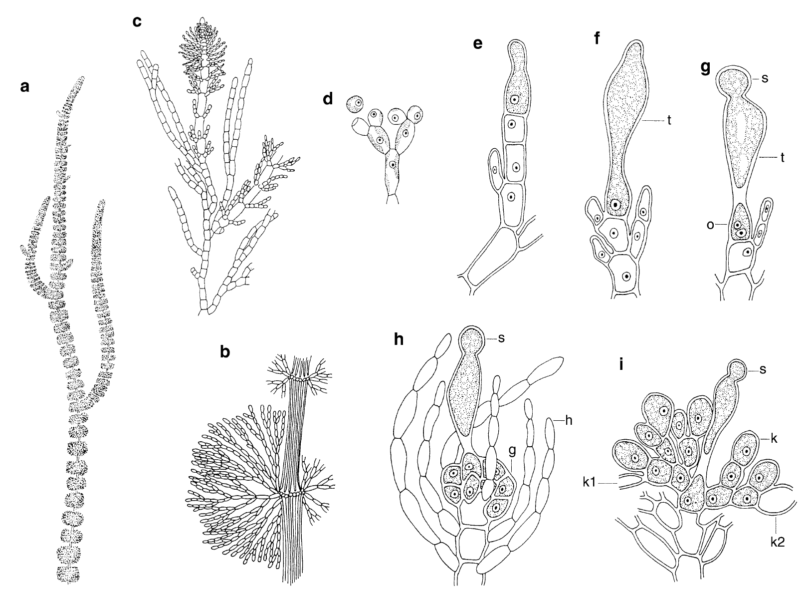
```

### Autotrophic heterokontobionta

```{r heterokontophyta, fig.cap="Heterokontophyta, Phaeophyceae, Laminariales. (a–e) Chorda filum. (a) Meiozoospores, (A 0 ) rounded off for germination (x1,200). (b–e) Development of the unilocular sporocysts (x1,000): (b) uninucleate; (c) tetranucleate; (d) 16-nucleate; (e) with almost complete zoospores. (f, g) Laminaria (x300). (f) Female gametophyte. (g) Male gametophyte. a spermatogonia (a 1 emptied), e egg cell, s 1 –s 3 juvenile sporophytes, still sitting on the emptied oogonium", out.width="45%"}
# pdftools::pdf_convert("./../../literatures/Plant Science Straussberger.pdf", pages = 794, dpi = 250, format = "png", filenames = "./../images/heterokontophyta_phaeophyceae.png")

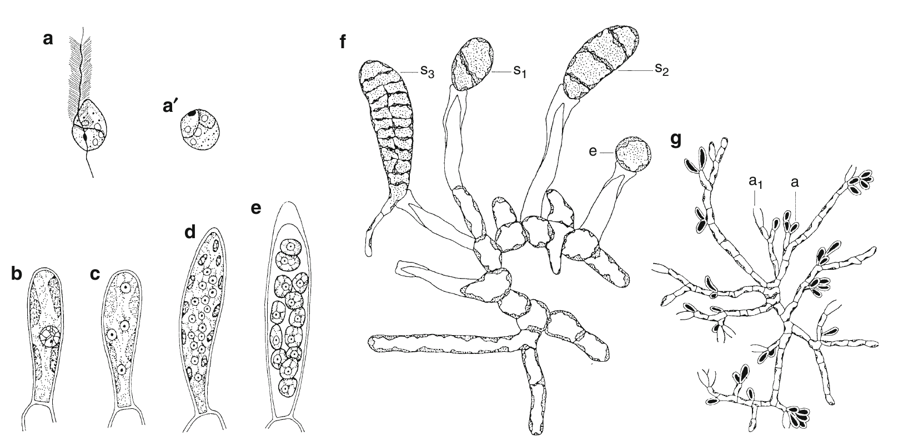
```

### Chlorobionta ("Viridiplantae")

```{r chlorobionta, fig.cap="Chlorophyta, Ulvophyceae. (a–j) Ulothrix zonata. (a) Young filament with a rhizoid cell (x300). (b) Piece of filament with emerging zoospores, which arise in pairs in each cell (x480). (c) Quadriflagellate mitozoospore (x480). (d) Formation and emptying of the smaller biflagellate gametes from a filament section (Â480). (e) Gametes (x480). (f) Gamete copulation (x480). (g, h) Zygote (x480). (i) Zygote germinating after the resting phase (x480). (j) Meiozoospore formation in the zygote (x480). (k) Ulva lactuca (sea lettuce) on a rock, marginal cell colorless after zoospore discharge (x0.5). (l) Enteromorpha intestinalis, anisogamete copulation and zygote (x1,800). r rhizoid cell, 1–3 stages up to zygote formation", out.width="40%"}
# pdftools::pdf_convert("./../../literatures/Plant Science Straussberger.pdf", pages = 803, dpi = 250, format = "png", filenames = "./../images/chlorophyta_ulvophyceae.png")

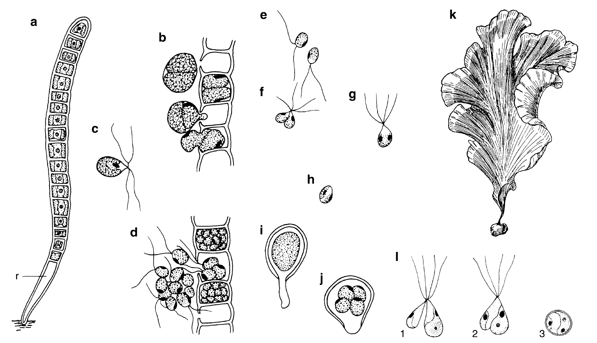
```

###

```{r chlorobionta-spirogyra, fig.cap="Streptophyta, Zygnematophyceae. (a–h) Spirogyra. (a) S. jugalis – cells (x250). (b) S. quinina – anisogamous copulation (x240). (c–h) S. longata, (c) part of the chloroplast facing the cell wall (x750). (d–h) young and old zygotes, (d) the two sex nuclei before copulation (x250), (e) after fusion (x250), (f) division of the zygote nucleus into four haploid nuclei (x250), (g) the three small nuclei degenerate (x250), (h) uninucleate germ (x180). (i–k) Mougeotia. (i, j M. scalaris – chloroplast (face view and side view, x600). (k) M. calospora – isogamous copulation (x450). c chloroplast(s), k cell nucleus, p pyrenoid, s starch, w cell wall, z zygote, zw zygote wall", out.width="45%"}
# pdftools::pdf_convert("./../../literatures/Plant Science Straussberger.pdf", pages = 817, dpi = 250, format = "png", filenames = "./../images/streptophyta_spirogyra.png")

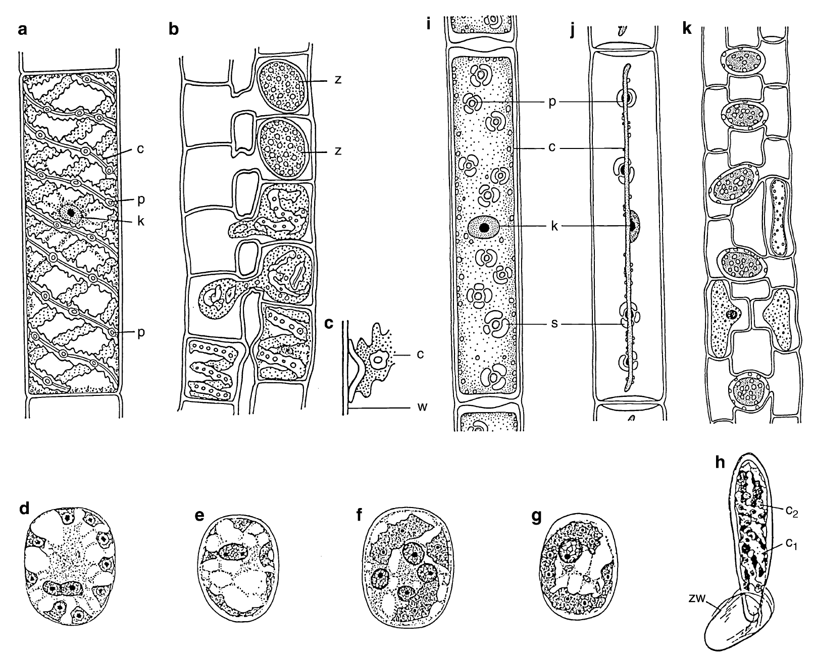
```

## Eukarya (alternative classification)

### Protists

- Protists exhibit more structural and functional diversity than any other group of eukaryotes; mostly unicellular, but also some colonial and multicellular species.
- Most nutritionally diverse: Photoautotrophs, heterotrophs and mixotrophs.
- Some reproduce exclusively asexually, while other employ sexual process.
- Role of \textbf{endosymbiosis}

###

```{r protistan-diversity, fig.cap="Phylogenetic history of Eukaryota", out.width="35%"}
# pdftools::pdf_convert("/media/deependra/e4da4ac5-3b38-4b89-9402-397eb940e4d3/Addition/Generalized Study/Reece Campbell Biology 9th txtbk.pdf", pages = 626, dpi = 250, format = "png", filenames = "./../images/protistan_diversity.png")

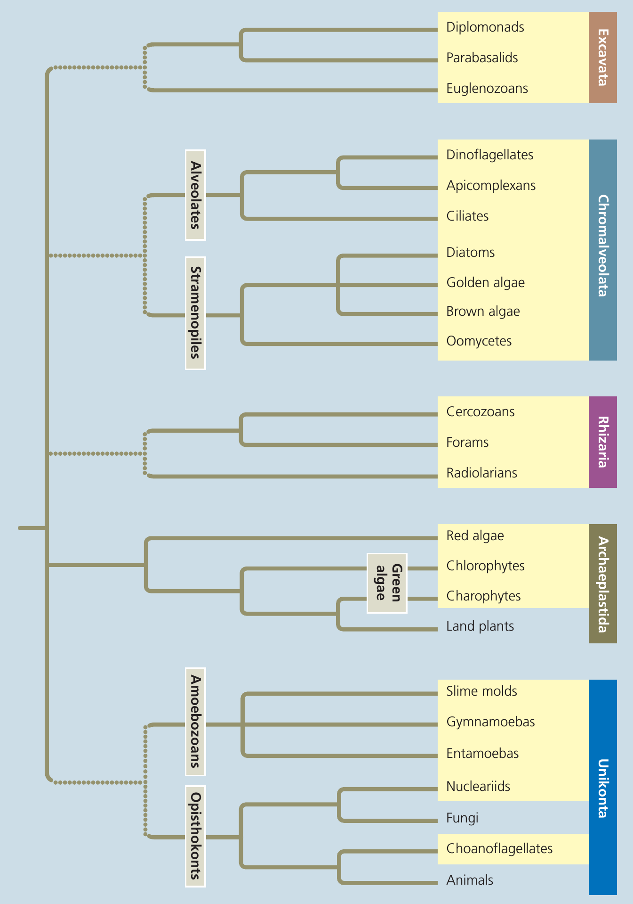
```

###

```{r eukaryotes-groups, fig.cap="Major groups in eukaryota", out.width="45%"}
# pdftools::pdf_convert("/media/deependra/e4da4ac5-3b38-4b89-9402-397eb940e4d3/Addition/Generalized Study/Reece Campbell Biology 9th txtbk.pdf", pages = 627, dpi = 250, format = "png", filenames = "./../images/eukaryotic_groups_four.png")

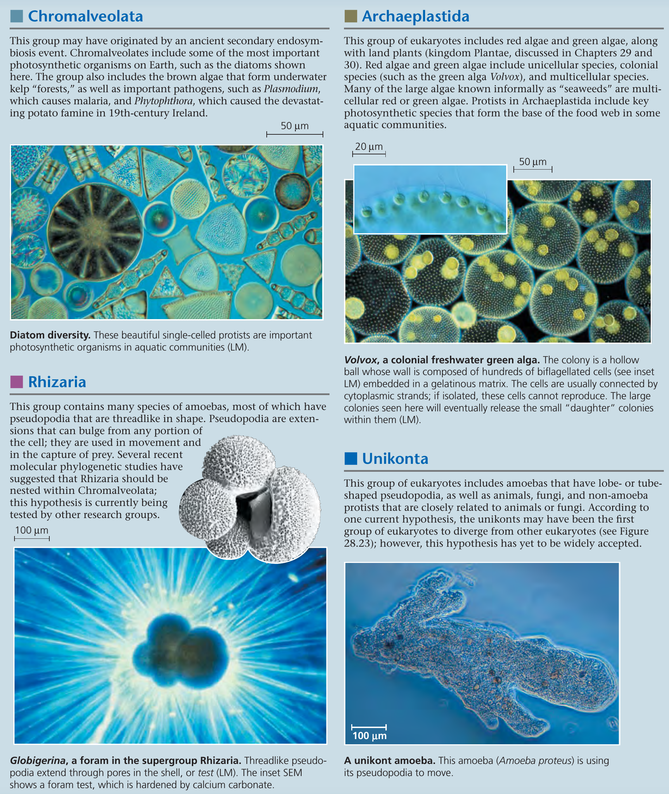
```

###

- \textbf{Excavates} include protists with modified mitochondria and protists with unique flagella.
- Includes: Diplomonads ( _Giardia_ spp), parabasalids ( _Trichomonas_ spp) and Euglenozoans ( _Trypanosoma_ spp), 
- \textbf{Chromalveolata} includes: 
  - Alvelolates: Dinoflagellates, Apicomplexans, Cilliates, 
  - Stramenopiles: Diatoms, Golden algae, Brown algae, Oomycetes

###

```{r apicomplexans-features, fig.cap="Paramecium function and structure", out.width="45%"}
# pdftools::pdf_convert("/media/deependra/e4da4ac5-3b38-4b89-9402-397eb940e4d3/Addition/Generalized Study/Reece Campbell Biology 9th txtbk.pdf", pages = 632, dpi = 250, format = "png", filenames = "./../images/apicomplexans_paramecium.png")

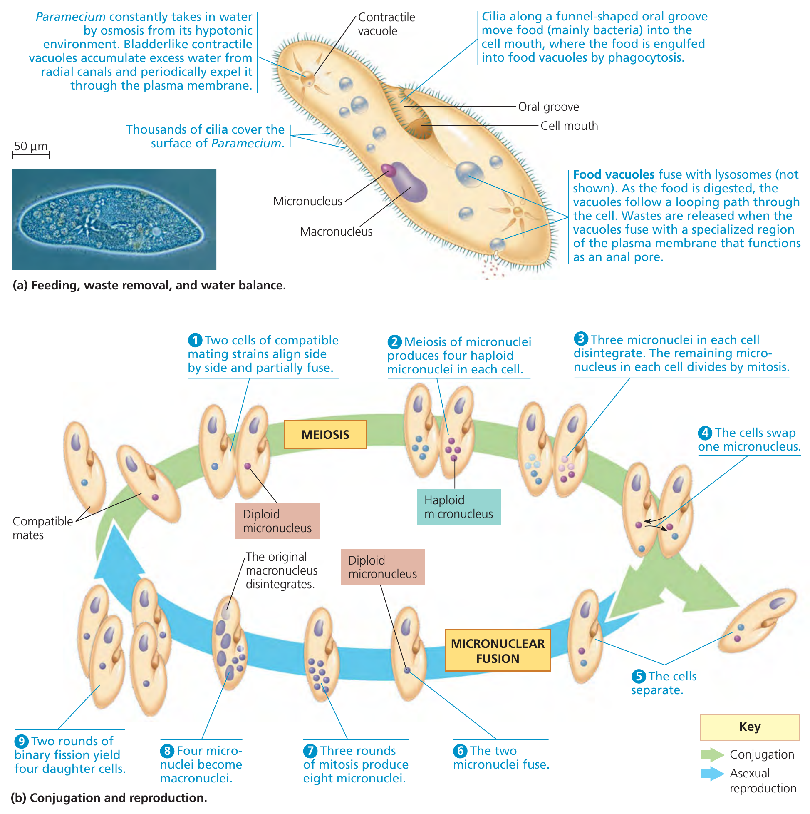
```

### Stramenopiles

- Photosynthetic organisms (named after *stramen*, straw and *pilos*, hair referring to their characteristic flagellum)
- Important groups:
  - Diatoms: Glass like wall made of hydrated silica. About 100, 000 species. Major component of phytoplankton both in ocean and in lakes.
  - Golden algae: Characteristic color results from their yellow and brown carotenoids. Components of freshwater and marine plankton. Some be mixotrophs. Can survive harsh environments as cysts.
  - Brown algae: Commonly called seaweeds. Most complex multicellular anatomy of all algae. Thallus body may be apparent. e.g. _Laminaria_ spp.
  - Oomycetes: Water molds, white rusts and downy mildews. Do not typically photosynthesize. e.g. _Phytophthora_ spp.
  
###

\begin{columns}[T,onlytextwidth]
  \column{0.5\textwidth}

```{r stramenopiles-diatom, fig.cap="Diatom", out.width="55%"}
# pdftools::pdf_convert("/media/deependra/e4da4ac5-3b38-4b89-9402-397eb940e4d3/Addition/Generalized Study/Reece Campbell Biology 9th txtbk.pdf", pages = 634, dpi = 250, format = "png", filenames = "./../images/diatom_phytoplankton.png")

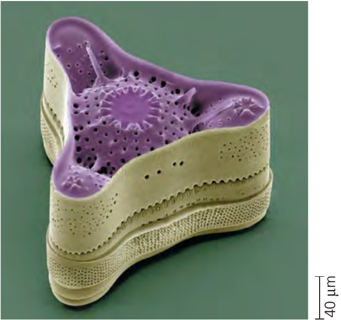
```
  \column{0.5\textwidth}

```{r stramenopiles-golden-algae, fig.cap="Dinobryon, a colonial golden alga found in fresh water", out.width="55%"}
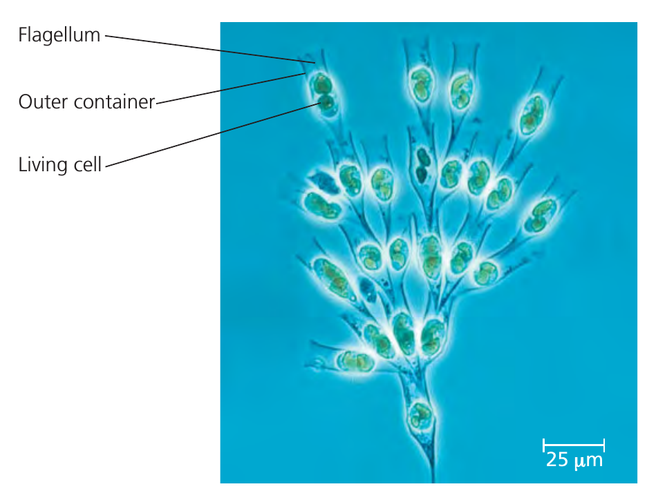
```
\end{columns}

### 

```{r lifecycle-oomycete, fig.cap="Lifecycle of a water mold", out.width="55%"}
# pdftools::pdf_convert("/media/deependra/e4da4ac5-3b38-4b89-9402-397eb940e4d3/Addition/Generalized Study/Reece Campbell Biology 9th txtbk.pdf", pages = 636, dpi = 250, format = "png", filenames = "./../images/watermold_lifecycle.png")

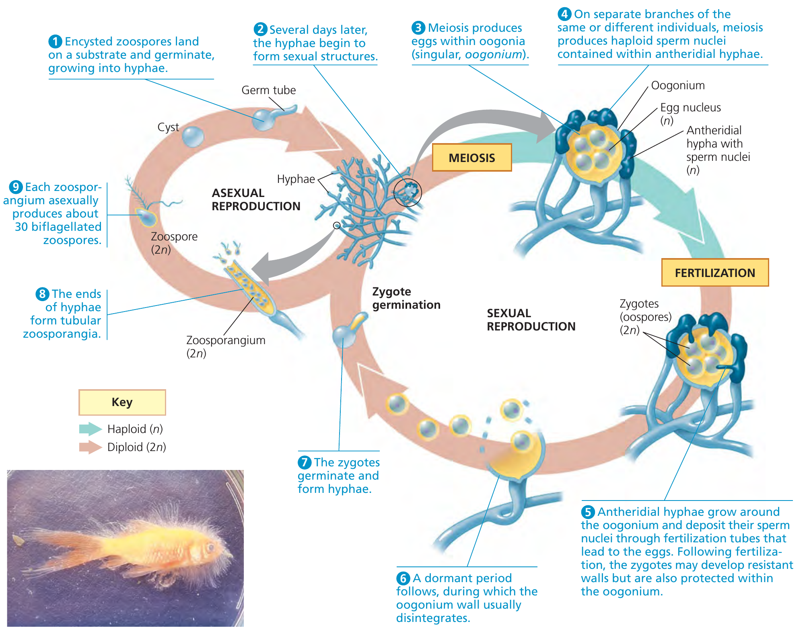
```

### Rhizarians

- Organisms previously referred to as amoebas. 
- Move and feed by the means of pseudopodia.
- Includes groups:
  - Radiolarians: Delicate intricately symmetrical internal skeletons made up of silica. The microtubules are covered by a thin layer of cytoplasm, which engulfs smaller microorganisms that become attached to the pseudopodia.
  - Forams: Possess porous shells called tests. Pseudopodia function in swimming, test formation, and feeding. Many forams also derive nourishment from the photosynthesis of symbiotic algae that live within the tests.
  - Cercozoans: Mostly heterotrophs. Bacterial predators but some are rare autotrophs. Amoeboid and flagellated with threadlike pseudopodia.

### Archaephlastida

- Red algae
- Green algae:
  - Chlorophytes
  - Charophytes
- Land plants

## Photoautotrophs

###

\begin{columns}[T,onlytextwidth]
  \column{0.5\textwidth}

```{r photoautotrophs, fig.cap="(a) On land, plants are the predominant producers of food. In aquatic environments, photoautotrophs include unicellular and (b) multicellular algae, such as this kelp; (c) some non-algal unicellular protists, such as Euglena;", out.width="50%"}
# pdftools::pdf_convert("/media/deependra/e4da4ac5-3b38-4b89-9402-397eb940e4d3/Addition/Generalized Study/Reece Campbell Biology 9th txtbk.pdf",
#                       pages = 233, dpi = 250, format = "png", filenames = "./../images/photoautotrophs.png")

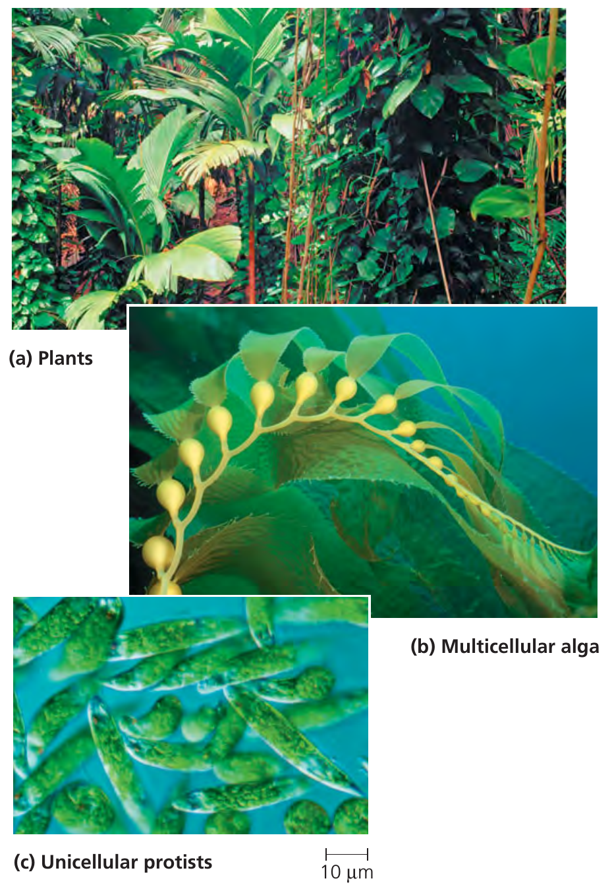
```

  \column{0.5\textwidth}

```{r photoautotrophs2, fig.cap="(d) The prokaryotes called cyanobacteria; and (e) other photosynthetic prokaryotes, such as these purple sulfur bacteria, which produce sulfur (the yellow globules within the cells)", out.width="50%"}
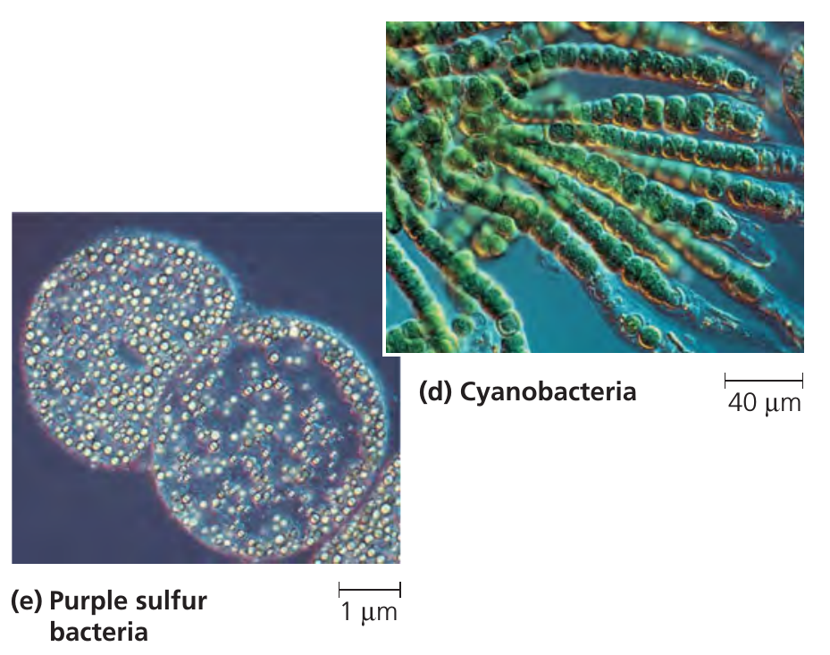
```

\end{columns}

## Phylogeny of plants and fungi

### 

```{r phylogenetic-plant-fungi, fig.cap="The phylogenetically significant primary and secondary endosymbiotic steps and the resulting acquisition of mitochondria and plastids are marked with arrows. The arrows pointing to the lichens show ectosymbioses with Cyanobacteria and Chlorophyta. Modified from Bresinsky and Kadereit (2006)", out.width="32%"}
# pdftools::pdf_convert("./../../literatures/Plant Science Straussberger.pdf", pages = 685, dpi = 250, format = "png", filenames = "./../images/phylogeny_plant_fungi.png")

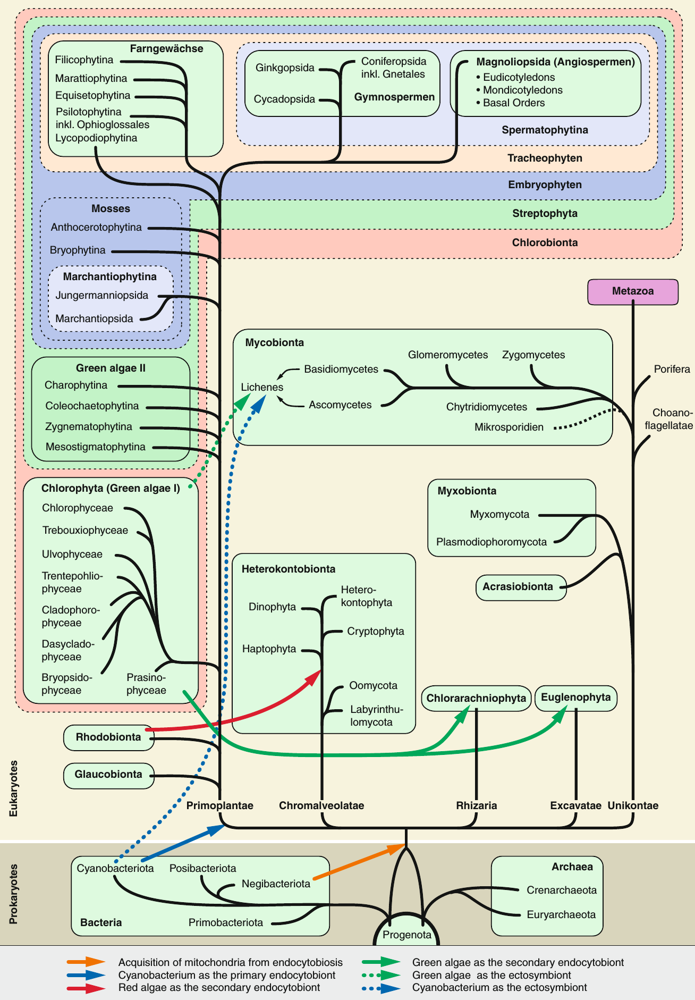
```

## Plants (Embryophytoes)

###

- Arose in Ordovician (~450 Ma).
- Charophytina (From chlorobionta) and land plants
- The original ancestral land plant lineages are the paraphyletic mosses (Marchantiophytina - liverworts; Bryophytina - foliose mosses; Anthocerophytina - hornworts).
- The paraphyletic pteridophytes (Lycopodiophytina - club mosses, spikemosses, quillworts; Equisetophytina - horsetails; Psilophytina - whisk ferns; Filicophytina - true ferns), together with the monophyletic seed plants (Spermatophytina)

### Classification of spermatophytina: Classes

- Cycadopsida
- Ginkgopsida
- Coniferopsida
- Magnoliopsida (Flowering plants):
  - Basal order (Eudicots): Amborellales, Nymphaeales, Austrobaileyales, Ceratophyllales, Chlranthales, Magnoliales, Laurales, Canellales, Piperales
  - Monocotyledons: Acorales, Alismatales, Petrosaviales, Dioscoreales, Pandanales, Liliales, Asparagales
  - Commelinids: Arecales, Poales, Commelinales, Zingiberales
  - Eudicotyledons: Ranunculales, Proteales, Sabiales, Trochodendrales, Buxales, Gunnerales

### Classification of spermatophytina: Classes (...continued)

- Magnoliopsida (flowering plants):
  - Core eudicots: Berberidopsidales, Dilleniales, Caryophyllales, Santalales, Saxifragales, Vitales
  - Rosids: Crossomatales, Geraniales, Myrtales
  - Fabids: Zygophyllales, Clastrales, Malphighiales, Oxalidales, Fabales, Rosales, Cucurbitales, Fagales
  - Malvids: Huerteales, Brassicales, Malvales, Sapindales
  - Asterids: Cornales, Ericales
  - Lamiids: Garryales, Gentianales, Lamiales, Solanales
  - Campanulids: Aquifoliales, Apiales, Dipsaclales, Asterales. 

###

```{r poales-reproductive, fig.cap="Poales, Poaceae. Grains, spikes, and spikelets. (a, b) Rye, Secale cereale (in b awns only partly shown). (c–e) Wheat, Triticum aestivum with (c) spelt and (d, e) wheat. (f, g) Barley, Hordeum vulgare with (f) two-rowed and (g) six-rowed forms (awns are only partly illustrated). (h) Oats, Avena sativa. (i, j) Rice, Oryza sativa. (k) Wheat grain (caryopsis), median longitudinal section through the lower part, lateral wall of the fruit furrow, below left the embryo with a scutellum, vascular bundle, and cylindrical epithelium, coleoptile, shoot apex, coleorhiza, radicle with root cap, and point of emergence (x14). a point of emergence, c coleoptile, cr coleorhiza, d lemma, f fruit furrow, h glume, l vascular bundle, r radicle, s scutellum, v palea, vk shoot apex, w root cap, z cylindrical epithelium", out.width="35%"}
# pdftools::pdf_convert("./../../literatures/Plant Science Straussberger.pdf", pages = 956, dpi = 250, format = "png", filenames = "./../images/poales_reproductive_morph.png")

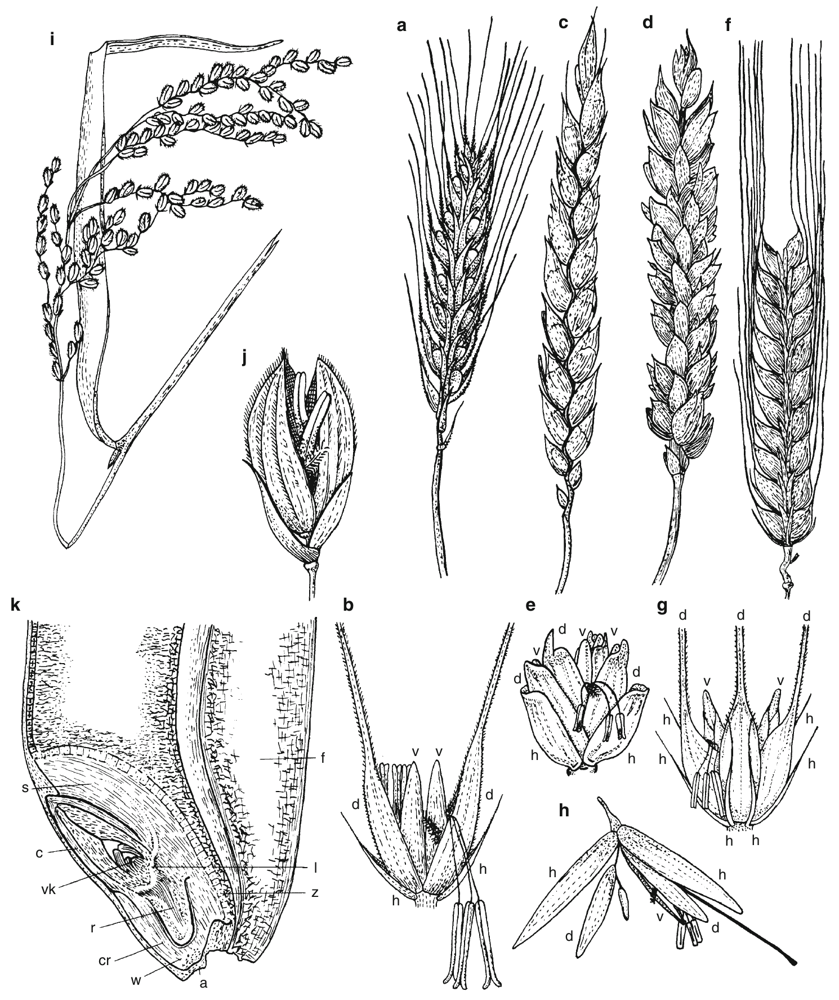
```

###

```{r poales-pollination, fig.cap="Pollination biology in the poales", out.width="35%"}
# pdftools::pdf_convert("./../../literatures/Plant Science Straussberger.pdf", pages = 958, dpi = 250, format = "png", filenames = "./../images/poales_pollination_modes.png")

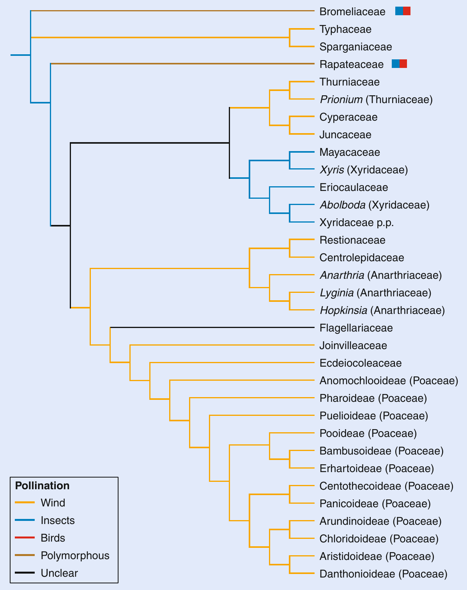
```

###

```{r fabales-flower-bio, fig.cap="Fabales, Fabaceae, Faboideae. (a) \\textit{Astragalus gummifer}, flowering shoot with spines (x0.5). (b, c) \\textit{Pisum sativum}. (b) Entire flower (x1) and (c) dissected (x1.2); calyx, corolla made up of flag, wings and keel, stamens (9+1), and monocarpellate ovary with stigma and ovules (dotted). f flag, fk ovary, fl wing, k calyx, n stigma, s keel, sb stamens", out.width="65%"}
# pdftools::pdf_convert("./../../literatures/Plant Science Straussberger.pdf", pages = 982, dpi = 250, format = "png", filenames = "./../images/fabales_flower_biology.png")

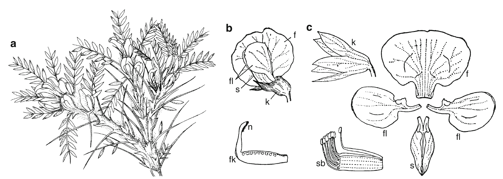
```

# Bibliography
