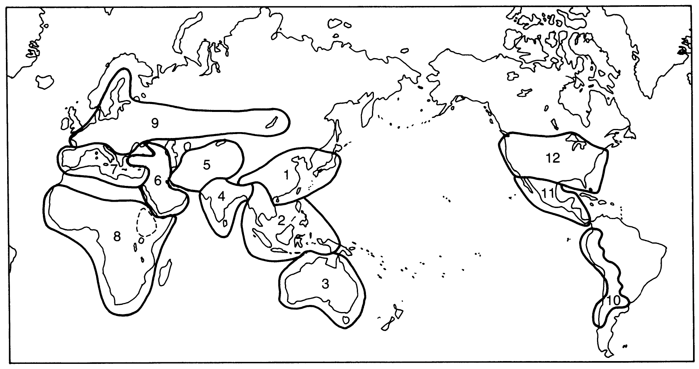

```{r setup, include=FALSE}
library(knitr)
require(tidyverse)
set.seed(453)
# invalidate cache when the package version changes
knitr::opts_chunk$set(tidy = FALSE, echo = FALSE, 
                  message = FALSE, warning = FALSE,
                  out.width = "45%")
options(knitr.table.format = "latex")
options(knitr.kable.NA = "", digits = 2)
options(kableExtra.latex.load_packages = FALSE)
```


```{r maize-domestication, fig.cap="Evolutionary history of maize", fig.height=3, fig.align='center', out.width = "55%"}

```

# Domestication

## What is a weed? 

### Weed

- "A plant in the wrong place" 
- How accurate is the definition ?
- We define weeds as plants we do not want that compete for resources with those we do want. 
- Clearly we have criteria about which plants we want and those that fail those criteria. 
- In evolutionary terms, it is the cultivated plants that are "fitter" than the weeds, as they have characteristics which we want, and since in the fi eld and the garden we have largely substituted ourselves for nature, and here it is us who control the evolutionary process.
- However, many commercially grown plants survive as volunteer weeds, or "escapes", in either the same, or different, regions to those in which they are most commonly grown commercially.

###

```{r weed-vs-crop, fig.cap="Perennial teosinte", out.width="26%", fig.align='center'}
knitr::include_graphics("./../images/Perennial_teosinte.jpg")
```

### Definition

\begin{block}{}
a plant population has been domesticated when it has been substantially altered from the wild state and certainly when it has been so altered to be unable to survive in the wild
\end{block}

N.W. Simmonds

- Domestication is the process by which genetic changes (shifts) in wild plants are brought about through a selection process imposed by humans. 

###

- Because of the roles of humans, the process results characteristics that are beneficial to humans but some that would be disadvantageous for plants in their natural habitats.
- Results are the plants that are adapted to supervised cultural conditions and which posses characteristics that are preferred by producers and consumers. 
- E.g. Modern corn stripped is completely  of its seed dispersal ability.
- *Domesticators*
- Both wild and domesticated populations are subject to evolution
- Forces of selection determine what will be domesticated and that which will continue in wild
	- The natural selection favours plant phenotypes which have the greatest chance of survival, reproduction, and distribution of progeny.
	- Human selection is the result of conscious decisions by a farmer or plant breeder to keep the progeny of a particular parent and discard others.

## Domestication syndrome (Changes in plant species under domestication)

###

```{r domestication-syndrome, tidy=FALSE}
domestication_syndrome <- readxl::read_xlsx("./../data/centers_of_diversity.xlsx", sheet = "domestication_syndrome")

domestication_syndrome[1:10,] %>%
  knitr::kable(caption = "Changes in plants under domestication", 
               booktabs = TRUE, digits = 2, escape = FALSE) %>% 
  kableExtra::kable_styling(latex_options = "striped", font_size = 6) %>% 
  kableExtra::column_spec(1, bold = TRUE) %>% 
  kableExtra::column_spec(column = 1:2, width = c("16em","40em"))
```

###

```{r domestication-syndrome2, tidy=FALSE}
domestication_syndrome[11:nrow(domestication_syndrome), ] %>%
  knitr::kable(caption = "Changes in plants under domestication (...continued)", 
               booktabs = TRUE, digits = 2, escape = FALSE) %>% 
  kableExtra::kable_styling(latex_options = "striped", font_size = 6) %>% 
  kableExtra::column_spec(1, bold = TRUE) %>% 
  kableExtra::column_spec(column = 1:2, width = c("16em","40em"))
```

### Wild versus domestication traits

\begin{columns}[T,onlytextwidth]
  
  \column{0.5\textwidth}
  
```{r domesticated, fig.cap="Domesticated dog", out.width="80%"}
knitr::include_graphics("./../images/domestic_dog_puppy.jpg")
```

  \column{0.5\textwidth}

```{r wild, fig.cap="Wild dog", out.width="80%"}
knitr::include_graphics("./../images/wild_dog_african.jpg")
```

\end{columns}

### Wild verus domestication traits (context)

- Wild cereal plants tend to have many small seeds at maturity and disperse their seed by shattering. These seeds also are likely to be attached to a strong awn to aid dispersal. 

- Similarly, wild potato species produce many small tubers, have their tubers develop at the end of very long stolons (so that daughter plants do not have to occupy ground too close to the parent), and many have tubers with high levels of toxin, which discourage animals from eating them.

- Breeders have developed cereal cultivars which have fewer, but larger seeds, that do not shatter their seeds at maturity and that have a non-persistent awn. 

###

- Similarly potato breeders have selected plants with fewer, but larger tubers, shorter stolons and with reduced levels of toxins in the tuber. 

- Human selection also has produced crops that are more uniform in the expression of many of their characteristics. For example, they have selected seeds that all mature at the same time, with uniform germination, and fruits with uniform fruit size and shape. 

- In more recent times plant breeders' selection has tended to result in shorter plants, greater harvest index, and increased ease of harvest (especially mechanized).

###

```{r, fig.align='center', fig.cap="Teosinte maize hybrid", out.width="40%"}

knitr::include_graphics("./../images/Teosinte_maize_hybrid_cross.jpg")
```

### When did domestication appear?

In the Euphrates valley of northern Syria, reliable signs of morphological domestication, indicated by the partial loss of the dispersal mechanism in emmer and barley, are found in the earliest levels at the sites of Halula and Abu Hureyra 2, dated to c. 10,000 BP These are full-scale farming sites, which have domestic animals and cover a surface area at least ten times larger than the PPNA sites. Elsewhere the same tell-tale abscission scars left on spikelet bases were found at the sites of Nevali Cori, Cayonu and Cafer Hoyuk dated to c. 10,500 years ago. The later date for domestication on the Euphrates in northern Syria may be due to a gap in the archaeological record. At these early domestication sites, wild types persist alongside the domestic types (van Zeist and de Roller 1994, de Moulins 1997, Pasternak 1998, Tanno and Willcox 2006).

### Germplasm

- Germplasm refers to the genetic material that can be used to perpetuate a species or population
- Germplasm provides the material used to initiate a breeding program
- Sometimes only germplasm screening and evaluation is practiced for introduction of improved variety in a region
- Certain institutional sets-ups such as gene banks are charged with the responsibility of assembling, cataloguing, storing and managing large number of germplasm. This allows for quick retrieval.

## Gene pool

### Background

J.R. Harlan and J.M.J. de Wet proposed a categorization of gene pools of cultivated crops according to the feasibility of gene transfer or gene flow from those species to the crop species.

```{r gene-pools, fig.cap="Crop gene pools; A system proposed by Harlan", out.width="45%"}
# pdftools::pdf_convert("./../../references_plb/George Acquaah(auth.) - Principles of Plant Genetics and Breeding, Second Edition-Wiley-Blackwell (2012).pdf", format = "png", pages = 211, filenames = "./images/crop_gene_pools.png", dpi = 300)
knitr::include_graphics("./../images/crop_gene_pools.png")
```

### Types of gene pool

- *Primary gene pool (GP1)* 
  - GP1 consists of biological species that can be intercrossed easily (interfertile) without any problems with fertility of the progeny. That is, there is no restriction to gene exchange between members of the group. This group may contain both cultivated and wild progenitors of the species.

- *Secondary gene pool (GP2)* 
  - Members of this gene pool include both cultivated and wild relatives of the crop species. They are more distantly related and have crossability problems. Nonetheless, crossing produces hybrids and derivatives that are sufficiently fertile to allow gene flow. GP2 species can cross with those in GP1, with some fertility of the F1, but more difficulty with success.

- *Tertiary gene pool (GP3)*
  - GP3 involves the outer limits of potential genetic resources. Gene transfer by hybridization between GP1 and GP3 is very problematic, resulting in lethality, sterility, and other abnormalities. To exploit germplasm from distant relatives, tools such as embryo rescue and bridge crossing may be used to nurture an embryo from a wide cross to a full plant and to obtain fertile plants.

# Origin and diversity

## The Vavilov Concept

###

- Nikolai I. Vavilov (1887-1942), the Russian botanist and plant breeder, demonstrated the existence of 'centres of origin' of cultivated plants (more correctly named today as 'centres of diversity'), in which can be found the highest level of genetic variability of a species. This variability, which arises in nature by mutation spontaneous hybridization, introgression and changes in chromosome form and number, provides the means by which adaptation to heterogenous environments can occur.

- It allows the breeder to identify sources of variation for specific characteristics. The extension of this principle to related species was formulated by Vavilov in his 'law of homologous series of variation'. This law allows the prediction of the appearance of a given type of mutation in a plant species when such a type has been found in another species phylogenetically related to the first. 
- Defined plant breeding as 'plant evolution directed by man'; concept of 'applied plant genetics'.

## Defining center of origin and center of diversity

### 

- CBD takes the "centre of origin" and the "centre of crop diversity" as references referring to the scientific rather than political connecting points for the definition of origin. [@Rights to plant genetic resources and traditional knowledge]

- It defines "centre of origin" as "a geographical area where a plant species, either domesticated or wild, first developed its distinctive properties", and "centre of crop diversity" as "the geographic area containing a high level of genetic diversity for crop species in in-situ conditions" (Articles 2.8 and 2.9).

- On the basis of soveignty of states over their natural resources, CBD takes "country" as starting point for defining the origin of genetic resources.

- Accordingly, "the country of origin of genetic resources" is defined as the country that possesses the genetic resources in in situ conditions (Article 2.4).

## Domestication and origin of major crop species

###

```{r domestication-origin, tidy=FALSE}
domestication_origin <- readxl::read_xlsx("./../data/centers_of_diversity.xlsx", sheet = "center_origin", skip=2)

domestication_origin[1:15, ] %>%
  knitr::kable(caption = "Estimated time of domestication and centre of origin of major crop species; @brown2014plant, Page 23", 
               booktabs = TRUE, digits = 2, escape = FALSE) %>% 
  kableExtra::kable_styling(latex_options = "striped", font_size = 6) %>% 
  kableExtra::column_spec(1, bold = TRUE) %>% 
  kableExtra::column_spec(column = 1:4, width = c("8em","12em", "8em", "12em"))
```

###

```{r domestication-origin2, tidy=FALSE}
domestication_origin <- readxl::read_xlsx("./../data/centers_of_diversity.xlsx", sheet = "center_origin", skip=2)

domestication_origin[16:nrow(domestication_origin), ] %>%
  knitr::kable(caption = "Estimated time of domestication and centre of origin of major crop species; @brown2014plant, Page 23 (...continued)", 
               booktabs = TRUE, digits = 2, escape = FALSE) %>% 
  kableExtra::kable_styling(latex_options = "striped", font_size = 6) %>% 
  kableExtra::column_spec(1, bold = TRUE) %>% 
  kableExtra::column_spec(column = 1:4, width = c("8em","12em", "8em", "12em"))
```

### Rice

- Probably originated 130 MYA (Virmani and IIyas-Ahmed, 2007)
- Spread as wild grass in Gondwanaland.
- Both cultivated species -- *O. sativa* and *O. glaberrima* (tropical West african rice) originated from common ancestor.
- Wild progenitor of *O. sativa* is common asian wild rice called *O. rufipogon* (has perennial to annual types).
- Annual types of the wild progenitor called *O. nivara* resulted in present day asian rice.
- Alternative hypotheses: two distinct subspecies of rice ( _indica_ and _japonica_) arose from different wild variants of *O. rufipogon*.

### Rice (...continued)

```{r subpopulations-rice, fig.cap="The recognized subpopulations of \\textit{Oryza sativa}", out.width="45%"}
# pdftools::pdf_convert("./../../literatures/ecological_genetics/Biodiversity in Agriculture_ Domestication, Evolution, and Sustainability.pdf", format = "png", pages = 348, filenames = "./../images/rice_subpopulations.png", dpi = 300)
knitr::include_graphics("./../images/rice_subpopulations.png")
```

### Rice (...continued)

- First archaeological evidence of rice cultivation leads to Yangtze valley of eastern China.
- Domestication has resulted in alterations to a large array of morphological traits:
  - Seed shattering behavior
  - Grain coloration
  - Grain size enlargement
  - Prostrate to erect growth habit
  - Reduced seed dormancy
- Genetic factors contributing to domestication syndrome *Shattering4 (Sha4)* on chromosome 4 and black hull by *Black hull (Bh4)* on chromosome 4.

### Maize

- Domestication history based on 7100 year old maize pollen from San Andres.
- Initially cultivated in seasonal tropical forest of southwestern mexico.
- Originated from annual teosinte (*Zea mays* subspecies *parviglumis*) around 9000 years ago in mid to lowland regions.
- Later on admixture occured among *parviglumis* and *mexicana* (highland type) subspecies.

### Wheat

```{r wheat-barley-archaeology, fig.cap="Charred wild cereal spikelet bases (left) and grains (right). Top, Hordeum spontaneum (wild barley) from Jerf el Ahmar. Middle, Secale sp. (rye) from Jerf el Ahmar. Bottom, Triticum boeoticum (single-grain einkorn) from Tell Qaramel. Note the basal abscission scar seen in the barley (top row, second from the left) and for rye the lower end of the rye spikelet bases (second row, first and second from left) is more reliable than the upper scar for distinguishing between wild and domestic.", out.width="30%"}
# pdftools::pdf_convert("./../../literatures/ecological_genetics/Biodiversity in Agriculture_ Domestication, Evolution, and Sustainability.pdf", format = "png", pages = 128, filenames = "./../images/charred_grass_grains.png", dpi = 300)

```

## Megacentres of cutivated plants

###

```{r cultivated-megacentres, fig.cap="Megacentres of cultivated plants (Zeven and Zhukovsky, 1975); @hayward2012plant, Page 37", out.width="55%"}
# pdftools::pdf_convert("./../../references_plb/E. S?nchez-Monge (auth.), M. D. Hayward, N. O. Bosemark, I. Romagosa, M. Cerezo (eds.) - Plant Breeding_ Principles and prospects.pdf", format = "png", pages = 53, filenames = "./images/megacentres_cultivated.png", dpi = 300)

```

###

```{r diversity-region1, tidy=FALSE}
megacentres <- readxl::read_xlsx("./../data/centers_of_diversity.xlsx", sheet = "diversity_region", skip=2)

megacentres[1:15, ] %>%
  knitr::kable(caption = "Cultivated plants and their regions of diversity. Based on Zeven and Zhukovsky (1975) and Zeven and de Wet (1982); @hayward2012plant, Page 54, 55.", 
               booktabs = TRUE, digits = 2, escape = FALSE, align = "l") %>% 
  kableExtra::kable_styling(latex_options = "striped", font_size = 6) %>% 
  kableExtra::column_spec(1, bold = TRUE) %>% 
  kableExtra::column_spec(column = 1:3, width = c("3em","14em", "32em"))

```

###

```{r diversity-region2, tidy=FALSE}
megacentres[16:30, ] %>%
  knitr::kable(caption = "Cultivated plants and their regions of diversity. Based on Zeven and Zhukovsky (1975) and Zeven and de Wet (1982); @hayward2012plant, Page 54, 55.", 
               booktabs = TRUE, digits = 2, escape = FALSE, align = "l") %>% 
  kableExtra::kable_styling(latex_options = "striped", font_size = 6) %>% 
  kableExtra::column_spec(1, bold = TRUE) %>% 
  kableExtra::column_spec(column = 1:3, width = c("3em","14em", "32em"))

```


###

```{r diversity-region3, tidy=FALSE}
megacentres[31:nrow(megacentres), ] %>%
  knitr::kable(caption = "Cultivated plants and their regions of diversity. Based on Zeven and Zhukovsky (1975) and Zeven and de Wet (1982); @hayward2012plant, Page 54, 55.", 
               booktabs = TRUE, digits = 2, escape = FALSE, align = "l") %>% 
  kableExtra::kable_styling(latex_options = "striped", font_size = 6) %>% 
  kableExtra::column_spec(1, bold = TRUE) %>% 
  kableExtra::column_spec(column = 1:3, width = c("3em","14em", "32em"))

```

## Plant introduction

### Background

- The plant breeder may import new, unadapted genotypes from outside the production region, usually from another country (called plant introductions). These new materials may be evaluated and adapted to new production regions as new cultivars, or used as parents for crossing in breeding projects.

- Primary Introduction
  - When the introduced variety is well adapted to the new environment, it is released for commercial cultivating without any alteration in the original genotype; this constitutes primary introduction. It is less common, particularly in countries having well organized crop improvement programmes.

- Secondary introduction
  - The introduced variety may be subject to selection in order to isolate a superior variety. Alternatively, it may be hybridized with local varieties to transfer one or few characters from these varieties to the local ones. Such introduction constitutes secondary introduction. It is much common than primary introduction.

### Purpose

1. To obtain entirely new crop species
2. To serve as new varieties
3. For use in crop improvement programmes
4. To introgress variability to existing genetic materials
5. For scientific studies
6. To augment aesthetics
7. For germplasm collection and comparison

# Bibliography
