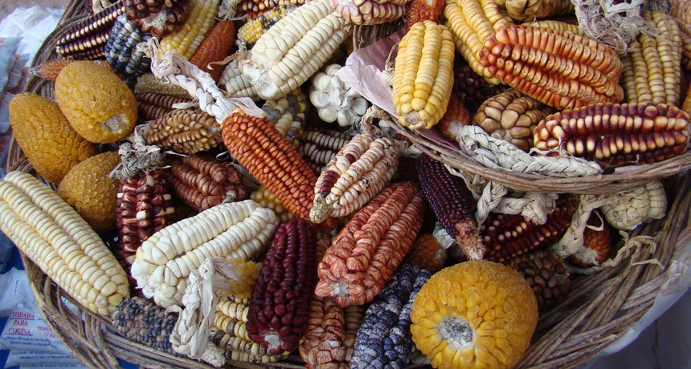

```{r setup, include=FALSE}
library(knitr)
require(tidyverse)
set.seed(453)
# invalidate cache when the package version changes
knitr::opts_chunk$set(tidy = FALSE, echo = FALSE, 
                  message = FALSE, warning = FALSE,
                  out.width = "45%")
options(knitr.table.format = "latex")
options(knitr.kable.NA = "", digits = 2)
options(kableExtra.latex.load_packages = FALSE)
```

# Species and genetic diversity

### Genetic diversity

<!-- Genetic and population diversity has been successfully used in many ways for direct-use value for agricultural production. In modern production systems, the focus has been on identifying traits that increase yield, keeping up the treadmill of rapidly changing virulence of specific diseases, meeting the demand for resistance to an increased range of biotic and abiotic stresses, or increasing the temporal and spatial production of commodities that are destined for different uses or planted at different times of the year (Cassman et al., 2003). Some of the gene pool available for crop improvement in the future has been safeguarded in gene banks for the major crops. -->

- Is reliant on the heritable variation within and between populations of organisms.
- Genetic variation (new) arises by gene and chromosome mutations, and through recombination.
-  It has been estimated that in humans and fruit flies alike, the number of possible combinations of different forms of each gene sequence exceeds the number of atoms in the universe.
<!-- Selection acts on this pool of genetic variation present within an interbreeding population.  Differential survival results in changes of the frequency of genes within this pool, and this is equivalent to population evolution.-->
- Genetic variation enables both natural evolutionary change and artificial selective breeding to occur.
- Only a small fraction (<1%) of the genetic material of higher organisms is outwardly expressed in the form and function of the organism; the purpose of the remaining DNA and the significance of any variation within it are unclear.

<!-- Those genes that control fundamental biochemical processes are strongly conserved across different taxa and generally show little variation, although such variation that does exist may exert a strong effect on the viability of the organism; the converse is true of other genes. A large amount of molecular variation in the mammalian immune system, for example, is possible on the basis of a small number of inherited genes. -->

###

\small

- Before initiating a (molecular/marker-assisted) breeding program an assessment of genetic diversity of the available germplasm is necessary.
- The goal is to select parents that are genetically diverse enough that you can identify differences - polymorphisms - in the progeny. 
<!-- This may include the need for a particular trait that appears in an accession, or just a general need for more diversity. -->
- Of several, few of the measures of genetic diversity are:
  \begin{itemize}
  \footnotesize
  \item Based on the number of variants among the alleles
  \item Polymorphism or rate of polymorphism (Pj)
  \item Proportion of polymorphic loci
  \item Number of alleles (A) and allelic richness (As)
  \item Average number of alleles per locus
  \item Based on the frequency of variant alleles
  \item Average expected heterozygosity (He; Nei's genetic diversity)
  \end{itemize}
- Clearly the use of markers is needed for these measures of genetic diversity.
- The genetic distance between two samples is described as the proportion of genetic elements (alleles, genes, gametes, genotypes) that the two samples do not share.

###

\scriptsize
A study of 26 accessions of groundnut (consisting of interspecific derivatives, land races and released cultivars) and 8 primers of a 10-mer were selected for RAPD DNA assay. The genetic similarity ($S_{ij}$) ranged from 59.0% to 98.8%, with an average of 86.2%. Both multidimensional scaling and unweighted pair-group method with arithmetic averages (UPGMA) dendrograms revealed the existence of five distinct clusters. However, this classification could not be related to known biological information about the accessions falling into di?erent clusters. Some accessions with diverse DNA profiles (ICG 1448, 7101, and 1471, and ICGV 99006 and 99014) were identified for mapping and genetic enhancement in groundnut. [@dwivedi2001assessment].

```{r groundnut-diversity, out.width="80%", fig.align='center'}

```

<!-- Although groundnut is highly self-pollinated, occasional outcrossing due to bees can introduce variability into an accession. -->

<!-- The text is contained inside "literatures/" directory -->

###

\bcolumns
\column{0.5\textwidth}
\scriptsize

A study conducted in **Ghana** evaluated 142 soybean accessions, genotyped with 34 SSR markers. 5 quantitative and 2 qualitative traits were concurrently evaluated. 29 of the SSR markers were polymorphic with mean allele number of 5.3, PIC of 0.51 and gene diversity of 0.55. UPGMA clustering and Principal Coordinate Analysis was similar in explaining the extent of diversity within the accessions. Structure analysis placed most of the accessions into two subpopulations with 18 (12.7%) as admixtures. Both UPGMA clustering-based SSR data and PCA from phenotypic data showed similar results[@denwar2019genetic].

\column{0.5\textwidth}

```{r ghana-soybean-diversity, out.width="82%", fig.align='center'}

```

\ecolumns

###

```{r ghana-soybean-diversity-upgma, out.width="35%", fig.align='center'}

```

<!-- The text is contained inside "literatures/" directory -->

###

```{r retrotransposon-fingerprinting, out.width="76%", fig.align='center'}

```

For the extensive discussion and protocol outline, refer to @kalendar2021retrotransposable.

###

```{r cultivated-tropical-plants-genetic-diversity, fig.align='center', out.width="36%"}

# text is available in literatures/ directory
```

### Species diversity

- Species are the fundamental descriptive units of the living world and this is why biodiversity is very commonly, and **incorrectly**, used as a synonym of species diversity, in particular of "species richness".
- When considering species numbers alone, life on earth appears to consist mostly of insects and microorganisms.
- The greater the interspecific differences (e.g., by an isolated position within the taxonomic hierarchy), then the greater contribution to any overall measure of global biological diversity -- implicit by the term "biodiversity".
<!-- A site with many different higher taxa present can be said to possess more taxonomic diversity than another site with fewer higher taxa but many more species. -->
- The ecological importance of a species can have a direct effect on community structure, and thus on overall biological diversity. For example, a species of tropical rain forest tree that supports an endemic invertebrate fauna of a hundred species makes a greater contribution to the maintenance of global biological diversity than does a European alpine plant that may have no other species wholly dependent on it.

<!-- While species are also the primary focus of evolutionary mechanisms, and the origination and extinction of species are the principal agents in governing biological diversity, species cannot be recognized and enumerated by systematists. It is because concept of what a species is differs considerably among groups of organisms. -->

###

<!-- A.S. Corbet, on analyzing a large collection of butterflies from Malaya, remarked on the decrease in number of new species with an increasing number of individuals. He thought that the resulting distribution could be described by a hyperbola, but R.A. Fisher, to whom Corbet sent his results, suggested that a negative binomial distribution would be much more appropriate (Williams, 1964). As mentioned earlier, Fisher, Corbet, and Williams (1943) approximated the frequency distribution of the species represented by 1,2,3,4y (and so on) individuals by the logarithmic series ax, ax2/2, ax3/3, ax4/4y, where the constant a is a measure of species diversity. Species diversity is low when the number of species rises slowly with an increase in the number of individuals, and diversity is high when the number of species rises quickly. -->

<!-- Species diversity measurement was thus clearly formulated more than 50 years ago and a particular index was proposed. Fisher et al. attempted to find some general "rule" or "law" according to which the numerical abundances of different species were related to each other. In many communities, the number of species with given abundance could be approximated by the log-normal distribution. If species are classified in accordance with their abundance in logarithmically increasing classes - so-called "octaves" (i.e., the first octave contains 1-2 individuals, the second contains 2–4 individuals, the third has 4–8, the fourth has 8-16, and so on) - then the number of species per "octave" shows a truncated normal distribution. If a sample contains a high number of species and individuals, we can usually obtain a log-normal distribution, and it is obviously more tractable than the logarithmic series. -->

- In a seminal work on the measurement of diversity, Whittaker (1972) introduced the concepts of alpha, beta, and gamma diversity. The measurements with Shannon Weaner formula, giving diversity values for single sites, are examples of alpha diversity.
- For a history of approaches to measurement and defining of species diversity, refer to Page 476 of Encyclopedia of Biodiversity.

```{r global-alpha-diversity, fig.align='center', out.width="60%"}

# text available in repository's literature directory
```

### Germplasm

- Germplasm refers to the genetic material that can be used to perpetuate a species or population
- Germplasm provides the material used to initiate a breeding program
- Sometimes only germplasm screening and evaluation is practiced for introduction of improved variety in a region
- Certain institutional sets-ups such as gene banks are charged with the responsibility of assembling, cataloguing, storing and managing large number of germplasm. This allows for quick retrieval.

### Gene pool

J.R. Harlan and J.M.J. de Wet proposed a categorization of gene pools of cultivated crops according to the feasibility of gene transfer or gene flow from those species to the crop species.

\bcolumns
\column{0.65\textwidth}

```{r gene-pools, fig.cap="Crop gene pools; A system proposed by Harlan", out.width="90%"}
# pdftools::pdf_convert("./../../references_plb/George Acquaah(auth.) - Principles of Plant Genetics and Breeding, Second Edition-Wiley-Blackwell (2012).pdf", format = "png", pages = 211, filenames = "./images/crop_gene_pools.png", dpi = 300)
knitr::include_graphics("../images/crop_gene_pools.png")
```

\column{0.35\textwidth}

```{r embryo-resuce, fig.cap="The embryo rescue of grape seeds. Increasing diversity by introgression from wild relatives can be complicated by the existence of crossing barriers or poor hybrid fertility.", out.width="98%"}

```

\ecolumns

### Types of gene pool

\small

- *Primary gene pool (GP1)* 
  - GP1 consists of biological species that can be intercrossed easily (interfertile) without any problems with fertility of the progeny. That is, there is no restriction to gene exchange between members of the group. This group may contain both cultivated and wild progenitors of the species.

- *Secondary gene pool (GP2)* 
  - Members of this gene pool include both cultivated and wild relatives of the crop species. They are more distantly related and have crossability problems. Nonetheless, crossing produces hybrids and derivatives that are sufficiently fertile to allow gene flow. GP2 species can cross with those in GP1, with some fertility of the F1, but more difficulty with success.

- *Tertiary gene pool (GP3)*
  - GP3 involves the outer limits of potential genetic resources. Gene transfer by hybridization between GP1 and GP3 is very problematic, resulting in lethality, sterility, and other abnormalities. To exploit germplasm from distant relatives, tools such as embryo rescue and bridge crossing may be used to nurture an embryo from a wide cross to a full plant and to obtain fertile plants.

# Wild genetic diversity of some important crops

### Domestication

\begin{block}{}
a plant population has been domesticated when it has been substantially altered from the wild state and certainly when it has been so altered to be unable to survive in the wild
\end{block}

N.W. Simmonds

- Domestication is the process by which genetic changes (shifts) in wild plants are brought about through a selection process imposed by humans. 

## Domestication syndrome (Changes in plant species under domestication)

```{r domestication-syndrome, tidy=FALSE}
domestication_syndrome <- readxl::read_xlsx("./../data/centers_of_diversity.xlsx", sheet = "domestication_syndrome")

domestication_syndrome[1:10,] %>%
  knitr::kable(caption = "Changes in plants under domestication", 
               booktabs = TRUE, digits = 2, escape = FALSE) %>% 
  kableExtra::kable_styling(latex_options = "striped", font_size = 6) %>% 
  kableExtra::column_spec(1, bold = TRUE) %>% 
  kableExtra::column_spec(column = 1:2, width = c("16em","40em"))
```

###

```{r domestication-syndrome2, tidy=FALSE}
domestication_syndrome[11:nrow(domestication_syndrome), ] %>%
  knitr::kable(caption = "Changes in plants under domestication\\footnote[frame]{For a detailed contrast between wild and domestication traits, refer to Lecture on 'Domestication, plant introduction, and acclimatization' of Introductory Plant Breeding course.} (...continued)", 
               booktabs = TRUE, digits = 2, escape = FALSE) %>% 
  kableExtra::kable_styling(latex_options = "striped", font_size = 6) %>% 
  kableExtra::column_spec(1, bold = TRUE) %>% 
  kableExtra::column_spec(column = 1:2, width = c("16em","40em"))
```

<!-- ### When did domestication appear? -->

<!-- In the Euphrates valley of northern Syria, reliable signs of morphological domestication, indicated by the partial loss of the dispersal mechanism in emmer and barley, are found in the earliest levels at the sites of Halula and Abu Hureyra 2, dated to c. 10,000 BP These are full-scale farming sites, which have domestic animals and cover a surface area at least ten times larger than the PPNA sites. Elsewhere the same tell-tale abscission scars left on spikelet bases were found at the sites of Nevali Cori, Cayonu and Cafer Hoyuk dated to c. 10,500 years ago. The later date for domestication on the Euphrates in northern Syria may be due to a gap in the archaeological record. At these early domestication sites, wild types persist alongside the domestic types (van Zeist and de Roller 1994, de Moulins 1997, Pasternak 1998, Tanno and Willcox 2006). -->

# Origin and diversity

### Law of homologous series of variation

- Nikolai I. Vavilov (1887-1942), the Russian botanist and plant breeder, demonstrated the existence of 'centres of origin' of cultivated plants (more correctly named today as 'centres of diversity'), in which can be found the highest level of genetic variability of a species. This variability, which arises in nature by mutation spontaneous hybridization, introgression and changes in chromosome form and number, provides the means by which adaptation to heterogenous environments can occur.
- It allows the breeder to identify sources of variation for specific characteristics. The extension of this principle to related species was formulated by Vavilov in his 'law of homologous series of variation'. This law allows the prediction of the appearance of a given type of mutation in a plant species when such a type has been found in another species phylogenetically related to the first. 
- Defined plant breeding as 'plant evolution directed by man'; concept of 'applied plant genetics'.

### Defining center of origin and center of diversity

- CBD takes the "centre of origin" and the "centre of crop diversity" as references referring to the scientific rather than political connecting points for the definition of origin. [Rights to plant genetic resources and traditional knowledge]
- It defines "centre of origin" as "a geographical area where a plant species, either domesticated or wild, first developed its distinctive properties", and "centre of crop diversity" as "the geographic area containing a high level of genetic diversity for crop species in in-situ conditions" (Articles 2.8 and 2.9).
- On the basis of soveignty of states over their natural resources, CBD takes "country" as starting point for defining the origin of genetic resources.
- Accordingly, "the country of origin of genetic resources" is defined as the country that possesses the genetic resources in in situ conditions (Article 2.4).

### Domestication and origin of major crop species

```{r domestication-origin, tidy=FALSE}
domestication_origin <- readxl::read_xlsx("./../data/centers_of_diversity.xlsx", sheet = "center_origin", skip=2)

domestication_origin[1:15, ] %>%
  knitr::kable(caption = "Estimated time of domestication and centre of origin of major crop species; \\cite{brown2014plant}, Page 23.", 
               booktabs = TRUE, digits = 2, escape = FALSE) %>% 
  kableExtra::kable_styling(latex_options = "striped", font_size = 6) %>% 
  kableExtra::column_spec(1, bold = TRUE) %>% 
  kableExtra::column_spec(column = 1:4, width = c("8em","12em", "8em", "12em"))
```

###

```{r domestication-origin2, tidy=FALSE}
domestication_origin <- readxl::read_xlsx("./../data/centers_of_diversity.xlsx", sheet = "center_origin", skip=2)

domestication_origin[16:nrow(domestication_origin), ] %>%
  knitr::kable(caption = "Estimated time of domestication and centre of origin of major crop species; \\cite{brown2014plant}, Page 23 (...continued).", 
               booktabs = TRUE, digits = 2, escape = FALSE) %>% 
  kableExtra::kable_styling(latex_options = "striped", font_size = 6) %>% 
  kableExtra::column_spec(1, bold = TRUE) %>% 
  kableExtra::column_spec(column = 1:4, width = c("8em","12em", "8em", "12em"))
```


### Rice: History and origin

- Probably originated 130 MYA (Virmani and IIyas-Ahmed, 2007)
- Spread as wild grass in Gondwanaland.
- Domesticated independently in Asia and Africa.
  - _O. sativa_ (derived from _O. rufipogon_ in China and in India)
    - Asian wild progenitor called *O. rufipogon* has also perennial to annual types
    - Annual types of the wild progenitor called *O. nivara* resulted in present day asian rice
  - _O. glaberrima_ (derived from _O. barthii_ in the Niger river delta)
- Both cultivated species -- *O. sativa* and *O. glaberrima* (tropical West african rice) originated from common ancestor.
- Alternative hypotheses: two distinct subspecies of rice ( _indica_ and _japonica_) arose from different wild variants of *O. rufipogon*.

###

\bcolumns
\column{0.5\textwidth}

```{r subpopulations-rice, fig.cap="The recognized subpopulations of \\textit{Oryza sativa}", out.width="94%"}
# pdftools::pdf_convert("./../../literatures/ecological_genetics/Biodiversity in Agriculture_ Domestication, Evolution, and Sustainability.pdf", format = "png", pages = 348, filenames = "./../images/rice_subpopulations.png", dpi = 300)

```

\column{0.5\textwidth}

```{r oryza-rufipogon, fig.cap="\\textit{Oryza rufipogon} panicle.", out.width="50%"}

```

```{r oryza-rice-types-seed, fig.cap="Undehusked seeds of African Oryza species. (a) Oryza longistaminata (b) Oryza glaberrima 1 (c) Oryza glaberrima 2 (d) Oryza brachyantha (e) Oryza eichingeri (f) Oryza punctata (g) Oryza barthii.", out.width="60%"}

```

\ecolumns

### Rice phylogeny and history in literatures

\bcolumns
\column{0.4\textwidth}

- Phylogeny of the genus Oryza as revealed by molecular approaches, Volume IV, Rice Genetics, 2001.
- Evolution and domestication of Rice, Volume IV, Rice Genetics, 2001.

\column{0.6\textwidth}

```{r oryza-phylogenetic-relationship, fig.cap="Unrooted neighbor-joining tree based on C.S. Chord (1967) based on 169 nuclear SSRs. The key relates the color of the line to the chloroplast haplotype based on ORF100 and PS-ID sequences. Admixed individuals are identified with an asterisk. Bootstrap values (out of 100) are indicated at the branch points. Source: \\cite{garris2005genetic}.", out.width="60%"}
knitr::include_graphics("../images/oryza_genus_phylogenetic_relationship.png")
```

\ecolumns

###

- First archaeological evidence of rice cultivation leads to Yangtze valley of eastern China.
- Domestication has resulted in alterations to a large array of morphological traits:
  - Seed shattering behavior
  - Grain coloration
  - Grain size enlargement
  - Prostrate to erect growth habit
  - Reduced seed dormancy
- Genetic factors contributing to domestication syndrome *Shattering4 (Sha4)* on chromosome 4 and black hull by *Black hull (Bh4)* on chromosome 4.

### Maize: History and origin

- Domestication history based on 7100 year old maize pollen from San Andres.
- Initially cultivated in seasonal tropical forest of southwestern mexico.
- Originated from annual teosinte (*Zea mays* subspecies *parviglumis*) around 9000 years ago in mid to lowland regions.
- Later on admixture occured among *parviglumis* and *mexicana* (highland type) subspecies.

###

\bcolumns
\column{0.5\textwidth}

```{r genetics-genomics-breeding-maize, fig.align='center', out.width="75%"}

```

\column{0.5\textwidth}

```{r maize-diversity-panel, out.width="99%", fig.align='center'}

```

\ecolumns

### Wheat: History and origin

```{r wheat-barley-archaeology, fig.cap="Charred wild cereal spikelet bases (left) and grains (right). Top, Hordeum spontaneum (wild barley) from Jerf el Ahmar. Middle, Secale sp. (rye) from Jerf el Ahmar. Bottom, Triticum boeoticum (single-grain einkorn) from Tell Qaramel. Note the basal abscission scar seen in the barley (top row, second from the left) and for rye the lower end of the rye spikelet bases (second row, first and second from left) is more reliable than the upper scar for distinguishing between wild and domestic.", out.width="30%"}
# pdftools::pdf_convert("./../../literatures/ecological_genetics/Biodiversity in Agriculture_ Domestication, Evolution, and Sustainability.pdf", format = "png", pages = 128, filenames = "./../images/charred_grass_grains.png", dpi = 300)
knitr::include_graphics("./../images/charred_grass_grains.png")
```

# Megacentres of cutivated plants

###

```{r cultivated-megacentres, fig.cap="Megacentres of cultivated plants (Zeven and Zhukovsky, 1975); \\cite{hayward2012plant}, Page 37", out.width="55%"}
# pdftools::pdf_convert("./../../references_plb/E. S?nchez-Monge (auth.), M. D. Hayward, N. O. Bosemark, I. Romagosa, M. Cerezo (eds.) - Plant Breeding_ Principles and prospects.pdf", format = "png", pages = 53, filenames = "./images/megacentres_cultivated.png", dpi = 300)
knitr::include_graphics("./../images/megacentres_cultivated.png")
```

###

```{r diversity-region1, tidy=FALSE}
megacentres <- readxl::read_xlsx("./../data/centers_of_diversity.xlsx", sheet = "diversity_region", skip=2)

megacentres[1:15, ] %>%
  knitr::kable(caption = "Cultivated plants and their regions of diversity. Based on Zeven and Zhukovsky (1975) and Zeven and de Wet (1982); \\cite{hayward2012plant}, Page 54, 55.", 
               booktabs = TRUE, digits = 2, escape = FALSE, align = "l") %>% 
  kableExtra::kable_styling(latex_options = "striped", font_size = 6) %>% 
  kableExtra::column_spec(1, bold = TRUE) %>% 
  kableExtra::column_spec(column = 1:3, width = c("3em","14em", "32em"))

```

###

```{r diversity-region2, tidy=FALSE}
megacentres[16:30, ] %>%
  knitr::kable(caption = "Cultivated plants and their regions of diversity. Based on Zeven and Zhukovsky (1975) and Zeven and de Wet (1982); \\cite{hayward2012plant}, Page 54, 55.", 
               booktabs = TRUE, digits = 2, escape = FALSE, align = "l") %>% 
  kableExtra::kable_styling(latex_options = "striped", font_size = 6) %>% 
  kableExtra::column_spec(1, bold = TRUE) %>% 
  kableExtra::column_spec(column = 1:3, width = c("3em","14em", "32em"))

```


###

```{r diversity-region3, tidy=FALSE}
megacentres[31:nrow(megacentres), ] %>%
  knitr::kable(caption = "Cultivated plants and their regions of diversity. Based on Zeven and Zhukovsky (1975) and Zeven and de Wet (1982); \\cite{hayward2012plant}, Page 54, 55.", 
               booktabs = TRUE, digits = 2, escape = FALSE, align = "l") %>% 
  kableExtra::kable_styling(latex_options = "striped", font_size = 6) %>% 
  kableExtra::column_spec(1, bold = TRUE) %>% 
  kableExtra::column_spec(column = 1:3, width = c("3em","14em", "32em"))

```

# Bibliography
