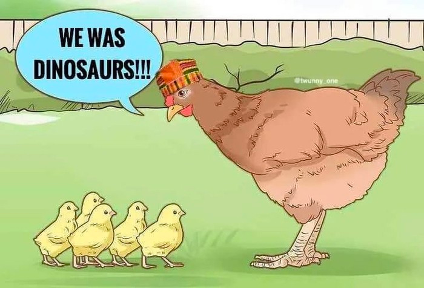
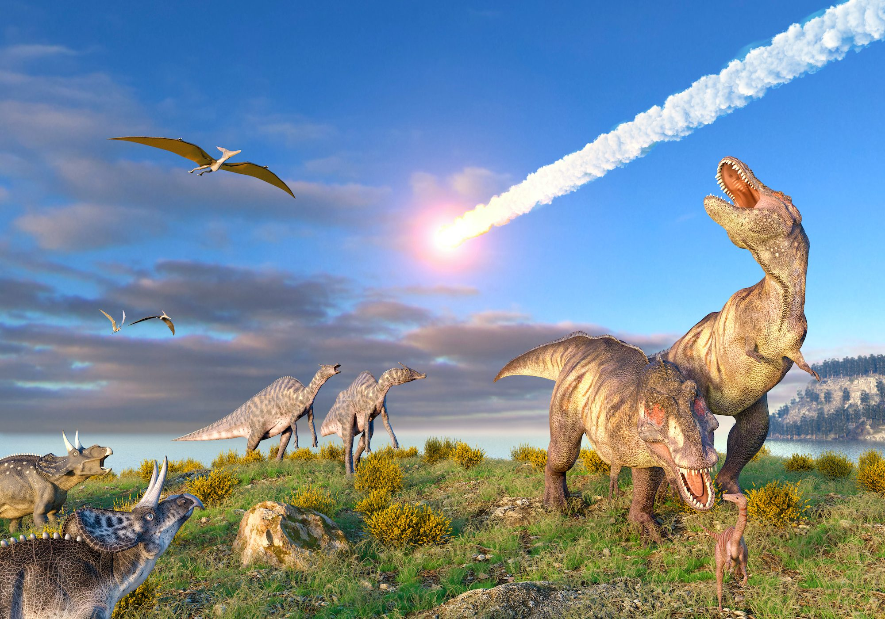
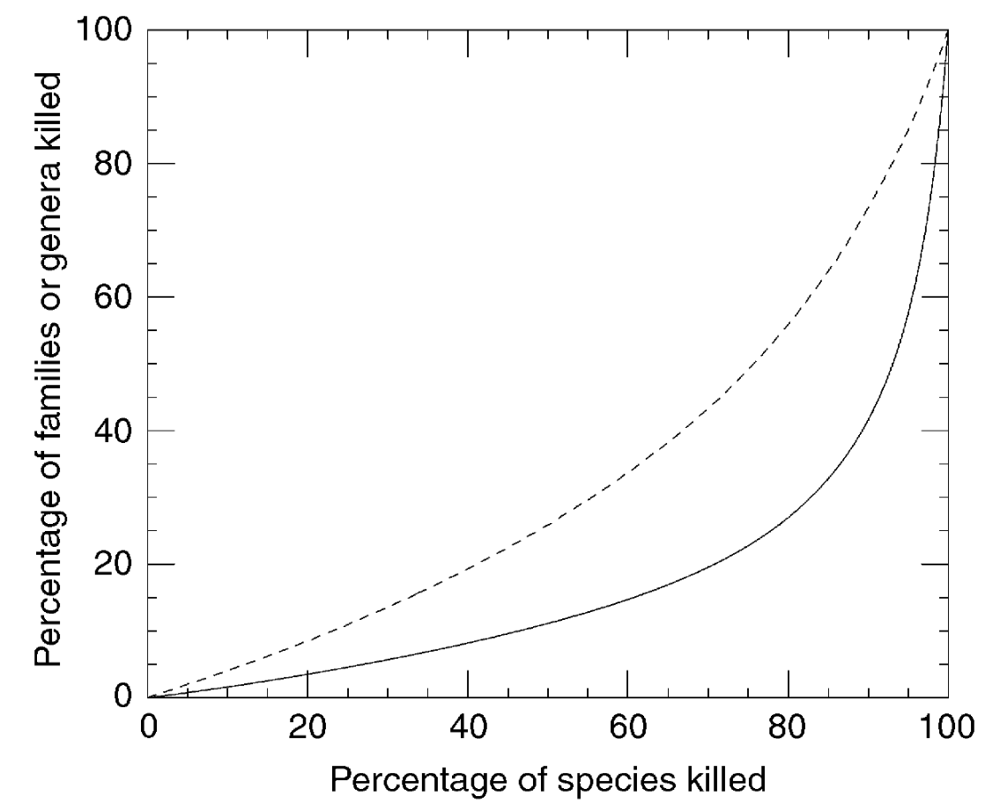
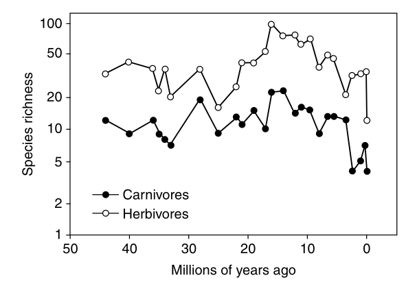
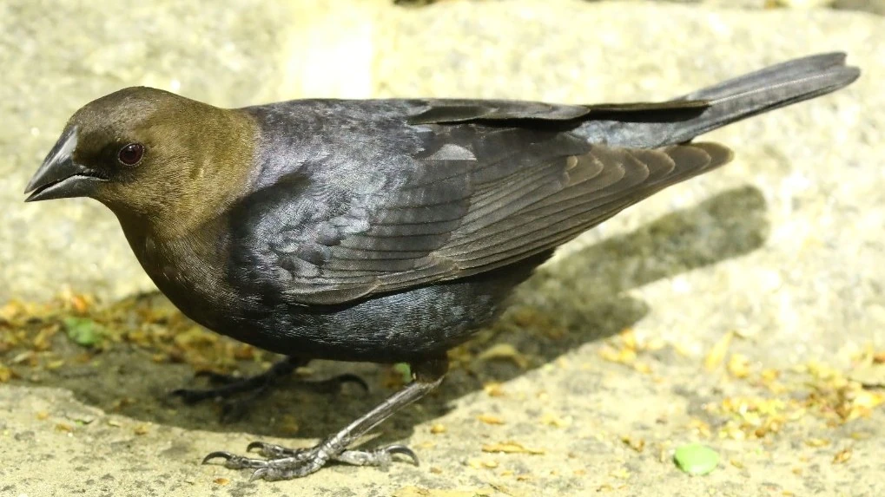
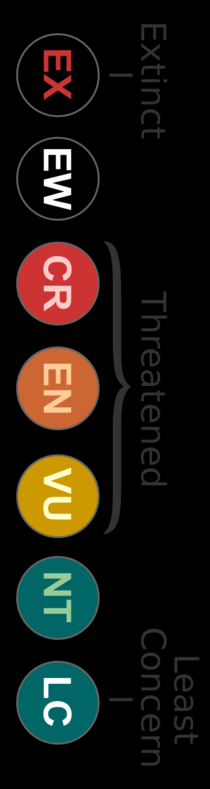
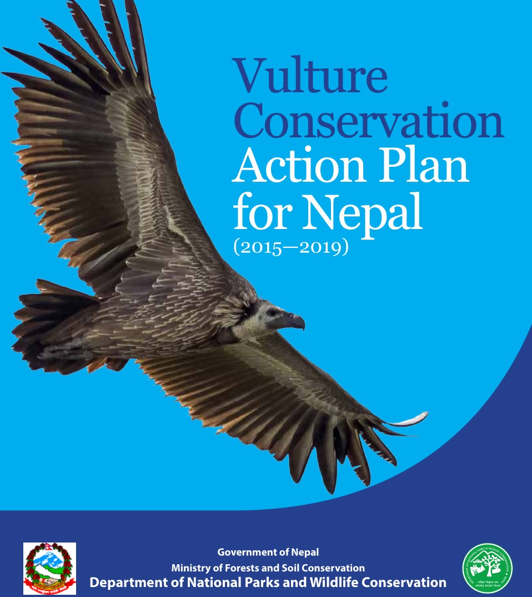
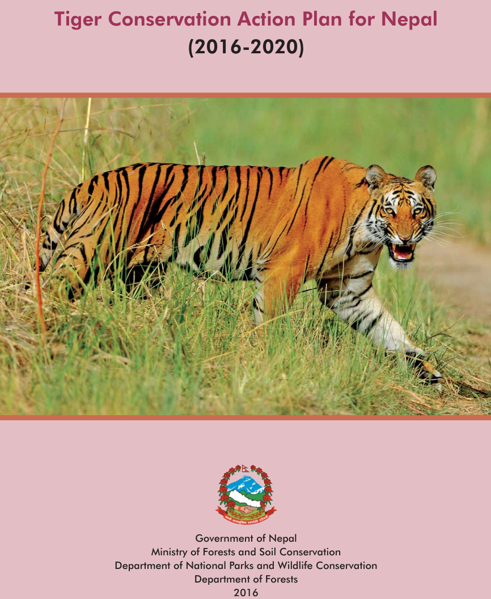
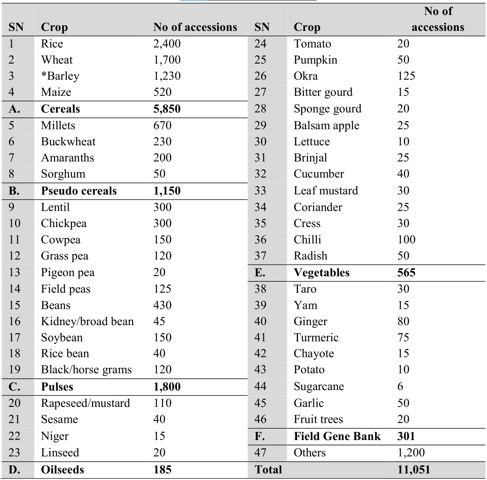
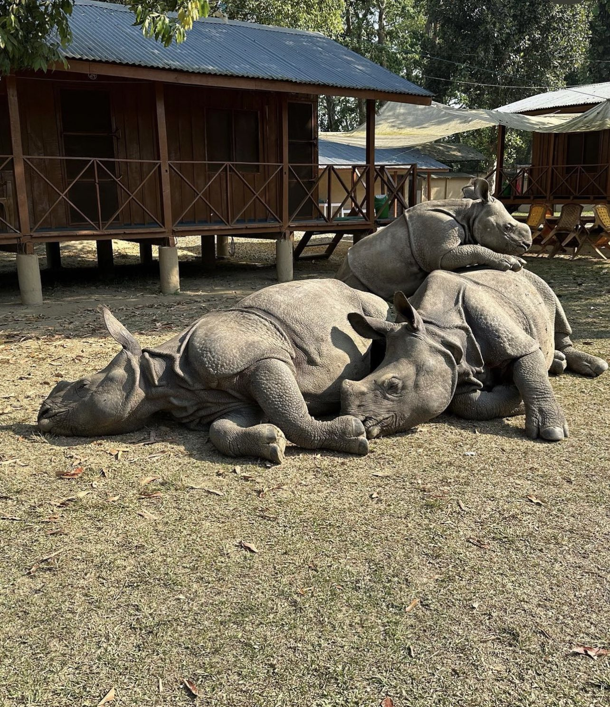

```{r setup, include=FALSE}
library(knitr)
require(tidyverse)
set.seed(453)
# invalidate cache when the package version changes
knitr::opts_chunk$set(tidy = FALSE, echo = FALSE, 
                  message = FALSE, warning = FALSE,
                  out.width = "45%")
options(knitr.table.format = "latex")
options(knitr.kable.NA = "", digits = 2)
options(kableExtra.latex.load_packages = FALSE)
```

# Value of biodiversity

##

- Value based on as anthropocentric/utilitarian appraoch and ecocentric approach.
- Utilitarian approach assigns values for
  - aesthetics, and
  - the moral responsibility of humanity to preserve natural resources (thus as indicator of sustainable use of resource)
- Ecocentric approach is concerned with the intrinsic value of biodiversity, meaning its value independent from its contribution to human welfare.
- Direct use value as food and medicines, clothing, energy and shelter; items of direct use value are privately appropriable.
- 80% of the people in developing countries rely on traditional medicine for primary health care needs.
- Indirect use value: ecosystem services and templates for industrial products; Regulatory functions of ecosystem, nutrient recycling, sedimentation processes, waste treatment, water regulation etc.
- Long term or option value: Value in diversity of amount of information, for conservation and natural evolutionary mechanism sustainance.

# Biodiversity conservation

## Background

- Conservationists' focus has expanded from the objective of establishing beautiful parks and conserving select species towards a more holistic goal of ecosystem integrity; a goal that goes well beyond the conservation of individual species and beautiful landscapes to include the protection of the existing diversity of species, natural habitats, and ecosystem processes.
- Fundamental questions about goals and strategies, particularly 
  1. What biodiversity should be conserved; e.g., should the focus be particular species, ecosystems, or ecosystem services? 
  2. Where does the targeted biodiversity occur, and where is the best place to protect it? and 
  3. Given the variety of conservation tools available, which is the most effective method to achieve conservation objectives?

##

- Traditional form of contribution to conservation effort due following peoples:
  - Geographers
  - Ethnobotanists
  - Plant ecologists
- Interplay of physical diversity and human management diversity gives rise complexity in agrobiodiversity.

## Operational considerations

- Hotspots approach to defining what should be conserved or coarse-filter/fine-filter approach that ensures that a given landscape's naturally occuring species and ecological communities are protected.
- Identifying the appropriate conservation landscape scale (Species/taxa or spatial scale)
- Need for multiple conservation operational tools (Governance based, Market based, Civil society based)
- Economic evaluation and conservation trade-offs with competing resource demands
- Use of "easy" tools (i.e., GIS models and remote sensing data) to resolve ecological features and processes and design interventions.

# Causes of biodiversity loss

## Introduction

- It is thought that global biodiversity reached its absolute peak about 30,000 years ago.
- Antropogenic biodiversity loss is estimated at 100-1000 times higher than the estimated rates for natural extinction process.
- Genetic erosion in _in-situ_ conservation; In china diversity of wheat varieties used have decreased 10 times between 1949 and 1970.
- Contaminiation in regenerating cross-pollinated species.
- Storage conditions and handling in _ex-situ_.
- Restructuring or financial leanness of storage institutions.

## Major drivers

- Habitat loss, overexploitation, alien species introductions, building and mechanical constructions, and climate change have resulted in significant losses to biodiversity, especially over the past 50 years. 
- These drivers are a influential both in protected as well as open areas.
- Within protected areas
  - range of physical (e.g., fire), 
  - biological (e.g., alien species), 
  - social (e.g., community opposition), 
  - political (e.g., political support), 
  - economic (lack of resources), and 
  - managerial (e.g., lack of planning) threats are faced by biodiversity

# Risk of extinction and recovery program

## Risk of extinction

\bcolumns
\column{0.6\textwidth}

- During the last 500 million years, Earth experienced five periods of **mass extinction** when at least half the living creatures were wiped out.
  \begin{itemize}
  \item Ordovician (445 MYA) -- intense ice age -- 60-70% extinction
  \item Devonian (375-360 MYA) -- drastic drop in oxygen levels -- 75% extinction
  \item Permian (252 MYA) -- Asteriod impacts, intensive volcanic activity -- 95% extinction
  \item Triassic (200 MYA) -- Massive volcanic eruptions, asteriods -- 70-80% extinction
  \item Cretaceous (66 MYA) -- Asteriod impact -- 75% extinction
  \end{itemize}

\column{0.4\textwidth}

```{r chicken-dinasaur, fig.align='center', out.width="48%"}

```


```{r mass-extinction, fig.align='center', out.width="98%"}

```

\ecolumns

##

\bcolumns
\column{0.6\textwidth}

- **Occasionally, we should expect to lose many species, whereas over most time periods, only a few species should be expected to be lost**.
- Therefore, the greater the disturbance, the greater the effect (reduction) on biodiversity.
- Probability of species loss depend mostly on:
  - Size of the population of species within the community
  - Species with narrow geographic ranges may be more susceptible to extinction
  - Small populations exhibit lower genetic variability
- Fossil records, provides the most direct evidence for tracing temporal changes in biodiversity, including both the origin and extinction of lineages.

\column{0.4\textwidth}
  
```{r rarefaction-curve, fig.cap="Rarefaction curves for the extinction of families (solid line) and genera (dashed line) calculated for echinoderms by Raup (1979). The curves indicate what percentage of families or genera are expected to become extinct during an event which kills a given percentage of species. Used in reverse, the curves also allow us to estimate what percentage of species became extinct in a particular event, given an observed percentage of family or genus kill.", out.width="70%"}
# Estimates of family extinction are obtained from directed analysis of the fossil record, whereas species loss is inferred using a statistical technique called "reverse rarefaction".

```

\ecolumns

<!-- Smaller populations are more likely to go extinct than larger populations, a process referred to as demographic stochasticity (Gambler's Ruin). The idea is that a gambler in a casino who has a limited number of betting units to lose (e.g., quarters for a slot machine or equivalents to the minimum bet at a black jack table) is more likely to go bankrupt simply by chance compared to a gambler with many betting. -->

<!-- Small populations, however, may experience more rapid evolution due to reduced genetic inertia. This may be seen in the founder effect, in which a few individuals begin a new population leading to allopatric speciation. -->

##

\bcolumns
\column{0.35\textwidth}
\footnotesize

- It is necessary to evaluate the risk of extinction by determining factors such as the absolute abundance of individuals within species and how this influences the extinction risk.
<!-- For example, if increased diversity over time has led to smaller population sizes due to the ecological partitioning of resources, we may anticipate a trend toward increased extinction rates. -->
- Experimental work on laboratory and field communities suggests that decreasing biodiversity also leads to a reduction in ecological time of ecosystem function, such as total productivity and carbon dioxide sequestration.

\column{0.65\textwidth}

```{r predator-prey-history, fig.align="center", fig.cap="The number of large mammal species from North America during the past 44 million years. Note the correlation between the diversity of predators and their potential prey ($r^2 = 0.43; p < 0.001$)", out.width="50%"}

```


```{r pandanaris-cowbird, fig.cap="The convex-billed cowbird (\\textit{Pandanaris convexa}) is a species of bird in the family Icteridae, and the only living member of the genus Pandanaris, that originally lived in North America during the Pleistocene. Its extinction was associated with the extinction of large herbivores.", out.width="50%"}

```

\ecolumns

##

Southeast Asia possesses an estimated vascular flora of around 60,000 species (20,000-25,000 species in Indo-China and 42,000 species in Malesia). Of 1371 red-listed plant species in Southeast Asia, 292 are critically endangered, 196 endangered, 737 vulnerable, 31 near-threatened, and 110 data-deficient. Five plant extinctions are documented: two mangos ( _Mangifera casturi_ Kosterm and _Mangifera rubropetala_ Kosterm), two dipterocarp trees ( _Dipterocarpus cinereus_ Sloot and _Shorea cuspidata_ Ashton), and one herb - the "woolly stalked Begonia" ( _Begonia eiromischa_ Ridl.). Only the mangos survive in ex situ collections (IUCNRedlist.org, accessed 23 August 2011)

Since AD 1500, at least 132 bird species have gone extinct (EX), and a further four are extinct in the wild (EW). Strikingly, 121 (92%) of these species were confined to islands, mostly in the Pacific, and an additional three were confined to single lake (Birdlife International, 2011).

## Recovery programs

\bcolumns
\column{0.7\textwidth}

- Endangered species are in the most imminent needs of attention for recovery (species recovery/conservation plan/action).
- A recovery plan describes the current status, threats and intended methods for increasing rare and endangered species.
- The Species Survival Commission's Specialist Groups of the International Union for Conservation of Nature (IUCN) has created Species Action Plans since at least the mid-1980s, which are used to outline the conservation strategies of species, normally between set dates.
- Either a single species or an area, habitat or ecosystem or entire landscape can be targeted by the recovery plan.

\column{0.3\textwidth}

```{r species-conservation-rating, fig.align='center', out.width="40%"}

```

\ecolumns

##

\bcolumns
\column{0.5\textwidth}

```{r vulture-conservation-action-plan, out.width="75%", fig.align='center'}

```

\column{0.5\textwidth}

```{r tiger-recovery-plan, out.width="60%", fig.align='center'}

```

\ecolumns

##

- Recovery program are conducted at both coarse-filter and fine-filter approach.
- Coarse filter approach focuses on habitat and most, if not all species, and their ecological functions being supported in reserves and conservation areas.
  - For example in conserving invertebrates (grasshoppers, ants and snail) species, a major consideration is that of effor to restore stone-cover.
- Restoration of grazing in areas where plant succession eliminates savannah-like, open habi tats often results in the increase of the species richness of native pollinators and other invertebrates.
- The Lord Howe Island stick insect ( _Dryococelus australis_) had been thought to be extinct until a small population was found on a tiny Ball’s Pyramid Islet (New 2012); a small fraction of the population has been collected and is now successfully breeding in captivity at Melbourne Zoo.

##

\footnotesize

- Reintroduction and restocking programs (generally effective for birds) may be employed when a wild population is otherwise beyond recovery.
- These programs are decided based on:
  - organism's ecology
  - current threats
  - suitability of available stock
  - regional human socio-economic implications
- Release should only take place when the habitat is capable of sustaining a viable population and original constraining factors no longer operate.
- Proper recovery programs do not simply act as stop gaps to prevent extinction, but can restore species to a state of health so they are self-sustaining.
- Best plans are adaptive and dynamic, responding to changing conditions.

# In-situ conservation

## Agrobiodiversity -- On farm conservation

- Seed preservation by farmer household
- Participatory variety breeding
- Culture based importance for conservation

## Wild/natural biodiversity -- Protected area conservation

- As long as 2000 years ago ancient societies in Greece, Rome, Asia, and Africa are known to have set aside areas as sacred groves or sites, while european societies had hunting grounds for use of royalty and the wealthy.
- First protected area of world: Yellowstone National Park (1872).
- Until recently, the motivations have seldom been the protection of biodiversity *per se*, and have usually been based on culturally valued aspects of biodiversity and the broader landscape, for example, charismatic megafauna, attractive habitats, important watersheds, recreational areas, or endangered species.
- 12.9% (114,000 sites) of earth's land surface now occur under protected areas.

\bcolumns

\column{0.6\textwidth}
\footnotesize

- Conserving species in their natural habitat for their own intrinsic value and to maintain their role in ecosystem and evolutionary development.
- A network of 20 protected areas for conserving viable populations of the large and wide-ranging species in their wilderness. 
  - focused on umbrella and keystone species: Bengal tigers, Greater one-horned rhinoceros, Asian elephants and Snow leopards
- Likewise, wild edible plants and wild relatives of cultivated crops are planned for conservation in collaboration with National Parks, religiously and culturally protected sites, heritage sites and community areas (including forest management).
- Yet, the wealth of local diversity in Nepal contrasts greatly with the paucity of opportunities for hill and mountain farmers using the dominant approach.

<!-- Such wealth is rarely recognised within economic or political evaluations of resources. The recognition of farmers' intellectual property rights to genetic resources at the community level could offer opportunities for linking financial compensation to biodiversity conservation.-->

<!-- Most agrobiodiversity is retained on farms in Nepal only due to a lack of development opportunities. Farming communities in the margins could assist to conserve much important local agrobiodiversity for the short to medium term if they were provided with appropriate incentives. Source: "In situ" agrobiodiversity conservation for regional development in Nepal Author(s): Douglas Bardsley and Ian Thomas.-->

\column{0.4\textwidth}

\begin{itemize}
\tiny
\item Which crop I can cultivate ?
\item Which varieties perform good on my locality ?
\item Which variety yields better ?
\item Which variety can escape disease well ?
\item Which crop or crop mixtures are likely to perform well in which season ?
\item What seed do I store for the upcoming crop ?
\item How do I best manage my land to have a good harvest ?
\item How do I best preserve the seed to ensure good planting ?
\item How do mix or relay my collection of crops where I grow ?
\item How do I preserve the integrity of a good variety ?
\end{itemize}

\ecolumns

## Functions of protected areas

- Scientific research, 
- Wilderness protection, 
- Preservation of species and genetic diversity, 
- Maintenance of environmental services, 
- Protection of specific natural and cultural features, 
- Tourism and recreation, 
- Education, 
- Sustainable use of resources from natural ecosystems, and
- Maintenance of cultural and traditional attributes

## Definition

\begin{block}{International Union for Conservation of Nature}
A clearly defined geographical space, recognized, dedicated and managed through legal or other effective means, to achieve the long-term conservation of nature with associated ecosystem services and cultural values.
\end{block}

##

- IUCN categories of protected areas:
  1a. Strict Nature Reserves; Areas set aside to protect biodiversity and possibly geological features within strict control of visitation, use and impact.
  1b. Wilderness Areas; Largely unmodified or slightly modified area, retaining natural character without human habitation.
  2. National Parks; Natural or near natural areas to protect large scale ecological processes
  3. Natural Monuments or Features; Landform, Sea mount, Submarine cavern, Cave, Living creature
  4. Habitat/Species Management Areas; Particular species or habitats and management
  5. Protected Landscape/Seascape: Area of interaction of people and nature
  6. Protected area with sustainable use: Large area, low level industrial use of natural resource, with cultural associations for natural resource management.

## Status of protected areas

```{r global, fig.cap="Global growth in protected areas. Reproduced from IUCN and UNEP-WCMC (2009).", out.width="65%"}
# pdftools::pdf_convert("/media/deependra/e4da4ac5-3b38-4b89-9402-397eb940e4d3/Addition/Ecology/Encyclopedia of Biodiversity/Encyclopedia of Biodiversity-2010.pdf", pages = 1109, filenames = "./../images/global_protected_area.png", dpi = 300)

knitr::include_graphics("./../images/global_protected_area.png")
```

##

```{r global-map, fig.cap="Protected areas of the world. Reproduced from World Database on Protected Areas (WDPA), UNEP-WCMC, July 2011.", out.width="80%"}
# pdftools::pdf_convert("/media/deependra/e4da4ac5-3b38-4b89-9402-397eb940e4d3/Addition/Ecology/Encyclopedia of Biodiversity/Encyclopedia of Biodiversity-2010.pdf", pages = 1110, filenames = "./../images/global_protected_area_map.png", dpi = 300)

knitr::include_graphics("./../images/global_protected_area_map.png")
```

## Protected area coverage of the world's biomes

```{r}
protected_cover_biome <- tribble(~"Biome", ~"Percentage cover",
        "Tropical and subtropical moist broadleaf forests (TMF)", 5.5,
        "Tropical and subtropical dry broadleaf forests (TDF)", 5,
        "Tropical and subtropical coniferous forests (TCF)", 2.5,
        "Temperate broadleaf and mixed forests (TeBF)", 3.75,
        "Temperatre coniferous forests (TeCF)", 8.75,
        "Boreal forests/taiga (BF)", 6.25,
        "Tropical and subtropical grasslands, savannas, and shrublands (TG)", 5.75,
        "Temperate grasslands, savannas, and shrublands (TeG)", 2,
        "Flooded grasslands and savannas (FG)", 8.75,
        "Montane grasslands and shrublands (MG)", 3.8,
        "Tundra (T)", 13.75,
        "Mediteranean forests, woodlands, and scrub or Sclerophyll forests (MF)", 3,
        "Deserts and xeric shrublands (D)", 3.8,
        "Mangrove (M)", 8.5)

protected_cover_biome %>% 
  kable(caption = "Protected area coverage of worlds biomes (in percentage)", 
        booktabs = TRUE) %>% 
 kableExtra::kable_styling(font_size = 6)

# source: Mace GM, Masundir H, Baillie J, et al. (2005)
```

## Protected areas nepal

```{r protected-areas-np1, tidy=FALSE}
protected_areas <- read_csv("./../data/national_protected_areas.csv")

protected_areas <- protected_areas %>% 
  drop_na() 

protected_areas[1:5, ] %>%
  knitr::kable(caption = "Protected areas of Nepal", 
               booktabs = TRUE, digits = 2, escape = FALSE) %>% 
  kableExtra::kable_styling(latex_options = "striped", font_size = 5) %>% 
  kableExtra::column_spec(1, bold = TRUE) %>% 
  kableExtra::column_spec(column = 1:5, width = c("8em","5em", "5em", "6em", "40em"))
```

##

```{r protected-areas-np2, tidy=FALSE}

protected_areas[6:10, ] %>%
  knitr::kable(caption = "Protected areas of Nepal (...continued)", 
               booktabs = TRUE, digits = 2, escape = FALSE) %>% 
  kableExtra::kable_styling(latex_options = "striped", font_size = 5) %>% 
  kableExtra::column_spec(1, bold = TRUE) %>% 
  kableExtra::column_spec(column = 1:5, width = c("8em","5em", "5em", "6em", "40em"))
```

##

```{r protected-areas-np3, tidy=FALSE}
protected_areas[11:15, ] %>%
  knitr::kable(caption = "Protected areas of Nepal (...continued)", 
               booktabs = TRUE, digits = 2, escape = FALSE) %>% 
  kableExtra::kable_styling(latex_options = "striped", font_size = 5) %>% 
  kableExtra::column_spec(1, bold = TRUE) %>% 
  kableExtra::column_spec(column = 1:5, width = c("8em","5em", "5em", "6em", "40em"))
```

##

```{r protected-areas-np4, tidy=FALSE}
protected_areas[16:nrow(protected_areas), ] %>%
  knitr::kable(caption = "Protected areas of Nepal (...continued)", 
               booktabs = TRUE, digits = 2, escape = FALSE) %>% 
  kableExtra::kable_styling(latex_options = "striped", font_size = 5) %>% 
  kableExtra::column_spec(1, bold = TRUE) %>% 
  kableExtra::column_spec(column = 1:5, width = c("8em","5em", "5em", "6em", "40em"))
```

## Framework for reviewing contribution

```{r contribution-review, fig.cap="A framework for reviewing the contribution of areas of land and water to biodiversity conservation. Starting at the bottom right hand corner the framework moves from 'strictly protected areas', reflecting the more traditional approach to protected areas managed almost exclusively for biodiversity conservation, The next category is 'living lands and waters', which are areas managed primarily for biodiversity conservation with some extractive uses limited to the ecologically sustainable management of areas of land and water to support life of all forms. 'Working lands and waters' are mostly agricultural lands managed primarily for extractive uses while attempting to conserve biodiversity at the same time. The final category is 'production areas' of land and water where the management focuses exclusively on maximizing extractive and productive uses and biodiversity conservation is not an objective."}
# pdftools::pdf_convert("/media/deependra/e4da4ac5-3b38-4b89-9402-397eb940e4d3/Addition/Ecology/Encyclopedia of Biodiversity/Encyclopedia of Biodiversity-2010.pdf", pages = 1113, filenames = "./../images/contribution_review.png", dpi = 300)

knitr::include_graphics("./../images/contribution_review.png")
```

# Ex situ conservation

##

```{r ex-situ-conservation, fig.align='center', out.width="65%"}

# As of 2015
```

##

- Refer to the media file: "Genebanks: Guardians of Biodiversity".

<!-- Available in `../media` directory -->

# Conservation endevours

## Institutional conservation endevours

- Single species based conservation. For e.g. *Ex situ* conservation for single species (e.g., zoos, expensive reintroduction programs, captive breeding programs).
- Elimination of invasise species linked to conservation failures.
- Protected areas management, for human exclusion.
- Fragmentation and loss of ecosystem management through management of spatial distribution of ecosystem or habitats.
- Incorporation of short-frequency disturbances.
- Limitting or excluding human extraction of resources from nature reserves.
- Reserve design and size allocation based on territory need of each species.
- Use of corridors and buffer zones to link habitat fragments and reserve networks.
- Small-scale, data-intensive species and community model design and implementation.
- Development of nonmarket values for species.

## Umbrella species approach

\bcolumns
\column{0.5\textwidth}

- Umbrella species are species selected for making conservation-related decisions, typically because protecting these species indirectly protects the many other species that make up the ecological community of its habitat (the umbrella effect). 
- Umbrella species can be used to help select the locations of potential reserves, find the minimum size of these conservation areas or reserves, and to determine the composition, structure, and processes of ecosystems.

\column{0.5\textwidth}

```{r rhinocerous-siblings, out.width="70%", fig.align='center'}

# https://twitter.com/samanthaiam/status/1634018415668260864
```

\ecolumns

## National (Nepal's) regional conservation strategies

1. Management of protected areas
  - A: Improvement in management of protected areas and species.
  - B: Abatement in poaching and illegal trade of wildlife and wildlife parts
  - C: Improvement in protected area habitats and connectivity
  - D: Improvement in management of protected area tourism
2. Management of biodiversity outside protected area
  - A: Improvement in forest governance and management
  - B: Significant reduction (by at least 75% of the current rate) in the loss and degradation of forest
  - C: Improvement in conservation of biodiversity in community managed forests
  - D: Enhancing conservation of species and genetic diversity
  - F: Enhancing forest based livelihoods

##

3. Management of rangeland biodiversity
4. Management of watershed biodiversity
5. Management of agrobiodiversity
6. Management of mountain biodiversity

## Conjoint national and international conservation strategies

\bcolumns
\column{0.5\textwidth}

\footnotesize

- Addressing the policy and legislative gaps
- Institutional strengthening
- Mainstreaming biodiversity across the government, society and economy
- Harmonization of biodiversity related international conventions
- Enhancement of national capacity for improved management of biodiversity
- Landscape management
- Management of invasive alien species
- Adaptation to and mitigation of the effects of climate change
- Integrating gender and social inclusion perspectives

\column{0.5\textwidth}

\footnotesize

- Conservation of and Respect to Traditional Knowledge, Innovations and Practices of Indigenous and Local Communities
- Knowledge generation and management
- Technology development, acquisition and use
- Communication, extension and outreach
- Fund generation and mobilization
- Monitoring evaluation and reporting

\ecolumns

# Intellectual property rights

## Background

- IP protection consists of principles that a society observes to ensure that an inventor is protected from the unfair use of his/her invention by others.
- Protection is provisioned in the form of: 
  - Copyright
  - Patent
  - Trademark
  - Trade secret
  - Breeder's right
  - Confidential information
- Innovation has a price tag, hence the investor must be compensated
- Ensures that invention is not kept secret from betterment of society.
- Law and science meet here.

## Guiding treaties, agreements and institutions

- Agreement on Trade related Aspects of Intellectual Property Rights (TRIPS Agreement) within the World Trade Organization (WTO) in 1995 (effective since).
- International Treaty on Plant Genetic Resources for Food and Agriculture in (ITPGRFA) 2002.
- World Intellectual Property Organization ([WIPO](https://www.wipo.int/portal/en/index.html))
- International Union for the Protection of New Varieties of Plants (Union International pour la Protection des Obtentions Vegetales; UPOV) established in 1961.

## Traditional knowledge

- Association between level of biodiversity in a specific region with cultural distinctiveness of its inhabitants.
- Specific knowledge of communities living in close relationship to their environment: traditional knowledge.
- Integrated into 
  - Rio Process, 
  - International Treaty on PGRFA
  - [World Summit on Sustainable Development](https://sustainabledevelopment.un.org/milesstones/wssd); Johannesburg, South Africa 26 August - 4 September 2002.
- CBD speaks of 'traditional knowledge, innovations and practices of indigenous and local communities embodying traditional lifestyles relevant for the conservation and sustainable use of biological diversity' (Article 8(j)).

## Traditional knowledge

- Foster sharing of economic incentives to making available traditional knowledge, to conserve it through use, and thereby enhance the livelihoods of farming and indigenous communities and reverse the decline of biodiversity, upon which, in return, long-term food security is based. [@biber2006rights]
- Since the adoption of convention on Biological Diversity (CBD) in 1992, the law of plant genetic resources (PGR) and the legal status of traditional knowledge (TK) has attracted increasing attention.
- 2001 Doha Agenda of the WTO explicitly endorsed the issue of traditional knowledge as a subject for further work.

## Traditional knowledge

- TK has common features for both indigenous as well as farming communities:
  - Information is not an individual creation, but the achievement of a specific community.
  - It cumulates over many generations and evolve accordingly.
  - Managed by and exchanged through customs or customary laws.
  - Close interaction exists between TK and the surrounding ecosystem.

## Farmer's right

- Intellectual contribution of farmers to the diversity of crop varieties and animal breeds emphasized in 'Farmers' Rights Charter', a document drafted by Indian Farmers' Unions.
- Guiding thoughts:
  - Farmers ought to have the right to 'participate fully in any benefits derived from the improved use of these genetic resources' and, of course, in the ITPGRFA (Preamble para. 7 and Article 9.1).
  - Farmers' innovations take place collectively and cumulatively, and that therefore farmers' rights, arising from their role as conservators and breeders, are community rights.

## UPOV

\small

- It seeks to protect new varieties of plants both in the interest of agricultural development and of plant breeders. 
- UPOV sought from the outset to provide incentives to the private sector to engage in commercial plant breeding, by introducing so-called plant breeders' rights, aka. Plant Variety Rights.
- Agreed guidelines for the conduct of tests and standardization of variety descriptions based upon the morphology of the grain and plant.
- PBR is an IPR, often described as plant "patent". Breeders can claim royalties on seed sold.
- Once granted, PBR ecognizes the exclusive rights of individual plant breeders to produce or reproduce protected varieties, to condition them for the purpose of propagation, to offer them for sale, to commercialize them, including exporting and importing them, and to stock them with a view to production or commercialization (Article 14.1 UPOV).
- Like any patent right, PBR expires after 20 years.

## TRIPS

- General Agreement on Tariffs and Trade (GATT) contains important provisions covering the protection of intellectual property in the agreement on Trade Related Aspects of Intellectual Property Rights (TRIPS). 
- For most member countries ratification of GATT means membership of UPOV and a PBR system based upon plant morphology. 
- Plant breeders will still use morphological characters to purify candidate varieties before submitting them for tests and trials, and seed traders will still use morphological characters to verify variety at the point of sale.
- However, the science of systematics is being revolutionized by molecular technologies.
- Concept of "Essentially derieved varieties"

# Bibliography
