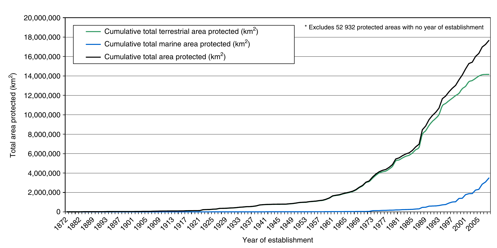
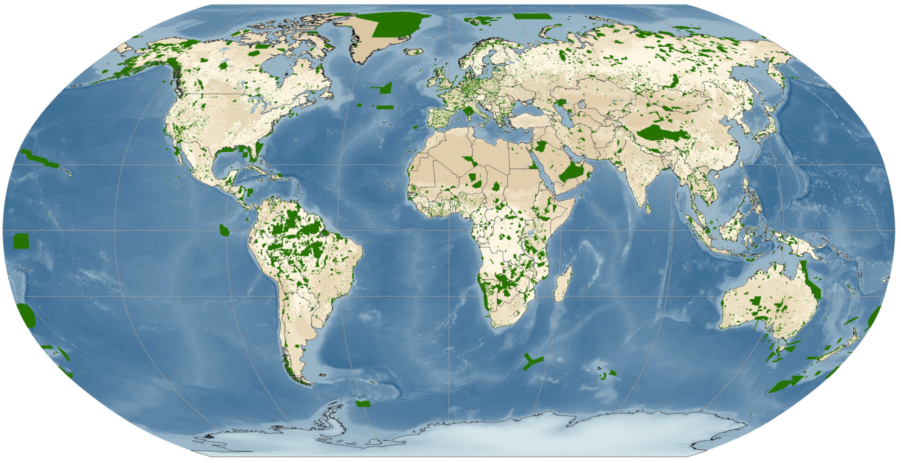
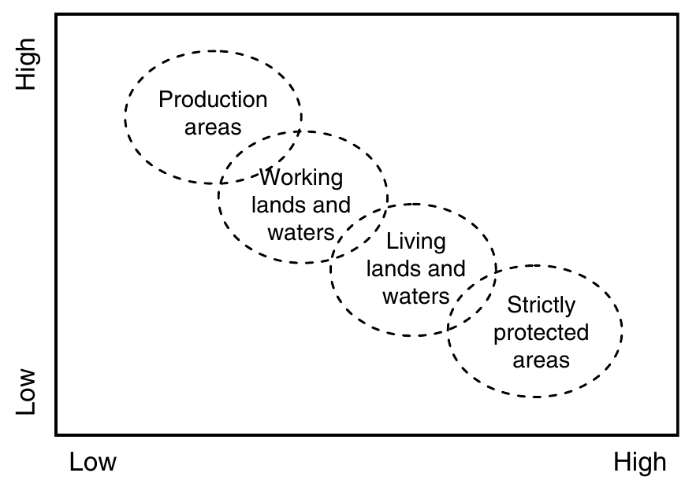

```{r setup, include=FALSE}
library(knitr)
require(tidyverse)
set.seed(453)
# invalidate cache when the package version changes
knitr::opts_chunk$set(tidy = FALSE, echo = FALSE, 
                  message = FALSE, warning = FALSE,
                  out.width = "45%")
options(knitr.table.format = "latex")
options(knitr.kable.NA = "", digits = 2)
options(kableExtra.latex.load_packages = FALSE)
```

# Value of biodiversity

##

- Value based on as anthropocentric/utilitarian appraoch and ecocentric approach.
- Utilitarian approach assigns values for
  - aesthetics, and
  - the moral responsibility of humanity to preserve natural resources (thus as indicator of sustainable use of resource)
- Ecocentric approach is concerned with the intrinsic value of biodiversity, meaning its value independent from its contribution to human welfare.
- Direct use value as food and medicines, clothing, energy and shelter; items of direct use value are privately appropriable.
- 80% of the people in developing countries rely on traditional medicine for primary health care needs.
- Indirect use value: ecosystem services and templates for industrial products; Regulatory functions of ecosystem, nutrient recycling, sedimentation processes, waste treatment, water regulation etc.
- Long term or option value: Value in diversity of amount of information, for conservation and natural evolutionary mechanism sustainance.

# Biodiversity conservation

## Background

- Conservationists' focus has expanded from the objective of establishing beautiful parks and conserving select species towards a more holistic goal of ecosystem integrity; a goal that goes well beyond the conservation of individual species and beautiful landscapes to include the protection of the existing diversity of species, natural habitats, and ecosystem processes.
- Fundamental questions about goals and strategies, particularly 
  1. What biodiversity should be conserved; e.g., should the focus be particular species, ecosystems, or ecosystem services? 
  2. Where does the targeted biodiversity occur, and where is the best place to protect it? and 
  3. Given the variety of conservation tools available, which is the most effective method to achieve conservation objectives?

##

- Traditional form of contribution to conservation effort due following peoples:
  - Geographers
  - Ethnobotanists
  - Plant ecologists
- Interplay of physical diversity and human management diversity gives rise complexity in agrobiodiversity.

## Operational considerations

- Hotspots approach to defining what should be conserved or coarse-filter/fine-filter approach that ensures that a given landscape's naturally occuring species and ecological communities are protected.
- Identifying the appropriate conservation landscape scale (Species/taxa or spatial scale)
- Need for multiple conservation operational tools (Governance based, Market based, Civil society based)
- Economic evaluation and conservation trade-offs with competing resource demands
- Use of "easy" tools (i.e., GIS models and remote sensing data) to resolve ecological features and processes and design interventions.

# Causes of biodiversity loss

## Introduction

- It is thought that global biodiversity reached its absolute peak about 30,000 years ago.
- Antropogenic biodiversity loss is estimated at 100-1000 times higher than the estimated rates for natural extinction process.
- Genetic erosion in _in-situ_ conservation; In china diversity of wheat varieties used have decreased 10 times between 1949 and 1970.
- Contaminiation in regenerating cross-pollinated species.
- Storage conditions and handling in _ex-situ_.
- Restructuring or financial leanness of storage institutions.

## Major drivers

- Habitat loss, overexploitation, alien species introductions, building and mechanical constructions, and climate change have resulted in significant losses to biodiversity, especially over the past 50 years. 
- These drivers are a influential both in protected as well as open areas.
- Within protected areas
  - range of physical (e.g., fire), 
  - biological (e.g., alien species), 
  - social (e.g., community opposition), 
  - political (e.g., political support), 
  - economic (lack of resources), and 
  - managerial (e.g., lack of planning) threats are faced by biodiversity

# Forms of biodiversity conservation

## On farm conservation

- Seed preservation by farmer household
- Participatory variety breeding
- Culture based importance for conservation

## Protected area conservation: History

- As long as 2000 years ago ancient societies in Greece, Rome, Asia, and Africa are known to have set aside areas as sacred groves or sites, while european societies had hunting grounds for use of royalty and the wealthy.
- First protected area of world: Yellowstone National Park (1872).
- Until recently, the motivations have seldom been the protection of biodiversity *per se*, and have usually been based on culturally valued aspects of biodiversity and the broader landscape, for example, charismatic megafauna, attractive habitats, important watersheds, recreational areas, or endangered species.
- Multiple functions of protected areas: 
  - Scientific research, 
  - Wilderness protection, 
  - Preservation of species and genetic diversity, 
  - Maintenance of environmental services, 
  - Protection of specific natural and cultural features, 

##

- Multiple functions ...
  - Tourism and recreation, 
  - Education, 
  - Sustainable use of resources from natural ecosystems, and
  - Maintenance of cultural and traditional attributes

## Protected area: Components

\begin{block}{International Union for Conservation of Nature}
A clearly defined geographical space, recognized, dedicated and managed through legal or other effective means, to achieve the long-term conservation of nature with associated ecosystem services and cultural values.
\end{block}

- 12.9% (114,000 sites) of earth's land surface now occur under protected areas.

##

- IUCN categories of protected areas:
  1a. Strict Nature Reserves; Areas set aside to protect biodiversity and possibly geological features within strict control of visitation, use and impact.
  1b. Wilderness Areas; Largely unmodified or slightly modified area, retaining natural character without human habitation.
  2. National Parks; Natural or near natural areas to protect large scale ecological processes
  3. Natural Monuments or Features; Landform, Sea mount, Submarine cavern, Cave, Living creature
  4. Habitat/Species Management Areas; Particular species or habitats and management
  5. Protected Landscape/Seascape: Area of interaction of people and nature
  6. Protected area with sustainable use: Large area, low level industrial use of natural resource, with cultural associations for natural resource management.

## Status of protected areas

```{r global, fig.cap="Global growth in protected areas. Reproduced from IUCN and UNEP-WCMC (2009).", out.width="65%"}
# pdftools::pdf_convert("/media/deependra/e4da4ac5-3b38-4b89-9402-397eb940e4d3/Addition/Ecology/Encyclopedia of Biodiversity/Encyclopedia of Biodiversity-2010.pdf", pages = 1109, filenames = "./../images/global_protected_area.png", dpi = 300)


```

##

```{r global-map, fig.cap="Protected areas of the world. Reproduced from World Database on Protected Areas (WDPA), UNEP-WCMC, July 2011.", out.width="80%"}
# pdftools::pdf_convert("/media/deependra/e4da4ac5-3b38-4b89-9402-397eb940e4d3/Addition/Ecology/Encyclopedia of Biodiversity/Encyclopedia of Biodiversity-2010.pdf", pages = 1110, filenames = "./../images/global_protected_area_map.png", dpi = 300)


```

## Protected area coverage of the world's biomes

```{r}
protected_cover_biome <- tribble(~"Biome", ~"Percentage cover",
        "Tropical and subtropical moist broadleaf forests (TMF)", 5.5,
        "Tropical and subtropical dry broadleaf forests (TDF)", 5,
        "Tropical and subtropical coniferous forests (TCF)", 2.5,
        "Temperate broadleaf and mixed forests (TeBF)", 3.75,
        "Temperatre coniferous forests (TeCF)", 8.75,
        "Boreal forests/taiga (BF)", 6.25,
        "Tropical and subtropical grasslands, savannas, and shrublands (TG)", 5.75,
        "Temperate grasslands, savannas, and shrublands (TeG)", 2,
        "Flooded grasslands and savannas (FG)", 8.75,
        "Montane grasslands and shrublands (MG)", 3.8,
        "Tundra (T)", 13.75,
        "Mediteranean forests, woodlands, and scrub or Sclerophyll forests (MF)", 3,
        "Deserts and xeric shrublands (D)", 3.8,
        "Mangrove (M)", 8.5)

protected_cover_biome %>% 
  kable(caption = "Protected area coverage of worlds biomes (in percentage)", 
        booktabs = TRUE) %>% 
 kableExtra::kable_styling(font_size = 6)

# source: Mace GM, Masundir H, Baillie J, et al. (2005)
```

## Protected areas nepal

```{r protected-areas-np1, tidy=FALSE}
protected_areas <- read_csv("./../data/national_protected_areas.csv")

protected_areas <- protected_areas %>% 
  drop_na() 

protected_areas[1:5, ] %>%
  knitr::kable(caption = "Protected areas of Nepal", 
               booktabs = TRUE, digits = 2, escape = FALSE) %>% 
  kableExtra::kable_styling(latex_options = "striped", font_size = 5) %>% 
  kableExtra::column_spec(1, bold = TRUE) %>% 
  kableExtra::column_spec(column = 1:5, width = c("8em","5em", "5em", "6em", "40em"))
```

##

```{r protected-areas-np2, tidy=FALSE}

protected_areas[6:10, ] %>%
  knitr::kable(caption = "Protected areas of Nepal (...continued)", 
               booktabs = TRUE, digits = 2, escape = FALSE) %>% 
  kableExtra::kable_styling(latex_options = "striped", font_size = 5) %>% 
  kableExtra::column_spec(1, bold = TRUE) %>% 
  kableExtra::column_spec(column = 1:5, width = c("8em","5em", "5em", "6em", "40em"))
```

##

```{r protected-areas-np3, tidy=FALSE}
protected_areas[11:15, ] %>%
  knitr::kable(caption = "Protected areas of Nepal (...continued)", 
               booktabs = TRUE, digits = 2, escape = FALSE) %>% 
  kableExtra::kable_styling(latex_options = "striped", font_size = 5) %>% 
  kableExtra::column_spec(1, bold = TRUE) %>% 
  kableExtra::column_spec(column = 1:5, width = c("8em","5em", "5em", "6em", "40em"))
```

##

```{r protected-areas-np4, tidy=FALSE}
protected_areas[16:nrow(protected_areas), ] %>%
  knitr::kable(caption = "Protected areas of Nepal (...continued)", 
               booktabs = TRUE, digits = 2, escape = FALSE) %>% 
  kableExtra::kable_styling(latex_options = "striped", font_size = 5) %>% 
  kableExtra::column_spec(1, bold = TRUE) %>% 
  kableExtra::column_spec(column = 1:5, width = c("8em","5em", "5em", "6em", "40em"))
```

## Framework for reviewing contribution

```{r contribution-review, fig.cap="A framework for reviewing the contribution of areas of land and water to biodiversity conservation. Starting at the bottom right hand corner the framework moves from 'strictly protected areas', reflecting the more traditional approach to protected areas managed almost exclusively for biodiversity conservation, The next category is 'living lands and waters', which are areas managed primarily for biodiversity conservation with some extractive uses limited to the ecologically sustainable management of areas of land and water to support life of all forms. 'Working lands and waters' are mostly agricultural lands managed primarily for extractive uses while attempting to conserve biodiversity at the same time. The final category is 'production areas' of land and water where the management focuses exclusively on maximizing extractive and productive uses and biodiversity conservation is not an objective."}
# pdftools::pdf_convert("/media/deependra/e4da4ac5-3b38-4b89-9402-397eb940e4d3/Addition/Ecology/Encyclopedia of Biodiversity/Encyclopedia of Biodiversity-2010.pdf", pages = 1113, filenames = "./../images/contribution_review.png", dpi = 300)


```

# Methods of biodiversity conservation

##

1. *In situ* conservation; 
2. *Ex situ* conservation
3. Restoration

# Area-specific/local approach

## Farmer as pivot

- Which crop I can cultivate ?
- Which varieties perform good on my locality ?
- Which variety yields better ?
- Which variety can escape disease well ?
- Which crop or crop mixtures are likely to perform well in which season ?
- What seed do I store for the upcoming crop ?
- How do I best manage my land to have a good harvest ?
- How do I best preserve the seed to ensure good planting ?
- How do mix or relay my collection of crops where I grow ?
- How do I preserve the integrity of a good variety ?

## Institutional conservation approaches

- Single species based conservation. For e.g. *Ex situ* conservation for single species (e.g., zoos, expensive reintroduction programs, captive breeding programs).
- Umbrella species approach
- Elimination of invasise species linked to conservation failures.
- Protected areas management, for human exclusion.
- Fragmentation and loss of ecosystem management through management of spatial distribution of ecosystem or habitats.
- Incorporation of short-frequency disturbances.
- Limitting or excluding human extraction of resources from nature reserves.
- Reserve design and size allocation based on territory need of each species.
- Use of corridors and buffer zones to link habitat fragments and reserve networks.
- Small-scale, data-intensive species and community model design and implementation.
- Development of nonmarket values for species.

# National (Nepal's)/regional approaches

## Targeted/sectoral approach

1. Management of protected areas
  - A: Improvement in management of protected areas and species.
  - B: Abatement in poaching and illegal trade of wildlife and wildlife parts
  - C: Improvement in protected area habitats and connectivity
  - D: Improvement in management of protected area tourism
2. Management of biodiversity outside protected area
  - A: Improvement in forest governance and management
  - B: Significant reduction (by at least 75% of the current rate) in the loss and degradation of forest
  - C: Improvement in conservation of biodiversity in community managed forests
  - D: Enhancing conservation of species and genetic diversity
  - F: Enhancing forest based livelihoods

## Targeted/sectoral approach (...continued)

3. Management of rangeland biodiversity
4. Management of watershed biodiversity
5. Management of agrobiodiversity
6. Management of mountain biodiversity

## Cross-thematic and cross-sectoral strategies

- Addressing the policy and legislative gaps
- Institutional strengthening
- Mainstreaming biodiversity across the government, society and economy
- Harmonization of biodiversity related international conventions
- Enhancement of national capacity for improved management of biodiversity
- Landscape management
- Management of invasive alien species
- Adaptation to and mitigation of the effects of climate change
- Integrating gender and social inclusion perspectives

## Cross-thematic (...continued)

- Conservation of and Respect to Traditional Knowledge, Innovations and Practices of Indigenous and Local Communities
- Knowledge generation and management
- Technology development, acquisition and use
- Communication, extension and outreach
- Fund generation and mobilization
- Monitoring evaluation and reporting

# International convention and treaties

# Intellectual property rights

# Bibliography
